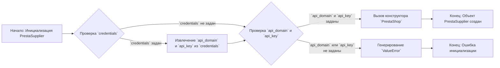
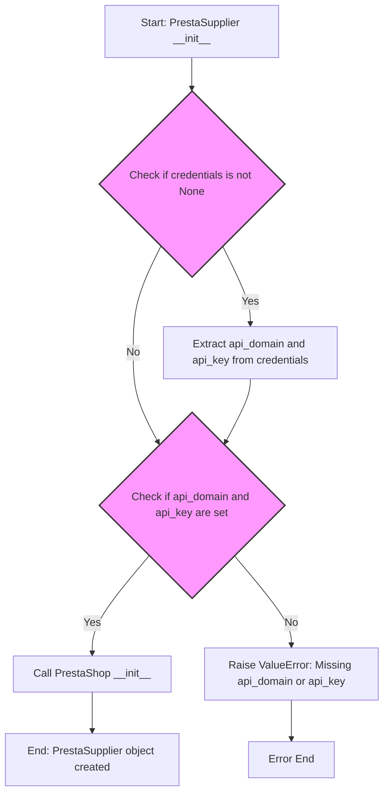
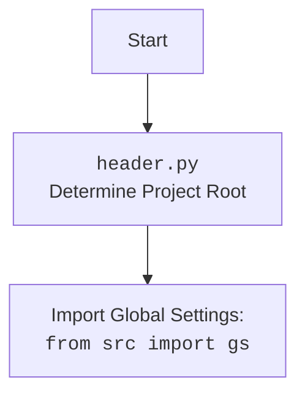

## АНАЛИЗ КОДА: `hypotez/src/endpoints/prestashop/supplier.py`

### 1. <алгоритм>

**Блок-схема работы `PrestaSupplier`:**



**Примеры:**

1.  **Инициализация с `credentials`:**
    ```python
    credentials = {'api_domain': 'example.com', 'api_key': 'test_key'}
    supplier = PrestaSupplier(credentials=credentials)
    # Поток: A -> B (credentials задан) -> C -> D -> E -> G
    ```
2.  **Инициализация с `api_domain` и `api_key`:**
    ```python
    supplier = PrestaSupplier(api_domain='example.com', api_key='test_key')
    # Поток: A -> B (credentials не задан) -> D -> E -> G
    ```
3.  **Инициализация с недостающими параметрами:**
    ```python
    supplier = PrestaSupplier(api_domain='example.com')
    # Поток: A -> B (credentials не задан) -> D -> F -> H (ValueError)
    ```
4.  **Инициализация с `SimpleNamespace`:**
    ```python
    from types import SimpleNamespace
    credentials = SimpleNamespace(api_domain='example.com', api_key='test_key')
    supplier = PrestaSupplier(credentials=credentials)
     # Поток: A -> B (credentials задан) -> C -> D -> E -> G
    ```

### 2. <mermaid>





**Объяснение зависимостей `mermaid`:**

*   **`Start`**: Начало процесса инициализации класса `PrestaSupplier`.
*   **`CheckCredentials`**: Проверка, были ли переданы аргументы `credentials`.
*   **`ExtractCredentials`**: Если `credentials` переданы, то из них извлекаются `api_domain` и `api_key`.
*   **`CheckApiKeys`**: Проверка наличия `api_domain` и `api_key`.
*   **`CallPrestaShopInit`**: Вызов конструктора родительского класса `PrestaShop` с полученными параметрами.
*   **`RaiseValueError`**: Если `api_domain` или `api_key` не заданы, выбрасывается исключение `ValueError`.
*    **`End`**: Успешное завершение инициализации объекта `PrestaSupplier`.
*    **`ErrorEnd`**: Конец с ошибкой, возникшей во время инициализации.

**Импорт `header.py`:**

*   **`Start`**: Начало процесса импорта.
*   **`Header`**: Выполнение кода в `header.py`, который определяет корень проекта.
*   **`import`**: Импорт глобальных настроек из `src.gs`.

### 3. <объяснение>

#### Импорты:

*   **`from types import SimpleNamespace`**: Импортирует `SimpleNamespace` для создания объектов с атрибутами, доступными через точку. Используется для передачи конфигурационных данных.
*   **`from typing import Optional`**: Импортирует `Optional`, чтобы указать, что некоторые параметры могут быть `None`.
*   **`import header`**: Импортирует модуль `header`, который, скорее всего, отвечает за определение корня проекта и настройку путей.
*   **`from src import gs`**: Импортирует глобальные настройки из модуля `gs`, который может содержать общие параметры конфигурации для всего проекта.
*   **`from src.logger.logger import logger`**: Импортирует объект `logger` для логирования событий и отладки.
*   **`from src.utils.jjson import j_loads_ns`**: Импортирует `j_loads_ns` для загрузки данных из JSON в объект `SimpleNamespace`.
*   **`from .api import PrestaShop`**: Импортирует класс `PrestaShop` из модуля `api` в текущем каталоге, предоставляющий API для работы с PrestaShop.

#### Классы:

*   **`PrestaSupplier(PrestaShop)`**:
    *   **Роль**: Класс для работы с поставщиками PrestaShop.
    *   **Атрибуты**: Нет собственных атрибутов, наследует атрибуты от `PrestaShop`.
    *   **Методы**:
        *   **`__init__(self, credentials: Optional[dict | SimpleNamespace] = None, api_domain: Optional[str] = None, api_key: Optional[str] = None, *args, **kwards)`**:
            *   **Аргументы**:
                *   `credentials`: Словарь или `SimpleNamespace` с `api_domain` и `api_key`.
                *   `api_domain`: Домен API PrestaShop.
                *   `api_key`: Ключ API PrestaShop.
                *   `*args`, `**kwards`: Аргументы, передаваемые в конструктор родительского класса.
            *   **Назначение**: Инициализирует объект `PrestaSupplier`, проверяет наличие `api_domain` и `api_key`, вызывает конструктор родительского класса `PrestaShop`.
            *   **Возвращаемое значение**: None
            *   **Пример**:
                ```python
                supplier1 = PrestaSupplier(api_domain='example.com', api_key='test_key')
                credentials = {'api_domain': 'example.com', 'api_key': 'test_key'}
                supplier2 = PrestaSupplier(credentials=credentials)
                ```
    *   **Взаимодействие**: Наследует функциональность от `PrestaShop`, дополняя её для работы с поставщиками.

#### Функции:

*   Нет функций, кроме методов класса.

#### Переменные:

*   `credentials`: Может быть `dict` или `SimpleNamespace`. Используется для передачи параметров `api_domain` и `api_key`.
*   `api_domain`: `str`, домен API PrestaShop.
*   `api_key`: `str`, ключ API PrestaShop.

#### Потенциальные ошибки и области для улучшения:

1.  **Отсутствие валидации `credentials`**: Не проверяется, что `credentials` имеет структуру, ожидаемую `get()`.
2.  **Дублирование логики**: Проверка наличия `api_domain` и `api_key` выполняется дважды. Можно объединить проверку.
3.  **Обработка ошибок**: Сейчас выбрасывается только `ValueError`, можно добавить более детальную обработку ошибок.

#### Взаимосвязь с другими частями проекта:

*   **`header.py`**: Используется для определения корня проекта.
*   **`src.gs`**: Используется для получения глобальных настроек.
*   **`src.logger.logger`**: Используется для логирования событий.
*   **`src.utils.jjson`**: Используется для загрузки JSON.
*   **`src.endpoints.prestashop.api.PrestaShop`**: Родительский класс, обеспечивающий API-функциональность PrestaShop.

**Цепочка взаимосвязей:**

1.  `PrestaSupplier` зависит от `PrestaShop` для API взаимодействия с PrestaShop.
2.  `PrestaSupplier` использует `header` и `gs` для конфигурации.
3.  `PrestaSupplier` использует `logger` для логирования.
4.  `PrestaSupplier` может использовать `j_loads_ns` через `credentials`.