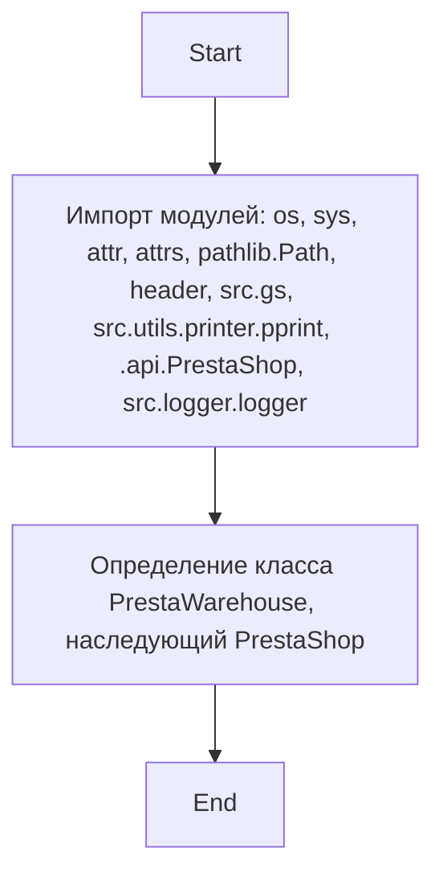
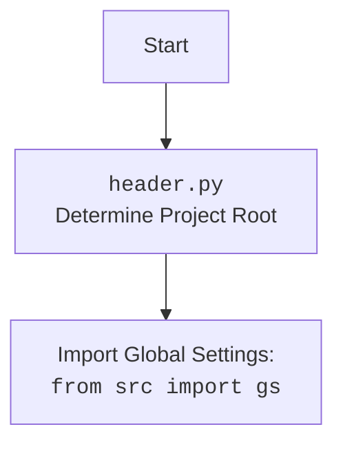

## АНАЛИЗ КОДА: `hypotez/src/endpoints/prestashop/warehouse.py`

### <алгоритм>

1.  **Импорт модулей:**
    *   Импортируются модули `os`, `sys` для работы с операционной системой и системными параметрами.
    *   Импортируются `attr`, `attrs` из библиотеки `attr` для создания классов с атрибутами.
    *   Импортируется `Path` из `pathlib` для работы с путями файлов.
    *   Импортируется `header` (предположительно из `header.py`) для определения корневой директории проекта.
    *   Импортируется `gs` (глобальные настройки) из `src`.
    *   Импортируется `pprint` для форматированного вывода из `src.utils.printer`.
    *   Импортируется `PrestaShop` из `.api` (текущего пакета), предположительно для взаимодействия с API PrestaShop.
    *   Импортируется `logger` для логирования из `src.logger.logger`.

2.  **Определение класса `PrestaWarehouse`:**
    *   Создается класс `PrestaWarehouse`, наследующий от `PrestaShop`.
    *   Содержимое класса на данный момент представлено `...`, что подразумевает, что детали реализации класса не включены в представленный код.

**Пример использования импортов:**

*   `os.path.join("dir", "file.txt")` - пример использования `os` для создания путей.
*   `Path("/home/user/file.txt").exists()` - пример использования `Path` для проверки существования файла.
*   `gs.PRESTASHOP_URL` - пример обращения к глобальной настройке из `gs`.
*   `pprint({"key": "value"})` - пример форматированного вывода данных с помощью `pprint`.
*   `logger.info("Сообщение")` - пример логирования с помощью `logger`.

### <mermaid>

**Объяснение зависимостей:**

*   `os`, `sys` : стандартные модули Python для работы с операционной системой и системными параметрами.
*   `attr`, `attrs` : библиотека для создания классов с атрибутами, упрощает создание классов данных.
*   `pathlib.Path`: класс для работы с путями файловой системы в объектно-ориентированном стиле.
*   `header`: Пользовательский модуль, предположительно отвечающий за определение корневого каталога проекта.
*   `src.gs`: Глобальные настройки проекта, например, URL API, ключи.
*   `src.utils.printer.pprint`:  Функция форматированного вывода данных.
*   `.api.PrestaShop`: Класс, отвечающий за взаимодействие с API PrestaShop.
*   `src.logger.logger`:  Логгер для записи информации о работе программы.

**mermaid header.py:**

### <объяснение>

**Импорты:**

*   `os`, `sys`:  Используются для низкоуровневых операций, таких как работа с путями в файловой системе (`os.path.join`), управление системными параметрами (`sys.path`). Они предоставляют доступ к функциям, зависящим от операционной системы.
*   `attr`, `attrs`: Из библиотеки `attr`, предназначены для автоматической генерации методов `__init__`, `__repr__`, `__eq__` и других boilerplate-методов для классов, что упрощает создание классов, предназначенных для хранения данных.
*   `pathlib.Path`: Более современный и объектно-ориентированный подход к работе с путями, чем `os.path`. Позволяет создавать и манипулировать путями, упрощая чтение файлов, создание директорий и т.д.
*   `header`: Этот импорт предполагает наличие файла `header.py` в проекте, который, вероятно, содержит логику для определения корневой директории проекта. Это может быть необходимо для правильной работы с путями, как это можно увидеть в примере вызова `src.gs`, который, вероятно, использует этот root.
*   `src.gs`:  Глобальные настройки проекта, доступные в виде объекта `gs`. Обычно содержит конфигурационные данные, такие как API ключи, URL-ы и другие общие настройки.
*   `src.utils.printer.pprint`:  Функция для "красивой" печати данных в консоль. Обычно используется для отладки и вывода структурированных данных.
*   `.api.PrestaShop`:  Класс `PrestaShop`, импортированный из текущего пакета,  вероятно, содержит методы для взаимодействия с API PrestaShop. Использование относительного импорта (`.api`) указывает на то, что класс `PrestaShop` расположен в том же пакете.
*   `src.logger.logger`:  Модуль для логирования событий в приложении, что помогает в отладке и мониторинге работы.

**Классы:**

*   `PrestaWarehouse(PrestaShop)`:
    *   **Роль:** Этот класс предназначен для представления склада PrestaShop. Он наследует функциональность класса `PrestaShop`, что предполагает, что он будет использовать методы для взаимодействия с API PrestaShop.
    *   **Атрибуты:** В текущем коде отсутствуют атрибуты. Но поскольку он наследует от `PrestaShop` , он, скорее всего, будет использовать атрибуты и методы, унаследованные от родительского класса.
    *   **Методы:** На данный момент отсутствуют методы, но можно предположить, что он будет реализовывать методы для получения, создания, обновления и удаления информации о складах PrestaShop.
    *   **Взаимодействие:** Взаимодействует с API PrestaShop через методы, унаследованные от `PrestaShop`, и, возможно, реализует собственную бизнес-логику для работы со складами.

**Функции:**

*   В данном коде отсутствуют пользовательские функции.  Однако используются функции из импортированных модулей (`os.path.join`, `Path(...).exists()`, `pprint`, `logger.info` и др.).

**Переменные:**
*  В данном коде переменные не определены, но будут использоваться в дальнейшей реализации класса `PrestaWarehouse`.

**Потенциальные ошибки и улучшения:**
*   **Отсутствие реализации класса `PrestaWarehouse`:** Код предоставляет только объявление класса без какой-либо реализации. Это значит, что класс еще не готов к использованию и требует доработки.
*   **Неопределенность `header.py`:** Функционал `header.py` не ясен, но важно понять, как он определяет корневую директорию, так как это влияет на импорт `src.gs` и другие части проекта.
*   **Обработка ошибок:**  В коде не предусмотрена обработка исключений. В дальнейшей реализации необходимо предусмотреть обработку возможных ошибок, например, при работе с API PrestaShop, файловой системой, и т.д.

**Цепочка взаимосвязей:**

*   `warehouse.py` -> `api.py`: `PrestaWarehouse` наследует от `PrestaShop`, что подразумевает взаимодействие с `api.py` через методы родительского класса.
*   `warehouse.py` -> `header.py` -> `src/gs`:  `header.py` определяет корневую директорию проекта, что может влиять на то, как `src/gs` загружает глобальные настройки.
*  `warehouse.py` -> `src.logger.logger`: Для логирования событий.
*   `warehouse.py` -> `src.utils.printer`: Для форматированного вывода информации.

Таким образом, этот файл `warehouse.py` является частью системы для взаимодействия с PrestaShop и представляет класс, который будет отвечать за работу со складами. Он зависит от нескольких модулей для работы с файловой системой, API, логирования и настроек.