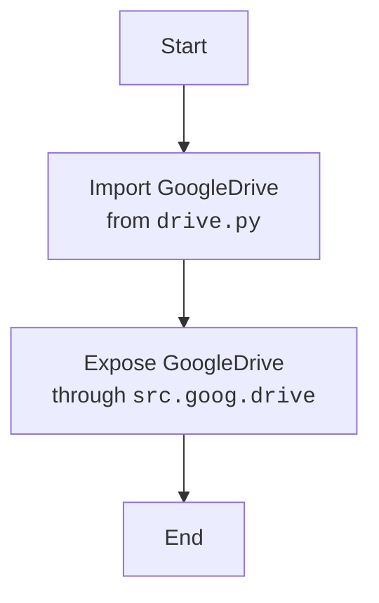

## АНАЛИЗ КОДА: `hypotez/src/goog/drive/__init__.py`

### <алгоритм>

1.  **Импорт модуля `drive`**:
    *   Импортируется модуль `GoogleDrive` из файла `drive.py`, расположенного в той же директории (`.`).
    *   Пример: `from .drive import GoogleDrive`.  Это значит, что из `drive.py` импортируется класс или функция `GoogleDrive`.
2.  **Инициализация модуля `src.goog.drive`**:
    *   Файл `__init__.py` действует как точка входа для пакета `src.goog.drive`.
    *   При импорте `src.goog.drive`, автоматически импортируется `GoogleDrive` из `drive.py`, что делает `GoogleDrive` доступным напрямую через пакет `src.goog.drive`.
    *   Пример использования: `from src.goog.drive import GoogleDrive`.

### <mermaid>

**Объяснение диаграммы `mermaid`:**

*   **Start**: Начало процесса импорта и инициализации пакета `src.goog.drive`.
*   **ImportDrive**: Импорт класса `GoogleDrive` из модуля `drive.py`, расположенного в той же директории.
*   **ExposeGoogleDrive**: Сделает `GoogleDrive` доступным при импорте пакета `src.goog.drive`.
*   **End**: Завершение процесса инициализации.

### <объяснение>

**Импорты:**

*   `from .drive import GoogleDrive`:
    *   `.drive`  указывает на модуль `drive.py`, находящийся в том же каталоге, что и `__init__.py`. Это способ импорта модулей внутри пакета.
    *   `GoogleDrive`: Предполагается, что это класс или функция, определенная в `drive.py`.
    *   **Назначение:** Этот импорт делает класс `GoogleDrive` доступным при импорте пакета `src.goog.drive`.

**Классы:**

*   В данном файле нет определения классов. Класс `GoogleDrive` должен быть определен в `drive.py`.

**Функции:**

*   В этом файле нет явных функций.  Однако неявно `__init__.py` играет роль функции инициализации, подготавливая пакет к использованию.

**Переменные:**

*   В данном файле нет явных переменных.

**Потенциальные проблемы и области для улучшения:**

1.  **Отсутствие документации**: Файл содержит только строку документации пакета. Хорошей практикой было бы добавление документации к самому файлу `__init__.py`.
2.  **Зависимость от `drive.py`**:  Работа `__init__.py` полностью зависит от наличия и правильности `drive.py`. Необходимо убедиться, что `drive.py` всегда содержит правильное определение `GoogleDrive`.
3.  **Нет обработки ошибок**:  Если импорт из `drive.py` не удается, это приведет к ошибке при импорте пакета `src.goog.drive`. Желательно добавить обработку исключений.

**Цепочка взаимосвязей с другими частями проекта:**

*   Этот файл является частью пакета `src.goog.drive`, который, предположительно, отвечает за взаимодействие с Google Drive API.
*   Другие части проекта могут импортировать `src.goog.drive` и использовать `GoogleDrive` для работы с Google Drive. Пример: `from src.goog.drive import GoogleDrive; drive = GoogleDrive(); drive.uploadFile(...)`.
*  Зависит от `src.gs` (глобальные настройки проекта) если таковы используются в `drive.py`.

В целом, данный `__init__.py` является простым, но важным файлом, который обеспечивает доступ к функциональности Google Drive из других частей проекта.