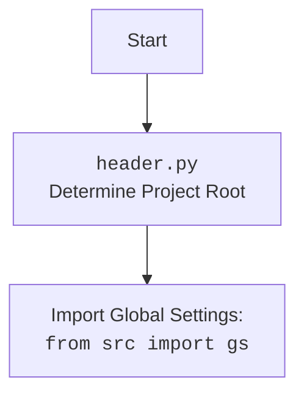

## ИНСТРУКЦИЯ:

Анализируй предоставленный код подробно и объясни его функциональность. Ответ должен включать три раздела:

1. **<алгоритм>**: Опиши рабочий процесс в виде пошаговой блок-схемы, включая примеры для каждого логического блока, и проиллюстрируй поток данных между функциями, классами или методами.
2. **<mermaid>**: Напиши код для диаграммы в формате `mermaid`, проанализируй и объясни все зависимости,
    которые импортируются при создании диаграммы.
    **ВАЖНО!** Убедитесь, что все имена переменных, используемые в диаграмме `mermaid`,
    имеют осмысленные и описательные имена. Имена переменных вроде `A`, `B`, `C`, и т.д., не допускаются!

    **Дополнительно**: Если в коде есть импорт `import header`, добавьте блок `mermaid` flowchart, объясняющий `header.py`:
    ```mermaid
    flowchart TD
        Start --> Header[<code>header.py</code><br> Determine Project Root]

        Header --> import[Import Global Settings: <br><code>from src import gs</code>]
    ```

3. **<объяснение>**: Предоставьте подробные объяснения:
   - **Импорты**: Их назначение и взаимосвязь с другими пакетами `src.`.
   - **Классы**: Их роль, атрибуты, методы и взаимодействие с другими компонентами проекта.
   - **Функции**: Их аргументы, возвращаемые значения, назначение и примеры.
   - **Переменные**: Их типы и использование.
   - Выделите потенциальные ошибки или области для улучшения.

Дополнительно, постройте цепочку взаимосвязей с другими частями проекта (если применимо).

Это обеспечивает всесторонний и структурированный анализ кода.
## Формат ответа: `.md` (markdown)
**КОНЕЦ ИНСТРУКЦИИ**

### <алгоритм>

1.  **Начало**: Скрипт запускается.
2.  **Определение корня проекта (set_project_root)**:
    *   Функция `set_project_root` вызывается с аргументом `marker_files`, по умолчанию `('__root__', '.git')`.
    *   Получается абсолютный путь к текущему файлу (`__file__`) и его родительская директория (`current_path`).
    *   Перебираются родительские директории (`parent`) `current_path` и его предков.
    *   Для каждой директории `parent` проверяется, существует ли любой из `marker_files` в ней. Если да, директория `parent` устанавливается как корень проекта (`__root__`).
    *   Если корень проекта не найден, текущая директория  `current_path` считается корнем проекта.
    *   Если корень проекта `__root__` еще не добавлен в список путей поиска модулей (`sys.path`), он добавляется.
    *   Функция возвращает путь к корню проекта (`__root__`).
    *   *Пример*: Если файл `header.py` находится в `/home/user/hypotez/src/goog/spreadsheet`, а файл `.git` находится в `/home/user/hypotez`, то корень проекта будет `/home/user/hypotez`.
3.  **Инициализация переменной `__root__`**: Возвращенное значение из `set_project_root()` сохраняется в глобальной переменной `__root__`.
4.  **Импорт глобальных настроек**:
    *   Выполняется `from src import gs`, импортируя модуль `gs` из пакета `src`.
5.  **Чтение файла настроек**:
    *   Пытаемся открыть файл `settings.json`, расположенный по пути, полученному с помощью `gs.path.root / 'src' / 'settings.json'`.
    *   Если файл открывается успешно, его содержимое загружается в переменную `settings` как словарь.
    *   В случае `FileNotFoundError` или `json.JSONDecodeError`, ошибки обрабатываются и `settings` остается `None`.
6. **Чтение README.md**:
    *   Пытаемся открыть файл `README.MD`, расположенный по пути, полученному с помощью `gs.path.root / 'src' / 'README.MD'`.
    *   Если файл открывается успешно, его содержимое загружается в переменную `doc_str` как строка.
    *   В случае `FileNotFoundError` или `json.JSONDecodeError`, ошибки обрабатываются и `doc_str` остается `None`.
7.  **Инициализация метаданных проекта**:
    *   Используя `settings` (если он не `None`), извлекаются значения для метаданных проекта, такие как `__project_name__`, `__version__`, `__author__`, `__copyright__` и `__cofee__`, с дефолтными значениями, если соответствующие ключи не найдены в `settings`.
    *   Значение `doc_str` присваивается переменной `__doc__`, если `doc_str` не `None`. В противном случае, `__doc__` будет пустой строкой.
    *  `__details__` инициализируется пустой строкой.

### <mermaid>

```mermaid
flowchart TD
    Start[Начало] --> FindProjectRoot[<code>set_project_root()</code><br>Определение корня проекта];
    FindProjectRoot -- Возвращает путь к корню проекта --> SetRootVariable[<code>__root__</code> = Путь к корню проекта]
    SetRootVariable --> ImportGS[<code>from src import gs</code><br>Импорт глобальных настроек]
    ImportGS --> ReadSettingsFile[Чтение <code>settings.json</code>];
    ReadSettingsFile -- Успешно --> LoadSettings[Загрузка настроек в <code>settings</code>]
    ReadSettingsFile -- Ошибка чтения файла/json --> LoadSettings[<code>settings = None</code>]
    LoadSettings --> ReadReadmeFile[Чтение <code>README.MD</code>];
    ReadReadmeFile -- Успешно --> LoadReadme[Загрузка содержимого в <code>doc_str</code>]
    ReadReadmeFile -- Ошибка чтения файла/json --> LoadReadme[<code>doc_str = None</code>]
    LoadReadme --> InitializeMetadata[Инициализация метаданных проекта]
    InitializeMetadata --> End[Конец]

    style Start fill:#f9f,stroke:#333,stroke-width:2px
    style End fill:#ccf,stroke:#333,stroke-width:2px
```


**Объяснение зависимостей:**

*   **`Start`**: Начало выполнения скрипта.
*   **`FindProjectRoot`**: Вызывает функцию `set_project_root`, которая ищет корень проекта.
*   **`SetRootVariable`**: Сохраняет результат выполнения `set_project_root` в переменную `__root__`.
*    **`ImportGS`**: Импортирует модуль `gs` из пакета `src`, обеспечивающий доступ к глобальным настройкам проекта, например, к пути к корню проекта.
*   **`ReadSettingsFile`**:  Пытается прочитать файл `settings.json` с использованием пути, определенного через `gs.path.root`.
*   **`LoadSettings`**: Если файл прочитан успешно, данные загружаются в словарь `settings`, иначе `settings` устанавливается в `None`.
*   **`ReadReadmeFile`**:  Пытается прочитать файл `README.MD` с использованием пути, определенного через `gs.path.root`.
*   **`LoadReadme`**: Если файл прочитан успешно, данные загружаются в строку `doc_str`, иначе `doc_str` устанавливается в `None`.
*   **`InitializeMetadata`**: Инициализирует переменные, содержащие метаданные проекта, такие как имя, версия, автор, и т. д., используя данные из `settings` и `doc_str`, если они доступны.
*   **`End`**: Конец выполнения скрипта.

### <объяснение>

**Импорты:**

*   `sys`: Модуль `sys` используется для работы с системными параметрами, включая `sys.path`, в который добавляется корень проекта для возможности импорта модулей из этого каталога.
*   `json`: Модуль `json` используется для работы с файлами JSON, в частности, для загрузки файла `settings.json`.
*    `packaging.version.Version`: Импортируется класс `Version` из библиотеки `packaging` для  работы с версиями программного обеспечения. В данном случае не используется, но импортирован.
*   `pathlib.Path`: Класс `Path` из модуля `pathlib` используется для представления путей к файлам и директориям в объектно-ориентированном виде.
*   `from src import gs`: Импортирует модуль `gs` из пакета `src`, который предположительно содержит глобальные настройки и константы проекта, включая путь к корню проекта.

**Классы:**
В предоставленном коде нет определения классов.

**Функции:**

*   `set_project_root(marker_files: tuple = ('__root__', '.git')) -> Path`:
    *   **Аргументы**:
        *   `marker_files`:  Кортеж строк, содержащий имена файлов или директорий, которые используются для идентификации корня проекта. По умолчанию `('__root__', '.git')`.
    *   **Возвращаемое значение**:
        *   Объект `Path`, представляющий путь к корню проекта.
    *   **Назначение**:
        *   Эта функция определяет корневую директорию проекта, ищет её, поднимаясь вверх по иерархии директорий, начиная от директории текущего файла. Поиск останавливается, когда будет найдена директория, содержащая любой из файлов или директорий, указанных в `marker_files`.
    *   **Пример**:
        ```python
        # Если файл header.py находится в /home/user/project/src/goog/spreadsheet
        # и .git находится в /home/user/project
        root_path = set_project_root()
        print(root_path)  # Выведет: /home/user/project
        ```

**Переменные:**

*   `__root__: Path`:  Путь к корневой директории проекта, определенный функцией `set_project_root`.
*   `settings: dict`: Словарь, содержащий настройки проекта, загруженные из файла `settings.json`.
*   `doc_str: str`: Строка, содержащая содержимое файла `README.MD`.
*   `__project_name__: str`: Имя проекта, извлеченное из `settings` или значение по умолчанию 'hypotez'.
*    `__version__: str`: Версия проекта, извлеченная из `settings` или пустая строка.
*   `__doc__: str`:  Описание проекта, извлеченное из `doc_str` или пустая строка.
*   `__details__: str`: Строка, предназначенная для хранения деталей проекта.
*   `__author__: str`: Автор проекта, извлеченный из `settings` или пустая строка.
*   `__copyright__: str`: Информация об авторских правах проекта, извлеченная из `settings` или пустая строка.
*   `__cofee__: str`: Сообщение с предложением поддержать разработчика чашечкой кофе, извлеченное из `settings` или значение по умолчанию.

**Потенциальные ошибки и области для улучшения:**

*   **Отсутствие обработки ошибок**: Блок `try-except` для чтения `settings.json` и `README.MD` просто пропускает ошибки (`...`), что может затруднить отладку. Можно добавить логирование ошибок или выводить предупреждение.
*   **Жестко заданные пути**: Пути к `settings.json` и `README.MD` жестко заданы относительно `gs.path.root`. Если структура проекта изменится, эти пути нужно будет менять вручную.
*  **Зависимость от gs**: Проект сильно зависит от модуля `gs` для определения корневой директории. Желательно сделать зависимость менее явной, либо описать структуру `gs` более детально.
*   **Неиспользуемый импорт**: Импорт `packaging.version.Version` не используется в коде и может быть удален.
*   **Отсутствие type hint для `__root__`:** Переменная  `__root__` аннотирована типом `Path` только внутри функции `set_project_root`, а за ее пределами - нет.

**Взаимосвязь с другими частями проекта:**

*   Модуль `header.py` является центральным, так как определяет корень проекта и загружает основные настройки.
*   Модуль `gs`, предположительно, содержит пути к различным частям проекта, включая путь к корню, который используется для определения местоположения файлов `settings.json` и `README.MD`.
*   Метаданные, загруженные в этом модуле, могут использоваться другими частями проекта для определения версии, имени проекта, авторских прав, и прочей информации.
*   Используемые `__root__` в `sys.path` обеспечивает правильную работу импортов из всего проекта.

Этот анализ предоставляет полную картину функциональности, зависимостей и потенциальных улучшений для данного модуля.