## ИНСТРУКЦИЯ:

Анализируй предоставленный код подробно и объясни его функциональность. Ответ должен включать три раздела:  

1.  **<алгоритм>**: Опиши рабочий процесс в виде пошаговой блок-схемы, включая примеры для каждого логического блока, и проиллюстрируй поток данных между функциями, классами или методами.  
2.  **<mermaid>**: Напиши код для диаграммы в формате `mermaid`, проанализируй и объясни все зависимости,  
    которые импортируются при создании диаграммы.  
    **ВАЖНО!** Убедитесь, что все имена переменных, используемые в диаграмме `mermaid`,  
    имеют осмысленные и описательные имена. Имена переменных вроде `A`, `B`, `C`, и т.д., не допускаются!  
    
    **Дополнительно**: Если в коде есть импорт `import header`, добавьте блок `mermaid` flowchart, объясняющий `header.py`:\
    ```mermaid
    flowchart TD
        Start --> Header[<code>header.py</code><br> Determine Project Root]
    
        Header --> import[Import Global Settings: <br><code>from src import gs</code>] 
    ```
3.  **<объяснение>**: Предоставьте подробные объяснения:  
    - **Импорты**: Их назначение и взаимосвязь с другими пакетами `src.`.  
    - **Классы**: Их роль, атрибуты, методы и взаимодействие с другими компонентами проекта.  
    - **Функции**: Их аргументы, возвращаемые значения, назначение и примеры.  
    - **Переменные**: Их типы и использование.  
    - Выделите потенциальные ошибки или области для улучшения.  

Дополнительно, постройте цепочку взаимосвязей с другими частями проекта (если применимо).  

Это обеспечивает всесторонний и структурированный анализ кода.
## Формат ответа: `.md` (markdown)
**КОНЕЦ ИНСТРУКЦИИ**

## <алгоритм>
```mermaid
graph TD
    A[Start] --> B{Инициализация QApplication};
    B --> C{Создание AssistantMainWindow};
    C --> D{Установка размеров окна};
    D --> E{Запрос выбора браузера};
    E -- Выбран браузер --> F{Определение пути профиля браузера};
    E -- Нет выбора --> G{Вывод сообщения об ошибке и выход};
    F --> H{Создание QWebEngineProfile};
    H --> I{Создание QWebEngineView};
    I --> J{Создание верхней панели};
    J --> K{Создание поля ввода URL};
    K --> L{Создание кнопки "Загрузить"};
    L --> M{Создание кнопки "Свернуть"};
    M --> N{Создание кнопки "На весь экран"};
    N --> O{Создание кнопки "Закрыть"};
    O --> P{Определение Layout верхней панели};
    P --> Q{Определение основного Layout};
    Q --> R{Создание центрального виджета};
    R --> S{Создание иконки системного трея};
    S --> T{Создание контекстного меню трея};
    T --> U{Создание меню сервисов Google};
    U --> V{Создание меню выбора модели};
    V --> W{Создание кнопок открытия меню};
    W --> X{Отображение окна};
    X --> Y{Запуск event loop QApplication};
    Y -- Событие закрытия --> Z{Скрытие в трей};
    Y -- Ввод URL --> AA{Загрузка URL в браузере};
    AA --> Y
     Z --> Y
    
    
    style A fill:#f9f,stroke:#333,stroke-width:2px
    style B fill:#ccf,stroke:#333,stroke-width:2px
    style C fill:#ccf,stroke:#333,stroke-width:2px
    style D fill:#ccf,stroke:#333,stroke-width:2px
    style E fill:#ccf,stroke:#333,stroke-width:2px
    style F fill:#ccf,stroke:#333,stroke-width:2px
    style G fill:#ccf,stroke:#333,stroke-width:2px
    style H fill:#ccf,stroke:#333,stroke-width:2px
    style I fill:#ccf,stroke:#333,stroke-width:2px
    style J fill:#ccf,stroke:#333,stroke-width:2px
    style K fill:#ccf,stroke:#333,stroke-width:2px
    style L fill:#ccf,stroke:#333,stroke-width:2px
    style M fill:#ccf,stroke:#333,stroke-width:2px
    style N fill:#ccf,stroke:#333,stroke-width:2px
    style O fill:#ccf,stroke:#333,stroke-width:2px
    style P fill:#ccf,stroke:#333,stroke-width:2px
    style Q fill:#ccf,stroke:#333,stroke-width:2px
    style R fill:#ccf,stroke:#333,stroke-width:2px
    style S fill:#ccf,stroke:#333,stroke-width:2px
    style T fill:#ccf,stroke:#333,stroke-width:2px
     style U fill:#ccf,stroke:#333,stroke-width:2px
      style V fill:#ccf,stroke:#333,stroke-width:2px
       style W fill:#ccf,stroke:#333,stroke-width:2px
        style X fill:#ccf,stroke:#333,stroke-width:2px
          style Y fill:#ccf,stroke:#333,stroke-width:2px
          style Z fill:#ccf,stroke:#333,stroke-width:2px
          style AA fill:#ccf,stroke:#333,stroke-width:2px

```

**Примеры:**

- **A (Start):** Начало выполнения скрипта `main.py`.
- **B (Инициализация QApplication):** Создание экземпляра `QApplication`, необходимого для работы PyQt.
- **C (Создание AssistantMainWindow):** Создание главного окна приложения на основе класса `AssistantMainWindow`.
- **D (Установка размеров окна):** Определение размера и начального положения окна (3/4 экрана).
- **E (Запрос выбора браузера):** Пользователю предлагается выбрать браузер по умолчанию из списка ("Chrome", "Firefox", "Edge").
    - Пример: Если пользователь выбирает "Chrome", то далее будет использован путь к профилю Chrome.
- **F (Определение пути профиля браузера):** В зависимости от выбора браузера определяется путь к его профилю пользователя.
    - Пример: Для Chrome путь будет `"~\\AppData\\Local\\Google\\Chrome\\User Data\\Default"`.
- **G (Вывод сообщения об ошибке и выход):** Если браузер не выбран или не поддерживается, выводится сообщение об ошибке, и приложение завершает работу.
- **H (Создание QWebEngineProfile):** Создание профиля браузера на основе полученного пути.
- **I (Создание QWebEngineView):** Создание веб-вьюера для отображения веб-страниц.
- **J (Создание верхней панели):** Создание виджета для размещения элементов управления (кнопок и поля ввода URL).
- **K (Создание поля ввода URL):** Создание текстового поля для ввода URL.
- **L (Создание кнопки "Загрузить"):** Создание кнопки для загрузки URL, введенного в текстовое поле.
- **M (Создание кнопки "Свернуть"):** Создание кнопки для сворачивания окна в системный трей.
- **N (Создание кнопки "На весь экран"):** Создание кнопки для отображения окна на весь экран.
- **O (Создание кнопки "Закрыть"):** Создание кнопки для закрытия окна.
- **P (Определение Layout верхней панели):** Определение размещения элементов управления на верхней панели.
- **Q (Определение основного Layout):** Определение расположения верхней панели и веб-вьюера.
- **R (Создание центрального виджета):** Создание основного виджета, на котором размещаются все элементы окна.
- **S (Создание иконки системного трея):** Создание иконки для системного трея.
- **T (Создание контекстного меню трея):** Создание контекстного меню для иконки в системном трее (восстановление окна, выход из приложения).
- **U (Создание меню сервисов Google):** Создание меню для быстрого доступа к сервисам Google.
- **V (Создание меню выбора модели):** Создание меню для выбора модели (ChatGPT, Gemini, Claude).
- **W (Создание кнопок открытия меню):** Создание кнопок для открытия меню сервисов Google и выбора модели.
- **X (Отображение окна):** Отображение главного окна приложения.
- **Y (Запуск event loop QApplication):** Запуск главного цикла обработки событий PyQt.
- **Z (Скрытие в трей):** При закрытии или нажатии кнопки "Свернуть", окно сворачивается в трей.
- **AA (Загрузка URL в браузере):** Загрузка URL, введенного пользователем или выбранного из меню, в веб-вьюер.

```mermaid
classDiagram
    class QApplication {
        <<class>>
        +QApplication(sys.argv)
        +exec()
        +setQuitOnLastWindowClosed(bool)
    }
    class QMainWindow {
        <<class>>
         +QMainWindow()
        +setCentralWidget(QWidget)
        +setWindowFlags(Qt.WindowType)
        +setGeometry(x, y, width, height)
        +show()
        +showFullScreen()
        +showNormal()
    }
    class QWidget {
        <<class>>
        +QWidget(parent=None)
        +setLayout(QLayout)
        +setStyleSheet(styleSheet: str)
        +setFixedHeight(height: int)
    }
    class QLineEdit {
        <<class>>
        +QLineEdit(parent=None)
        +setPlaceholderText(text: str)
        +text()
        +returnPressed(signal)
    }
    class QPushButton {
        <<class>>
        +QPushButton(text: str, parent=None)
        +clicked(signal)
        +setFixedSize(width: int, height: int)
        +setIcon(QIcon)
         +setToolTip(toolTip: str)
        +setMenu(QMenu)
    }
    class QVBoxLayout {
         <<class>>
        +QVBoxLayout(parent=None)
        +addWidget(QWidget)
        +setContentsMargins(left: int, top: int, right: int, bottom: int)
    }
     class QHBoxLayout {
         <<class>>
        +QHBoxLayout(parent=None)
        +addWidget(QWidget)
         +addStretch(stretch: int)
        +setContentsMargins(left: int, top: int, right: int, bottom: int)
    }
    class QWebEngineView {
       <<class>>
         +QWebEngineView(parent=None)
        +setPage(QWebEnginePage)
        +setUrl(QUrl)
    }
    class QWebEngineProfile {
        <<class>>
       +QWebEngineProfile(profile_path: str)
       +defaultProfile()
    }
    class QUrl {
       <<class>>
        +QUrl(url: str)
    }
     class QSystemTrayIcon {
       <<class>>
        +QSystemTrayIcon(parent=None)
        +setIcon(QIcon)
        +setContextMenu(QMenu)
        +show()
        +hide()
    }
    class QMenu {
      <<class>>
         +QMenu(title: str, parent=None)
        +addAction(QAction)
    }
    class QAction {
      <<class>>
       +QAction(text: str, parent=None)
       +triggered(signal)
    }
    class QIcon {
        <<class>>
        +QIcon.fromTheme(name: str)
    }
    class QMessageBox {
     <<class>>
        +QMessageBox.warning(parent: QWidget, title: str, message: str)
        +QMessageBox.getItem(parent: QWidget, title: str, label: str, items: list, current: int, editable: bool)
    }
    class AssistantMainWindow {
        <<class>>
        +__init__()
        +ask_for_browser()
        +load_url(url: str)
        +hide_to_tray()
        +quit_app()
        +closeEvent(event)
        -title_bar: QWidget
         -url_input: QLineEdit
        -load_button: QPushButton
        -minimize_button: QPushButton
        -fullscreen_button: QPushButton
        -close_button: QPushButton
        -browser: QWebEngineView
        -profile: QWebEngineProfile
         -tray_icon: QSystemTrayIcon
         -url_menu: QMenu
         -model_menu: QMenu
         -url_button: QPushButton
         -model_button: QPushButton
    }
    QApplication --|> AssistantMainWindow
     AssistantMainWindow --|> QMainWindow
     AssistantMainWindow --|> QWidget
     AssistantMainWindow --|> QLineEdit
      AssistantMainWindow --|> QPushButton
       AssistantMainWindow --|> QWebEngineView
       AssistantMainWindow --|> QWebEngineProfile
       AssistantMainWindow --|> QSystemTrayIcon
       AssistantMainWindow --|> QMenu
       AssistantMainWindow --|> QAction
      AssistantMainWindow --|>  QHBoxLayout
        AssistantMainWindow --|> QVBoxLayout
    QLineEdit --|> QWidget
     QPushButton --|> QWidget
     QWebEngineView --|> QWidget
      QSystemTrayIcon --|> QWidget
     QAction --|> QWidget
    QVBoxLayout --|> QLayout
    QHBoxLayout --|> QLayout
     QMenu --|> QWidget
        QMessageBox --|> QWidget
    
```

## <mermaid>

**Описание зависимостей:**
- `QApplication`: Управляет основным циклом событий и общими настройками приложения.
- `QMainWindow`: Базовый класс для главного окна приложения. `AssistantMainWindow` наследуется от него.
- `QWidget`: Базовый класс для всех UI элементов. Используется для создания контейнеров и кнопок.
- `QLineEdit`: Поле для ввода текста, используется для ввода URL.
- `QPushButton`: Кнопки для выполнения действий (загрузка URL, сворачивание, закрытие).
- `QVBoxLayout`: Менеджер компоновки для вертикального размещения виджетов.
-  `QHBoxLayout`: Менеджер компоновки для горизонтального размещения виджетов.
- `QWebEngineView`: Компонент для отображения веб-страниц.
- `QWebEngineProfile`: Управляет профилем браузера (путь к данным пользователя).
- `QUrl`: Класс для работы с URL.
-  `QSystemTrayIcon`: Компонент для отображения иконки в системном трее.
- `QMenu`: Контекстное меню для системного трея и меню для выбора URL и моделей.
- `QAction`: Элемент меню, выполняющий действие при выборе.
- `QIcon`: Класс для работы с иконками, используется для установки иконок на кнопки и в системном трее.
- `QMessageBox`: Используется для вывода предупреждений и запросов к пользователю.
- `AssistantMainWindow`: Главное окно приложения, которое содержит все виджеты и управляет их поведением.

## <объяснение>

**Импорты:**
- `sys`: Предоставляет доступ к некоторым переменным и функциям, которые взаимодействуют с интерпретатором Python.
    - Используется для завершения работы приложения через `sys.exit()`.
- `os`: Предоставляет функции для работы с операционной системой.
    - Используется для определения пути к профилю браузера `os.path.expanduser()`.
- `PyQt6.QtCore`: Основной модуль PyQt, содержит основные классы и функции для работы с событиями, сигналами и т.д.
    - `Qt`: Константы для определения типа окна.
    - `QUrl`: Используется для представления URL.
- `PyQt6.QtGui`: Модуль PyQt, содержащий классы для работы с графическим интерфейсом, такими как иконки.
    - `QIcon`: Используется для загрузки иконок.
    - `QAction`: Используется для создания элементов меню.
- `PyQt6.QtWidgets`: Модуль PyQt, содержащий классы для создания элементов пользовательского интерфейса (кнопки, окна, виджеты).
    - `QApplication`: Класс для управления приложением PyQt.
    - `QMainWindow`: Основной класс для главного окна приложения.
    - `QSystemTrayIcon`: Класс для работы с иконкой в системном трее.
    - `QMenu`: Класс для создания меню.
    - `QPushButton`: Класс для создания кнопок.
    - `QVBoxLayout`, `QHBoxLayout`: Классы для организации размещения виджетов на экране.
    - `QWidget`: Базовый класс для всех виджетов.
    - `QLineEdit`: Класс для создания текстового поля.
    - `QMessageBox`: Класс для вывода сообщений.
- `PyQt6.QtWebEngineWidgets`: Модуль PyQt, предоставляющий классы для работы с веб-движком.
    - `QWebEngineView`: Класс для отображения веб-страниц.
- `PyQt6.QtWebEngineCore`: Модуль PyQt, содержащий основные классы для работы с веб-движком.
    - `QWebEngineProfile`: Класс для управления профилями браузера.

**Классы:**

- `AssistantMainWindow(QMainWindow)`:
    - **Роль:** Главное окно приложения.
    - **Атрибуты:**
      - `title_bar`: `QWidget`, верхняя панель с элементами управления.
      - `url_input`: `QLineEdit`, поле для ввода URL.
      - `load_button`: `QPushButton`, кнопка загрузки URL.
      - `minimize_button`: `QPushButton`, кнопка сворачивания окна.
      - `fullscreen_button`: `QPushButton`, кнопка открытия на весь экран.
      - `close_button`: `QPushButton`, кнопка закрытия окна.
      - `browser`: `QWebEngineView`, виджет для отображения веб-страниц.
      - `profile`: `QWebEngineProfile`, профиль веб-движка.
      - `tray_icon`: `QSystemTrayIcon`, иконка в системном трее.
      - `url_menu`: `QMenu`, меню для выбора URL сервисов Google.
      - `model_menu`: `QMenu`, меню для выбора модели.
      - `url_button`: `QPushButton`, кнопка для открытия меню сервисов Google.
      - `model_button`: `QPushButton`, кнопка для открытия меню выбора модели.
    - **Методы:**
      - `__init__()`: Инициализирует окно, настраивает размеры, создает виджеты и устанавливает layout.
      - `ask_for_browser()`: Запрашивает у пользователя выбор браузера по умолчанию.
      - `load_url(url: str = None)`: Загружает указанный URL в веб-вьюер.
      - `hide_to_tray()`: Сворачивает окно в системный трей.
      - `quit_app()`: Закрывает приложение.
      - `closeEvent(event)`: Переопределяет событие закрытия окна, чтобы свернуть окно в системный трей вместо закрытия.

**Функции:**

- `ask_for_browser()`:
    - **Аргументы:** Нет.
    - **Возвращаемое значение:** Строка с выбранным браузером ("Chrome", "Firefox", "Edge") или `None`, если пользователь не выбрал браузер.
    - **Назначение:** Выводит диалоговое окно с запросом выбора браузера.
    - **Пример:** Если пользователь выбирает "Chrome", возвращается строка `"Chrome"`.
- `load_url(url: str = None)`:
    - **Аргументы:** `url` (строка, по умолчанию `None`).
    - **Возвращаемое значение:** Нет.
    - **Назначение:** Загружает веб-страницу по указанному URL.
    - **Пример:** `load_url("https://www.google.com")` загрузит главную страницу Google.
    - Если `url` не передан явно, берется текст из поля ввода `url_input`.
- `hide_to_tray()`:
    - **Аргументы:** Нет.
    - **Возвращаемое значение:** Нет.
    - **Назначение:** Скрывает окно и переводит его в системный трей.
- `quit_app()`:
    - **Аргументы:** Нет.
    - **Возвращаемое значение:** Нет.
    - **Назначение:** Скрывает иконку из трея и завершает работу приложения.
- `closeEvent(event)`:
    - **Аргументы:** `event` (событие закрытия окна).
    - **Возвращаемое значение:** Нет.
    - **Назначение:** Игнорирует событие закрытия окна и вместо этого вызывает метод `hide_to_tray()` для скрытия окна в трей.

**Переменные:**

- `app`: Экземпляр `QApplication`.
- `window`: Экземпляр `AssistantMainWindow`.
- `screen_geometry`: Объект, содержащий информацию о геометрии экрана.
- `width`, `height`: Ширина и высота окна в пикселях.
- `profile_path`: Строка с путем к профилю выбранного браузера.
- `browser_choice`: Строка с именем выбранного браузера.
- `profile`: Экземпляр `QWebEngineProfile`.
- `browser`: Экземпляр `QWebEngineView`.
- `tray_icon`: Экземпляр `QSystemTrayIcon`.
- `tray_menu`: Экземпляр `QMenu` для системного трея.
- `restore_action`: Экземпляр `QAction` для восстановления окна.
- `quit_action`: Экземпляр `QAction` для выхода из приложения.
- `title_bar_layout`: Экземпляр `QHBoxLayout` для верхней панели.
- `main_layout`: Экземпляр `QVBoxLayout` для основного окна.
- `central_widget`: Экземпляр `QWidget` для центрального виджета.
- `url_menu`: Экземпляр `QMenu` для сервисов Google.
- `model_menu`: Экземпляр `QMenu` для моделей.
- `google_login_action`, `gmail_action`, `google_docs_action`, `google_sheets_action`, `google_drive_action`, `google_photos_action`: Экземпляры `QAction` для меню сервисов Google.
- `chatgpt_action`, `gemini_action`, `claude_action`: Экземпляры `QAction` для меню выбора моделей.
- `url_button`, `model_button`: Экземпляры `QPushButton` для открытия меню.

**Потенциальные ошибки и области для улучшения:**

- **Обработка ошибок:**
    - Не все возможные ошибки обработки ввода пользователя обрабатываются, например, некорректный URL или отсутствие подключения к интернету.
    - В случае ошибки с выбором браузера приложение просто завершает работу. Желательно дать пользователю возможность повторить выбор.
- **Поддержка других браузеров:**
    - Приложение поддерживает только Chrome, Firefox и Edge. Можно расширить поддержку другими браузерами.
- **Настройки профиля:**
    - Пути к профилям браузеров заданы жестко. Было бы лучше сделать их настраиваемыми.
- **UX:**
  - Можно улучшить UX, добавив индикатор загрузки страницы, проверку валидности URL, возможность копировать URL из адресной строки.
- **Зависимость от ОС:**
    -  Пути профилей привязаны к Windows. Для кросс-платформенности нужно будет использовать os.path.join для правильного формирования путей.
- **Меню выбора моделей:**
   -  Ссылки на Gemini и Claude являются заглушками. Их нужно заменить реальными URL.
- **Дополнительные функции:**
  - Можно добавить функцию для возврата на предыдущую страницу,  кнопку обновления страницы,  возможность управлять загрузкой (например, остановить загрузку).
- **Разделение логики:**
   -  Класс `AssistantMainWindow` можно разбить на несколько классов для большей модульности.
- **Документация:**
   -  Код можно дополнить комментариями для повышения читаемости.
- **Тестирование:**
  - Необходимо добавить тесты для проверки работоспособности различных функций.
- **Зависимости:**
  - Можно использовать `requirements.txt` для отслеживания зависимостей.

**Цепочка взаимосвязей с другими частями проекта:**

Данный код представляет собой основной компонент GUI для обучения моделей OpenAI. Он взаимодействует с веб-движком для отображения веб-страниц и загрузки URL, тем самым предоставляя интерфейс для взаимодействия с моделями OpenAI через их веб-интерфейсы. В дальнейшем, этот компонент может быть интегрирован с другими частями проекта, такими как:
- Система управления тренировочными данными.
- Система сбора и хранения результатов.
- Модуль для взаимодействия с API OpenAI (если есть необходимость)

Этот код представляет собой отдельную часть GUI, не имеющей прямых связей с другими частями проекта.