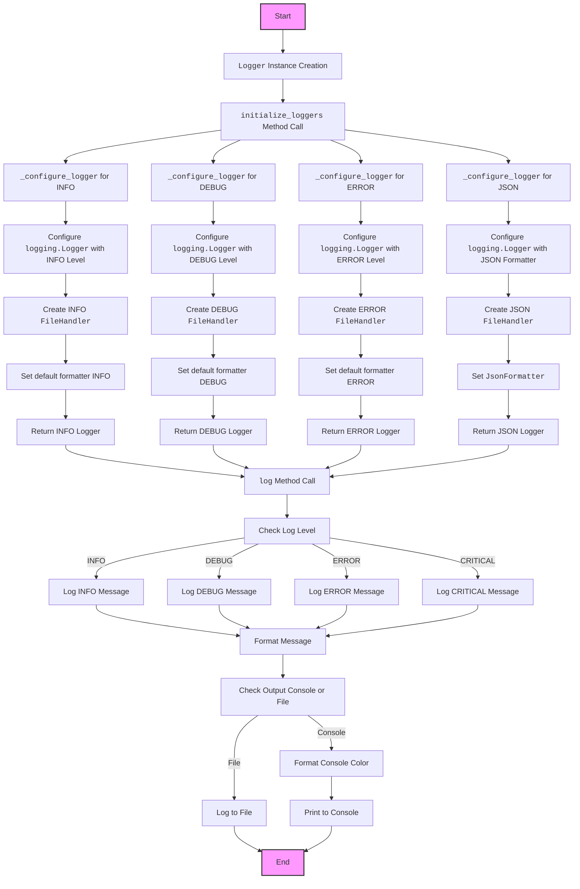
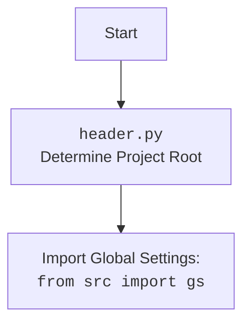

## Анализ кода модуля `src.logger`

### 1. <алгоритм>

**Описание работы модуля `src.logger`:**

Модуль `src.logger` предоставляет настраиваемую систему логирования, которая позволяет записывать сообщения различных уровней (DEBUG, INFO, WARNING, ERROR, CRITICAL) в консоль, файлы и в формате JSON. Он использует Singleton паттерн для гарантирования единственного экземпляра логгера в приложении.

**Пошаговая блок-схема:**

1.  **Инициализация Логгера:**
    *   Создается экземпляр класса `Logger`.
    *   Пример: `logger = Logger()`.
2.  **Конфигурация Логгеров:**
    *   Вызывается метод `initialize_loggers` с путями к файлам для разных типов логирования (info, debug, errors, json).
    *   Пример: `logger.initialize_loggers(info_log_path='logs/info.log', debug_log_path='logs/debug.log', errors_log_path='logs/errors.log', json_log_path='logs/log.json')`.
3.  **Создание Логгеров:**
    *   Внутри `initialize_loggers` вызывается `_configure_logger` для каждого типа логирования.
        *   **_configure_logger:**
            *   Создается экземпляр `logging.Logger`.
            *   Устанавливается уровень логирования (по умолчанию `DEBUG`).
            *   Создается `FileHandler` для записи логов в файл.
            *   Устанавливается форматтер (по умолчанию `%(asctime)s - %(levelname)s - %(message)s`, для json используется `JsonFormatter`).
            *   Возвращается настроенный логгер.
4. **Логирование Сообщений:**
    *   Вызывается метод `log` для записи сообщения с указанным уровнем.
    *   Пример: `logger.log(logging.INFO, 'Сообщение', color=(colorama.Fore.GREEN, colorama.Back.BLACK))`.
        * **Метод `log`:**
             * Определяет, куда отправлять лог: консоль или файл (или и туда и туда).
             * Форматирует сообщение: добавляет цвет для консоли.
             * Вызывает соответствующие методы логгера (`logger.info`, `logger.error` и т.д.).
             * Если есть исключение `ex`, добавляет информацию об исключении.
5.  **Уровни логирования:**
    *   Примеры использования методов для разных уровней:
        *   `logger.info('Информационное сообщение')`
        *   `logger.success('Сообщение об успехе')`
        *   `logger.warning('Предупреждение')`
        *   `logger.debug('Отладочное сообщение')`
        *   `logger.error('Сообщение об ошибке')`
        *   `logger.critical('Критическое сообщение')`
6.  **Форматирование:**
    *   Используется стандартный `logging.Formatter` или кастомный `JsonFormatter` для JSON.
7.  **Цвета:**
    *   Для консольных сообщений можно задавать цвета текста и фона с помощью `colorama`.

### 2. <mermaid>

**Объяснение `mermaid` диаграммы:**

1.  **`Start`**: Начало процесса.
2.  **`LoggerCreation`**: Создание экземпляра класса `Logger`.
3.  **`InitializeLoggers`**: Вызов метода `initialize_loggers` для настройки логгеров.
4.  **`ConfigureInfoLogger`, `ConfigureDebugLogger`, `ConfigureErrorLogger`, `ConfigureJsonLogger`**: Вызовы `_configure_logger` для каждого типа логирования.
5.  **`LoggerConfigInfo`, `LoggerConfigDebug`, `LoggerConfigError`, `LoggerConfigJson`**: Настройка экземпляров `logging.Logger` с соответствующими уровнями и форматерами.
6.  **`FileHandlerInfo`, `FileHandlerDebug`, `FileHandlerError`, `FileHandlerJson`**: Создание обработчиков для записи логов в файлы.
7.   **`FormatterInfo`, `FormatterDebug`, `FormatterError`**: Установка стандартного форматтера.
8.  **`JsonFormatter`**: Установка кастомного JSON форматтера.
9. **`ReturnLoggerInfo`, `ReturnLoggerDebug`, `ReturnLoggerError`, `ReturnLoggerJson`**: Возвращение настроенных логгеров.
10. **`LogMethodCall`**: Вызов метода `log` для записи сообщения.
11. **`CheckLevel`**: Проверка уровня сообщения.
12. **`InfoLog`, `DebugLog`, `ErrorLog`, `CriticalLog`**: Различные методы для логирования сообщений.
13. **`FormatMessage`**: Форматирование сообщения.
14. **`CheckOutput`**: Проверка, куда отправлять сообщение: консоль или файл.
15. **`ColoredOutput`**: Форматирование цвета для консольного вывода.
16. **`FileOutput`**: Запись сообщения в файл.
17. **`PrintConsole`**: Вывод сообщения в консоль.
18. **`End`**: Конец процесса.

### 3. <объяснение>

**Импорты:**

*   `logging`: Стандартный модуль Python для логирования. Используется для создания и настройки логгеров, обработчиков и форматтеров.
*   `typing.Optional`: Используется для аннотации типов переменных, которые могут быть `None`.
*   `colorama`: Библиотека для добавления цветов в вывод консоли. Используется для цветного форматирования логов в консоль.
*   `json`: Модуль для работы с JSON. Используется для форматирования логов в формате JSON.
*   `src.header`: Модуль для определения корня проекта.
*    `src.gs`: Модуль для доступа к глобальным настройкам проекта.

**Классы:**

*   **`SingletonMeta`**:
    *   **Роль**: Метакласс, реализующий шаблон Singleton.
    *   **Атрибуты**: Нет.
    *   **Методы**: `__call__`: Гарантирует, что существует только один экземпляр класса.
    *   **Взаимодействие**: Используется как метакласс для `Logger`, чтобы сделать его Singleton.
*   **`JsonFormatter`**:
    *   **Роль**: Кастомный форматтер для вывода логов в формате JSON.
    *   **Атрибуты**: Нет.
    *   **Методы**: `format`: Преобразует запись лога в JSON-формат.
    *   **Взаимодействие**: Используется `_configure_logger` для форматирования JSON-логов.
*   **`Logger`**:
    *   **Роль**: Основной класс логгера, обеспечивающий логирование в консоль, файлы и JSON.
    *   **Атрибуты**: `_loggers`: Словарь для хранения экземпляров логгеров.
    *   **Методы**:
        *   `__init__`: Инициализирует плейсхолдеры для логгеров.
        *   `_configure_logger`: Настраивает логгер (уровень, обработчик, форматтер) и возвращает его.
        *   `initialize_loggers`: Инициализирует логгеры для разных типов (info, debug, error, json).
        *   `log`: Логирует сообщение на указанном уровне, с возможностью добавления цвета и исключения.
        *   `info`, `success`, `warning`, `debug`, `error`, `critical`: Методы-обертки для вызова `log` с соответствующим уровнем.
    *   **Взаимодействие**: Использует `SingletonMeta` как метакласс, что гарантирует создание только одного экземпляра `Logger`.

**Функции:**

*   **`__init__`**:
    *   **Аргументы**: Нет.
    *   **Возвращаемое значение**: Нет.
    *   **Назначение**: Инициализирует атрибут `_loggers` как пустой словарь.
*   **`_configure_logger`**:
    *   **Аргументы**: `name` (строка), `log_path` (строка), `level` (int, по умолчанию `logging.DEBUG`), `formatter` (`logging.Formatter`, опционально), `mode` (строка, по умолчанию `'a'`).
    *   **Возвращаемое значение**: `logging.Logger`.
    *   **Назначение**: Создает и настраивает логгер, включая установку уровня, обработчика и форматтера.
    *   **Пример**: `_configure_logger('info', 'logs/info.log', logging.INFO)`.
*   **`initialize_loggers`**:
    *   **Аргументы**: `info_log_path` (строка, опционально), `debug_log_path` (строка, опционально), `errors_log_path` (строка, опционально), `json_log_path` (строка, опционально).
    *   **Возвращаемое значение**: Нет.
    *   **Назначение**: Инициализирует логгеры для разных типов, вызывая `_configure_logger` для каждого.
    *   **Пример**: `initialize_loggers(info_log_path='logs/info.log', debug_log_path='logs/debug.log')`.
*   **`log`**:
    *   **Аргументы**: `level` (int), `message` (строка), `ex` (Exception, опционально), `exc_info` (bool, по умолчанию `False`), `color` (кортеж, опционально).
    *   **Возвращаемое значение**: Нет.
    *   **Назначение**: Логирует сообщение на указанном уровне, форматирует цвет для консоли, добавляет информацию об исключении, если нужно.
    *   **Пример**: `log(logging.INFO, 'Информационное сообщение', color=(colorama.Fore.GREEN, colorama.Back.BLACK))`.

**Переменные:**

*   `_loggers`: Словарь в классе `Logger`, хранит настроенные экземпляры логгеров.
*   `name`: Имя логгера.
*   `log_path`: Путь к файлу для логов.
*   `level`: Уровень логирования.
*   `formatter`: Форматтер логов.
*   `mode`: Режим открытия файла ('a' - append, 'w' - write).
*   `message`: Сообщение для логирования.
*   `ex`: Исключение, которое нужно залогировать.
*   `exc_info`: Флаг, показывающий, нужно ли добавлять информацию об исключении.
*   `color`: Кортеж с цветами для текста и фона.

**Потенциальные ошибки и области для улучшения:**

*   **Обработка ошибок открытия файла**: Добавить try-except для обработки ошибок при открытии файла лога.
*   **Конфигурация из файла**: Вместо жестко заданных путей в коде, можно использовать файл конфигурации.
*   **Управление форматом даты**: Можно добавить настройку формата даты.
*   **Более продвинутая система фильтрации сообщений**: Добавить возможность фильтровать сообщения на основе их содержимого или других параметров.
*    **Добавить возможность логирование в разные хранилища**: БД, API, и т.д.

**Цепочка взаимосвязей:**

1.  Модуль `src.logger` зависит от:
    *   Стандартного модуля `logging`.
    *   Библиотеки `colorama` для цветного вывода.
    *   Модуля `json` для работы с JSON.
    *   Модуля `src.header` для определения корня проекта.
        *  `header.py` определяет путь к корневому каталогу проекта.
    *   Модуля `src.gs` для доступа к глобальным настройкам проекта.
2.  Модуль `src.logger` используется в других частях проекта для логирования.

**Дополнительно:**

**Объяснение `header.py`:**

- **`Start`**: Начало процесса.
- **`Header`**: Модуль `header.py` определяет путь к корневому каталогу проекта.
- **`import`**: Импортирует глобальные настройки из `src.gs`.