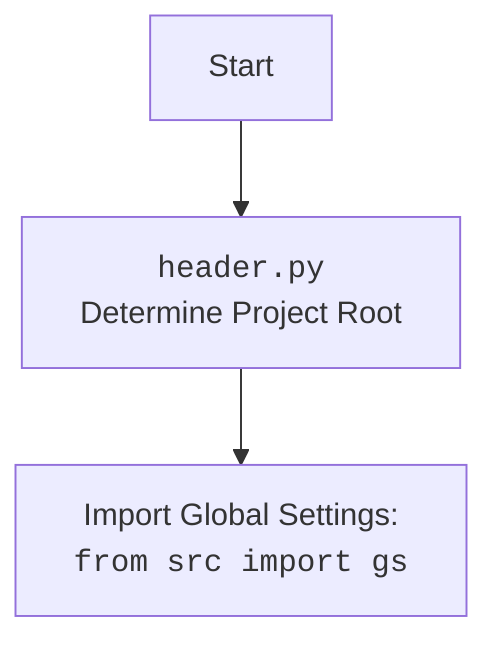

## <алгоритм>

1. **`set_project_root(marker_files)`**:
   - **Начало**: Функция принимает кортеж `marker_files` (по умолчанию `('__root__', '.git')`) в качестве аргумента.
   - **Инициализация**:
     - `current_path` устанавливается в абсолютный путь к директории, содержащей текущий файл `header.py`.
     - `__root__` инициализируется значением `current_path`.
   - **Поиск корневой директории**:
     - Цикл перебирает текущую директорию и все ее родительские директории.
     - Внутри цикла проверяется, существует ли в каждой директории какой-либо из файлов или папок, указанных в `marker_files`.
     - Если маркерный файл найден, `__root__` обновляется до родительской директории и цикл прерывается.
     - Пример: Если `header.py` находится в `project/src/scenario`, а `.git` находится в `project`, то `__root__` станет `project`.
   - **Добавление в `sys.path`**:
     - Проверяется, добавлена ли `__root__` в `sys.path`. Если нет, она добавляется в начало списка путей для импорта.
     - Пример: Если `__root__` равен `/home/user/project`, то `/home/user/project` добавляется в `sys.path`, что позволяет импортировать модули из этой директории.
   - **Возврат**: Функция возвращает `__root__`, путь к корневой директории проекта.

2. **Инициализация глобальных переменных**:
   - **`__root__`**: Вызывается `set_project_root()` для определения и сохранения пути к корневой директории.
   - **Импорт `gs`**: Импортируется модуль глобальных настроек `src.gs` для доступа к общим путям проекта.
   - **Загрузка `settings.json`**:
      - Пытается открыть и загрузить `settings.json` из директории `src` относительно корня проекта.
      - Если файл не найден или содержит некорректный JSON, переходит к блоку `except`.
      - Пример: Если `__root__` это `/home/user/project`, то ищется `/home/user/project/src/settings.json`.
      - Загруженные настройки сохраняются в переменной `settings`.
   - **Загрузка `README.MD`**:
     - Пытается открыть и прочитать содержимое файла `README.MD` из директории `src` относительно корня проекта.
     - Если файл не найден, или возникают проблемы при чтении, переходит к блоку `except`.
     - Пример: Если `__root__` это `/home/user/project`, то ищется `/home/user/project/src/README.MD`.
     - Содержимое `README.MD` сохраняется в переменной `doc_str`.
   - **Установка глобальных переменных**:
      - `__project_name__` устанавливается как значение из ключа `project_name` в `settings`, если `settings` не `None`, иначе `hypotez`.
      - `__version__` устанавливается как значение из ключа `version` в `settings`, если `settings` не `None`, иначе `''`.
      - `__doc__` устанавливается равным `doc_str`, если `doc_str` не `None`, иначе `''`.
      - `__details__` устанавливается в `''`.
      - `__author__` устанавливается как значение из ключа `author` в `settings`, если `settings` не `None`, иначе `''`.
      - `__copyright__` устанавливается как значение из ключа `copyrihgnt` в `settings`, если `settings` не `None`, иначе `''`.
      - `__cofee__` устанавливается как значение из ключа `cofee` в `settings`, если `settings` не `None`, иначе строка с призывом к кофе.

## <mermaid>

```mermaid
flowchart TD
    Start --> FindProjectRoot[<code>set_project_root()</code><br> Locate Project Root Directory]
    
    FindProjectRoot --> SetCurrentPath[Get absolute path to the current file's directory and store it as current_path]
    SetCurrentPath --> InitProjectRoot[Initialize project root as current_path]
    InitProjectRoot --> LoopParents[Loop through current_path and its parent directories]
    LoopParents --> CheckMarkerFiles{Does any marker file exist in current directory?}
    CheckMarkerFiles -- Yes --> UpdateProjectRoot[Update project root and break the loop]
    CheckMarkerFiles -- No --> LoopParents
     LoopParents --> CheckProjectRootPath{Is project root path already in sys.path?}
    CheckProjectRootPath -- No --> AddProjectRootToSysPath[Insert project root path at the beginning of sys.path]
    CheckProjectRootPath -- Yes --> ReturnProjectRoot[Return the determined project root]
    ReturnProjectRoot --> InitGlobalVars[Initialize global project variables]
    
   InitGlobalVars --> ImportGlobalSettings[Import Global Settings: <br><code>from src import gs</code>]
   ImportGlobalSettings --> LoadSettingsFile{Try to load settings.json}
   LoadSettingsFile -- Success --> LoadSettings[Load settings from settings.json]
     LoadSettingsFile -- Fail --> ExceptionSettings[Handle exception]
    LoadSettings --> LoadReadmeFile{Try to load README.MD}
   
   LoadReadmeFile -- Success --> LoadReadme[Load documentation string from README.MD]
   LoadReadmeFile -- Fail --> ExceptionReadme[Handle exception]
   LoadReadme --> SetProjectVars[Set Project Global variables ]

  ExceptionSettings --> LoadReadmeFile
    ExceptionReadme --> SetProjectVars

   SetProjectVars --> End

   
    
    classDef codefill fill:#f9f,stroke:#333,stroke-width:2px
    class FindProjectRoot, SetCurrentPath, InitProjectRoot,LoopParents, CheckMarkerFiles, UpdateProjectRoot,CheckProjectRootPath,AddProjectRootToSysPath,ReturnProjectRoot, InitGlobalVars,ImportGlobalSettings,LoadSettingsFile,LoadSettings,LoadReadmeFile,LoadReadme,SetProjectVars,ExceptionSettings,ExceptionReadme codefill

```



## <объяснение>

### Импорты:
-   `sys`: Модуль `sys` используется для работы с системными переменными и функциями, в частности для изменения `sys.path` и добавления пути к корневой директории проекта, чтобы сделать модули из этой директории импортируемыми.
-   `json`: Модуль `json` используется для работы с JSON-форматом. Он необходим для чтения файла `settings.json`, в котором могут храниться настройки проекта.
-   `pathlib.Path`: Класс `Path` из модуля `pathlib` обеспечивает объектно-ориентированный способ работы с путями файловой системы. Это делает код более читаемым и простым в использовании.
- `packaging.version.Version`: Класс `Version` из модуля `packaging.version` предоставляет возможность сравнивать версии программного обеспечения.
-   `src.gs`: Это импорт модуля `gs` из пакета `src`. Скорее всего, `gs` содержит глобальные переменные, такие как путь к корневой директории и другие общие настройки.

### Функции:
-   **`set_project_root(marker_files)`**:
    -   **Аргументы**:
        -   `marker_files`: Кортеж (tuple) строк, представляющих имена файлов или папок, которые используются для определения корневой директории проекта. По умолчанию `('__root__', '.git')`.
    -   **Возвращаемое значение**:
        -   `Path`: Объект `Path`, представляющий абсолютный путь к корневой директории проекта.
    -   **Назначение**:
        -   Функция определяет корневую директорию проекта, начиная с директории, где находится файл `header.py`, и двигаясь вверх по дереву каталогов, пока не найдет один из маркерных файлов.
        -   После определения корневой директории она добавляет ее в `sys.path`, чтобы можно было импортировать модули из этой директории.
        -   Пример: Если проект лежит в `/home/user/myproject`, а маркерный файл `.git` лежит в `/home/user/myproject`, то функция вернет объект `Path('/home/user/myproject')`.

### Переменные:
-   `__root__`:
    -   **Тип**: `pathlib.Path`.
    -   **Назначение**: Абсолютный путь к корневой директории проекта. Устанавливается путем вызова функции `set_project_root()`.
-   `settings`:
    -   **Тип**: `dict` или `None`.
    -   **Назначение**: Словарь, содержащий настройки проекта, загруженные из файла `settings.json`. Если загрузка не удалась, то `None`.
-   `doc_str`:
    -   **Тип**: `str` или `None`.
    -   **Назначение**: Строка, содержащая содержимое файла `README.MD`. Если загрузка не удалась, то `None`.
-   `__project_name__`:
    -   **Тип**: `str`.
    -   **Назначение**: Имя проекта, устанавливается из `settings` или `hypotez` по умолчанию.
-   `__version__`:
     -   **Тип**: `str`.
    -   **Назначение**: Версия проекта, устанавливается из `settings` или `''` по умолчанию.
-   `__doc__`:
    -   **Тип**: `str`.
    -   **Назначение**: Описание проекта, загружается из `README.MD` или  `''` по умолчанию.
-  `__details__`:
     -   **Тип**: `str`.
    -   **Назначение**: Детали проекта. Всегда устанавливается в `''`.
- `__author__`:
    -   **Тип**: `str`.
    -   **Назначение**: Автор проекта, устанавливается из `settings` или `''` по умолчанию.
- `__copyright__`:
    -   **Тип**: `str`.
    -   **Назначение**: Информация об авторских правах, устанавливается из `settings` или `''` по умолчанию.
- `__cofee__`:
    -   **Тип**: `str`.
    -   **Назначение**: Строка с призывом к кофе, устанавливается из `settings` или дефолтная строка.

### Потенциальные ошибки и области для улучшения:
1.  **Обработка исключений**: Обработка исключений при загрузке `settings.json` и `README.MD` простая (`...`), лучше бы логировать ошибку.
2.  **Жесткая привязка к `settings.json`**: Код полагается на наличие файла `settings.json` и `README.MD`, в случае их отсутствия, переменные проекта будут установлены в значения по умолчанию. Можно добавить возможность загружать дефолтные настройки и в таком случае, если файл не найден.

### Взаимосвязь с другими частями проекта:

-   `header.py` является ключевым файлом, который определяет корневую директорию проекта и предоставляет основные метаданные, такие как название, версия и описание. Этот файл используется для настройки среды выполнения и импорта других модулей.
-   Модуль `gs` (глобальные настройки) импортируется и используется для получения доступа к глобальным путям проекта, что обеспечивает единообразие в рамках всего проекта.
-   Загруженные из `settings.json` настройки влияют на значения глобальных переменных, определяя имя проекта, версию, автора, и т.д.

В целом, код `header.py` является важной частью проекта, отвечающей за настройку начальной среды и определение глобальных параметров проекта.