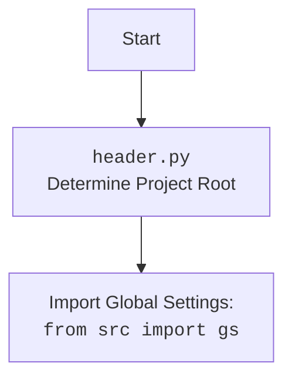

## <алгоритм>

1.  **Инициализация:**
    *   Создается экземпляр класса `Aliexpress`.
    *   Принимаются параметры `webdriver`, `locale`, `*args`, и `**kwargs`.
    *   Вызывается конструктор суперкласса `Supplier` с параметрами `supplier_prefix` (равным 'aliexpress'), `locale` и `webdriver`.
    *   Пример:
        ```python
        a = Aliexpress(webdriver='chrome', locale={'RU': 'RUB'})
        ```
2.  **Настройка Supplier**:
    *  Инициализация `Supplier`, которая может устанавливать дополнительные настройки, такие как locale и webdriver
3.  **Использование API**:
    *   Класс `Aliexpress` наследует функциональность от `AliRequests` и `AliApi`, что позволяет делать запросы и обрабатывать данные, полученные от AliExpress.
    *   Примеры:
        *   Методы для запроса данных с использованием `AliRequests`
        *   Методы для взаимодействия с API AliExpress используя `AliApi`

## <mermaid>

```mermaid
flowchart TD
    Start[Start] --> InitAliExpress[Initialize Aliexpress Class];
    InitAliExpress --> InitSupplier[Initialize Supplier Class];
    InitSupplier --> SetPrefix[Set supplier_prefix = 'aliexpress'];
    InitSupplier --> SetLocale[Set locale];
    InitSupplier --> SetWebdriver[Set webdriver];
    InitSupplier --> CallSuperInit[Call super().__init__ from Supplier];
    CallSuperInit --> EndSupplierInit[End Supplier Initialization]
    EndSupplierInit --> InheritAliRequests[Inherit Functionality from AliRequests];
    EndSupplierInit --> InheritAliApi[Inherit Functionality from AliApi];
    InheritAliRequests --> CallAliRequestsMethods[Call AliRequests Methods]
    InheritAliApi --> CallAliApiMethods[Call AliApi Methods]
    CallAliRequestsMethods --> End[End]
    CallAliApiMethods --> End


    
    classDef classFill fill:#f9f,stroke:#333,stroke-width:2px
    class Aliexpress,Supplier,AliRequests,AliApi classFill
```



**Объяснение зависимостей `mermaid`:**

*   **`Start`**: Начало процесса инициализации.
*   **`InitAliExpress`**: Инициализация класса `Aliexpress`. Этот шаг также может включать настройки, основанные на аргументах конструктора.
*    **`InitSupplier`**: Инициализация класса `Supplier` - суперкласса `Aliexpress`.
*   **`SetPrefix`**: Установка `supplier_prefix` в 'aliexpress'. Это используется для идентификации поставщика в системе.
*   **`SetLocale`**: Установка языковых и валютных настроек (`locale`).
*   **`SetWebdriver`**: Установка режима веб-драйвера (`webdriver`).
*   **`CallSuperInit`**: Вызов конструктора `__init__` суперкласса `Supplier` с заданными параметрами.
*   **`EndSupplierInit`**: Завершение инициализации класса `Supplier`.
*   **`InheritAliRequests`**: Наследование функциональности класса `AliRequests`, который обеспечивает методы для выполнения запросов.
*   **`InheritAliApi`**: Наследование функциональности класса `AliApi`, который предоставляет методы для взаимодействия с API AliExpress.
*   **`CallAliRequestsMethods`**:  Использование методов, унаследованных от `AliRequests`, для выполнения запросов.
*   **`CallAliApiMethods`**: Использование методов, унаследованных от `AliApi`, для взаимодействия с API.
*   **`End`**: Конец процесса.
*   `classDef classFill fill:#f9f,stroke:#333,stroke-width:2px`: определяет стиль для классов
*  `class Aliexpress,Supplier,AliRequests,AliApi classFill`: применяет стиль к классам

Диаграмма показывает последовательность инициализации, наследования и использования функциональности в классе `Aliexpress`.  Имена переменных (например, `locale`, `webdriver`, `supplier_prefix`) имеют описательные имена.

## <объяснение>

**Импорты:**

*   **`import header`**: Импортирует модуль `header` из текущего проекта. Модуль, вероятно, содержит код для определения корневой директории проекта и настройки глобальных путей.
*   **`import pickle`**: Используется для сериализации и десериализации объектов Python, что может быть полезно для сохранения и загрузки данных (например, кэш или настройки).
*   **`import threading`**: Предоставляет возможность использовать многопоточность в Python, что позволяет выполнять несколько задач параллельно и, возможно, ускорить работу программы.
*   **`from requests.sessions import Session`**: Импортирует класс `Session` из библиотеки `requests`, который позволяет сохранять параметры между HTTP-запросами, такие как куки.
*   **`from fake_useragent import UserAgent`**: Импортирует класс `UserAgent` из библиотеки `fake-useragent`, который позволяет генерировать случайные `User-Agent` для имитации запросов от разных браузеров и избегать блокировки со стороны сайтов.
*   **`from pathlib import Path`**: Импортирует класс `Path` из библиотеки `pathlib`, который предоставляет удобный способ работы с файловыми путями в Python.
*   **`from typing import Union`**: Импортирует `Union` из библиотеки `typing`, который позволяет объявлять типы переменных, принимающих несколько типов значений.
*   **`from requests.cookies import RequestsCookieJar`**: Импортирует класс `RequestsCookieJar` из библиотеки `requests`, который используется для хранения куки.
*   **`from urllib.parse import urlparse`**: Импортирует функцию `urlparse` из библиотеки `urllib.parse`, которая используется для разбора URL.
*   **`from src import gs`**: Импортирует модуль `gs` из пакета `src`.  `gs` вероятно, содержит глобальные настройки и константы приложения.
*   **`from src.suppliers.supplier import Supplier`**: Импортирует класс `Supplier` из `src.suppliers.supplier`, который, вероятно, является базовым классом для всех поставщиков.
*   **`from .alirequests import AliRequests`**: Импортирует класс `AliRequests` из текущего пакета `src.suppliers.aliexpress`. Этот класс, вероятно, содержит методы для выполнения HTTP-запросов к AliExpress.
*   **`from .aliapi import AliApi`**: Импортирует класс `AliApi` из текущего пакета. Этот класс, вероятно, содержит методы для взаимодействия с API AliExpress.
*  **`from src.logger.logger import logger`**: Импортирует `logger` из пакета `src.logger.logger`, который предоставляет функциональность для логирования событий и ошибок.

**Классы:**

*   **`Aliexpress(Supplier, AliRequests, AliApi)`**:
    *   Роль: Основной класс для работы с AliExpress. Он наследует функциональность от `Supplier`, `AliRequests` и `AliApi`, объединяя их для создания интегрированного решения.
    *   Атрибуты: Наследует атрибуты от родительских классов (например, настройки `locale`, `webdriver` из `Supplier`).
    *   Методы:
        *   `__init__(self, webdriver: bool | str = False, locale: str | dict = {'EN': 'USD'}, *args, **kwargs)`: Конструктор класса, инициализирует объект, устанавливая режим веб-драйвера и языковые настройки, вызывая конструктор `Supplier`.

**Функции:**

*   **`__init__`**:
    *   Аргументы: `webdriver` (режим веб-драйвера), `locale` (язык и валюта), `*args` (произвольные позиционные аргументы), `**kwargs` (произвольные именованные аргументы).
    *   Возвращаемое значение: Нет (конструктор).
    *   Назначение: Инициализация объекта класса `Aliexpress`, вызов конструктора родительского класса `Supplier` и настройка параметров поставщика.

**Переменные:**

*   **`webdriver`**: Булевое значение или строка, определяющая режим использования веб-драйвера.
*   **`locale`**: Строка или словарь, определяющий язык и валюту.
*   **`supplier_prefix`**: строка, устанавливаемая в `aliexpress`, используется для идентификации поставщика.

**Потенциальные ошибки и области для улучшения:**

*   **Обработка ошибок**: Код не содержит обработки исключений, что может привести к сбоям в случае ошибок при запросах или взаимодействии с API.
*   **Документация**: Не хватает более подробной документации к функциям и методам, особенно по логике работы с API `AliExpress`.
*   **Зависимости**: Класс сильно зависит от других классов (`Supplier`, `AliRequests`, `AliApi`) и модулей, что делает его не очень гибким.
*   **Тестирование**: Нет информации о модульных тестах, что затрудняет поддержание и развитие кода.
*   **Конфигурация**: Использование магических значений (например, `'aliexpress'`) может быть вынесено в константы для большей гибкости и читаемости.

**Взаимосвязи с другими частями проекта:**

*   **`src.suppliers.supplier.Supplier`**:  `Aliexpress` является подклассом `Supplier`, что подразумевает наличие общей структуры для всех поставщиков в системе.
*   **`src.suppliers.aliexpress.alirequests.AliRequests`**: Предоставляет методы для отправки HTTP-запросов к AliExpress.
*   **`src.suppliers.aliexpress.aliapi.AliApi`**: Предоставляет методы для взаимодействия с API AliExpress.
*   **`src.gs`**: Обеспечивает доступ к глобальным настройкам, что позволяет гибко настраивать поведение системы.
*  **`src.logger.logger`**: Используется для логирования событий, что позволяет отслеживать работу программы и выявлять ошибки.

В целом, данный код представляет собой базовый класс для работы с AliExpress, интегрирующий функциональность для веб-запросов и API-взаимодействия. Улучшение кода заключается в добавлении обработки ошибок, документации, модульных тестов и улучшении конфигурации.