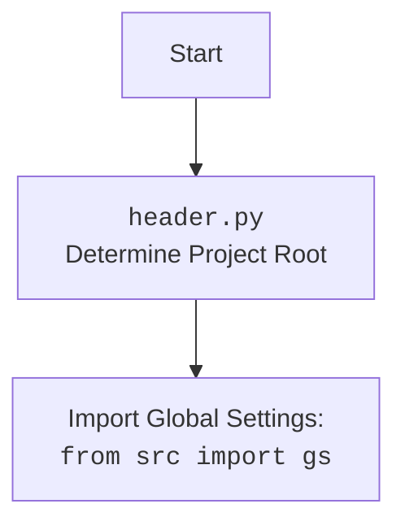

## ИНСТРУКЦИЯ:

Анализируй предоставленный код подробно и объясни его функциональность. Ответ должен включать три раздела:

1.  **<алгоритм>**: Опиши рабочий процесс в виде пошаговой блок-схемы, включая примеры для каждого логического блока, и проиллюстрируй поток данных между функциями, классами или методами.
2.  **<mermaid>**: Напиши код для диаграммы в формате `mermaid`, проанализируй и объясни все зависимости,
    которые импортируются при создании диаграммы.
    **ВАЖНО!** Убедитесь, что все имена переменных, используемые в диаграмме `mermaid`,
    имеют осмысленные и описательные имена. Имена переменных вроде `A`, `B`, `C`, и т.д., не допускаются!

    **Дополнительно**: Если в коде есть импорт `import header`, добавьте блок `mermaid` flowchart, объясняющий `header.py`:\
    ```mermaid
    flowchart TD
        Start --> Header[<code>header.py</code><br> Determine Project Root]

        Header --> import[Import Global Settings: <br><code>from src import gs</code>]
    ```

3.  **<объяснение>**: Предоставьте подробные объяснения:
    *   **Импорты**: Их назначение и взаимосвязь с другими пакетами `src.`.
    *   **Классы**: Их роль, атрибуты, методы и взаимодействие с другими компонентами проекта.
    *   **Функции**: Их аргументы, возвращаемые значения, назначение и примеры.
    *   **Переменные**: Их типы и использование.
    *   Выделите потенциальные ошибки или области для улучшения.

Дополнительно, постройте цепочку взаимосвязей с другими частями проекта (если применимо).

Это обеспечивает всесторонний и структурированный анализ кода.

## Формат ответа: `.md` (markdown)

**КОНЕЦ ИНСТРУКЦИИ**

```markdown
## <алгоритм>

1.  **Инициализация `AliRequests`**:
    *   При создании экземпляра `AliRequests` вызывается конструктор `__init__`.
    *   Создается пустой `RequestsCookieJar` для хранения cookies.
    *   Инициализируется `session_id` в `None`.
    *   Создаются заголовки `headers` с случайным `User-Agent`.
    *   Создается сессия `requests.Session()` для выполнения HTTP-запросов.
    *   Вызывается метод `_load_webdriver_cookies_file` для загрузки cookies.
    *   Пример:
        ```python
        ali_requests = AliRequests(webdriver_for_cookies='chrome')
        ```

2.  **Загрузка Cookies (`_load_webdriver_cookies_file`)**:
    *   Формируется путь к файлу с cookies на основе `webdriver_for_cookies`.
    *   Пытается открыть файл cookies, десериализует его содержимое с помощью `pickle.load` в `cookies_list`.
    *   Итерируется по `cookies_list`, устанавливая cookie в `self.cookies_jar` с соответствующими параметрами,
        такими как `name`, `value`, `domain`, `path`, `secure`, `HttpOnly`, `SameSite`, `expires`.
    *   После загрузки cookies обновляет cookies сессии, вызывая `_refresh_session_cookies`.
    *   Возвращает `True` в случае успеха и `False` в случае ошибки.
    *   Пример:

        ```python
        # Путь к cookies файлу: /path/to/cookies/aliexpress.com/chrome/cookie
        # Содержимое cookie файла:
        # [{"name": "cookie1", "value": "value1", "domain": ".aliexpress.com", "path": "/", "secure": True, "HttpOnly": "true", "SameSite": "None", "expirationDate": 1704067200}]
        # {"name": "cookie2", "value": "value2", "domain": ".aliexpress.com", "path": "/", "secure": False, "HttpOnly": "false", "SameSite": "unspecified", "expirationDate": 1704067300}
        # ...
        ```

3.  **Обновление Cookies сессии (`_refresh_session_cookies`)**:
    *   Выполняет GET-запрос к `https://portals.aliexpress.com`.
    *   Если в `self.cookies_jar` есть cookies, они добавляются к запросу, иначе выполняется запрос без них.
    *   Вызывает `_handle_session_id` для обработки `JSESSIONID` из полученных cookies.
    *   Обрабатывает `requests.RequestException` и другие исключения, логируя их.

4.  **Обработка `JSESSIONID` (`_handle_session_id`)**:
    *   Итерируется по cookies из ответа.
    *   Если находит `JSESSIONID`:
        *   Сравнивает его с текущим значением `self.session_id`. Если значения совпадают, то метод завершается.
        *   Обновляет `self.session_id` новым значением.
        *   Обновляет cookie `JSESSIONID` в `self.cookies_jar` с полными атрибутами.
        *   Устанавливает флаг `session_id_found` в `True`.
    *   Если `JSESSIONID` не найден, выводится предупреждение в лог.

5.  **Выполнение GET запроса (`make_get_request`)**:
    *   Принимает URL, cookies (опционально), и headers (опционально).
    *   Устанавливает headers, если они переданы, иначе использует `self.headers`.
    *   Обновляет cookies сессии с помощью `self.session.cookies.update(self.cookies_jar)`.
    *   Выполняет GET запрос с переданным URL и headers.
    *   Вызывает `resp.raise_for_status()`, чтобы проверить статус ответа на ошибки.
    *   Вызывает `_handle_session_id` для обработки `JSESSIONID` из ответа.
    *   Возвращает объект `requests.Response` в случае успеха или `False` в случае ошибки.
    *   Пример:
        ```python
        response = ali_requests.make_get_request(url='https://example.com')
        ```

6.  **Получение сокращенной партнерской ссылки (`short_affiliate_link`)**:
    *   Принимает `link_url`, URL который нужно сократить.
    *   Формирует URL для запроса на основе базового URL и `link_url` с trackId по умолчанию.
    *   Вызывает `make_get_request` с сформированным URL.
    *   Возвращает объект `requests.Response` в случае успеха или `False` в случае ошибки.
    *   Пример:
        ```python
        short_link_response = ali_requests.short_affiliate_link(link_url='https://aliexpress.com/item/12345.html')
        ```

## <mermaid>

```mermaid
flowchart TD
    Start[Start] --> AliRequestsInit
    
    subgraph AliRequests Class
        AliRequestsInit[AliRequests.__init__] --> LoadCookies[_load_webdriver_cookies_file]
        LoadCookies --> RefreshSessionCookies[_refresh_session_cookies]
        RefreshSessionCookies --> HandleSessionId[_handle_session_id]
        HandleSessionId --> MakeGetRequest[make_get_request]
        MakeGetRequest --> HandleSessionId
        MakeGetRequest --> EndGetRequest[End make_get_request]
        
        
        ShortAffiliateLink[short_affiliate_link] --> MakeGetRequest

    end
    
    EndGetRequest --> End[End]
    
    
    classDef common fill:#f9f,stroke:#333,stroke-width:2px;
	class AliRequestsInit, LoadCookies, RefreshSessionCookies, HandleSessionId,MakeGetRequest,ShortAffiliateLink common;
```



**Описание диаграммы:**

1.  `Start`: Начало выполнения кода.
2.  `AliRequestsInit`: Инициализация класса `AliRequests`. Создаются экземпляры `RequestsCookieJar`, `session_id`, `headers`, `requests.Session`. Загружаются cookies из файла.
3.  `LoadCookies`: Метод `_load_webdriver_cookies_file`. Загружает cookies из файла, используя `pickle`, и устанавливает их в `RequestsCookieJar`. В случае успеха вызывает `_refresh_session_cookies`.
4.  `RefreshSessionCookies`: Метод `_refresh_session_cookies`. Выполняет запрос к `https://portals.aliexpress.com` для обновления cookies сессии. Вызывает `_handle_session_id` для обработки cookies.
5.   `HandleSessionId`: Метод `_handle_session_id`. Проверяет наличие и обновляет `JSESSIONID` в `RequestsCookieJar`.
6.  `MakeGetRequest`: Метод `make_get_request`. Выполняет GET-запрос с заданным URL, cookies и headers.  Обрабатывает `JSESSIONID`.
7.  `ShortAffiliateLink`: Метод `short_affiliate_link`. Формирует URL для запроса сокращенной партнерской ссылки и вызывает `make_get_request`.
8.   `EndGetRequest`: Конец выполнения метода `make_get_request`.
9. `End`: Конец выполнения кода.

**Импортируемые зависимости:**

*   `pickle`: Используется для сериализации и десериализации объектов Python, в частности для сохранения и загрузки cookies.
*   `requests`: Используется для выполнения HTTP-запросов к AliExpress.
*   `pathlib.Path`: Используется для работы с путями к файлам и директориям.
*   `typing.List`: Используется для аннотации типов.
*   `requests.cookies.RequestsCookieJar`: Используется для работы с cookies.
*   `urllib.parse.urlparse`: Используется для парсинга URL.
*   `fake_useragent.UserAgent`: Используется для генерации случайных `User-Agent` для запросов.
*   `src.gs`: Используется для доступа к глобальным настройкам проекта, таким как `dir_cookies`.
*   `src.utils.jjson.j_dumps`: Используется для JSON-сериализации (не используется в предоставленном коде, но импортируется).
*   `src.logger.logger`: Используется для логирования сообщений об ошибках, предупреждениях и успехе.

## <объяснение>

**Импорты:**

*   `pickle`: Модуль для сериализации и десериализации объектов Python. В данном случае используется для сохранения и загрузки cookies из файла.
*   `requests`: Библиотека для выполнения HTTP-запросов.
*   `pathlib.Path`: Модуль для работы с файловыми путями.
*   `typing.List`: Модуль для аннотации типов, используется для обозначения типа `List` для cookies.
*   `requests.cookies.RequestsCookieJar`: Класс для хранения cookies.
*   `urllib.parse.urlparse`: Модуль для парсинга URL (не используется напрямую, но импортируется).
*   `fake_useragent.UserAgent`: Модуль для генерации случайных `User-Agent`, чтобы имитировать запросы от различных браузеров.
*   `src.gs`: Модуль, содержащий глобальные настройки проекта, такие как путь к директории с cookies (`gs.dir_cookies`).
*   `src.utils.jjson.j_dumps`: Модуль для сериализации JSON-данных (не используется в данном коде).
*   `src.logger.logger`: Модуль для логирования, обеспечивающий сохранение сообщений об ошибках, предупреждениях и успехе.

**Класс `AliRequests`:**

*   **Роль:** Инкапсулирует функциональность для выполнения HTTP-запросов к AliExpress, включая обработку cookies и сессий.
*   **Атрибуты:**
    *   `cookies_jar`: Экземпляр `RequestsCookieJar`, хранящий cookies.
    *   `session_id`: Идентификатор сессии.
    *   `headers`: Заголовки HTTP-запросов, включая User-Agent.
    *   `session`: Экземпляр `requests.Session` для выполнения запросов.
*   **Методы:**
    *   `__init__(self, webdriver_for_cookies: str = 'chrome')`: Инициализирует объект класса `AliRequests`, загружает cookies.
    *   `_load_webdriver_cookies_file(self, webdriver_for_cookies: str = 'chrome') -> bool`: Загружает cookies из файла, возвращает `True` при успехе, `False` при неудаче.
    *   `_refresh_session_cookies(self)`: Обновляет cookies сессии, делая GET-запрос на `https://portals.aliexpress.com`.
    *   `_handle_session_id(self, response_cookies)`: Обрабатывает `JSESSIONID` из cookies, полученных в ответе, и устанавливает их в `self.cookies_jar`.
    *   `make_get_request(self, url: str, cookies: List[dict] = None, headers: dict = None)`: Выполняет GET-запрос с заданным URL, cookies и headers.
    *   `short_affiliate_link(self, link_url: str)`: Формирует URL для запроса на сокращение партнерской ссылки и вызывает метод `make_get_request`.

**Функции:**

*   `__init__(self, webdriver_for_cookies: str = 'chrome')`: Конструктор класса, устанавливает начальные значения атрибутов и загружает cookies.
    *   Аргументы:
        *   `webdriver_for_cookies` (str): Название вебдрайвера, по умолчанию 'chrome'.
    *   Возвращаемое значение: None
    *   Назначение: Инициализация объекта класса `AliRequests`.
*   `_load_webdriver_cookies_file(self, webdriver_for_cookies: str = 'chrome') -> bool`: Загружает cookies из файла, используя pickle.
    *   Аргументы:
        *   `webdriver_for_cookies` (str): Название вебдрайвера, по умолчанию 'chrome'.
    *   Возвращаемое значение: `True` в случае успеха, `False` в случае неудачи.
    *   Назначение: Загрузка cookies из файла.
*   `_refresh_session_cookies(self)`: Обновляет cookies сессии, делая GET-запрос к AliExpress.
    *   Аргументы: Нет
    *   Возвращаемое значение: None
    *   Назначение: Обновление cookies сессии.
*   `_handle_session_id(self, response_cookies)`: Обрабатывает `JSESSIONID` из cookies, полученных в ответе.
    *   Аргументы:
        *   `response_cookies`: Список cookies полученных от сервера.
    *   Возвращаемое значение: None
    *   Назначение: Обработка `JSESSIONID` и обновление cookies.
*   `make_get_request(self, url: str, cookies: List[dict] = None, headers: dict = None)`: Выполняет GET-запрос к заданному URL.
    *   Аргументы:
        *   `url` (str): URL запроса.
        *   `cookies` (List[dict], optional): Список cookies для запроса.
        *   `headers` (dict, optional): Заголовки запроса.
    *   Возвращаемое значение: `requests.Response` объект в случае успеха или `False` в случае ошибки.
    *   Назначение: Выполнение GET-запроса.
*   `short_affiliate_link(self, link_url: str)`: Формирует запрос для получения короткой партнерской ссылки.
    *   Аргументы:
        *   `link_url` (str): URL для сокращения.
    *   Возвращаемое значение: `requests.Response` объект в случае успеха или `False` в случае ошибки.
    *   Назначение: Получение короткой партнерской ссылки.

**Переменные:**

*   `self.cookies_jar`: Экземпляр `RequestsCookieJar`, хранит cookies.
*   `self.session_id`: Идентификатор сессии типа `str` или `None`.
*   `self.headers`: Словарь с заголовками HTTP-запросов, включая `User-Agent`.
*   `self.session`: Экземпляр `requests.Session` для управления сессией HTTP-запросов.
*   `cookie_file_path`: Объект `pathlib.Path`, содержащий путь к файлу с cookies.
*   `cookies_list`: Список словарей с данными о cookies.
*    `cookie`: Словарь с данными о каждом cookie.
*   `url`: Строка, представляющая URL для запроса.
*   `resp`: Объект `requests.Response`, полученный в результате HTTP-запроса.
*   `base_url`: Базовый URL для генерации коротких партнерских ссылок.
*   `track_id`: Идентификатор отслеживания, используемый для партнерских ссылок.

**Потенциальные ошибки и области для улучшения:**

*   **Обработка ошибок:**
    *   Обработка ошибок в `_load_webdriver_cookies_file` и `make_get_request` ограничена простым логированием и возвратом `False`. Можно улучшить, возвращая более информативные сообщения об ошибках и использовать собственные исключения.
*   **Зависимости:**
    *   Импорт `j_dumps` не используется в коде, что является избыточным.
*   **Логирование:**
    *   Логирование ограничивается success, error и warning. Можно добавить info уровни для более детального логирования.
*   **Безопасность:**
    *   В случае ошибок при загрузке cookies, сессия может оставаться неавторизованной. Можно добавить механизм повторной попытки загрузки или логирования ошибок на более высоком уровне.
    *   Использование `secure=bool(cookie.get('secure', False))` и  `rest={'HttpOnly': cookie.get('HttpOnly', 'false'), 'SameSite': cookie.get('SameSite', 'unspecified')}` гарантирует корректную установку свойств кук.

**Цепочка взаимосвязей с другими частями проекта:**

*   `src.gs`:  Класс `AliRequests` использует глобальные настройки, хранящиеся в `src.gs`, для определения пути к файлам с cookies.
*   `src.logger.logger`: Класс `AliRequests` использует модуль логирования для записи событий и ошибок.
*   `src.utils.jjson`: Хотя `j_dumps` импортируется, он не используется в текущем коде. Модуль может быть необходим для других частей проекта, которые могут использовать JSON-сериализацию данных, полученных от AliExpress.
*   Класс `AliRequests` может использоваться в других частях проекта для взаимодействия с AliExpress, например, для парсинга товаров, получения информации о заказах и т.д.
```