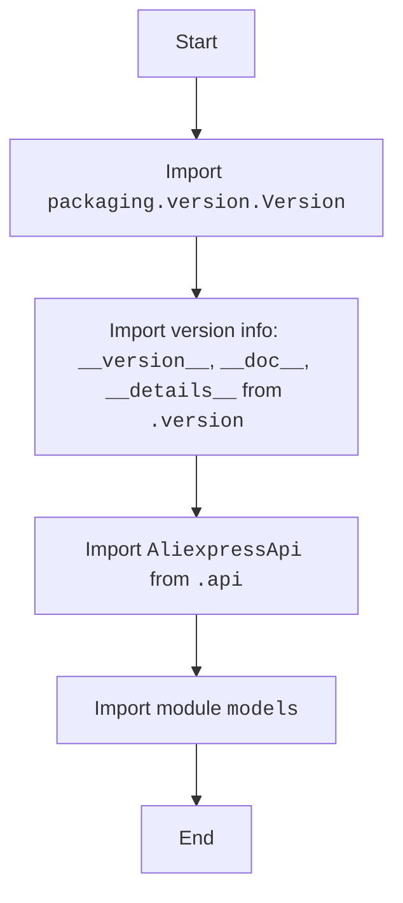

## Анализ кода `src/suppliers/aliexpress/api/__init__.py`

### 1. **<алгоритм>**

1.  **Импорт `packaging.version.Version`**: 
    *   Импортируется класс `Version` из библиотеки `packaging.version` для сравнения версий.
    *   _Пример_: `version1 = Version("1.2.3"); version2 = Version("1.2.4"); version1 < version2`
2.  **Импорт `__version__`, `__doc__`, `__details__` из `.version`**:
    *   Импортируются строковые переменные, определяющие версию, документацию и подробности модуля.
    *   _Пример_: `print(__version__)`, `print(__doc__)`
3.  **Импорт `AliexpressApi` из `.api`**:
    *   Импортируется класс `AliexpressApi`, который предположительно является основным классом для работы с API AliExpress.
    *   _Пример_: `api = AliexpressApi(app_key="your_key", app_secret="your_secret")`
4.  **Импорт модуля `models`**:
    *   Импортируется пакет `models`, содержащий модели данных, используемые для представления структур данных AliExpress API.
    *   _Пример_: `product = models.Product(name="Some product", price=100)`

### 2. **<mermaid>**

### 3. **<объяснение>**

*   **Импорты:**
    *   `packaging.version.Version`: Используется для работы с версиями программного обеспечения. Это позволяет сравнивать версии, что полезно, например, для определения совместимости.
    *   `from .version import __version__, __doc__, __details__`:
        *   `__version__`: Строка, представляющая версию текущего пакета. Полезна для отслеживания изменений и зависимостей.
        *   `__doc__`: Строка, содержащая документацию модуля. Используется для предоставления описания модуля при запросе справки.
        *   `__details__`: Строка, содержащая подробные сведения о модуле.
    *   `from .api import AliexpressApi`:
        *   `AliexpressApi`: Класс, являющийся основным API-клиентом для взаимодействия с AliExpress. Он вероятно содержит методы для вызова различных API-эндпоинтов AliExpress.
    *   `from . import models`:
        *   `models`: Пакет, содержащий классы, представляющие модели данных, которые используются при работе с AliExpress API (например, для представления продуктов, заказов, и т.д.).

*   **Классы:**
    *   `AliexpressApi`: Основной класс, который инкапсулирует логику для работы с API AliExpress. Он, скорее всего, содержит методы для осуществления HTTP-запросов к API и обработки ответов. Этот класс вероятно использует данные из моделей, импортированных из пакета `models`.
   * **`models`**: Пакет (не класс), который содержит определения моделей данных, представляющих данные, получаемые или отправляемые в API AliExpress. Эти модели, вероятно, представлены в виде классов, где каждое свойство соответствует полю данных из ответа API.

*   **Функции:**
    *   В этом файле (`__init__.py`) явно не определены функции. Он в основном занимается импортом и экспортом классов и переменных для того, чтобы сделать их доступными при обращении к пакету `src.suppliers.aliexpress.api`.

*   **Переменные:**
    *   `__version__`, `__doc__`, `__details__`: Строковые константы, определенные в `version.py` и используемые для метаданных пакета.

*   **Взаимосвязи с другими частями проекта:**
    *   Модуль (пакет) `src.suppliers.aliexpress.api` является частью более крупного проекта, предназначенного для работы с поставщиками, в частности, с AliExpress.
    *   `AliexpressApi` в этом пакете, вероятно, будет использоваться компонентами в других частях проекта, которым требуется взаимодействие с API AliExpress (например, компоненты для получения данных о продуктах, оформления заказов и т.д.).
    *   Модели из `models` используются как структуры данных для взаимодействия между API и другими компонентами проекта.
    *   `packaging.version` — сторонняя библиотека, облегчающая управление версиями, используемая для контроля совместимости и отслеживания изменений.

*   **Потенциальные ошибки и области для улучшения:**
    *   В текущем коде не видно явных ошибок, но всегда существует возможность ошибок при обращении к API AliExpress, например, неправильные параметры запроса или неверная обработка ответов.
    *   Стоит рассмотреть возможность добавления более подробной документации в виде docstring для каждого класса и функции, особенно для класса `AliexpressApi`.
    *   Необходимо предусмотреть обработку возможных ошибок сети и API AliExpress.
    *   Также стоит рассмотреть добавление тестов для обеспечения надежности работы API-клиента.