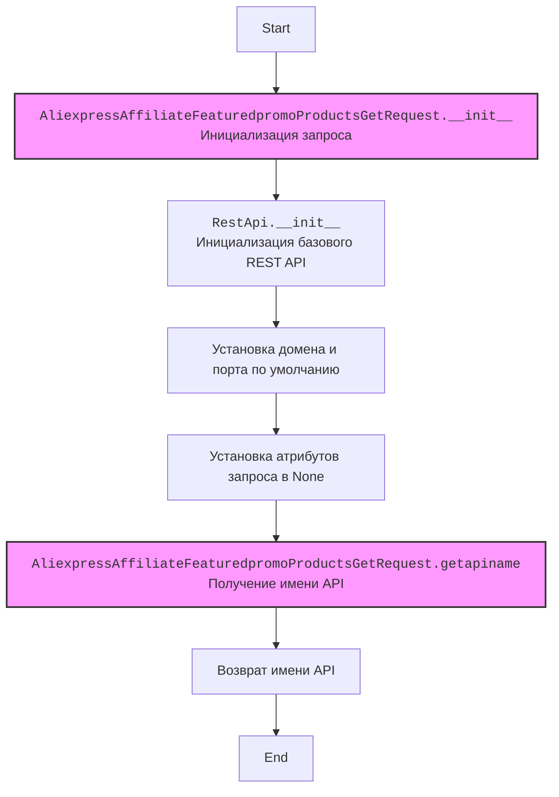

## АНАЛИЗ КОДА: `AliexpressAffiliateFeaturedpromoProductsGetRequest.py`

### 1. <алгоритм>

1. **Инициализация класса `AliexpressAffiliateFeaturedpromoProductsGetRequest`**:
   - При создании объекта класса вызывается конструктор `__init__`.
   - Инициализируются базовые параметры через вызов `RestApi.__init__(self, domain, port)`.
     -  `domain` устанавливается в "api-sg.aliexpress.com" по умолчанию.
     -  `port` устанавливается в 80 по умолчанию.
   - Устанавливаются атрибуты запроса в `None`:
     - `app_signature`
     - `category_id`
     - `country`
     - `fields`
     - `page_no`
     - `page_size`
     - `promotion_end_time`
     - `promotion_name`
     - `promotion_start_time`
     - `sort`
     - `target_currency`
     - `target_language`
     - `tracking_id`
   *Пример: `request = AliexpressAffiliateFeaturedpromoProductsGetRequest()`

2. **Получение имени API**:
   - При вызове метода `getapiname` возвращается строка с именем API - `'aliexpress.affiliate.featuredpromo.products.get'`.
   *Пример: `api_name = request.getapiname()` -> api_name = 'aliexpress.affiliate.featuredpromo.products.get'

### 2. <mermaid>

**Объяснение зависимостей `mermaid`:**

-   `AliexpressAffiliateFeaturedpromoProductsGetRequest` наследует от `RestApi`, поэтому в `mermaid` сначала происходит инициализация `AliexpressAffiliateFeaturedpromoProductsGetRequest` (`AliexpressAffiliateFeaturedpromoProductsGetRequest_init`), затем вызывается инициализация родительского класса `RestApi` (`RestApi_init`).
-   `RestApi_init` устанавливает домен и порт по умолчанию, затем устанавливаются атрибуты запроса в `None`.
-   `AliexpressAffiliateFeaturedpromoProductsGetRequest_getapiname` возвращает имя API.
-   `classDef classFill fill:#f9f,stroke:#333,stroke-width:2px` - стилизует узлы графа, добавляя заливку и обводку для более выразительного отображения.

### 3. <объяснение>

**Импорты:**

- `from ..base import RestApi`: Импортирует класс `RestApi` из модуля `base`, расположенного на уровень выше в иерархии пакетов. `RestApi` является базовым классом для всех REST API запросов, предоставляя общую логику инициализации и отправки запросов. Этот импорт устанавливает связь с базовой реализацией API запросов внутри проекта.

**Классы:**

- `AliexpressAffiliateFeaturedpromoProductsGetRequest(RestApi)`:
    -   **Роль:** Представляет конкретный запрос для получения списка рекомендуемых товаров из Aliexpress по партнерской программе. Наследуется от `RestApi`, чтобы использовать базовую функциональность.
    -   **Атрибуты:**
        -   `domain`:  Домен API (по умолчанию "api-sg.aliexpress.com").
        -   `port`: Порт API (по умолчанию 80).
        -   `app_signature`: Сигнатура приложения.
        -   `category_id`: Идентификатор категории товаров.
        -   `country`: Страна товаров.
        -   `fields`: Список полей, которые нужно вернуть в ответе.
        -   `page_no`: Номер страницы результатов.
        -   `page_size`: Количество товаров на странице.
        -   `promotion_end_time`: Время окончания акции.
        -   `promotion_name`: Название акции.
        -   `promotion_start_time`: Время начала акции.
        -   `sort`: Критерий сортировки.
        -   `target_currency`: Целевая валюта.
        -   `target_language`: Целевой язык.
        -   `tracking_id`: Идентификатор отслеживания.
    -   **Методы:**
        -   `__init__(self, domain="api-sg.aliexpress.com", port=80)`: Конструктор класса, инициализирует атрибуты запроса, вызывая конструктор родительского класса `RestApi.__init__`
        -   `getapiname(self)`: Возвращает строку `'aliexpress.affiliate.featuredpromo.products.get'`, которая является именем API метода.

**Функции:**

-   `__init__(self, domain="api-sg.aliexpress.com", port=80)`:
    -   **Аргументы:**
        -   `self`:  Ссылка на текущий экземпляр класса.
        -   `domain` (str, optional): Домен API (по умолчанию "api-sg.aliexpress.com").
        -   `port` (int, optional): Порт API (по умолчанию 80).
    -   **Возвращаемое значение:** `None`.
    -   **Назначение:** Инициализирует объект запроса, устанавливая домен, порт и сбрасывая все параметры запроса в `None`. Это подготавливает объект для последующей настройки перед отправкой запроса.
-   `getapiname(self)`:
    -   **Аргументы:** `self`: Ссылка на текущий экземпляр класса.
    -   **Возвращаемое значение:** Строка, представляющая имя API метода.
    -   **Назначение:** Возвращает имя API, необходимое для формирования правильного запроса.

**Переменные:**

-   `domain`: Строка, представляющая домен API.
-   `port`: Целое число, представляющее порт API.
-   `app_signature`, `category_id`, `country`, `fields`, `page_no`, `page_size`, `promotion_end_time`, `promotion_name`, `promotion_start_time`, `sort`, `target_currency`, `target_language`, `tracking_id`: Атрибуты класса, которые представляют параметры запроса. Изначально устанавливаются в `None` и должны быть установлены перед отправкой запроса.

**Потенциальные ошибки и области для улучшения:**

-   **Отсутствие валидации:** Нет валидации входных параметров. Перед отправкой запроса было бы полезно добавить проверку типов и значений атрибутов.
-   **Отсутствие обработки ошибок:** Код не обрабатывает возможные ошибки, связанные с сетевыми запросами или ответами API. Необходимо добавить обработку исключений.
-   **Зависимость от базового класса:** Код тесно связан с базовым классом `RestApi`, что может затруднить тестирование и рефакторинг.

**Взаимосвязь с другими частями проекта:**
-   Этот класс используется как часть системы работы с API Aliexpress. Он наследует общую логику из `RestApi` (предположительно, для отправки запросов) и определяет конкретные параметры запроса для получения рекомендуемых товаров.
-  Вероятно, этот класс используется в связке с другими классами (например, для формирования запроса, отправки запроса, обработки ответа, и т.д.).

**Дополнительно**:
- Использование `None` в качестве значения по умолчанию для всех атрибутов запроса - позволяет гибко конструировать запрос, включая только необходимые параметры.