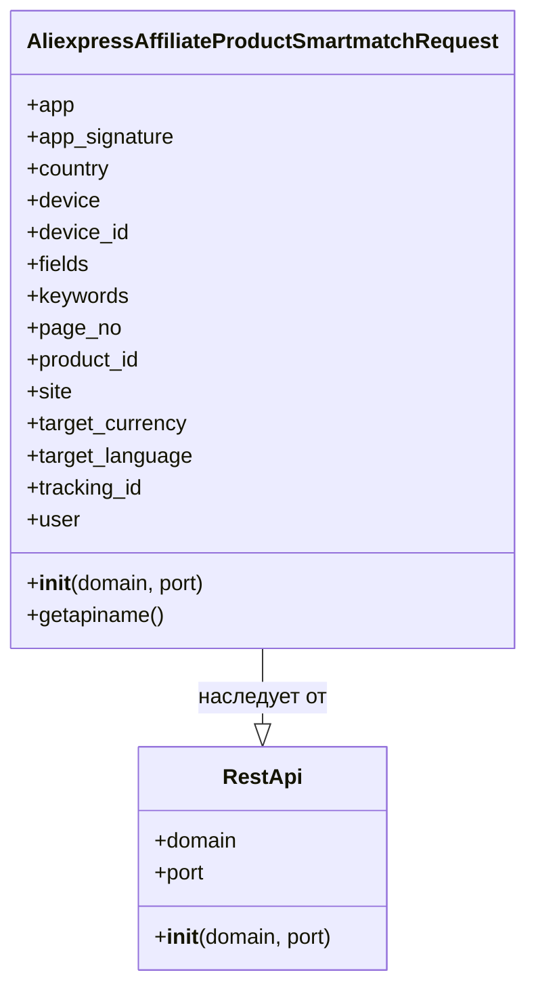

## АНАЛИЗ КОДА: `AliexpressAffiliateProductSmartmatchRequest.py`

### 1. <алгоритм>

1.  **Инициализация объекта класса:**
    *   Создается экземпляр класса `AliexpressAffiliateProductSmartmatchRequest`.
    *   Вызывается конструктор `__init__`, который принимает домен и порт сервера AliExpress API (по умолчанию `api-sg.aliexpress.com` и `80`).
    *   Вызывается конструктор базового класса `RestApi` для инициализации домена и порта.
    *   Инициализируются атрибуты экземпляра, которые будут использоваться в запросе к API:
        *   `app` (идентификатор приложения)
        *   `app_signature` (подпись приложения)
        *   `country` (страна)
        *   `device` (тип устройства)
        *   `device_id` (идентификатор устройства)
        *   `fields` (поля, которые нужно получить в ответе)
        *   `keywords` (ключевые слова для поиска)
        *   `page_no` (номер страницы результатов)
        *    `product_id` (идентификатор продукта)
        *   `site` (идентификатор сайта)
        *   `target_currency` (целевая валюта)
        *   `target_language` (целевой язык)
        *   `tracking_id` (идентификатор отслеживания)
        *   `user` (идентификатор пользователя)
2.  **Определение имени API:**
    *   Вызывается метод `getapiname()`.
    *   Возвращает строку `'aliexpress.affiliate.product.smartmatch'`, которая определяет имя API метода, к которому будет обращаться данный объект.

**Пример:**

```python
# Создание экземпляра класса
request = AliexpressAffiliateProductSmartmatchRequest(domain="api.aliexpress.com", port=443)

# Задание параметров запроса
request.keywords = "laptop"
request.country = "US"
request.page_no = 1
request.tracking_id = "your_tracking_id"
request.fields = "product_title, product_price"

# Вызов метода getapiname()
api_name = request.getapiname()  # api_name теперь содержит 'aliexpress.affiliate.product.smartmatch'
```

### 2. <mermaid>


### 3. <объяснение>

**Импорты:**

*   `from ..base import RestApi`: Импортирует класс `RestApi` из модуля `base`, который находится на один уровень выше в иерархии пакетов (`src.suppliers.aliexpress.api.base`). Класс `RestApi`, вероятно, содержит общую логику для взаимодействия с REST API, такую как выполнение HTTP-запросов, установку заголовков и обработку ответов. `AliexpressAffiliateProductSmartmatchRequest` наследует от `RestApi`, получая доступ к базовым возможностям.

**Классы:**

*   `class AliexpressAffiliateProductSmartmatchRequest(RestApi)`:
    *   **Роль**: Представляет запрос к API AliExpress для получения списка продуктов по "умному" соответствию (smart match). Это "заготовка" запроса, которая хранит все параметры, необходимые для этого запроса.
    *   **Атрибуты**:
        *   `domain` (унаследован от `RestApi`): Доменное имя API сервера AliExpress.
        *   `port` (унаследован от `RestApi`): Порт API сервера.
        *   `app`: Идентификатор приложения.
        *   `app_signature`: Подпись приложения.
        *   `country`: Страна, для которой выполняется поиск.
        *   `device`: Тип устройства пользователя (например, `android`, `ios`).
        *   `device_id`: Идентификатор устройства пользователя.
        *   `fields`: Список полей, которые нужно получить в ответе от API.
        *   `keywords`: Ключевые слова для поиска продуктов.
        *   `page_no`: Номер страницы результатов.
         *   `product_id`: идентификатор продукта
        *   `site`: Идентификатор сайта AliExpress.
        *   `target_currency`: Валюта, в которой отображаются цены.
        *   `target_language`: Язык, на котором отображается информация о продукте.
        *   `tracking_id`: Идентификатор отслеживания для партнерских программ.
        *   `user`: Идентификатор пользователя AliExpress.
    *   **Методы**:
        *   `__init__(self, domain="api-sg.aliexpress.com", port=80)`: Конструктор класса. Инициализирует атрибуты экземпляра, включая домен и порт API, и вызывает конструктор родительского класса `RestApi`.
        *   `getapiname(self)`: Возвращает имя API метода, к которому будет отправлен запрос (`'aliexpress.affiliate.product.smartmatch'`).
    *   **Взаимодействие**:
        *   Наследует от `RestApi`, получая базовую функциональность для работы с API.
        *   Устанавливает параметры для конкретного типа запроса к API AliExpress (поиск продуктов по "умному" соответствию).
        *   Метод `getapiname()` используется для определения конкретного имени API метода для данного запроса.
        *   Данные атрибуты класса будут использоваться для формирования JSON запроса к API Aliexpress.

**Функции:**

*   `__init__(self, domain="api-sg.aliexpress.com", port=80)`:
    *   **Аргументы**:
        *   `self`: Ссылка на текущий экземпляр класса.
        *   `domain`: Доменное имя API сервера (по умолчанию `"api-sg.aliexpress.com"`).
        *   `port`: Порт API сервера (по умолчанию `80`).
    *   **Назначение**: Конструктор класса, инициализирует атрибуты экземпляра и вызывает конструктор родительского класса `RestApi` для инициализации домена и порта.
    *   **Пример**: `request = AliexpressAffiliateProductSmartmatchRequest(domain="api.aliexpress.com", port=443)` создает экземпляр класса с указанным доменом и портом.
*    `getapiname(self)`:
        * **Аргументы**:
            *   `self`: Ссылка на текущий экземпляр класса.
        * **Назначение**: Возвращает имя API метода, к которому будет отправлен запрос.
        * **Возвращает**: Строку `'aliexpress.affiliate.product.smartmatch'`.
        * **Пример**: `api_name = request.getapiname()` возвращает имя API метода для текущего запроса.

**Переменные:**

*   Все атрибуты класса являются переменными, предназначенными для хранения параметров запроса к API. Типы переменных (строка, число, список и т.д.) не указаны явно, но они определяются контекстом их использования.

**Потенциальные ошибки и области для улучшения:**

1.  **Отсутствие проверки типов:** Не выполняется проверка типов данных, присваиваемых атрибутам. Это может привести к ошибкам во время выполнения, если передать некорректные значения. Желательно добавить проверки типов и, возможно, валидацию для всех атрибутов, используя, например, `pydantic`.
2.  **Не указаны значения по умолчанию для всех атрибутов:** Атрибуты, которые не имеют значений по умолчанию, могут быть не инициализированы при создании экземпляра класса, если для них явно не указаны значения, что может вызвать проблемы при формировании запроса к API.
3. **Отсутствует реализация запроса:** Класс только подготавливает данные для запроса, но не реализует сам запрос. Необходимо реализовать метод для отправки запроса и обработки ответа (это, вероятно, будет реализовано в базовом классе `RestApi`).
4. **Обработка ошибок:** Не определена логика обработки ошибок, которые могут возникнуть при запросе к API.

**Взаимосвязи с другими частями проекта:**

*   `AliexpressAffiliateProductSmartmatchRequest` наследует от `RestApi`, предполагается, что в `RestApi` реализована логика отправки запросов к API.
*   Вероятно, есть другие классы, подобные `AliexpressAffiliateProductSmartmatchRequest`, которые реализуют другие запросы к API AliExpress.
*   Этот класс используется в более высокоуровневых модулях проекта (например, в `src.suppliers.aliexpress`), которые инициируют запросы и обрабатывают результаты.