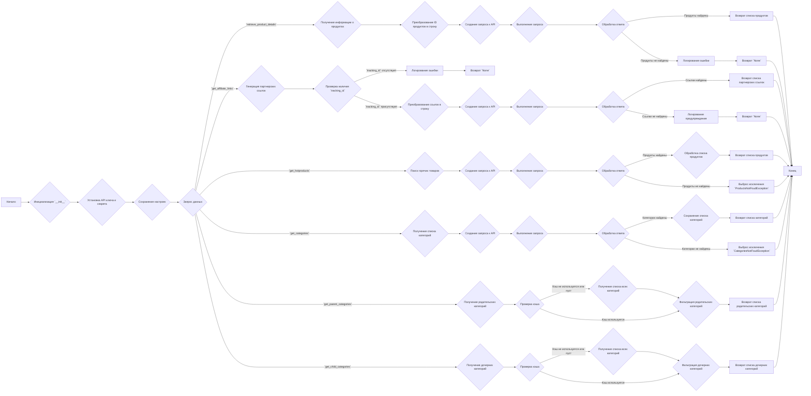

## АНАЛИЗ КОДА: `src/suppliers/aliexpress/api/api.py`

### 1. <алгоритм>

**Блок-схема работы класса `AliexpressApi`:**



**Примеры для логических блоков:**

*   **Инициализация (`__init__`):**
    ```python
    api = AliexpressApi(key="your_api_key", secret="your_api_secret", language="RU", currency="RUB", tracking_id="your_tracking_id")
    ```
    Здесь создаётся экземпляр `AliexpressApi`, передаются API ключ, секрет, язык, валюта и `tracking_id`.

*   **Получение информации о продуктах (`retrieve_product_details`):**
    ```python
    products = api.retrieve_product_details(product_ids=["123456789", "987654321"], fields=["title", "price"])
    ```
    Функция запрашивает информацию о продуктах с ID 123456789 и 987654321, возвращает только поля `title` и `price`.

*   **Генерация партнерских ссылок (`get_affiliate_links`):**
    ```python
    affiliate_links = api.get_affiliate_links(links=["https://example.com/product1", "https://example.com/product2"], link_type=model_LinkType.HOTLINK)
    ```
    Функция преобразует ссылки в партнерские, используя `tracking_id` и тип `HOTLINK`.

*   **Поиск горячих товаров (`get_hotproducts`):**
    ```python
    hot_products = api.get_hotproducts(category_ids="100003011", min_sale_price=1000, max_sale_price=5000, page_size=20)
    ```
    Поиск горячих товаров в категории "100003011", с ценой от 1000 до 5000, по 20 товаров на странице.

*   **Получение списка категорий (`get_categories`):**
    ```python
    categories = api.get_categories()
    ```
    Функция возвращает список всех категорий.

*  **Получение родительских категорий (`get_parent_categories`):**
    ```python
    parent_categories = api.get_parent_categories()
    ```
    Возвращает список родительских категорий.

*   **Получение дочерних категорий (`get_child_categories`):**
    ```python
    child_categories = api.get_child_categories(parent_category_id=100003011)
    ```
    Возвращает список дочерних категорий для родительской категории с ID 100003011.

```mermaid
flowchart TD
    classDef apiClass fill:#f9f,stroke:#333,stroke-width:2px
    classDef function fill:#ccf,stroke:#333,stroke-width:2px
    classDef data fill:#cfc,stroke:#333,stroke-width:2px
    
    A[AliexpressApi]:::apiClass --> B(setDefaultAppInfo):::function
    
    subgraph AliexpressApi
    
        B --> C[__init__]:::function
        C --> D[key]:::data
        C --> E[secret]:::data
        C --> F[tracking_id]:::data
        C --> G[language]:::data
        C --> H[currency]:::data
        C --> I[app_signature]:::data
        
        C --> J[categories]:::data

        J --> K{retrieve_product_details}:::function
         J --> L{get_affiliate_links}:::function
        J --> M{get_hotproducts}:::function
         J --> N{get_categories}:::function
        J --> O{get_parent_categories}:::function
        J --> P{get_child_categories}:::function
        
        K --> Q[product_ids]:::data
        K --> R[fields]:::data
        K --> S[country]:::data
        K --> T(get_product_ids):::function
        K --> U(get_list_as_string):::function
        K --> V(aliapi.rest.AliexpressAffiliateProductdetailGetRequest):::function
        K --> W(api_request):::function
        K --> X(parse_products):::function
        
        L --> Y[links]:::data
         L --> Z[link_type]:::data
         L --> AA(get_list_as_string):::function
        L --> AB(aliapi.rest.AliexpressAffiliateLinkGenerateRequest):::function
        L --> AC(api_request):::function
        
        M --> AD[category_ids]:::data
        M --> AE[delivery_days]:::data
        M --> AF[fields]:::data
        M --> AG[keywords]:::data
        M --> AH[max_sale_price]:::data
        M --> AI[min_sale_price]:::data
        M --> AJ[page_no]:::data
        M --> AK[page_size]:::data
        M --> AL[platform_product_type]:::data
        M --> AM[ship_to_country]:::data
         M --> AN[sort]:::data
         M --> AO(get_list_as_string):::function
        M --> AP(aliapi.rest.AliexpressAffiliateHotproductQueryRequest):::function
         M --> AQ(api_request):::function
         M --> AR(parse_products):::function
         
        N --> AS(aliapi.rest.AliexpressAffiliateCategoryGetRequest):::function
        N --> AT(api_request):::function
        
        O --> AU[use_cache]:::data
         O --> AV(filter_parent_categories):::function
    
        P --> AW[parent_category_id]:::data
        P --> AX[use_cache]:::data
        P --> AY(filter_child_categories):::function
        
    end
    
    style AliexpressApi fill:#fff,stroke:#333,stroke-width:2px
```

### 2. <mermaid>



**Объяснение `mermaid` диаграммы:**

*   **`AliexpressApi`**: Главный класс, который предоставляет методы для взаимодействия с API AliExpress.
*   **`setDefaultAppInfo`**: Функция из `skd.py` (не показана на диаграмме) для установки ключа и секрета приложения.
*   **`__init__`**: Метод инициализации класса, принимающий параметры: `key`, `secret`, `language`, `currency`, `tracking_id`, `app_signature` и сохраняющий их в атрибутах экземпляра класса.
*   **`retrieve_product_details`**: Метод для получения информации о продуктах. Принимает `product_ids`, `fields`, и `country`.
*   **`get_affiliate_links`**: Метод для генерации партнерских ссылок. Принимает `links` и `link_type`.
*   **`get_hotproducts`**: Метод для поиска горячих товаров. Принимает различные параметры для фильтрации и сортировки.
*  **`get_categories`**: Метод для получения списка всех категорий.
*  **`get_parent_categories`**: Метод для получения списка родительских категорий.
*   **`get_child_categories`**: Метод для получения списка дочерних категорий. Принимает `parent_category_id`.
*   **`get_product_ids`**: Вспомогательная функция для преобразования `product_ids` в список.
*   **`get_list_as_string`**: Вспомогательная функция для преобразования списка в строку.
*   **`aliapi.rest.AliexpressAffiliateProductdetailGetRequest`**, **`aliapi.rest.AliexpressAffiliateLinkGenerateRequest`**, **`aliapi.rest.AliexpressAffiliateHotproductQueryRequest`**,  **`aliapi.rest.AliexpressAffiliateCategoryGetRequest`**: Классы запросов к API AliExpress.
*   **`api_request`**: Функция для выполнения запроса к API.
*   **`parse_products`**: Функция для обработки ответа API и преобразования его в список объектов `model_Product`.
*  **`filter_parent_categories`**: Функция для фильтрации родительских категорий из списка.
*  **`filter_child_categories`**: Функция для фильтрации дочерних категорий из списка.

**Диаграмма зависимостей `header.py` не требуется, так как в коде нет импорта `import header`.**

### 3. <объяснение>

**Импорты:**

*   `typing`: Используется для аннотации типов данных (`List`, `Union`).
*   `src.logger.logger`: Используется для логирования событий и ошибок (`logger`).
*   `src.utils.printer`: Используется для форматированного вывода (`pprint`).
*   `.models`: Содержит классы моделей данных (например, `AffiliateLink`, `Category`, `Product`) для представления объектов AliExpress API.
*   `.errors.exceptions`: Содержит пользовательские исключения, такие как `CategoriesNotFoudException` и `ProductsNotFoudException`.
*   `.helpers.categories`: Вспомогательные функции для фильтрации категорий (`filter_child_categories`, `filter_parent_categories`).
*   `.skd`: Модуль для установки параметров приложения API (`setDefaultAppInfo`) и доступа к классам для формирования запросов API ( `api as aliapi`).
*   `.errors`: Содержит исключения для обработки ошибок в запросах API (`ProductsNotFoudException`, `InvalidTrackingIdException`).
*   `.helpers`: Вспомогательные функции для обработки запросов API (`api_request`, `parse_products`, `get_list_as_string`, `get_product_ids`).

**Класс `AliexpressApi`:**

*   **Роль**: Является основным классом для взаимодействия с AliExpress API. Он содержит методы для получения информации о продуктах, генерации партнерских ссылок, поиска горячих товаров и управления категориями.
*   **Атрибуты**:
    *   `_key`: API ключ.
    *   `_secret`: API секрет.
    *   `_tracking_id`: ID отслеживания.
    *   `_language`: Язык.
    *   `_currency`: Валюта.
    *   `_app_signature`: Подпись приложения.
    *   `categories`: Список загруженных категорий.
*   **Методы**:
    *   `__init__(self, key, secret, language, currency, tracking_id, app_signature, **kwargs)`: Конструктор класса, инициализирующий атрибуты и устанавливающий параметры приложения.
    *  `retrieve_product_details(self, product_ids, fields=None, country=None, **kwargs)`: Получает детали продуктов по их ID или списку ссылок.
    *   `get_affiliate_links(self, links, link_type=model_LinkType.NORMAL, **kwargs)`: Генерирует партнерские ссылки для списка ссылок.
    *   `get_hotproducts(self, category_ids=None, delivery_days=None, fields=None, keywords=None, max_sale_price=None, min_sale_price=None, page_no=None, page_size=None, platform_product_type=None, ship_to_country=None, sort=None, **kwargs)`: Получает список горячих товаров с возможностью фильтрации.
    *   `get_categories(self, **kwargs)`: Получает список всех доступных категорий.
    *   `get_parent_categories(self, use_cache=True, **kwargs)`: Получает список родительских категорий, используя кэш для оптимизации.
    *   `get_child_categories(self, parent_category_id, use_cache=True, **kwargs)`: Получает список дочерних категорий для определенной родительской категории, используя кэш.
    *  Взаимодействует с API AliExpress через модули `skd` и `helpers`, а также обрабатывает ответы, используя `parse_products`.

**Функции:**

*   `retrieve_product_details(self, ...)`:
    *   **Аргументы**: `product_ids` (строка или список ID), `fields` (поля для вывода, строка или список), `country` (страна доставки).
    *   **Возвращает**: `List[model_Product]` (список объектов Product).
    *   **Назначение**: Получает детальную информацию о продуктах.
    *  **Пример**: `products = api.retrieve_product_details(product_ids=["12345", "67890"], fields=["title", "price"])`
*   `get_affiliate_links(self, ...)`:
    *   **Аргументы**: `links` (строка или список ссылок), `link_type` (тип ссылки: HOTLINK или NORMAL).
    *   **Возвращает**: `List[model_AffiliateLink]` (список объектов AffiliateLink).
    *   **Назначение**: Генерирует партнерские ссылки.
    *   **Пример**: `aff_links = api.get_affiliate_links(links=["https://ex.com/1", "https://ex.com/2"], link_type=model_LinkType.HOTLINK)`
*   `get_hotproducts(self, ...)`:
    *  **Аргументы**: Параметры для фильтрации и поиска продуктов, такие как `category_ids`, `keywords`, `min_sale_price`, `max_sale_price`, `page_size` и др.
    *   **Возвращает**: `model_HotProductsResponse` (объект, содержащий информацию о горячих продуктах).
    *   **Назначение**: Поиск горячих продуктов с высокой комиссией.
    *    **Пример**: `hot_products = api.get_hotproducts(category_ids="100", min_sale_price=1000, page_size=20)`
*   `get_categories(self, **kwargs)`:
    *   **Аргументы**: Нет.
    *   **Возвращает**: `List[model_Category | model_ChildCategory]` (список объектов Category или ChildCategory).
    *   **Назначение**: Получает список всех категорий.
    *    **Пример**: `categories = api.get_categories()`
*    `get_parent_categories(self, use_cache=True, **kwargs)`:
    *   **Аргументы**: `use_cache` (использовать кэш).
    *   **Возвращает**: `List[model_Category]` (список объектов Category).
    *   **Назначение**: Получает список родительских категорий.
    *    **Пример**: `parent_categories = api.get_parent_categories()`
*   `get_child_categories(self, parent_category_id, use_cache=True, **kwargs)`:
    *   **Аргументы**: `parent_category_id` (ID родительской категории), `use_cache` (использовать кэш).
    *   **Возвращает**: `List[model_ChildCategory]` (список объектов ChildCategory).
    *   **Назначение**: Получает список дочерних категорий.
    *    **Пример**: `child_categories = api.get_child_categories(parent_category_id=123)`

**Переменные:**

*   Атрибуты класса (например, `_key`, `_secret`, `categories`) хранят данные для работы с API.
*   Локальные переменные в методах используются для хранения промежуточных значений (например, `request`, `response`).

**Потенциальные ошибки и области для улучшения:**

*   Обработка ошибок: В некоторых случаях используется `logger.warning` или `logger.error` вместо выброса исключений, что может затруднить отладку.
*   Кэширование категорий: Кэширование может быть улучшено, например, можно добавить механизм TTL (время жизни) для категорий.
*   Повторение кода: Код в методах `get_parent_categories` и `get_child_categories` почти идентичен, можно использовать общую функцию для уменьшения дублирования.
*   Валидация входных данных: Можно добавить валидацию входных данных для повышения надежности кода (например, проверка на пустые ID или некорректный формат).
*   `TODO` комментарии: Нужно посмотреть все `TODO` комментарии и проработать их.

**Взаимосвязи с другими частями проекта:**

*   Класс `AliexpressApi` взаимодействует с API AliExpress через модуль `skd`, который в свою очередь, использует `api_request`.
*   Модели данных (`.models`) используются для представления информации, полученной от API AliExpress.
*   Логирование (`src.logger.logger`) используется для отслеживания ошибок и событий.
*  Утилиты (`src.utils.printer`) могут использоваться для отладки и вывода данных.
*   Исключения (`.errors.exceptions`, `.errors`) используются для обработки ошибок, возникающих при работе с API AliExpress.

Этот анализ предоставляет всестороннее понимание функциональности, архитектуры и возможных улучшений кода `api.py`.