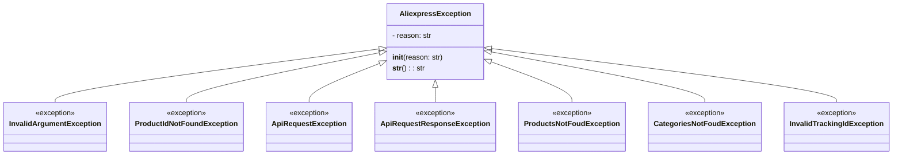

## <алгоритм>

1. **`AliexpressException`**:
   - **Инициализация (`__init__`)**: Принимает строку `reason` в качестве аргумента. Сохраняет ее в атрибуте `self.reason`.
   - **Строковое представление (`__str__`)**: Возвращает строку, содержащую причину исключения.
   - *Пример:* `raise AliexpressException("Произошла ошибка API")`

2. **`InvalidArgumentException`**:
   - Наследуется от `AliexpressException`.
   - Не имеет собственной реализации, просто служит для обозначения неверных аргументов.
   - *Пример:* `raise InvalidArgumentException("Неверный формат ID")`

3. **`ProductIdNotFoundException`**:
   - Наследуется от `AliexpressException`.
   -  Представляет исключение, когда ID продукта не найден.
   - *Пример:* `raise ProductIdNotFoundException("Продукт с данным ID не найден")`

4. **`ApiRequestException`**:
   - Наследуется от `AliexpressException`.
   - Представляет исключение при неудачном запросе к AliExpress API.
   - *Пример:* `raise ApiRequestException("Ошибка запроса к API")`

5. **`ApiRequestResponseException`**:
    - Наследуется от `AliexpressException`.
    - Представляет исключение, когда ответ от API некорректный.
    - *Пример:* `raise ApiRequestResponseException("Неверный ответ от API")`

6. **`ProductsNotFoudException`**:
    - Наследуется от `AliexpressException`.
    - Представляет исключение, когда продукты не найдены.
    - *Пример:* `raise ProductsNotFoudException("Продукты не найдены")`

7. **`CategoriesNotFoudException`**:
    - Наследуется от `AliexpressException`.
    - Представляет исключение, когда категории не найдены.
    - *Пример:* `raise CategoriesNotFoudException("Категории не найдены")`

8. **`InvalidTrackingIdException`**:
    - Наследуется от `AliexpressException`.
    - Представляет исключение при недействительном ID отслеживания.
    - *Пример:* `raise InvalidTrackingIdException("Неверный ID отслеживания")`

## <mermaid>

## <объяснение>

**Импорты:**

-   В данном коде нет явных импортов из других модулей или пакетов. Это связано с тем, что модуль `exceptions.py` определяет собственные классы исключений и не зависит от других частей проекта. Все классы исключений наследуют от встроенного в Python класса `Exception`.

**Классы:**

1.  **`AliexpressException`**:
    -   **Роль:** Базовый класс для всех исключений, специфичных для работы с AliExpress API. Он предоставляет общую структуру для всех пользовательских исключений в этом модуле.
    -   **Атрибуты:**
        -   `reason` (str): Строка, содержащая описание причины исключения.
    -   **Методы:**
        -   `__init__(self, reason: str)`: Конструктор, принимающий строку с описанием ошибки и инициализирующий атрибут `reason`.
        -   `__str__(self) -> str`: Метод, возвращающий строковое представление исключения, которое в данном случае является просто причиной ошибки.
    -   **Взаимодействие:** Этот класс является родительским для всех других исключений в этом модуле. Он обеспечивает общий интерфейс и механизм для обработки ошибок, связанных с AliExpress API.

2.  **`InvalidArgumentException`**:
    -   **Роль:** Исключение, которое поднимается, когда аргументы, переданные в функцию или метод, неверны или имеют некорректный формат.
    -   **Атрибуты:** Нет.
    -   **Методы:** Нет.
    -   **Взаимодействие:** Наследуется от `AliexpressException` и сигнализирует о проблемах с аргументами.

3.  **`ProductIdNotFoundException`**:
    -   **Роль:** Исключение, поднимаемое, если продукт с указанным ID не найден.
    -   **Атрибуты:** Нет.
    -   **Методы:** Нет.
    -   **Взаимодействие:** Наследуется от `AliexpressException` и используется при отсутствии продукта по ID.

4.  **`ApiRequestException`**:
    -   **Роль:** Исключение, поднимаемое при неудачном запросе к AliExpress API.
    -   **Атрибуты:** Нет.
    -   **Методы:** Нет.
    -   **Взаимодействие:** Наследуется от `AliexpressException` и используется при проблемах во время запроса к API.

5.  **`ApiRequestResponseException`**:
    -   **Роль:** Исключение, поднимаемое, если ответ от AliExpress API не является корректным.
    -   **Атрибуты:** Нет.
    -   **Методы:** Нет.
    -   **Взаимодействие:** Наследуется от `AliexpressException` и сигнализирует о проблемах в ответе от API.

6. **`ProductsNotFoudException`**:
    -   **Роль:** Исключение, поднимается, когда продукты не найдены.
    -   **Атрибуты:** Нет.
    -   **Методы:** Нет.
    -   **Взаимодействие:** Наследуется от `AliexpressException` и используется при отсутствии продуктов.

7.  **`CategoriesNotFoudException`**:
    -   **Роль:** Исключение, поднимается, когда категории не найдены.
    -   **Атрибуты:** Нет.
    -   **Методы:** Нет.
    -   **Взаимодействие:** Наследуется от `AliexpressException` и используется при отсутствии категорий.

8.  **`InvalidTrackingIdException`**:
    -   **Роль:** Исключение, поднимаемое, если ID отслеживания не действителен.
    -   **Атрибуты:** Нет.
    -   **Методы:** Нет.
    -   **Взаимодействие:** Наследуется от `AliexpressException` и используется при проблемах с ID отслеживания.

**Функции:**

-   В данном коде нет явных функций, кроме методов классов (`__init__` и `__str__` класса `AliexpressException`).

**Переменные:**

-   `reason` (str): Атрибут класса `AliexpressException`, хранит строку с описанием причины исключения.

**Потенциальные ошибки и области для улучшения:**

1.  **Конкретизация ошибок:** Хотя и созданы разные типы исключений, сами исключения содержат только строку с описанием ошибки. Может быть полезно добавить дополнительную информацию, например, код ошибки или другие параметры, связанные с исключением, для более точного логирования и отладки.
2.  **Логирование**:  Может быть полезно добавить встроенные механизмы логирования для всех исключений, особенно для `ApiRequestException` и `ApiRequestResponseException`.

**Взаимосвязь с другими частями проекта:**

-   Модуль используется для создания пользовательских исключений, которые могут быть подняты в других частях проекта (например, в модулях, которые взаимодействуют с API AliExpress) при возникновении ошибок. Исключения позволяют более эффективно обрабатывать ошибки и информировать вызывающий код о возникших проблемах.

Модуль определяет стандартный набор исключений, которые используются для обозначения проблем, специфичных для работы с API AliExpress, и обеспечивает унифицированный подход к обработке ошибок.