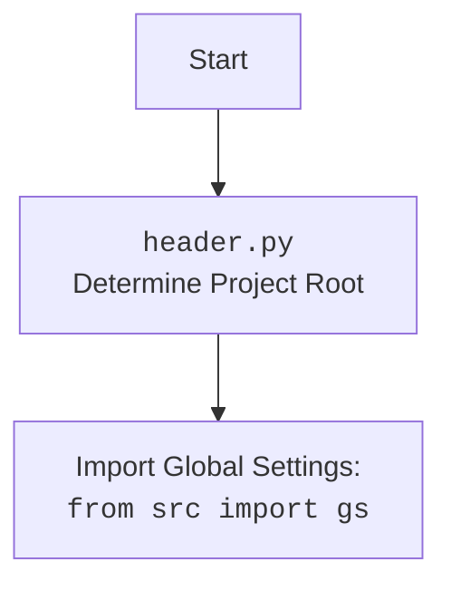

## <алгоритм>

**1. Функция `api_request` (начало):**

   - **Пример:** `api_request(request_object, "aliexpress_product_detail", attemps=3)`
   - Функция принимает три аргумента:
     - `request`: Объект запроса (например, запрос к API AliExpress).
     - `response_name`: Ключ в ответе, содержащий нужные данные.
     - `attemps`: Количество попыток выполнить запрос (по умолчанию 1).

**2. Обработка запроса (try):**

   -  **Пример:**  `response = request.getResponse()`.
   - Функция пытается получить ответ на запрос, используя метод `getResponse()` объекта `request`.
   - Если возникает исключение (например, ошибка сети), переходит к блоку `except`.

**3. Обработка исключения при запросе (except):**
   
   - **Пример:** Если при выполнении `request.getResponse()` возникла ошибка, например, `ConnectionError`, код перейдет в этот блок.
   - Исключение обрабатывается, но оно игнорируется. Записывается в лог. Функция возвращает `None`.

**4. Обработка ответа (try):**
   
   - **Пример:** `response = response["aliexpress_product_detail"]["resp_result"]`
   - Пытается извлечь данные из ответа по ключам `response_name` и `resp_result`.
   - Конвертирует ответ в JSON строку, а затем обратно в объект `SimpleNamespace`, для удобства доступа к атрибутам через точку.
   - Если возникает исключение (например, ключ не найден), переходит к блоку `except`.

**5. Обработка исключения при обработке ответа (except):**

   - **Пример:** Если во время преобразования JSON возникнет ошибка, например, некорректный формат, то код перейдет в этот блок.
   -  Записывается в лог. Функция возвращает `None`.

**6. Проверка кода ответа (try):**
   - **Пример:** `if response.resp_code == 200:`
   - Проверяется код ответа `response.resp_code`.
   - Если код равен 200, возвращаются результаты из `response.result`.
   - Если код не равен 200, выводится предупреждение в лог, и возвращает `None`.

**7. Обработка исключений при проверке кода ответа (except):**
   - **Пример:** Если во время проверки `response.resp_code` или `response.result` произойдет ошибка (например, атрибута не существует)
   - Записывает исключение в лог и возвращает `None`.

**8. Конец функции `api_request`:**
   - Функция возвращает либо результаты запроса (если `response.resp_code == 200`), либо `None` в случае ошибки или не успешного запроса.

## <mermaid>

```mermaid
flowchart TD
    Start[Начало функции api_request] --> GetResponse[Вызов request.getResponse() <br> Получение ответа от API]
    
    GetResponse -- Успешно --> ExtractData[Извлечение данных из ответа: <br>response[response_name]['resp_result']]
    GetResponse -- Исключение --> HandleRequestError[Обработка исключения при запросе]
    
    HandleRequestError --> ReturnNone1[Возврат None]
     
    ExtractData -- Успешно --> JsonConversion[Преобразование JSON <br> в SimpleNamespace]
    ExtractData -- Исключение --> HandleResponseError[Обработка исключения при обработке ответа]
   
    HandleResponseError --> ReturnNone2[Возврат None]    
    
    JsonConversion --> CheckResponseCode[Проверка response.resp_code]
    
    CheckResponseCode -- response.resp_code == 200 --> ReturnResult[Возврат response.result]
    CheckResponseCode -- response.resp_code != 200 --> LogWarning[Логирование предупреждения об ошибке ответа]
    LogWarning --> ReturnNone3[Возврат None]
     
    CheckResponseCode -- Исключение --> HandleCheckError[Обработка исключения при проверке кода ответа]
    HandleCheckError --> ReturnNone4[Возврат None]
    ReturnNone1 --> End[Конец функции]
    ReturnNone2 --> End
    ReturnNone3 --> End
    ReturnNone4 --> End
    ReturnResult --> End
    
```



**Объяснение диаграммы `mermaid`:**

- **`Start`**: Начало выполнения функции `api_request`.
- **`GetResponse`**: Вызов метода `getResponse()` объекта `request` для получения ответа от API.
- **`HandleRequestError`**: Обработка исключения, возникшего во время вызова `getResponse()`.
- **`ReturnNone1`**: Возврат значения `None` из функции `api_request` при ошибке в запросе.
- **`ExtractData`**: Извлечение данных из ответа по ключам `response_name` и `resp_result`.
- **`JsonConversion`**: Преобразование извлеченных данных в формат JSON, а затем обратно в объект типа `SimpleNamespace`.
- **`HandleResponseError`**: Обработка исключения, возникшего во время преобразования JSON.
- **`ReturnNone2`**: Возврат значения `None` из функции `api_request` при ошибке обработки ответа.
- **`CheckResponseCode`**: Проверка кода ответа `response.resp_code`.
- **`ReturnResult`**: Возврат `response.result` при успешном коде ответа (200).
- **`LogWarning`**: Вывод предупреждения в лог при не успешном коде ответа.
- **`ReturnNone3`**: Возврат значения `None` из функции `api_request` после вывода предупреждения.
- **`HandleCheckError`**: Обработка исключения, возникшего при проверке кода ответа.
- **`ReturnNone4`**: Возврат значения `None` из функции `api_request` при ошибке проверки кода ответа.
- **`End`**: Конец выполнения функции `api_request`.

Диаграмма отражает поток выполнения программы, показывая различные пути, в зависимости от успешности выполнения операций.

## <объяснение>

### Импорты:

-   `from types import SimpleNamespace`: `SimpleNamespace` используется для создания объектов, к атрибутам которых можно обращаться как к обычным атрибутам объекта (через точку), что упрощает доступ к данным из JSON-ответа.
-   `from time import sleep`:  Используется для приостановки выполнения программы на заданное время, но в данном коде не используется.
-   `from src.logger.logger import logger`: Импортируется объект `logger` из модуля `src.logger.logger` для логирования ошибок и предупреждений.
-   `from src.utils.printer import pprint`: Импортируется функция `pprint` для форматированного вывода данных, часто используется для вывода отладочной информации.
-   `import json`: Импортируется модуль `json` для работы с JSON-данными (преобразование между JSON-строками и Python-объектами).
-   `from ..errors import ApiRequestException, ApiRequestResponseException`: Импортируются пользовательские исключения `ApiRequestException` и `ApiRequestResponseException` из модуля `src.suppliers.aliexpress.api.errors`. Эти исключения используются для обработки ошибок, специфичных для API запросов AliExpress.

### Функция `api_request`:

-   **Аргументы:**
    -   `request`: Объект, который имеет метод `getResponse()` для выполнения запроса к API.
    -   `response_name`: Строка, представляющая ключ в словаре, содержащем результат ответа.
    -   `attemps`: Целое число, представляющее количество попыток запроса (по умолчанию 1). Этот параметр не используется в коде.
-   **Возвращаемое значение:**
    -   Возвращает результат запроса `response.result`, если `response.resp_code == 200`.
    -   Возвращает `None`, если произошла ошибка или код ответа не равен 200.
-   **Назначение:** Функция `api_request` предназначена для выполнения запросов к API и обработки ответов. Она обрабатывает возможные ошибки, форматирует JSON-ответ в объект `SimpleNamespace` и проверяет код ответа.
-   **Примеры:**
    -   `api_request(aliexpress_request_object, 'aliexpress_product_detail')` - выполняет запрос и обрабатывает результат как детали продукта.
    -   `api_request(search_request_object, 'aliexpress_search_result')` - выполняет запрос и обрабатывает результат поиска.
-   **Логика:**
    1.  Пытается получить ответ на запрос с помощью `request.getResponse()`.
    2.  Если возникает исключение, оно обрабатывается, записывается в лог и возвращается `None`.
    3.  Извлекает данные из ответа по ключам `response_name` и `resp_result`.
    4.  Преобразует извлеченные данные в JSON строку, а затем обратно в объект `SimpleNamespace` для удобного доступа к атрибутам.
    5.  Если возникает исключение, оно обрабатывается, записывается в лог и возвращается `None`.
    6.  Проверяет код ответа `response.resp_code`.
    7.  Если код равен 200, возвращает `response.result`.
    8.  Если код не равен 200, записывает предупреждение в лог и возвращает `None`.
    9.  Если при проверке кода ответа возникает исключение, записывает ошибку в лог и возвращает `None`.

### Переменные:

-   `request`: Объект запроса, передаваемый в функцию.
-   `response_name`: Ключ для извлечения данных из ответа.
-   `attemps`: Количество попыток выполнить запрос (не используется).
-   `response`: Переменная для хранения ответа от API, а также для промежуточных преобразований данных.

### Потенциальные ошибки и области для улучшения:

-   **Обработка исключений:**
    -   В блоках `except` код игнорирует ошибки запроса и обработки ответа, не поднимая исключения повторно, а просто возвращая `None`. Это может затруднить отладку.
    -   Стоит пересмотреть обработку исключений и возможно поднимать их выше, или возвращать собственные исключения, чтобы сигнализировать об ошибке более явно.
-   **Повторные запросы:** Функция принимает аргумент `attemps`, но не использует его для повторных запросов при неудаче. Можно было бы добавить логику для выполнения повторных запросов при ошибке.
-   **Логирование:**
    -   Логирование в `except` блоках в основном использует `logger.critical`, даже для ошибок, которые можно было бы классифицировать как `warning`. Возможно, стоит использовать более точные уровни логирования.
    -   В случае исключения при проверке кода ответа логгируется только `ex`, и не указывается тип ошибки, для лучшей читаемости.
-   **Общая обработка ошибок:** Можно добавить более общую обработку ошибок, чтобы можно было обрабатывать различные типы ошибок API.
-   **Отсутствие проверок типа аргументов:** Нет проверок типов аргументов `request`, `response_name` и `attemps`. Желательно добавить их, чтобы избежать неожиданных ошибок во время выполнения.

### Взаимосвязи с другими частями проекта:

-   **`src.logger.logger`:** Функция использует модуль `logger` для записи ошибок и предупреждений, что позволяет отслеживать проблемы, возникающие при запросах к API.
-   **`src.utils.printer`:** Функция `pprint` используется для форматированного вывода данных, что помогает в отладке.
-   **`src.suppliers.aliexpress.api.errors`:** Функция импортирует исключения из этого модуля, что позволяет обрабатывать специфические для API AliExpress ошибки.
-   Функция является частью API-клиента для AliExpress и используется для выполнения запросов к API.
-   `header.py` - определяет корневую директорию проекта и загружает глобальные настройки.

**Цепочка взаимосвязей:**

1.  `api_request` -> `request` (объект запроса, созданный в другом модуле).
2.  `api_request` -> `src.logger.logger.logger` (для логирования).
3.  `api_request` -> `src.utils.printer.pprint` (для форматированного вывода).
4.  `api_request` -> `src.suppliers.aliexpress.api.errors` (для обработки ошибок).
5.  `api_request` <-  `header.py` (для глобальных настроек).

Таким образом, функция `api_request` является важным компонентом API-клиента, обеспечивающим выполнение запросов, обработку ответов и логирование ошибок.