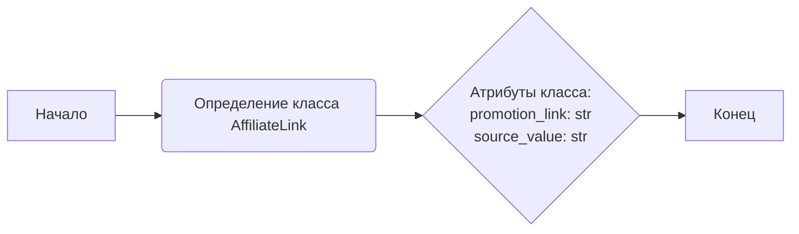
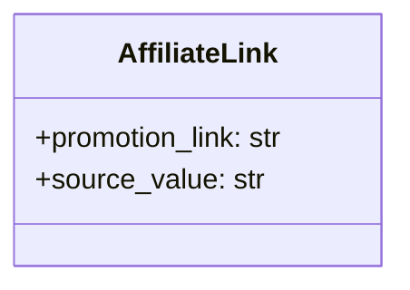

## АНАЛИЗ КОДА: `src/suppliers/aliexpress/api/models/affiliate_link.py`

### 1. <алгоритм>

**Описание:**
Модуль `affiliate_link.py` определяет структуру данных для представления партнерской ссылки AliExpress. Он включает класс `AffiliateLink`, который имеет два атрибута: `promotion_link` (сама партнерская ссылка) и `source_value` (значение, связанное с источником ссылки, например, id товара).

**Блок-схема:**



**Пример использования:**

```python
# Создание экземпляра класса AffiliateLink
link = AffiliateLink()
link.promotion_link = "https://s.click.aliexpress.com/e/_DFv578f"
link.source_value = "1234567890"

# Доступ к атрибутам
print(link.promotion_link)  # Вывод: https://s.click.aliexpress.com/e/_DFv578f
print(link.source_value) # Вывод: 1234567890
```

### 2. <mermaid>



**Анализ зависимостей:**

В данном коде нет импортов других модулей, поэтому диаграмма `mermaid` представляет только класс `AffiliateLink` с его атрибутами.  В диаграмме `classDiagram` показано, что класс `AffiliateLink` имеет два публичных атрибута: `promotion_link` типа `str` и `source_value` типа `str`.

### 3. <объяснение>

**Импорты:**

В данном коде нет никаких импортов. Это означает, что класс `AffiliateLink` является самодостаточным и не зависит от других модулей в проекте.

**Классы:**

*   **`class AffiliateLink`**:
    *   **Роль**: Этот класс представляет структуру данных для хранения информации о партнерской ссылке AliExpress. Он используется для организации и хранения `promotion_link` (самой ссылки) и `source_value` (идентификатора связанного товара или значения).
    *   **Атрибуты**:
        *   `promotion_link: str`: Строка, представляющая собой партнерскую ссылку AliExpress.
        *   `source_value: str`: Строка, представляющая собой значение, идентифицирующее источник ссылки (например, id товара).
    *   **Методы**:
        *   Класс не имеет явно определенных методов.
    *   **Взаимодействие**:
        *   Предполагается, что этот класс будет использоваться другими частями приложения, например, модулями для работы с API AliExpress, чтобы передавать информацию о партнерских ссылках.

**Функции:**

В данном коде нет функций.

**Переменные:**

*   `promotion_link`: Атрибут экземпляра класса `AffiliateLink`, хранит партнерскую ссылку в виде строки.
*   `source_value`: Атрибут экземпляра класса `AffiliateLink`, хранит идентификатор источника ссылки в виде строки.

**Потенциальные ошибки и области для улучшения:**

*   **Отсутствие валидации**: В текущей реализации отсутствует валидация типов данных для `promotion_link` и `source_value`, а также их содержимого. Желательно добавить валидацию для обеспечения корректности данных.
*   **Отсутствие документации**: Было бы полезно добавить docstrings к классу и атрибутам, что улучшит читаемость и понимание кода.
*   **Использование dataclass**: Можно было бы использовать `dataclass` для автоматического создания конструктора и методов сравнения, что сделало бы код более компактным и читаемым.
*   **Добавление проверки URL:** Было бы полезно добавить проверку формата URL для поля `promotion_link`, что бы убедиться, что это корректная ссылка.

**Взаимосвязи с другими частями проекта:**

Предполагается, что этот класс будет использоваться модулями, которые взаимодействуют с API AliExpress, для получения и обработки партнерских ссылок. Например:

*   Модули, отвечающие за создание партнерских ссылок на основе API AliExpress, будут создавать экземпляры `AffiliateLink` и заполнять их данными.
*   Модули, отвечающие за сохранение и отправку данных, будут принимать экземпляры `AffiliateLink` в качестве входных данных.
*   Модули, отвечающие за получение информации о товаре, будут использовать `source_value` для идентификации товара в каталоге AliExpress.