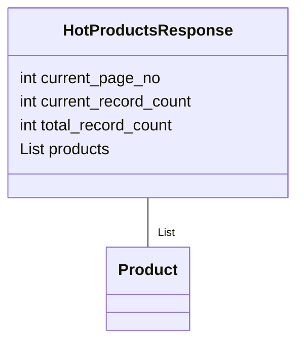

## АНАЛИЗ КОДА: `src/suppliers/aliexpress/api/models/hotproducts.py`

### 1. <алгоритм>
```mermaid
flowchart TD
    Start[Начало] --> ImportModules[Импорт модулей: <br> `from .product import Product`, <br> `from typing import List`]
    ImportModules --> DefineClass[Определение класса `HotProductsResponse`];
    DefineClass --> Attr_currentPageNo[Объявление атрибута: <br> `current_page_no: int`]
    Attr_currentPageNo --> Attr_currentRecordCount[Объявление атрибута: <br> `current_record_count: int`]
    Attr_currentRecordCount --> Attr_totalRecordCount[Объявление атрибута: <br> `total_record_count: int`]
    Attr_totalRecordCount --> Attr_products[Объявление атрибута: <br> `products: List[Product]`]
    Attr_products --> End[Конец]
```
**Примеры:**
- **Импорт модулей:** Импортируется класс `Product` из файла `product.py` в той же директории. Импортируется `List` из модуля `typing` для аннотации типов.
- **Определение класса `HotProductsResponse`:** Создается класс для представления ответа API с горячими товарами.
- **Объявление атрибутов:** Атрибуты класса `HotProductsResponse` (например, `current_page_no`, `current_record_count`, `total_record_count` и `products`) хранят информацию о текущей странице, количестве записей на странице, общем количестве записей и список продуктов.
### 2. <mermaid>



**Объяснение `mermaid`:**
- `classDiagram`:  Указывает, что это диаграмма классов.
- `class HotProductsResponse`:  Определяет класс `HotProductsResponse` с его атрибутами.
- `int current_page_no`:  Атрибут `current_page_no` типа int.
- `int current_record_count`:  Атрибут `current_record_count` типа int.
- `int total_record_count`:  Атрибут `total_record_count` типа int.
- `List<Product> products`: Атрибут `products`, который является списком объектов типа `Product`.
- `class Product`:  Определяет класс `Product`, представляющий структуру данных продукта.
- `HotProductsResponse  --  "List<Product>" Product`: Устанавливает связь между `HotProductsResponse` и `Product` указывая, что `HotProductsResponse` содержит список объектов `Product`.

### 3. <объяснение>

**Импорты:**
- `from .product import Product`: Импортирует класс `Product` из модуля `product.py`, расположенного в той же директории. Этот класс предположительно используется для представления данных об отдельном продукте.
- `from typing import List`: Импортирует `List` из модуля `typing` для определения типа списка. Это используется для аннотации типа `products` как списка объектов `Product`, что улучшает читаемость и поддержку кода.

**Классы:**
- `class HotProductsResponse`: Этот класс представляет структуру ответа API, содержащего данные о горячих товарах. Он имеет следующие атрибуты:
  - `current_page_no: int`: Номер текущей страницы.
  - `current_record_count: int`: Количество записей на текущей странице.
  - `total_record_count: int`: Общее количество записей.
  - `products: List[Product]`: Список объектов `Product`, представляющих горячие товары.

**Атрибуты:**
- `current_page_no`: Целое число, представляющее номер текущей страницы.
- `current_record_count`: Целое число, представляющее количество записей (продуктов) на текущей странице.
- `total_record_count`: Целое число, представляющее общее количество записей (продуктов).
- `products`: Список объектов `Product`.

**Объяснение:**
- Этот код определяет модель данных для представления ответа API, содержащего горячие товары.
- Класс `HotProductsResponse` инкапсулирует данные ответа, такие как номер страницы, количество записей на странице, общее количество записей и список продуктов.
- Аннотация типов делает код более читаемым и надежным, так как позволяет статическим анализаторам кода проверять типы переменных.

**Возможные области для улучшения:**
- Добавить валидацию данных, особенно для входных данных.
- Рассмотреть возможность использования `dataclasses` для упрощения определения класса и генерации автоматически методов `__init__`, `__repr__` и т.д.
- Реализовать возможность обработки ошибок и исключений.
- Подумать о реализации методов, для добавления, фильтрации или сортировки данных о товарах, если это будет необходимо.

**Взаимосвязи с другими частями проекта:**
- Предположительно, класс `HotProductsResponse` будет использоваться для обработки данных, полученных от API AliExpress.
- Класс `Product`, вероятно, будет определен в файле `product.py` и будет содержать атрибуты, специфичные для каждого продукта.
- Этот класс может использоваться другими частями проекта, такими как UI или обработчики данных, для отображения или обработки полученных данных о горячих товарах.