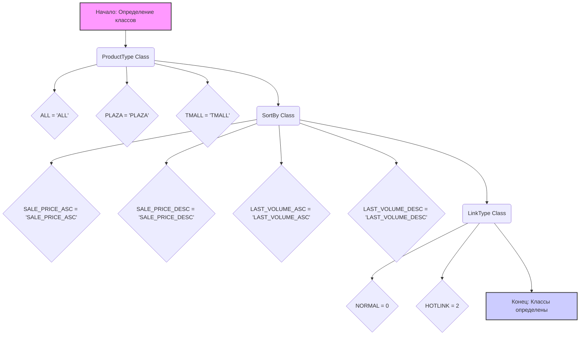
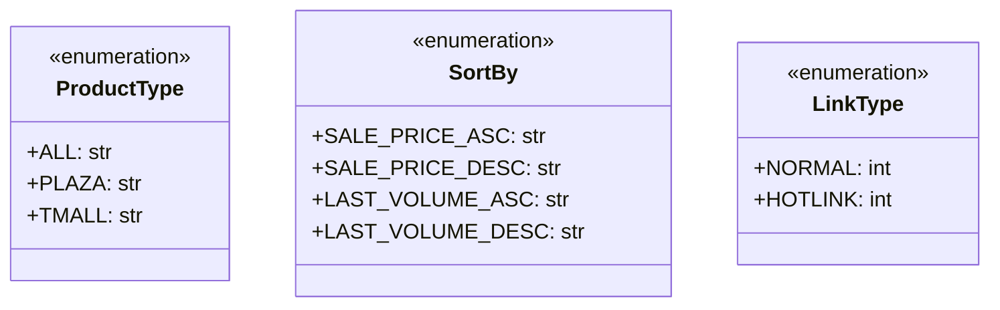

## АНАЛИЗ КОДА: `src/suppliers/aliexpress/api/models/request_parameters.py`

### 1. <алгоритм>

**Общая цель:** Этот файл определяет константы (классы с константами), используемые для параметров запросов к API AliExpress. Эти константы представляют собой предопределенные значения, которые могут быть использованы при формировании запросов, обеспечивая типизацию и предотвращая ошибки при написании кода.

**Блок-схема:**

**Примеры использования:**

1. **`ProductType`**:
    -   `product_type = ProductType.ALL`  # Запрос товаров всех типов
    -   `product_type = ProductType.PLAZA` # Запрос только товаров Plaza
    -   `product_type = ProductType.TMALL` # Запрос только товаров TMall

2.  **`SortBy`**:
    -   `sort_by = SortBy.SALE_PRICE_ASC` # Сортировка по возрастанию цены
    -   `sort_by = SortBy.LAST_VOLUME_DESC` # Сортировка по убыванию количества продаж

3. **`LinkType`**:
    - `link_type = LinkType.NORMAL` # Запрос обычной ссылки
    - `link_type = LinkType.HOTLINK` # Запрос горячей ссылки

### 2. <mermaid>

**Объяснение `mermaid` диаграммы:**

-   Диаграмма представляет три класса (`ProductType`, `SortBy`, `LinkType`), каждый из которых помечен как `enumeration`, что указывает на то, что они представляют собой наборы именованных констант.
-   Каждый класс имеет поля, которые соответствуют константам, определенным в коде.
-   Типы данных полей указаны как `str` для строк и `int` для целых чисел.
-   Диаграмма показывает структуру классов и их атрибуты, которые используются в качестве параметров запросов.

### 3. <объяснение>

#### Импорты:

-   В данном файле нет импортов. Он содержит только определения констант в виде классов.

#### Классы:

1.  **`ProductType`**:
    -   **Роль**: Представляет типы товаров, которые могут быть запрошены через API AliExpress.
    -   **Атрибуты**:
        -   `ALL`: Строка `'ALL'`, обозначающая запрос всех типов товаров.
        -   `PLAZA`: Строка `'PLAZA'`, обозначающая запрос только товаров из раздела Plaza.
        -   `TMALL`: Строка `'TMALL'`, обозначающая запрос только товаров из раздела TMall.
    -   **Взаимодействие**: Используется как параметр для фильтрации товаров при формировании запросов к API AliExpress.

2.  **`SortBy`**:
    -   **Роль**: Определяет способы сортировки результатов запроса товаров.
    -   **Атрибуты**:
        -   `SALE_PRICE_ASC`: Строка `'SALE_PRICE_ASC'`, обозначающая сортировку по возрастанию цены.
        -   `SALE_PRICE_DESC`: Строка `'SALE_PRICE_DESC'`, обозначающая сортировку по убыванию цены.
        -   `LAST_VOLUME_ASC`: Строка `'LAST_VOLUME_ASC'`, обозначающая сортировку по возрастанию количества продаж.
        -   `LAST_VOLUME_DESC`: Строка `'LAST_VOLUME_DESC'`, обозначающая сортировку по убыванию количества продаж.
    -   **Взаимодействие**: Используется как параметр для сортировки результатов запроса при обращении к API AliExpress.

3.  **`LinkType`**:
    -   **Роль**: Определяет тип ссылки, которую нужно получить.
    -   **Атрибуты**:
        -   `NORMAL`: Целое число `0`, обозначающее получение обычной ссылки.
        -   `HOTLINK`: Целое число `2`, обозначающее получение горячей ссылки (возможно, партнерской или с повышенными комиссиями).
    -   **Взаимодействие**: Используется как параметр для указания требуемого типа ссылки при запросах к API AliExpress.

#### Функции:

-   В данном файле нет функций. Он содержит только определения классов.

#### Переменные:

-   Внутри классов используются константы, которые являются строками (`str`) или целыми числами (`int`). Эти переменные используются как предопределенные значения для параметров запросов.

#### Потенциальные ошибки и области для улучшения:

1.  **Расширяемость**: При добавлении новых типов продуктов, сортировок или типов ссылок, необходимо будет изменять данный файл, что может нарушить принцип открытости/закрытости (open/closed principle).
2.  **Описания**: Отсутствуют описания для конкретных значений в классах `ProductType`, `SortBy` и `LinkType`.
3.  **Управление версиями API**:  При изменениях в API AliExpress данные константы могут устареть,  потребуется отслеживать актуальность значений, чтобы обеспечить совместимость.

#### Цепочка взаимосвязей:

-   Данный файл (`request_parameters.py`) является частью модуля `src.suppliers.aliexpress.api.models`.
-   Он используется модулями, которые формируют запросы к API AliExpress, например, в  `src.suppliers.aliexpress.api.api_client.py`, где эти константы используются для создания параметров API-запросов.
-   В целом, файл `request_parameters.py` предоставляет словарь типизированных констант для работы с AliExpress API.