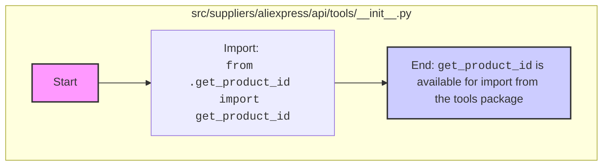

## АНАЛИЗ КОДА: `hypotez/src/suppliers/aliexpress/api/tools/__init__.py`

### <алгоритм>

1.  **Импорт:**
    *   Импортируется функция `get_product_id` из модуля `get_product_id.py`, находящегося в той же директории (`.`).
    *   **Пример:** `from .get_product_id import get_product_id` - импортирует функцию для извлечения ID продукта.
2.  **Использование:**
    *   В данном `__init__.py` файле, функция `get_product_id` становится доступна для импорта из пакета `src.suppliers.aliexpress.api.tools`.
    *   **Пример:** При импорте `from src.suppliers.aliexpress.api.tools import get_product_id`, можно использовать функцию `get_product_id`.

### <mermaid>

**Объяснение `mermaid` диаграммы:**
1. `Start` - Начальная точка процесса.
2.  `Import_get_product_id` -  Импортирует функцию `get_product_id` из модуля `get_product_id.py`.
    
3. `End` - `get_product_id` теперь доступна для импорта из пакета `src.suppliers.aliexpress.api.tools`.

### <объяснение>

**Импорты:**

*   `from .get_product_id import get_product_id`:
    *   `.` означает, что импортируется модуль `get_product_id.py`, находящийся в той же директории.
    *   `get_product_id` - функция, предположительно предназначенная для извлечения идентификатора продукта.
    *   Этот импорт делает функцию `get_product_id` доступной для использования при импорте пакета `src.suppliers.aliexpress.api.tools`.
    *   **Взаимосвязь с другими пакетами:** Позволяет другим пакетам в `src` использовать инструменты для работы с идентификаторами продуктов.

**Классы:**

*   В данном файле классы отсутствуют.

**Функции:**

*   В данном файле функции отсутствуют, кроме импортированной `get_product_id`.
    *   `get_product_id`:
        *   **Аргументы:**  Из контекста этого файла аргументы не известны.
        *   **Возвращаемое значение:** Из контекста этого файла возвращаемое значение не известно, но предположительно это будет ID продукта.
        *   **Назначение:** Предназначена для извлечения идентификатора продукта из каких-либо данных.
        *   **Примеры:** Без контекста использования невозможно привести пример.

**Переменные:**

*   В данном файле переменные отсутствуют.

**Потенциальные ошибки и области для улучшения:**

*   **Недостаток документации:** Отсутствуют docstring для модуля и функции.
*   **Неизвестные детали реализации:** Без просмотра кода в `get_product_id.py` сложно понять детали реализации и возможные ошибки.
*   **Отсутствие тестов:** Неизвестно, есть ли тесты для функции `get_product_id`.

**Цепочка взаимосвязей:**

1.  `src.suppliers.aliexpress.api.tools.__init__.py` импортирует `get_product_id` из `src.suppliers.aliexpress.api.tools.get_product_id.py`.
2.  Другие модули в проекте, например, в `src.suppliers.aliexpress.api`, могут импортировать функции из `src.suppliers.aliexpress.api.tools`, включая `get_product_id`, для работы с данными о продуктах с AliExpress.
3.  Модули, зависящие от `src.suppliers.aliexpress.api`, таким образом, неявно зависят и от `src.suppliers.aliexpress.api.tools`.