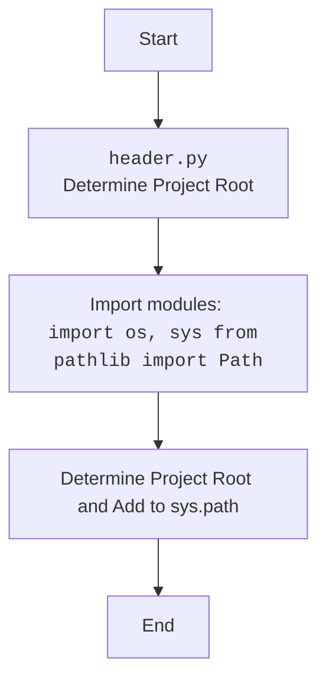

## Анализ кода `header.py`

### 1. <алгоритм>

**Назначение:**
Файл `header.py` предназначен для определения корневой директории проекта `hypotez` и добавления её, а также директории `src` в `sys.path`, чтобы обеспечить правильный импорт модулей внутри проекта.

**Блок-схема:**

```mermaid
graph LR
    A[Начало] --> B{Получение текущей рабочей директории: `os.getcwd()`};
    B --> C{Поиск индекса подстроки 'hypotez' в рабочей директории: `os.getcwd().rfind('hypotez')`};
    C --> D{Извлечение части строки, включая 'hypotez', из рабочей директории: `os.getcwd()[:index + 7]`};
    D --> E{Создание объекта Path из полученной строки: `Path(...)`};
    E --> F{Присваивание объекта Path переменной dir_root};
    F --> G{Добавление dir_root в sys.path: `sys.path.append(str(dir_root))`};
    G --> H{Создание объекта Path для директории src: `Path(dir_root, 'src')`};
     H --> I{Присваивание объекта Path переменной dir_src};
    I --> J{Добавление dir_root в sys.path: `sys.path.append(str(dir_root))`};
    J --> K[Конец];
    
    style A fill:#f9f,stroke:#333,stroke-width:2px
    style K fill:#f9f,stroke:#333,stroke-width:2px
```

**Примеры:**

1.  **`os.getcwd()`**:  Допустим, текущая рабочая директория: `/home/user/projects/hypotez/src/suppliers/aliexpress/campaign/_examples`.

2.  **`os.getcwd().rfind('hypotez')`**: Результат будет `20` (индекс начала подстроки 'hypotez').

3.  **`os.getcwd()[:index + 7]`**:  Результат будет `/home/user/projects/hypotez` (извлекается строка до конца 'hypotez').

4.  **`Path(...)`**: Создается объект `Path('/home/user/projects/hypotez')`, который удобно использовать для работы с путями в разных ОС.

5.  **`sys.path.append(...)`**: В `sys.path` добавляется строка `/home/user/projects/hypotez`, что позволяет импортировать модули из этой директории.

6.  **`Path(dir_root, 'src')`**: Создается объект `Path('/home/user/projects/hypotez/src')`
7.  **`sys.path.append(...)`**: В `sys.path` добавляется строка `/home/user/projects/hypotez`, что позволяет импортировать модули из этой директории.

### 2. <mermaid>
```mermaid
flowchart TD
    Start[Start] --> GetWorkingDirectory[Get Current Working Directory: <code>os.getcwd()</code>];
    GetWorkingDirectory --> FindHypotezIndex[Find Index of 'hypotez': <code>os.getcwd().rfind('hypotez')</code>];
    FindHypotezIndex --> ExtractRootPath[Extract Root Path: <code>os.getcwd()[:index + 7]</code>];
    ExtractRootPath --> CreatePathObject[Create Path Object: <code>Path(...)</code>];
    CreatePathObject --> SetRootDir[Set Root Directory: <code>dir_root</code>];
    SetRootDir --> AddRootDirToSysPath[Add Root Directory to <code>sys.path</code>: <code>sys.path.append(str(dir_root))</code>];
     AddRootDirToSysPath --> CreateSrcPathObject[Create Path Object for <code>src</code>: <code>Path(dir_root, 'src')</code>];
    CreateSrcPathObject --> SetSrcDir[Set Src Directory: <code>dir_src</code>];
    SetSrcDir --> AddRootDirToSysPathAgain[Add Root Directory to <code>sys.path</code> again: <code>sys.path.append(str(dir_root))</code>];
    AddRootDirToSysPathAgain --> End[End];
    
    style Start fill:#f9f,stroke:#333,stroke-width:2px
    style End fill:#f9f,stroke:#333,stroke-width:2px
```


### 3. <объяснение>

**Импорты:**

*   `import os`: Модуль `os` предоставляет функции для взаимодействия с операционной системой, такие как получение текущей рабочей директории (`os.getcwd()`).
*   `import sys`: Модуль `sys` предоставляет доступ к некоторым переменным и функциям, которые взаимодействуют с интерпретатором Python, включая добавление путей к поиску модулей (`sys.path`).
*   `from pathlib import Path`: Класс `Path` из модуля `pathlib` используется для работы с путями в файловой системе, упрощая создание и манипуляции путями.

**Переменные:**

*   `dir_root: Path`: Переменная типа `Path`, содержащая абсолютный путь к корневой директории проекта `hypotez`.
*   `dir_src : Path`: Переменная типа `Path`, содержащая абсолютный путь к директории `src` внутри проекта `hypotez`.

**Функции (в данном случае используются методы):**

*   `os.getcwd()`: Метод, возвращающий строку с абсолютным путем к текущей рабочей директории.
*   `string.rfind(sub)`: Метод string, возвращает индекс последнего вхождения подстроки `sub`.
*  `sys.path.append(path)`: Метод, добавляющий путь `path` к списку путей поиска модулей.
*  `Path(...)`:  Конструктор класса `Path`, создаёт объекты путей.

**Объяснение:**

1.  **Определение корневой директории:**
    *   Код начинает с получения текущей рабочей директории с помощью `os.getcwd()`.
    *   Затем, используя `rfind('hypotez')`, определяется индекс последнего вхождения подстроки 'hypotez' в пути.
    *   Далее извлекается часть строки, включая `hypotez` из рабочей директории. Это делается для того, чтобы определить корень проекта `hypotez`, даже если скрипт запущен из поддиректории.
    *   Полученная строка преобразуется в объект `Path`, что делает работу с путями более удобной и кросс-платформенной. Результат сохраняется в переменной `dir_root`.
2. **Добавление корневой директории в `sys.path`:**
    *   Строковое представление `dir_root` (абсолютный путь к корневой директории) добавляется в `sys.path` с помощью `sys.path.append(str(dir_root))`. Это позволяет Python находить и импортировать модули из корневой директории проекта и её поддиректорий.
3. **Определение директории src:**
    *  Создаётся объект `Path` для директории `src` внутри проекта `hypotez`, используя  `Path(dir_root, 'src')`, что делает работу с путями более удобной. Результат сохраняется в переменной `dir_src`.
4. **Добавление корневой директории в `sys.path`:**
    *  Повторно добавляется корневая директория в  `sys.path`, что может показаться избыточным, так как корневая директория уже была добавлена ранее. Скорее всего это результат избыточной вставки.

**Потенциальные ошибки и области для улучшения:**

*   **Избыточное добавление в `sys.path`**: Повторное добавление `dir_root` в `sys.path` является избыточным. Достаточно добавить его один раз.
*   **Жестко закодированная строка `'hypotez'`**: Зависимость от жестко закодированной строки `'hypotez'` может привести к проблемам, если имя проекта изменится. Лучше было бы использовать переменную окружения или параметр командной строки.
*   **Отсутствие проверки**: Код не проверяет наличие подстроки `'hypotez'` в текущей директории. В случае отсутствия, `rfind()` вернет -1, что может привести к некорректному определению корневой директории.

**Цепочка взаимосвязей с другими частями проекта:**

Файл `header.py` используется как модуль инициализации для установки путей поиска модулей в проекте. Он импортируется в других модулях проекта для того, чтобы иметь возможность импортировать другие модули из `src`, а не из текущей рабочей директории, как например:
```python
from src import gs
```
Файл `header.py` является важной частью проекта, так как обеспечивает правильную работу механизма импорта модулей и является центральной точкой для определения корневой директории проекта.