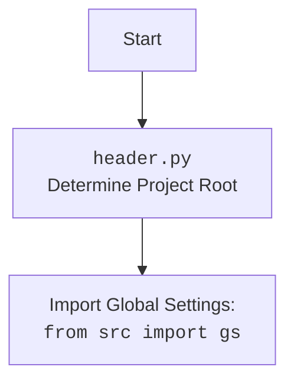

## <алгоритм>

1.  **`test_save_text_file`**:
    *   **Пример:** `test_save_text_file()`
    *   Использует `patch` для замены `Path.open`, `Path.mkdir`, и `logger` на `MagicMock` объекты.
    *   Вызывает `save_text_file("test.txt", "This is a test.")`.
    *   Проверяет, что `mock_file_open` был вызван с параметрами `w` и `encoding="utf-8"`.
    *   Проверяет, что метод `write` `mock_file_open` был вызван с параметром `"This is a test."`.
    *   Проверяет, что `mock_mkdir` был вызван один раз.

2.  **`test_read_text_file`**:
    *   **Пример:** `content = test_read_text_file()`
    *   Использует `patch` для замены `Path.open` на `MagicMock`, который возвращает `"This is a test."` при чтении.
    *   Вызывает `read_text_file("test.txt")`.
    *   Проверяет, что возвращенный контент равен `"This is a test."`.
    *   Проверяет, что `mock_file_open` был вызван с параметрами `r` и `encoding="utf-8"`.

3.  **`test_get_filenames`**:
    *   **Пример:** `filenames = test_get_filenames()`
    *   Использует `patch` для замены `Path.iterdir` на `MagicMock`, который возвращает список объектов `Path` "file1.txt", "file2.txt".
    *   Вызывает `get_filenames(Path("/some/dir"))`.
    *   Проверяет, что возвращенный список имен файлов равен `["file1.txt", "file2.txt"]`.

4.  **`test_get_directory_names`**:
    *   **Пример:** `directories = test_get_directory_names()`
    *   Использует `patch` для замены `Path.iterdir` на `MagicMock`, который возвращает список объектов `Path` "dir1", "dir2".
    *   Вызывает `get_directory_names(Path("/some/dir"))`.
    *   Проверяет, что возвращенный список имен директорий равен `["dir1", "dir2"]`.

## <mermaid>

```mermaid
flowchart TD
    subgraph file
    Start_save_text_file[<code>test_save_text_file</code> <br> Save text to file]
        Start_save_text_file --> Mock_Path_Open_write[Mock Path.open("w")<br>with encoding="utf-8"]
        Mock_Path_Open_write --> Mock_Write[Mock File.write("This is a test.")]
        Mock_Write --> Mock_Path_mkdir[Mock Path.mkdir()]
    end
    
     subgraph file
    Start_read_text_file[<code>test_read_text_file</code> <br> Read text from file]
        Start_read_text_file --> Mock_Path_Open_read[Mock Path.open("r")<br>with encoding="utf-8" <br>returns "This is a test."]
       Mock_Path_Open_read--> Assert_read_content[Assert content == "This is a test."]
    end


    subgraph file
    Start_get_filenames[<code>test_get_filenames</code> <br> Get filenames from directory]
        Start_get_filenames --> Mock_Path_iterdir[Mock Path.iterdir<br> returns list of Path "file1.txt", "file2.txt"]
        Mock_Path_iterdir --> Assert_get_filenames[Assert filenames == ["file1.txt", "file2.txt"]]
    end

    subgraph file
    Start_get_directory_names[<code>test_get_directory_names</code> <br> Get directory names from path]
        Start_get_directory_names --> Mock_Path_iterdir_dir[Mock Path.iterdir <br> returns list of Path "dir1", "dir2"]
        Mock_Path_iterdir_dir --> Assert_get_directory_names[Assert directories == ["dir1", "dir2"]]
     end


    
```



## <объяснение>

**Импорты:**

*   `import header`: Импортирует модуль `header`, который, вероятно, используется для определения корневой директории проекта и загрузки глобальных настроек. В `header.py` вероятно используется `os.path` или `pathlib` для определения корневой директории, а также он импортирует и настраивает глобальные параметры `src.gs`.
*   `import pytest`: Импортирует pytest, фреймворк для тестирования на Python. Используется для создания и запуска тестов.
*   `from unittest.mock import patch, mock_open, MagicMock`: Импортирует инструменты для мокирования из стандартной библиотеки `unittest`. `patch` используется для замены функций или методов при тестировании, `mock_open` используется для мокирования открытия файлов, а `MagicMock` — для создания фиктивных объектов.
*   `from pathlib import Path`: Импортирует класс `Path` из модуля `pathlib` для работы с путями файлов и директорий.
*   `from src.utils.file.file import save_text_file, read_text_file, get_filenames, get_directory_names`: Импортирует функции для работы с файлами из модуля `src.utils.file.file`. Это:
    *   `save_text_file`: Функция для сохранения текста в файл.
    *   `read_text_file`: Функция для чтения текста из файла.
    *   `get_filenames`: Функция для получения списка имен файлов в директории.
    *   `get_directory_names`: Функция для получения списка имен директорий в директории.

**Функции:**

*   **`test_save_text_file(mock_logger, mock_mkdir, mock_file_open)`**:
    *   **Аргументы**: `mock_logger`, `mock_mkdir`, `mock_file_open` – это мокированные объекты для `logger`, `Path.mkdir` и `Path.open` соответственно.
    *   **Назначение**: Тестирует функцию `save_text_file`. Она проверяет, что файл создается, в него записывается переданный текст, и вызывается функция создания директории.
    *   **Пример**:
        *   Вызывается `save_text_file("test.txt", "This is a test.")`.
        *   Проверяется вызов `mock_file_open` с параметрами `"w"` и `encoding="utf-8"`, а также вызов `write` с текстом `"This is a test."` и  `mock_mkdir`
*   **`test_read_text_file(mock_file_open)`**:
    *   **Аргументы**: `mock_file_open` – мокированный объект для `Path.open`.
    *   **Назначение**: Тестирует функцию `read_text_file`. Она проверяет, что текст корректно читается из файла.
    *   **Пример**:
        *   Вызывается `read_text_file("test.txt")`.
        *   Проверяется, что возвращенный контент равен `"This is a test."`, и что `mock_file_open` был вызван с параметрами `"r"` и `encoding="utf-8"`.
*   **`test_get_filenames()`**:
    *   **Аргументы**: Нет.
    *   **Назначение**: Тестирует функцию `get_filenames`. Она проверяет, что функция возвращает правильный список имен файлов из директории.
    *   **Пример**:
        *   Вызывается `get_filenames(Path("/some/dir"))`.
        *   Проверяется, что возвращенный список равен `["file1.txt", "file2.txt"]`.
*   **`test_get_directory_names()`**:
    *   **Аргументы**: Нет.
    *   **Назначение**: Тестирует функцию `get_directory_names`. Она проверяет, что функция возвращает правильный список имен директорий.
    *   **Пример**:
        *   Вызывается `get_directory_names(Path("/some/dir"))`.
        *   Проверяется, что возвращенный список равен `["dir1", "dir2"]`.

**Переменные:**
В данном коде нету значимых переменных. Все переменные используются локально в тестовых функциях.
*   `content`: Используется в `test_read_text_file` для хранения содержимого, прочитанного из файла. Тип `str`.
*   `filenames`: Используется в `test_get_filenames` для хранения списка имен файлов. Тип `list[str]`.
*   `directories`: Используется в `test_get_directory_names` для хранения списка имен директорий. Тип `list[str]`.

**Объяснение:**

Этот файл содержит тесты для функций работы с файлами, находящихся в модуле `src.utils.file.file`. Тесты используют `pytest` и `unittest.mock` для изоляции тестируемых функций от реальной файловой системы. Это позволяет проводить тесты быстро и надежно, не затрагивая реальные файлы.

*   **Использование `patch`**:
    *   `patch` используется для мокирования (замены) функций и методов на `MagicMock` объекты. Это позволяет контролировать их поведение во время теста и проверять, как они вызываются.
    *   Мокирование необходимо для того, чтобы тесты не зависели от реальной файловой системы и всегда выполнялись предсказуемо.
    *   `mock_open` специально используется для мокирования функции `open()`, позволяя имитировать чтение и запись в файлы без реального доступа к файловой системе.
*   **`MagicMock`**:
    *   `MagicMock` объекты позволяют проверять, какие методы и с какими аргументами вызывались на мокированных объектах.
    *   Это позволяет убедиться, что тестируемые функции используют файловые операции корректно.
*   **Ассерты (`assert`)**:
    *   Ассерты используются для проверки ожидаемых результатов. Если условие ассерта не выполняется, тест завершается с ошибкой.
    *   В тестах проверяется, что:
        *   Содержимое файла, прочитанное функцией `read_text_file`, соответствует ожидаемому.
        *   Списки имен файлов и директорий, возвращенные функциями `get_filenames` и `get_directory_names`, соответствуют ожидаемым.
        *   Функция `save_text_file` вызывает `Path.open`, `write`, и `mkdir` с правильными параметрами.

**Потенциальные области для улучшения:**

*   Можно добавить тесты для проверки обработки ошибок, например, когда файл не существует или нет прав доступа.
*   Можно добавить параметризованные тесты для проверки разных входных данных (например, разные пути к файлам).
*   Можно добавить больше комментариев и документации для улучшения читаемости кода.

**Взаимосвязи с другими частями проекта:**

*   Тестируемые функции находятся в модуле `src.utils.file.file`. Это указывает на то, что функции предоставляют общие утилиты для работы с файлами и используются в различных частях проекта.
*   Модуль `header` используется для определения корневой директории проекта.
*   Тесты расположены в поддиректории `_pytest` модуля `src.suppliers.aliexpress.campaign`, что говорит о том, что эти функции работы с файлами могут быть задействованы в этом модуле.