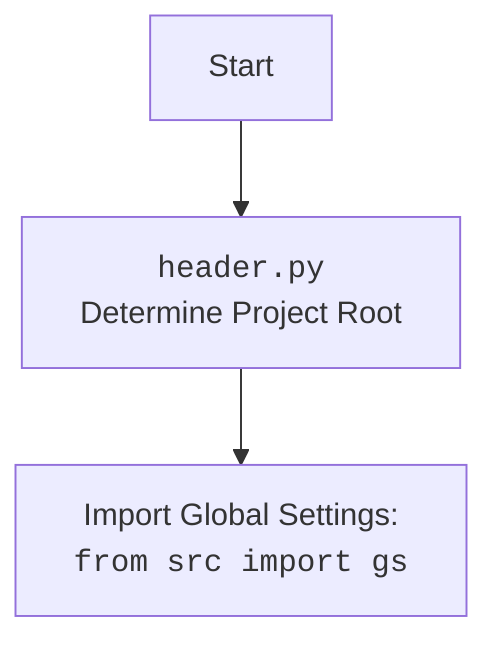
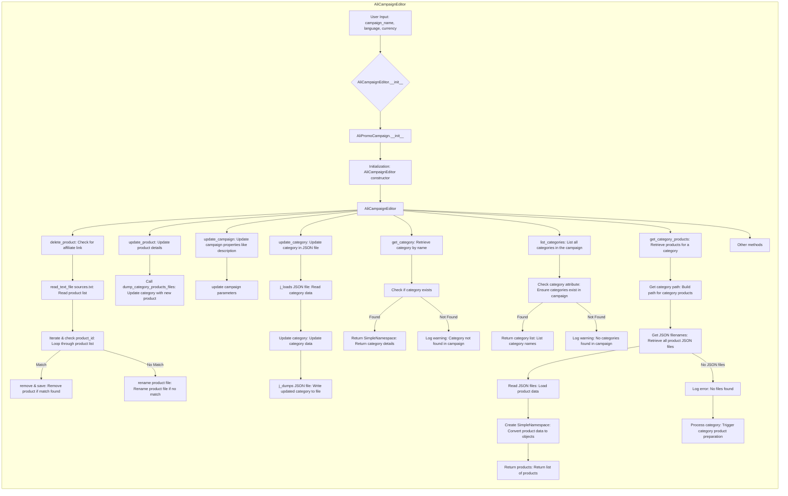

## ИНСТРУКЦИЯ:

Анализируй предоставленный код подробно и объясни его функциональность. Ответ должен включать три раздела:

1. **<алгоритм>**: Опиши рабочий процесс в виде пошаговой блок-схемы, включая примеры для каждого логического блока, и проиллюстрируй поток данных между функциями, классами или методами.
2. **<mermaid>**: Напиши код для диаграммы в формате `mermaid`, проанализируй и объясни все зависимости,
    которые импортируются при создании диаграммы.
    **ВАЖНО!** Убедитесь, что все имена переменных, используемые в диаграмме `mermaid`,
    имеют осмысленные и описательные имена. Имена переменных вроде `A`, `B`, `C`, и т.д., не допускаются!

    **Дополнительно**: Если в коде есть импорт `import header`, добавьте блок `mermaid` flowchart, объясняющий `header.py`:
    ```mermaid
    flowchart TD
        Start --> Header[<code>header.py</code><br> Determine Project Root]

        Header --> import[Import Global Settings: <br><code>from src import gs</code>]
    ```

3. **<объяснение>**: Предоставьте подробные объяснения:
   - **Импорты**: Их назначение и взаимосвязь с другими пакетами `src.`.
   - **Классы**: Их роль, атрибуты, методы и взаимодействие с другими компонентами проекта.
   - **Функции**: Их аргументы, возвращаемые значения, назначение и примеры.
   - **Переменные**: Их типы и использование.
   - Выделите потенциальные ошибки или области для улучшения.

Дополнительно, постройте цепочку взаимосвязей с другими частями проекта (если применимо).

Это обеспечивает всесторонний и структурированный анализ кода.
## Формат ответа: `.md` (markdown)
**КОНЕЦ ИНСТРУКЦИИ**

## <алгоритм>

**Общий рабочий процесс:**

1. **Инициализация `AliCampaignEditor`:**
   - Принимает имя кампании, язык и валюту.
   - Вызывает конструктор родительского класса `AliPromoCampaign` для настройки базовых параметров.
   - Создаёт экземпляр `AliCampaignEditor` для управления рекламной кампанией.

2. **Удаление товара (`delete_product`)**:
   - Принимает `product_id` товара для удаления.
   - Пытается найти `product_id` в файле `sources.txt` в директории категории.
   - Если `product_id` найден в файле `sources.txt`, удаляет строку с `product_id`.
     - Создаёт временный файл `_sources.txt`, куда сохраняет измененный список товаров.
     - Если `product_id` не найден в `sources.txt`, то ищет файл `product_id.html` в `sources`.
     - Если файл `product_id.html` найден, то переименовывает его в `product_id_.html`.
   - Логирует результаты операции.

    ```mermaid
    flowchart TD
      Start(Начало) --> Input_product_id[Ввод product_id]
      Input_product_id --> Find_sources_file{Найти sources.txt}
      Find_sources_file -- Файл найден --> Read_sources_file[Считать sources.txt]
      Read_sources_file --> Check_product_id{Проверить product_id в каждой строке}
      Check_product_id -- product_id найден --> Remove_product_id[Удалить product_id]
      Remove_product_id --> Save_temp_file[Сохранить в _sources.txt]
      Save_temp_file --> End(Конец)
      Check_product_id -- product_id не найден --> Find_product_html{Найти product_id.html}
      Find_product_html -- Файл найден --> Rename_product_html[Переименовать в product_id_.html]
      Rename_product_html --> End(Конец)
      Find_product_html -- Файл не найден --> Log_error[Лог ошибки]
      Log_error --> End(Конец)
      Find_sources_file -- Файл не найден --> Log_error2[Лог ошибки]
      Log_error2 --> End(Конец)
    ```

   *Пример*:
        ```python
            editor = AliCampaignEditor(campaign_name="Summer Sale")
            editor.delete_product("12345")
        ```

3. **Обновление товара (`update_product`)**:
   - Принимает `category_name`, `lang` и `product` (словарь с данными продукта).
   - Вызывает `dump_category_products_files` для обновления информации о продукте.

   *Пример*:
        ```python
            editor = AliCampaignEditor(campaign_name="Summer Sale")
            editor.update_product("Electronics", "EN", {"product_id": "12345", "title": "Smartphone"})
        ```

4. **Обновление кампании (`update_campaign`)**:
   - Предназначен для обновления свойств кампании, таких как описание, теги и т.д. (реализация не показана в коде).

   *Пример*:
        ```python
            editor = AliCampaignEditor(campaign_name="Summer Sale")
            editor.update_campaign()
        ```

5. **Обновление категории (`update_category`)**:
   - Принимает `json_path` (путь к JSON файлу) и `category` (SimpleNamespace объект с данными категории).
   - Читает JSON файл, обновляет данные категории и сохраняет изменения.
   - Возвращает `True`, если обновление успешно, и `False` в противном случае.

   *Пример*:
        ```python
            category = SimpleNamespace(name="New Category", description="Updated description")
            editor = AliCampaignEditor(campaign_name="Summer Sale")
            result = editor.update_category(Path("category.json"), category)
        ```

6. **Получение категории (`get_category`)**:
   - Принимает `category_name`.
   - Возвращает SimpleNamespace объект с данными категории, если категория найдена в атрибуте `campaign.category`.
   - Возвращает `None` и логирует предупреждение, если категория не найдена.

   *Пример*:
        ```python
            editor = AliCampaignEditor(campaign_name="Summer Sale")
            category = editor.get_category("Electronics")
        ```

7. **Получение списка категорий (`list_categories`)**:
   - Возвращает список названий категорий.
   - Проверяет, что у кампании есть атрибут `category` типа `SimpleNamespace`.
   - Если категорий нет, возвращает `None` и логирует предупреждение.

   *Пример*:
        ```python
            editor = AliCampaignEditor(campaign_name="Summer Sale")
            categories = editor.list_categories
        ```

8. **Получение товаров категории (`get_category_products`)**:
    - Принимает `category_name`.
    - Формирует путь к директории с JSON файлами для товаров категории.
    - Читает JSON файлы и конвертирует данные в `SimpleNamespace` объекты.
    - Возвращает список объектов `SimpleNamespace`, представляющих товары.
    - Если JSON файлы не найдены, логирует ошибку и вызывает `process_category_products` для подготовки данных.

   *Пример*:
         ```python
            products = await campaign.get_category_products("Electronics")
            print(len(products))
        ```
## <mermaid>





**Анализ зависимостей `mermaid`:**

Диаграмма показывает работу класса `AliCampaignEditor` и его взаимодействие с другими методами.

- **`AliCampaignEditor` subgraph:**
    - **A**: Ввод пользователя: имя кампании, язык, валюта.
    - **B**: Инициализация `AliCampaignEditor.__init__`.
    - **C**: Вызов конструктора родительского класса `AliPromoCampaign`.
    - **D**:  Инициализация конструктора `AliCampaignEditor`.
    - **E**: Экземпляр `AliCampaignEditor`.

- **Методы `AliCampaignEditor`:**
    - **F**: `delete_product` - метод для удаления товара.
        - **G**: Чтение файла `sources.txt`.
        - **H**: Итерация по списку товаров и проверка `product_id`.
        - **I**: Удаление и сохранение.
        - **J**: Переименование файла продукта.

    - **K**: `update_product` - метод для обновления товара.
        - **L**: Вызов `dump_category_products_files`.

    - **M**: `update_campaign` - метод для обновления свойств кампании.
        - **N**: Обновление параметров кампании.

    - **O**: `update_category` - метод для обновления категории.
        - **P**: Чтение JSON файла.
        - **Q**: Обновление данных категории.
        - **R**: Запись JSON файла.

    - **S**: `get_category` - метод для получения категории.
        - **T**: Проверка существования категории.
        - **U**: Возврат деталей категории.
        - **V**: Логирование предупреждения о ненайденной категории.

    - **W**: `list_categories` - метод для получения списка категорий.
        - **X**: Проверка атрибута категории.
        - **Y**: Возврат списка категорий.
        - **Z**: Логирование предупреждения об отсутствии категорий.

    - **AA**: `get_category_products` - метод для получения товаров категории.
        - **AB**: Получение пути к директории категории.
        - **AC**: Получение списка JSON файлов товаров.
        - **AD**: Чтение JSON файлов.
        - **AE**: Создание `SimpleNamespace` для товаров.
        - **AF**: Возврат списка товаров.
        - **AG**: Логирование ошибки об отсутствии файлов.
        - **AH**: Запуск обработки категории.

    - **AI**: Другие методы.

**Импортированные модули:**

- `asyncio`: Для асинхронного программирования.
- `re`: Для работы с регулярными выражениями.
- `shutil`: Для высокоуровневых операций с файлами.
- `datetime`: Для работы с датой и временем.
- `pathlib.Path`: Для работы с путями к файлам и каталогам.
- `types.SimpleNamespace`: Для создания простых объектов с атрибутами.
- `typing.List, Optional`: Для аннотации типов.

**Импорты из `src`:**

- `header`: (см. mermaid flowchart выше)
- `src.gs`: Глобальные настройки проекта.
- `src.suppliers.aliexpress.campaign.ali_promo_campaign`: Базовый класс для кампаний AliExpress.
- `src.suppliers.aliexpress.campaign.gsheet`: Класс для работы с Google Sheets.
- `src.suppliers.aliexpress.utils`: Вспомогательные функции для работы с AliExpress.
- `src.utils.jjson`: Функции для работы с JSON.
- `src.utils.convertors.csv`: Функции для работы с CSV.
- `src.utils.printer`: Функция для печати.
- `src.utils.file_async`: Функции для асинхронной работы с файлами.
- `src.logger.logger`: Модуль логирования.

## <объяснение>

**Импорты:**

- `asyncio`: Используется для асинхронного программирования, в частности, для функции `get_category_products`, которая работает асинхронно.
- `re`: Модуль для работы с регулярными выражениями, используется в функции `extract_prod_ids` (из `src.suppliers.aliexpress.utils`) для извлечения `product_id` из строки.
- `shutil`: Используется для высокоуровневых файловых операций, например, перемещения и переименования файлов.
- `datetime`: Модуль для работы с датой и временем, вероятно, используется в других частях проекта, но в этом коде напрямую не применяется.
- `pathlib.Path`: Модуль для работы с путями в файловой системе. Предоставляет удобный объектный интерфейс для работы с файлами и директориями.
- `types.SimpleNamespace`: Класс для создания простых объектов с произвольными атрибутами. Удобен для представления данных, так как не требует предварительного объявления структуры.
- `typing.List, Optional`: Используется для аннотации типов, что делает код более читаемым и помогает отлавливать ошибки на этапе разработки.
- `header`: Используется для определения корневой директории проекта и импорта глобальных настроек.
    ```mermaid
    flowchart TD
        Start --> Header[<code>header.py</code><br> Determine Project Root]

        Header --> import[Import Global Settings: <br><code>from src import gs</code>]
    ```
- `src.gs`: Глобальные настройки проекта.
- `src.suppliers.aliexpress.campaign.ali_promo_campaign`: Родительский класс для `AliCampaignEditor`, предоставляющий базовый функционал для работы с кампаниями.
- `src.suppliers.aliexpress.campaign.gsheet`: Класс для работы с Google Sheets, используется для синхронизации данных.
- `src.suppliers.aliexpress.utils`: Модуль с утилитами, такими как `extract_prod_ids` и `ensure_https`.
- `src.utils.jjson`: Модуль для работы с JSON, включает функции `j_loads`, `j_loads_ns` и `j_dumps` для чтения, загрузки и записи JSON данных.
- `src.utils.convertors.csv`: Модуль для конвертации CSV в dict. В данном коде не используется на прямую, но импортируется, возможно используется в других частях проекта, которые использует класс.
- `src.utils.printer`: Модуль для форматированного вывода, например, `pprint`.
- `src.utils.file_async`: Содержит асинхронные функции для работы с файлами, такие как `read_text_file`, `get_filenames_from_directory` и `get_directory_names`.
- `src.logger.logger`: Модуль для логирования, используется для записи ошибок, предупреждений и информационных сообщений.

**Класс `AliCampaignEditor`:**

- **Роль:** Управляет рекламными кампаниями, включая создание, обновление, удаление продуктов, а также работу с категориями.
- **Наследование:** Наследуется от `AliPromoCampaign`, получая доступ к его базовому функционалу.
- **Атрибуты:**
    -  `campaign` - объект SimpleNamespace, представляет данные о кампании.
    - `base_path` - путь до папки с данными кампании.
    -  `category_path` - путь до папки с данными категории.
    - `language` - язык кампании.
    - `currency` - валюта кампании.
- **Методы:**
    - `__init__`: Конструктор, инициализирует объект `AliCampaignEditor` с именем кампании, языком и валютой.
    - `delete_product`: Удаляет продукт из списка, переименовывая файл если файл найден в папке с файлами, либо удаляет строку из `sources.txt` если это список товаров.
    - `update_product`: Обновляет детали продукта в заданной категории.
    - `update_campaign`: Обновляет свойства кампании.
    - `update_category`: Обновляет данные категории в JSON файле.
    - `get_category`: Возвращает объект `SimpleNamespace` с данными категории.
    - `list_categories`: Возвращает список имен категорий.
    - `get_category_products`: Асинхронно загружает данные о товарах для конкретной категории.

**Функции:**

- `__init__(self, campaign_name: str, language: Optional[str | dict] = None, currency: Optional[str] = None)`:
  - Аргументы:
    - `campaign_name`: Имя кампании (обязательно).
    - `language`: Язык кампании (необязательно, по умолчанию `EN`).
    - `currency`: Валюта кампании (необязательно, по умолчанию `USD`).
  - Возвращаемое значение: None.
  - Назначение: Инициализирует объект `AliCampaignEditor` и вызывает конструктор родительского класса `AliPromoCampaign`.

- `delete_product(self, product_id: str, exc_info: bool = False)`:
  - Аргументы:
    - `product_id`: ID удаляемого продукта.
    - `exc_info`: Флаг, указывающий, нужно ли логировать дополнительную информацию при возникновении исключения.
  - Возвращаемое значение: None.
  - Назначение: Удаляет продукт из списка товаров или переименовывает файл продукта, если он существует.

- `update_product(self, category_name: str, lang: str, product: dict)`:
  - Аргументы:
    - `category_name`: Имя категории, в которой нужно обновить продукт.
    - `lang`: Язык кампании.
    - `product`: Словарь с данными продукта.
  - Возвращаемое значение: None.
  - Назначение: Обновляет информацию о продукте. Вызывает `dump_category_products_files` для сохранения обновленных данных.

- `update_campaign(self)`:
  - Аргументы: None.
  - Возвращаемое значение: None.
  - Назначение: Обновляет свойства кампании (реализация не приведена в коде).

- `update_category(self, json_path: Path, category: SimpleNamespace) -> bool`:
  - Аргументы:
    - `json_path`: Путь к JSON файлу.
    - `category`: Объект `SimpleNamespace` с данными категории.
  - Возвращаемое значение: `True`, если обновление успешно, `False` в противном случае.
  - Назначение: Обновляет данные категории в JSON файле.

- `get_category(self, category_name: str) -> Optional[SimpleNamespace]`:
  - Аргументы:
    - `category_name`: Имя категории.
  - Возвращаемое значение: `SimpleNamespace` объект с данными категории или `None`, если категория не найдена.
  - Назначение: Возвращает объект `SimpleNamespace` с данными категории из атрибута `campaign.category`.

- `@property list_categories(self) -> Optional[List[str]]`:
  - Аргументы: None.
  - Возвращаемое значение: Список имен категорий или `None`, если категории не найдены.
  - Назначение: Возвращает список категорий из текущей кампании.

- `async def get_category_products(self, category_name: str) -> Optional[List[SimpleNamespace]]`:
  - Аргументы:
      - `category_name`: Имя категории.
  - Возвращаемое значение: Список объектов `SimpleNamespace`, представляющих товары, или `None`, если JSON файлы не найдены.
  - Назначение: Асинхронно загружает и возвращает список товаров для заданной категории.

**Переменные:**

- `_product_id`: ID продукта, извлеченный с помощью функции `extract_prod_ids`.
- `product_path`: Путь к файлу `sources.txt` или файлу продукта.
- `prepared_product_path`: Путь к временному файлу `_sources.txt`.
- `products_list`: Список товаров, прочитанный из `sources.txt`.
- `record_id`: ID товара, извлеченный из строки.
- `data`: Данные, прочитанные из JSON файла.
- `category_path`: Путь к директории с JSON файлами товаров.
- `json_filenames`: Список JSON файлов товаров в директории.
- `product_data`: Данные о товаре, прочитанные из JSON файла.
- `product`: Объект `SimpleNamespace` с данными товара.

**Потенциальные ошибки и области для улучшения:**

-   **Обработка ошибок**: В некоторых местах используются общие исключения, которые могут затруднить отладку. Лучше использовать более конкретные исключения, и обрабатывать их отдельно для каждого блока.
-   **Улучшенная логика удаления продуктов**: Процесс удаления продукта может быть оптимизирован. Например, можно использовать set для быстрого поиска `product_id` в списке товаров.
-   **Добавление проверок**: Перед записью данных в JSON файл можно добавить проверку данных на соответствие схеме.
-   **Более подробные комментарии**: В коде не хватает комментариев, объясняющих некоторые неочевидные моменты.
-   **Дублирование логики**: Есть несколько мест, где логика кажется немного дублированной (например, при чтении и сохранении файла).
-   **Использование `os`**: Заменить `pathlib.Path` там где это возможно.

**Взаимосвязи с другими частями проекта:**

-   Класс `AliCampaignEditor` зависит от `AliPromoCampaign`, `AliCampaignGoogleSheet`, `extract_prod_ids`, `j_loads`, `j_dumps` и асинхронных функций работы с файлами.
-   Логирование ошибок и предупреждений ведется через `src.logger.logger`.
-   Глобальные настройки проекта хранятся в `src.gs`.
-   Данные для кампаний хранятся в JSON файлах, которые обрабатываются с помощью `src.utils.jjson`.
-   Данные о товарах и категориях, берутся из файлов, которые читаются с помощью асинхронных функций.

Этот анализ предоставляет полное и структурированное представление о функциональности кода и его связях с другими компонентами проекта.