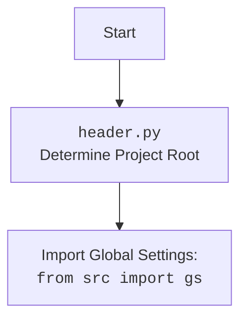

## АНАЛИЗ КОДА:

### 1. <алгоритм>

**Блок-схема:**

1. **Инициализация:**
    - Создается экземпляр класса `JupyterCampaignEditorWidgets`.
    - Устанавливается путь к директории кампаний (`campaigns_directory`).
    - Если директория не существует, выбрасывается `FileNotFoundError`.
    - Создаются выпадающие списки (`widgets.Dropdown`):
        - `campaign_name_dropdown`: для выбора имени кампании, список заполняется именами папок из `campaigns_directory` (пример: `["SummerSale", "WinterSale"]`).
        - `category_name_dropdown`: для выбора категории, изначально пустой список (пример: `[]`).
        - `language_dropdown`: для выбора языка и валюты (пример: `["EN USD", "HE ILS", "RU ILS"]`).
    - Создаются кнопки (`widgets.Button`):
        - `initialize_button`: для инициализации редактора кампании.
        - `save_button`: для сохранения кампании.
        - `show_products_button`: для показа продуктов категории.
        - `open_spreadsheet_button`: для открытия Google Sheets.
    - Устанавливаются обработчики событий для виджетов (`setup_callbacks`).
    - Запускается первичная инициализация редактора кампании (`initialize_campaign_editor(None)`).

2.  **Обработка выбора кампании (`on_campaign_name_change`)**:
    - При изменении значения `campaign_name_dropdown` вызывается эта функция.
    - Обновляется атрибут `self.campaign_name`.
    - Вызывается `update_category_dropdown` для обновления списка категорий для выбранной кампании (пример: `["Electronics", "Clothes"]`).
    - Вызывается `initialize_campaign_editor(None)` для переинициализации с новой кампанией.

3.  **Обновление списка категорий (`update_category_dropdown`)**:
    - Принимает имя кампании.
    - Строит путь к папке с категориями для этой кампании.
    - Получает список имен папок из папки категорий (пример:  `["Electronics", "Clothes"]`).
    - Обновляет список `category_name_dropdown` полученными именами.

4. **Обработка выбора категории (`on_category_change`)**:
    - При изменении значения `category_name_dropdown` вызывается эта функция.
    - Обновляется атрибут `self.category_name`.
    - Вызывается `initialize_campaign_editor(None)` для переинициализации с новой категорией.

5. **Обработка выбора языка (`on_language_change`)**:
    - При изменении значения `language_dropdown` вызывается эта функция.
    - Обновляется атрибут `self.language` и `self.currency`.
    - Вызывается `initialize_campaign_editor(None)` для переинициализации с новым языком и валютой.

6. **Инициализация редактора кампании (`initialize_campaign_editor`)**:
    - Получает выбранные значения из `campaign_name_dropdown`, `category_name_dropdown`, и `language_dropdown`.
    - Если выбрано имя кампании:
        - Обновляет список категорий (вызывает `update_category_dropdown`).
        - Создает экземпляр `AliCampaignEditor` с выбранными параметрами (кампания, язык, валюта).
        - Если выбрана категория, получает информацию о категории и продуктах для нее.
    - Если не выбрано имя кампании, выводит предупреждение в логи.

7. **Сохранение кампании (`save_campaign`)**:
    - Получает текущие значения `campaign_name`, `category_name`, `language`, и `currency` из виджетов.
    - Если выбраны имя кампании и язык:
        - Создает экземпляр `AliCampaignEditor`.
        - Сохраняет категории из Google Sheets (вызывает `save_categories_from_worksheet`).
    - Если не выбраны имя кампании или язык, выводит предупреждение в логи.

8. **Показ продуктов (`show_products`)**:
    - Получает значения `campaign_name` и `category_name`.
    - Создает экземпляр `AliCampaignEditor`.
    - Устанавливает данные для показа продуктов в Google Sheets (вызывает `set_products_worksheet`).

9. **Открытие Google Sheets (`open_spreadsheet`)**:
    - Если `campaign_editor` инициализирован:
        - Формирует URL для Google Sheets на основе `spreadsheet_id` из `campaign_editor`.
        - Открывает URL в браузере.
    - Если `campaign_editor` не инициализирован, выводит сообщение в консоль.

10. **Настройка обработчиков событий (`setup_callbacks`)**:
    - Устанавливает функции-обработчики для изменений значений виджетов и нажатий кнопок.

11. **Отображение виджетов (`display_widgets`)**:
    - Отображает все виджеты в Jupyter Notebook.
    - Инициализирует редактор кампании сразу после отображения виджетов.

### 2. <mermaid>

```mermaid
flowchart TD
    Start[Начало] --> InitializeWidgets[Инициализация виджетов: <br>JupyterCampaignEditorWidgets]
    InitializeWidgets --> CreateDropdowns[Создание выпадающих списков:<br>campaign_name_dropdown,<br>category_name_dropdown,<br>language_dropdown]
    CreateDropdowns --> CreateButtons[Создание кнопок:<br>initialize_button,<br>save_button,<br>show_products_button,<br>open_spreadsheet_button]
    CreateButtons --> SetupCallbacks[Настройка обработчиков событий (callbacks)]
    SetupCallbacks --> InitializeEditor[Первичная инициализация редактора:<br>initialize_campaign_editor(None)]
    
    InitializeEditor --> CheckCampaignName{Выбрано имя кампании?}
    CheckCampaignName -- Да --> UpdateCategoryDropdown[Обновить список категорий:<br>update_category_dropdown]
    UpdateCategoryDropdown --> CreateAliCampaignEditor[Создать экземпляр:<br>AliCampaignEditor]
    CreateAliCampaignEditor --> GetCategoryInfo{Выбрана категория?}
     GetCategoryInfo -- Да --> GetCategoryAndProducts[Получить информацию о категории и продуктах]
     GetCategoryInfo -- Нет --> EndInitializeEditor[Завершить инициализацию редактора]    
    GetCategoryAndProducts --> EndInitializeEditor
    CheckCampaignName -- Нет --> LogWarning[Вывести предупреждение в лог]
    LogWarning --> EndInitializeEditor
     
    EndInitializeEditor --> DisplayWidgets[Отобразить виджеты:<br>display_widgets]
    DisplayWidgets --> End[Конец]

    
    subgraph Обработчики событий
    	
        CampaignChange[Изменение campaign_name_dropdown] --> OnCampaignNameChange[on_campaign_name_change]
        OnCampaignNameChange --> UpdateCategoryDropdown
        OnCampaignNameChange --> ReInitializeEditor[Переинициализация редактора:<br>initialize_campaign_editor(None)]
      
        CategoryChange[Изменение category_name_dropdown] --> OnCategoryChange[on_category_change]
        OnCategoryChange --> ReInitializeEditor
     
        LanguageChange[Изменение language_dropdown] --> OnLanguageChange[on_language_change]
        OnLanguageChange --> ReInitializeEditor
        
        
        InitializeClick[Нажатие initialize_button] --> InitializeEditorCall[initialize_campaign_editor]
        
        SaveClick[Нажатие save_button] --> SaveCampaign[save_campaign]
        SaveCampaign --> CreateAliCampaignEditorSave[Создать экземпляр:<br>AliCampaignEditor]
        CreateAliCampaignEditorSave --> SaveCategories[Сохранить категории:<br>save_categories_from_worksheet]
        SaveCategories --> LogErrorSave{Ошибка?}
        LogErrorSave -- Да -->  LogSaveError[Логирование ошибки]
        LogErrorSave -- Нет --> EndSaveCampaign[Завершение сохранения кампании]
        
         ShowProductsClick[Нажатие show_products_button] --> ShowProducts[show_products]
         ShowProducts --> CreateAliCampaignEditorShow[Создать экземпляр:<br>AliCampaignEditor]
        CreateAliCampaignEditorShow --> SetProducts[Установить данные продуктов:<br>set_products_worksheet]
        SetProducts --> LogErrorShow{Ошибка?}
        LogErrorShow -- Да -->  LogShowError[Логирование ошибки]
        LogErrorShow -- Нет --> EndShowProducts[Завершение показа продуктов]
         
        OpenSpreadsheetClick[Нажатие open_spreadsheet_button] --> OpenSpreadsheet[open_spreadsheet]
       OpenSpreadsheet --> CheckEditorInit{Редактор инициализирован?}
       CheckEditorInit -- Да --> OpenBrowser[Открыть браузер с Google Sheets]
      CheckEditorInit -- Нет --> PrintConsole[Вывести сообщение в консоль]
       
        
     end
     
     style Start fill:#f9f,stroke:#333,stroke-width:2px
     style End fill:#f9f,stroke:#333,stroke-width:2px
     style ReInitializeEditor fill:#ccf,stroke:#333,stroke-width:1px
    style EndInitializeEditor fill:#ccf,stroke:#333,stroke-width:1px
     style LogWarning fill:#ffd,stroke:#333,stroke-width:1px
     style InitializeWidgets fill:#ccf,stroke:#333,stroke-width:1px
      style InitializeEditor fill:#ccf,stroke:#333,stroke-width:1px
      
       style SaveCategories fill:#ccf,stroke:#333,stroke-width:1px
      style SetProducts fill:#ccf,stroke:#333,stroke-width:1px
       style OpenBrowser fill:#ccf,stroke:#333,stroke-width:1px
       style PrintConsole fill:#ccf,stroke:#333,stroke-width:1px

```

**Объяснение `mermaid` диаграммы:**

1. **`Start`**: Начало процесса.
2.  **`InitializeWidgets`**: Инициализация виджетов класса `JupyterCampaignEditorWidgets`, включая создание выпадающих списков и кнопок.
3.  **`CreateDropdowns`**: Создание выпадающих списков для выбора кампании, категории и языка/валюты.
4.  **`CreateButtons`**: Создание кнопок для инициализации редактора, сохранения кампании, показа продуктов и открытия Google Sheets.
5.  **`SetupCallbacks`**: Настройка функций-обработчиков событий для виджетов.
6.  **`InitializeEditor`**: Вызов функции `initialize_campaign_editor` для первичной инициализации.
7. **`CheckCampaignName`**: Проверка, выбрано ли имя кампании из выпадающего списка.
8.  **`UpdateCategoryDropdown`**: Обновление выпадающего списка категорий в зависимости от выбранной кампании.
9. **`CreateAliCampaignEditor`**: Создание экземпляра класса `AliCampaignEditor`
10. **`GetCategoryInfo`**: Проверка, выбрана ли категория.
11. **`GetCategoryAndProducts`**: Получение информации о категории и продуктах.
12. **`EndInitializeEditor`**: Завершение инициализации редактора.
13.  **`LogWarning`**: Вывод предупреждения в лог, если не выбрано имя кампании.
14.  **`DisplayWidgets`**: Отображение созданных виджетов в Jupyter Notebook.
15. **`End`**: Конец процесса.

   **Subgraph "Обработчики событий"**:
16.  **`CampaignChange`**: Событие изменения значения в выпадающем списке `campaign_name_dropdown`.
17.  **`OnCampaignNameChange`**: Вызов функции-обработчика `on_campaign_name_change`.
18.  **`ReInitializeEditor`**: Повторная инициализация редактора после изменения имени кампании.
19. **`CategoryChange`**: Событие изменения значения в выпадающем списке `category_name_dropdown`.
20.  **`OnCategoryChange`**: Вызов функции-обработчика `on_category_change`.
21. **`LanguageChange`**: Событие изменения значения в выпадающем списке `language_dropdown`.
22.  **`OnLanguageChange`**: Вызов функции-обработчика `on_language_change`.
23.  **`InitializeClick`**: Событие нажатия на кнопку `initialize_button`.
24.  **`InitializeEditorCall`**: Вызов функции-обработчика `initialize_campaign_editor`.
25. **`SaveClick`**: Событие нажатия на кнопку `save_button`.
26.  **`SaveCampaign`**: Вызов функции-обработчика `save_campaign`.
27. **`CreateAliCampaignEditorSave`**: Создание экземпляра `AliCampaignEditor` при сохранении.
28. **`SaveCategories`**: Сохранение категорий из Google Sheets.
29. **`LogErrorSave`**: Проверка на ошибку во время сохранения.
30. **`LogSaveError`**: Логирование ошибки при сохранении.
31. **`EndSaveCampaign`**: Завершение процесса сохранения.
32. **`ShowProductsClick`**: Событие нажатия на кнопку `show_products_button`.
33.  **`ShowProducts`**: Вызов функции-обработчика `show_products`.
34. **`CreateAliCampaignEditorShow`**: Создание экземпляра `AliCampaignEditor` при показе продуктов.
35. **`SetProducts`**: Установка данных для отображения продуктов в Google Sheets.
36. **`LogErrorShow`**: Проверка на ошибку во время показа продуктов.
37. **`LogShowError`**: Логирование ошибки при показе продуктов.
38. **`EndShowProducts`**: Завершение процесса показа продуктов.
39. **`OpenSpreadsheetClick`**: Событие нажатия на кнопку `open_spreadsheet_button`.
40.  **`OpenSpreadsheet`**: Вызов функции-обработчика `open_spreadsheet`.
41. **`CheckEditorInit`**: Проверка, был ли инициализирован редактор.
42. **`OpenBrowser`**: Открытие Google Sheets в браузере.
43. **`PrintConsole`**: Вывод сообщения в консоль, если редактор не инициализирован.

**Импорты, используемые в диаграмме `mermaid`**:

   -   `JupyterCampaignEditorWidgets`: Основной класс, создающий виджеты.
    -   `AliCampaignEditor`: Класс, управляющий кампанией AliExpress.
    -   `widgets`: Модуль из `ipywidgets`, предоставляющий виджеты Jupyter.
    -   `logger`: Модуль для логирования событий и ошибок.
    -   `display`: Модуль из `IPython.display` для отображения виджетов.
     -  `webbrowser`: Модуль для открытия URL в браузере.
   

Дополнительно:



### 3. <объяснение>

**Импорты:**

-   `types`: Импортируется `SimpleNamespace` для создания простых объектов с атрибутами (используется для представления категорий и продуктов).
-   `header`:  Предположительно, используется для определения корневой директории проекта и импорта глобальных настроек. Взаимодействует с остальными модулями через общие настройки `gs`.
-   `pathlib`:  Используется для работы с путями файловой системы.
-   `ipywidgets`:  Библиотека для создания интерактивных виджетов в Jupyter Notebook.  Используется для создания выпадающих списков и кнопок.
-   `IPython.display`:  Используется для отображения виджетов в Jupyter Notebook.
-   `webbrowser`:  Используется для открытия URL (Google Sheets) в браузере.
-    `src`: Пакет, содержащий основные модули проекта.
-   `src.gs`:  Глобальные настройки проекта, доступные через импорт `from src import gs`.
-   `src.suppliers.aliexpress.campaign`:  Модуль, содержащий класс `AliCampaignEditor` для управления кампаниями AliExpress.
-   `src.suppliers.aliexpress.utils`: Содержит модуль `locales` для хранения информации о языках и валютах.
-   `src.utils.printer`:  Модуль для форматированного вывода данных.
-   `src.logger.logger`: Модуль для логирования событий и ошибок.

**Классы:**

-   `JupyterCampaignEditorWidgets`:
    -   **Роль:**  Предоставляет интерфейс в виде Jupyter виджетов для управления кампаниями AliExpress.
    -   **Атрибуты:**
        -   `language (str)`: Выбранный язык кампании.
        -   `currency (str)`:  Выбранная валюта кампании.
        -   `campaign_name (str)`:  Выбранное имя кампании.
        -   `category_name (str)`: Выбранное имя категории.
        -   `category (SimpleNamespace)`: Информация о выбранной категории.
        -   `campaign_editor (AliCampaignEditor)`: Экземпляр редактора кампании.
        -   `products (list[SimpleNamespace])`:  Список продуктов в выбранной категории.
        -   `campaigns_directory (str)`:  Путь к директории с кампаниями.
        -   `campaign_name_dropdown (widgets.Dropdown)`: Выпадающий список для выбора имени кампании.
        -   `category_name_dropdown (widgets.Dropdown)`: Выпадающий список для выбора категории.
        -   `language_dropdown (widgets.Dropdown)`:  Выпадающий список для выбора языка и валюты.
        -   `initialize_button (widgets.Button)`: Кнопка для инициализации редактора кампании.
        -   `save_button (widgets.Button)`: Кнопка для сохранения кампании.
        -   `show_products_button (widgets.Button)`: Кнопка для показа продуктов.
        -  `open_spreadsheet_button (widgets.Button)`: Кнопка для открытия Google Sheets.
    -   **Методы:**
        -   `__init__`: Инициализирует виджеты, настраивает обработчики событий и инициализирует редактор кампании.
        -    `initialize_campaign_editor`: Инициализирует или переинициализирует редактор кампании на основе выбранных значений.
        -   `update_category_dropdown`: Обновляет список категорий в выпадающем списке на основе выбранной кампании.
        -   `on_campaign_name_change`: Обрабатывает изменение выбранной кампании.
        -   `on_category_change`: Обрабатывает изменение выбранной категории.
        -   `on_language_change`:  Обрабатывает изменение выбранного языка и валюты.
        -   `save_campaign`:  Сохраняет изменения в кампании.
        -   `show_products`:  Отображает продукты в выбранной категории.
        -   `open_spreadsheet`: Открывает Google Sheets с данными кампании.
        -   `setup_callbacks`: Устанавливает обработчики событий для виджетов.
        -   `display_widgets`: Отображает все виджеты в Jupyter Notebook.
    -   **Взаимодействие:**
        -   Взаимодействует с `AliCampaignEditor` для выполнения операций с кампаниями AliExpress.
        -   Использует `ipywidgets` для создания интерактивных элементов интерфейса.
        -   Обращается к глобальным настройкам `gs` для доступа к путям и конфигурации.

**Функции:**

-   `initialize_campaign_editor(self, _)`:
    -   **Аргументы:** `_` (игнорируется, требуется для обратного вызова кнопки).
    -   **Возвращаемое значение:** `None`.
    -   **Назначение:**  Инициализирует `AliCampaignEditor` на основе выбранных кампании, категории, языка и валюты, а также получает данные о категории и продуктах.
    -   **Пример:**  При нажатии на кнопку "Initialize Campaign Editor" вызывается эта функция и создает экземпляр `AliCampaignEditor` с выбранными параметрами.
-   `update_category_dropdown(self, campaign_name: str)`:
    -   **Аргументы:** `campaign_name (str)`: Имя кампании.
    -   **Возвращаемое значение:** `None`.
    -   **Назначение:** Обновляет содержимое выпадающего списка категорий на основе выбранной кампании, читая имена директорий из папки `/campaign_name/category`.
    -   **Пример:** `update_category_dropdown("SummerSale")` загрузит имена категорий для кампании "SummerSale" в выпадающий список `category_name_dropdown`.
-   `on_campaign_name_change(self, change: dict[str, str])`:
    -   **Аргументы:** `change (dict[str, str])`: Словарь с информацией об изменении значения виджета (содержит ключ `new`).
    -   **Возвращаемое значение:** `None`.
    -   **Назначение:** Обрабатывает изменение выбора в списке кампаний. Обновляет атрибут `self.campaign_name`, вызывает `update_category_dropdown`, и перезапускает `initialize_campaign_editor`.
    -   **Пример:**  При выборе "WinterSale" в списке кампаний вызывается эта функция и обновит атрибут `self.campaign_name`, загрузит категории для "WinterSale", и переинициализирует редактор.
-   `on_category_change(self, change: dict[str, str])`:
    -   **Аргументы:** `change (dict[str, str])`: Словарь с информацией об изменении значения виджета (содержит ключ `new`).
    -   **Возвращаемое значение:** `None`.
    -   **Назначение:** Обрабатывает изменение выбора в списке категорий. Обновляет атрибут `self.category_name` и перезапускает `initialize_campaign_editor`.
    -   **Пример:** При выборе категории "Electronics" вызывается эта функция и обновит атрибут `self.category_name` и переинициализирует редактор.
-    `on_language_change(self, change: dict[str, str])`:
    -   **Аргументы:** `change (dict[str, str])`: Словарь с информацией об изменении значения виджета (содержит ключ `new`).
    -   **Возвращаемое значение:** `None`.
    -   **Назначение:** Обрабатывает изменение выбора языка/валюты. Обновляет `self.language` и `self.currency` и перезапускает `initialize_campaign_editor`.
    -   **Пример:** При выборе "RU ILS" вызывается эта функция и обновит `self.language` = "RU", и `self.currency` = "ILS" и переинициализирует редактор.
-   `save_campaign(self, _)`:
    -   **Аргументы:**  `_` (игнорируется, требуется для обратного вызова кнопки).
    -   **Возвращаемое значение:** `None`.
    -   **Назначение:**  Сохраняет данные кампании через `AliCampaignEditor` если выбраны кампания и язык/валюта.
    -   **Пример:** При нажатии кнопки сохранения вызывается эта функция.
-   `show_products(self, _)`:
    -   **Аргументы:** `_` (игнорируется, требуется для обратного вызова кнопки).
    -   **Возвращаемое значение:** `None`.
    -   **Назначение:** Отображает продукты в Google Sheets.
    -   **Пример:** При нажатии кнопки "Show Products" вызывается эта функция и вызывает метод `set_products_worksheet` у `AliCampaignEditor`.
-   `open_spreadsheet(self, _)`:
    -   **Аргументы:** `_` (игнорируется, требуется для обратного вызова кнопки).
    -   **Возвращаемое значение:** `None`.
    -   **Назначение:** Открывает Google Sheets в браузере.
    -   **Пример:** При нажатии кнопки "Open Google Spreadsheet" вызывается эта функция и открывает браузер.
-   `setup_callbacks(self)`:
    -   **Аргументы:**  `None`.
    -   **Возвращаемое значение:** `None`.
    -   **Назначение:** Устанавливает обратные вызовы (callbacks) для виджетов, связывая их с соответствующими функциями.
    -   **Пример:** Вызывается в конструкторе класса и устанавливает обработчики событий для каждого виджета.
-   `display_widgets(self)`:
    -   **Аргументы:** `None`.
    -   **Возвращаемое значение:** `None`.
    -   **Назначение:** Отображает все виджеты на экране.
    -   **Пример:** Вызывается для отображения пользовательского интерфейса в Jupyter Notebook.

**Переменные:**

-   `language (str)`:  Хранит выбранный язык кампании.
-   `currency (str)`:  Хранит выбранную валюту кампании.
-   `campaign_name (str)`:  Хранит имя выбранной кампании.
-   `category_name (str)`: Хранит имя выбранной категории.
-   `category (SimpleNamespace)`:  Хранит информацию о выбранной категории (включая название, и другие свойства).
-   `campaign_editor (AliCampaignEditor)`: Хранит экземпляр класса `AliCampaignEditor`.
-   `products (list[SimpleNamespace])`: Хранит список продуктов в выбранной категории.
-   `campaigns_directory (Path)`: Хранит путь к директории кампаний.
-   `campaign_name_dropdown (widgets.Dropdown)`: Виджет для выбора имени кампании.
-   `category_name_dropdown (widgets.Dropdown)`: Виджет для выбора категории.
-   `language_dropdown (widgets.Dropdown)`: Виджет для выбора языка и валюты.
-   `initialize_button (widgets.Button)`: Виджет кнопки инициализации.
-   `save_button (widgets.Button)`: Виджет кнопки сохранения.
-   `show_products_button (widgets.Button)`: Виджет кнопки показа продуктов.
-   `open_spreadsheet_button (widgets.Button)`: Виджет кнопки открытия Google Sheets.

**Потенциальные ошибки и области для улучшения:**

-   **Обработка ошибок**: В коде есть блоки `try...except`, но более детальная обработка ошибок могла бы повысить надежность. Например, можно выводить более информативные сообщения пользователю при ошибках.
-   **Валидация вводимых данных**: Код полагается на то, что пользователи выбирают значения из выпадающих списков, однако, необходимо добавить дополнительную валидацию и проверку данных.
-    **Зависимости**: `AliCampaignEditor` создает зависимость, необходимо проанализировать его методы.
-   **Тестирование**:  Необходимо написать юнит тесты для класса `JupyterCampaignEditorWidgets` и его методов.
-   **Улучшение интерфейса**: Пользовательский интерфейс может быть улучшен путем добавления дополнительных виджетов, таких как индикатор загрузки, прогресс сохранения, а также более подробной информацией о статусе операции.

**Цепочка взаимосвязей с другими частями проекта:**

1.  **`header.py`**:  Определяет корневую директорию проекта, что необходимо для доступа к другим модулям и данным.
2.  **`src/gs`**:  Глобальные настройки, используемые для доступа к путям, конфигурациям и другим глобальным параметрам проекта.
3.  **`src.suppliers.aliexpress.campaign.AliCampaignEditor`**: Предоставляет функциональность для работы с кампаниями AliExpress, используется для инициализации, сохранения, и получения данных о кампаниях.
4.  **`src.suppliers.aliexpress.utils.locales`**: Используется для хранения данных о языках и валютах, используемых в кампаниях AliExpress.
5.  **`src.utils.printer`**: Используется для вывода данных в отформатированном виде.
6.  **`src.logger.logger`**:  Используется для логирования событий и ошибок, что обеспечивает более удобную отладку и мониторинг работы приложения.
7.  **`ipywidgets`**: Используется для создания интерактивного интерфейса в Jupyter Notebook.
8.  **`IPython.display`**:  Используется для отображения виджетов в Jupyter Notebook.
9.  **`webbrowser`**:  Используется для открытия Google Sheets в браузере.

Этот анализ обеспечивает полное понимание функциональности, взаимосвязей и потенциальных областей для улучшения в коде.