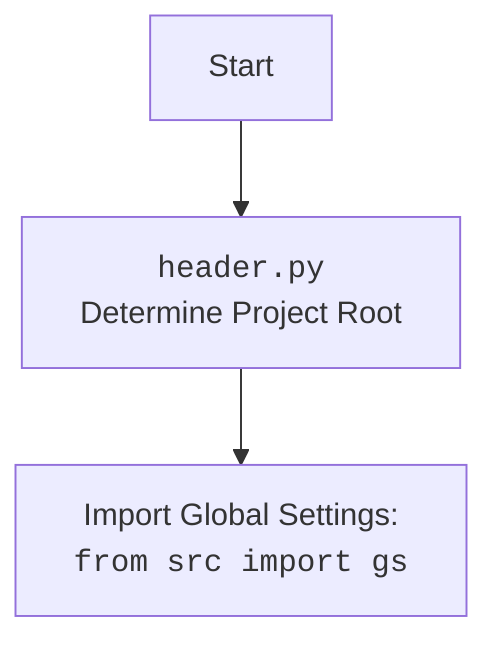

## <алгоритм>

**1. `ProductHTMLGenerator.set_product_html(product, category_path)`**
   - **Вход:** `product` (объект SimpleNamespace с данными о продукте) и `category_path` (путь к каталогу категории).
   - **Действие:**
     -   Извлекает имя категории из `category_path`.
     -   Формирует путь к HTML-файлу продукта: `category_path/html/{product.product_id}.html`.
     -   Создает HTML-шаблон, используя данные из `product`:
         - Заголовок страницы: `product.product_title`
         - Изображение продукта: `product.local_image_path`
         - Цена: `product.target_sale_price`, `product.target_sale_price_currency`
         - Оригинальная цена: `product.target_original_price`, `product.target_original_price_currency`
         - Категория: `product.second_level_category_name`
         - Ссылка на покупку: `product.promotion_link`
     -   Сохраняет HTML-содержимое в файл.
   - **Выход:** HTML-файл продукта.

**Пример:**
   - **Вход:**
     ```python
     product = SimpleNamespace(
        product_id = '12345',
        product_title='Sample Product',
        local_image_path='/path/to/image.jpg',
        target_sale_price='25',
        target_sale_price_currency='$',
        target_original_price='30',
        target_original_price_currency='$',
        second_level_category_name='Electronics',
        promotion_link='https://example.com/buy'
    )
    category_path = '/path/to/category'
    ```
   - **Действие:** Создаст файл `/path/to/category/html/12345.html` с HTML-кодом продукта.

**2. `CategoryHTMLGenerator.set_category_html(products_list, category_path)`**
    - **Вход:** `products_list` (список объектов SimpleNamespace с данными о продуктах, или отдельный объект SimpleNamespace) и `category_path` (путь к каталогу категории).
    - **Действие:**
      -   Преобразует `products_list` в список, если это не список.
      -   Извлекает имя категории из `category_path`.
      -   Формирует путь к HTML-файлу категории: `category_path/html/index.html`.
      -   Создает HTML-шаблон, включая:
          -   Заголовок страницы: `category_name`
          -   Цикл по `products_list` для генерации карточек продуктов:
              - Изображение продукта: `product.local_image_path`
              - Название продукта: `product.product_title`
              - Цена: `product.target_sale_price`, `product.target_sale_price_currency`
              - Оригинальная цена: `product.target_original_price`, `product.target_original_price_currency`
              - Категория: `product.second_level_category_name`
              - Ссылка на покупку: `product.promotion_link`
      -   Сохраняет HTML-содержимое в файл.
    - **Выход:** HTML-файл категории со списком продуктов.

**Пример:**
   - **Вход:**
     ```python
    products = [
        SimpleNamespace(
            product_title='Product 1',
            local_image_path='/path/to/img1.jpg',
            target_sale_price='20',
            target_sale_price_currency='$',
            target_original_price='25',
            target_original_price_currency='$',
            second_level_category_name='Electronics',
            promotion_link='https://example.com/buy1'
        ),
        SimpleNamespace(
            product_title='Product 2',
            local_image_path='/path/to/img2.jpg',
            target_sale_price='30',
            target_sale_price_currency='$',
            target_original_price='35',
            target_original_price_currency='$',
            second_level_category_name='Electronics',
            promotion_link='https://example.com/buy2'
        )
    ]
    category_path = '/path/to/category'
    ```
   - **Действие:** Создаст файл `/path/to/category/html/index.html` с HTML-кодом категории и списками продуктов.

**3. `CampaignHTMLGenerator.set_campaign_html(categories, campaign_path)`**
    - **Вход:** `categories` (список имен категорий) и `campaign_path` (путь к каталогу кампании).
    - **Действие:**
      -   Формирует путь к HTML-файлу кампании: `campaign_path/index.html`.
      -   Создает HTML-шаблон:
          -   Заголовок страницы: "Campaign Overview".
          -   Цикл по `categories` для создания ссылок на страницы категорий.
      -   Сохраняет HTML-содержимое в файл.
    - **Выход:** HTML-файл кампании со списком категорий.

**Пример:**
   - **Вход:**
     ```python
    categories = ['Category1', 'Category2']
    campaign_path = '/path/to/campaign'
    ```
   - **Действие:** Создаст файл `/path/to/campaign/index.html` с HTML-кодом обзора кампании и ссылками на категории.

## <mermaid>

```mermaid
flowchart TD
    StartProductGenerator[Start: <code>ProductHTMLGenerator.set_product_html</code>] --> ExtractCategoryNameProduct[Extract Category Name]
    ExtractCategoryNameProduct --> CreateHTMLPathProduct[Create HTML Path: <code>{category_path}/html/{product.product_id}.html</code>]
    CreateHTMLPathProduct --> GenerateHTMLContentProduct[Generate HTML Content with Product Data]
    GenerateHTMLContentProduct --> SaveHTMLFileProduct[Save HTML File: <code>save_text_file</code>]
    SaveHTMLFileProduct --> EndProductGenerator[End: HTML file saved]

    StartCategoryGenerator[Start: <code>CategoryHTMLGenerator.set_category_html</code>] --> CheckProductsListType[Check if <code>products_list</code> is a list]
    CheckProductsListType -- Yes --> ExtractCategoryNameCategory[Extract Category Name]
    CheckProductsListType -- No --> ConvertProductsListToList[Convert <code>products_list</code> to List]
    ConvertProductsListToList --> ExtractCategoryNameCategory
    ExtractCategoryNameCategory --> CreateHTMLPathCategory[Create HTML Path: <code>{category_path}/html/index.html</code>]
    CreateHTMLPathCategory --> GenerateHTMLContentCategory[Generate HTML Content with Product List]
    GenerateHTMLContentCategory --> SaveHTMLFileCategory[Save HTML File: <code>save_text_file</code>]
    SaveHTMLFileCategory --> EndCategoryGenerator[End: HTML file saved]

    StartCampaignGenerator[Start: <code>CampaignHTMLGenerator.set_campaign_html</code>] --> CreateHTMLPathCampaign[Create HTML Path: <code>{campaign_path}/index.html</code>]
    CreateHTMLPathCampaign --> GenerateHTMLContentCampaign[Generate HTML Content with Categories]
    GenerateHTMLContentCampaign --> SaveHTMLFileCampaign[Save HTML File: <code>save_text_file</code>]
    SaveHTMLFileCampaign --> EndCampaignGenerator[End: HTML file saved]
    
    Start --> StartProductGenerator
    Start --> StartCategoryGenerator
    Start --> StartCampaignGenerator
    
    classDef datafill fill:#f9f,stroke:#333,stroke-width:2px
    
    class StartProductGenerator,StartCategoryGenerator,StartCampaignGenerator,EndProductGenerator,EndCategoryGenerator,EndCampaignGenerator datafill
```

## <объяснение>

**Импорты:**

-   `import header`: Этот импорт, вероятно, используется для определения корневого каталога проекта и настройки глобальных переменных. Он необходим для правильного импорта других модулей внутри пакета `src`. Подробности можно посмотреть в файле `header.py`
-   `from pathlib import Path`: Используется для работы с путями файловой системы в кросс-платформенном режиме, облегчает конструирование путей и манипуляции с ними.
-   `from types import SimpleNamespace`: Используется для создания простых объектов, которые могут содержать атрибуты. Это позволяет удобно передавать данные о продуктах.
-   `from src.utils.file import save_text_file`: Импортируется функция для сохранения текстового содержимого (HTML) в файл. Это часть утилитарного пакета `src.utils.file`.
-   `import html`: Используется для экранирования HTML-спецсимволов, чтобы предотвратить инъекции и обеспечить корректное отображение текста.

**Классы:**

1.  **`ProductHTMLGenerator`**:
    -   **Роль**: Генерирует HTML-страницы для отдельных продуктов.
    -   **Методы**:
        -   `set_product_html(product: SimpleNamespace, category_path: str | Path)`:
            -   **Аргументы**:
                -   `product`: SimpleNamespace объект, содержащий данные продукта (id, название, изображение, цены, категория, ссылка на покупку).
                -   `category_path`: Путь к каталогу категории.
            -   **Назначение**: Создает и сохраняет HTML-файл для одного продукта в указанной категории.
            -   **Пример**: `ProductHTMLGenerator.set_product_html(product_data, '/path/to/category')`
2.  **`CategoryHTMLGenerator`**:
    -   **Роль**: Генерирует HTML-страницу для списка продуктов внутри категории.
    -   **Методы**:
        -   `set_category_html(products_list: list[SimpleNamespace] | SimpleNamespace, category_path: str | Path)`:
            -   **Аргументы**:
                -   `products_list`: Список объектов `SimpleNamespace`, каждый из которых содержит данные продукта, или отдельный SimpleNamespace.
                -   `category_path`: Путь к каталогу категории.
            -   **Назначение**: Создает и сохраняет HTML-файл со списком продуктов в указанной категории.
            -   **Пример**: `CategoryHTMLGenerator.set_category_html(list_of_products, '/path/to/category')`
3.  **`CampaignHTMLGenerator`**:
    -   **Роль**: Генерирует HTML-страницу, обозревающую все категории в кампании.
    -   **Методы**:
        -   `set_campaign_html(categories: list[str], campaign_path: str | Path)`:
            -   **Аргументы**:
                -   `categories`: Список названий категорий.
                -   `campaign_path`: Путь к каталогу кампании.
            -   **Назначение**: Создает и сохраняет HTML-файл со списком ссылок на категории в кампании.
            -   **Пример**: `CampaignHTMLGenerator.set_campaign_html(list_of_categories, '/path/to/campaign')`

**Функции:**

-   `save_text_file(content: str, file_path: Path)` (из `src.utils.file`):
    -   **Аргументы**: `content` (текстовое содержимое для сохранения) и `file_path` (путь к файлу).
    -   **Назначение**: Сохраняет текстовый контент в файл по указанному пути.
    -   **Пример**: `save_text_file(html_string, Path('/path/to/file.html'))`

**Переменные:**

-   `product`: Объект `SimpleNamespace`, содержащий данные об одном продукте, используемый в `ProductHTMLGenerator`.
-   `products_list`: Список объектов `SimpleNamespace` (или отдельный SimpleNamespace), содержащих данные о продуктах, используемый в `CategoryHTMLGenerator`.
-   `category_path`: Путь к каталогу, в котором сохраняются файлы HTML, используется в `ProductHTMLGenerator`, `CategoryHTMLGenerator`
-   `campaign_path`: Путь к каталогу, в котором сохраняются файлы HTML кампании, используется в `CampaignHTMLGenerator`
-   `categories`: Список названий категорий, используемый в `CampaignHTMLGenerator`.
-   `html_path`: Путь к HTML файлу, формируется внутри каждого класса.
-   `html_content`: Строка, содержащая HTML контент.

**Потенциальные ошибки и области для улучшения:**

-   **Жестко закодированные стили:** Стили CSS (bootstrap и `styles.css`) подключены через ссылки. Лучше интегрировать их в проект и использовать сборщик для лучшего управления.
-   **Отсутствие обработки ошибок:**  Нет проверки на существование директории, куда сохраняются файлы, нет обработки ошибок при создании файлов.
-   **Отсутствие тестирования**: Нет тестов на корректность формирования HTML кода.
-   **Не используется шаблонизатор**:  Для сложной логики генерации HTML лучше использовать шаблонизатор, например Jinja2. Это сделает код более читаемым и поддерживаемым.
-   **Повторяющийся код**: Код создания HTML шапки и подвала повторяется в каждом классе, это можно вынести в отдельную функцию.

**Взаимосвязи с другими частями проекта:**

-   `header.py`: Определяет корневой каталог проекта и загружает глобальные настройки, влияющие на импорты других модулей в проекте.
-   `src.utils.file.save_text_file`: Предоставляет утилитарную функцию для сохранения HTML в файл, что делает код более модульным.
-   Данные о продуктах (объекты `SimpleNamespace`) должны быть получены из других частей проекта (например, после парсинга данных с AliExpress), этот код не отвечает за получение этих данных.

В целом, код предоставляет базовый функционал для генерации HTML-страниц, но имеет потенциал для улучшения в плане гибкости, переиспользуемости и обработки ошибок.