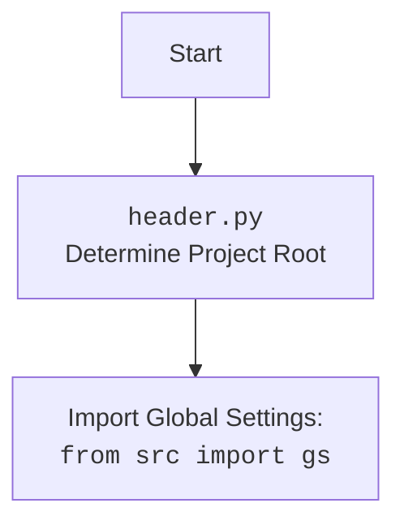

## <алгоритм>

1. **Импорт библиотек и настройка окружения**:
   - Импортируются необходимые модули и библиотеки (`header`, `argparse`, `copy`, `pathlib`, `typing`, `src.gs`, `AliCampaignEditor`, `locales`, `pprint`, `get_directory_names`, `j_loads_ns`, `logger`).
   - Определяется путь к директории с кампаниями (`campaigns_directory`).

2. **Функция `process_campaign_category`**:
   - **Входные данные**: `campaign_name` (название кампании), `category_name` (название категории), `language` (язык), `currency` (валюта).
   - **Действие**: Создает экземпляр класса `AliCampaignEditor` с заданными параметрами и вызывает метод `process_campaign_category` для обработки категории.
   - **Выходные данные**: `List[str]` (список заголовков продуктов в категории).
   - **Пример**: `process_campaign_category("summer_sale", "electronics", "EN", "USD")` возвращает список заголовков товаров из категории "electronics" для кампании "summer_sale" на английском языке и в долларах США.

3. **Функция `process_campaign`**:
   - **Входные данные**: `campaign_name` (название кампании), `language` (язык, опционально), `currency` (валюта, опционально), `campaign_file` (путь к файлу кампании, опционально).
   - **Действие**:
     - Формирует список локалей (`_l`) для обработки. Если указаны `language` и `currency`, то список будет содержать только их. Иначе — все локали из `locales`.
     - Проходит по всем локалям в списке `_l`.
     - Создает экземпляр `AliCampaignEditor` для каждой локали.
     - Вызывает метод `process_campaign` для каждого экземпляра `AliCampaignEditor`.
   - **Выходные данные**: `bool` (всегда `True`, предполагается успешная обработка).
   - **Пример**: `process_campaign("summer_sale", "EN", "USD")` обработает кампанию "summer_sale" для английского языка и доллара США.

4. **Функция `process_all_campaigns`**:
    - **Входные данные**: `language` (язык, опционально), `currency` (валюта, опционально).
    - **Действие**:
        - Определяет список локалей `_l`. Если `language` и `currency` не переданы, то обрабатывает все возможные локали.
        - Получает список всех директорий кампаний с помощью `get_directory_names`.
        - Для каждой директории (кампании) и каждой локали создает и запускает обработку через `AliCampaignEditor`.
    - **Выходные данные**: `None`.
    - **Пример**: `process_all_campaigns("EN", "USD")` обработает все кампании для английского языка и доллара США.

5.  **Функция `main_process`**:
    - **Входные данные**: `campaign_name` (название кампании), `categories` (список категорий или строка, если их нет), `language` (язык, опционально), `currency` (валюта, опционально).
    - **Действие**:
        - Определяет список локалей для обработки. Если переданы `language` и `currency`, то будет обрабатываться только одна локаль, иначе — все локали из `locales`.
        - Если категории указаны, то вызывает `process_campaign_category` для каждой категории и локали.
        - Если категории не указаны, вызывает `process_campaign` для обработки всей кампании для каждой локали.
    - **Выходные данные**: `None`.
    - **Пример**:
        - `main_process("summer_sale", ["electronics"], "EN", "USD")` обработает категорию "electronics" для кампании "summer_sale" на английском языке и в долларах США.
        - `main_process("summer_sale", [], "EN", "USD")` обработает всю кампанию "summer_sale" на английском языке и в долларах США.

6. **Функция `main`**:
   - **Действие**:
     - Инициализирует парсер аргументов командной строки.
     - Получает значения аргументов: `campaign_name`, `categories`, `language`, `currency`, `all`.
     - Если установлен флаг `--all`, то вызывает `process_all_campaigns`.
     - Иначе вызывает `main_process` с полученными аргументами.
   - **Выходные данные**: `None`.
   - **Пример**: При запуске скрипта с аргументами `summer_sale -c electronics -l EN -cu USD` будет вызвана функция `main_process` для обработки категории "electronics" кампании "summer_sale" для английского языка и доллара США.

7. **Блок `if __name__ == "__main__":`**:
   - **Действие**:
     - Вызывает функцию `main` для запуска обработки кампаний.

## <mermaid>

```mermaid
flowchart TD
    Start[Start] --> ParseArgs[Parse Command Line Arguments]
    ParseArgs --> CheckAllFlag{Is --all Flag Set?}
    CheckAllFlag -- Yes --> ProcessAllCampaigns[process_all_campaigns()]
    CheckAllFlag -- No --> ProcessCampaign[main_process()]
    ProcessAllCampaigns --> End[End]
    ProcessCampaign --> End
    
    subgraph main_process
        A[main_process()] --> DetermineLocales[Determine locales]
        DetermineLocales --> CheckCategories{Are categories provided?}
        CheckCategories -- Yes --> ProcessCategoriesLoop[Loop through categories]
        CheckCategories -- No --> ProcessCampaignFull[process_campaign()]
        ProcessCategoriesLoop --> ProcessCategory[process_campaign_category()]
        ProcessCategory --> ProcessCategoriesLoop
        ProcessCategoriesLoop --> ProcessCampaignFull
        ProcessCampaignFull --> B[return]
    end
    subgraph process_campaign
        C[process_campaign()] --> CreateLocalesList[Create locales list]
        CreateLocalesList --> LoopLocales[Loop through locales]
        LoopLocales --> CreateEditor[Create AliCampaignEditor]
        CreateEditor --> ProcessEditorCampaign[editor.process_campaign()]
        ProcessEditorCampaign --> LoopLocales
        LoopLocales --> D[return True]
    end
     subgraph process_campaign_category
        E[process_campaign_category()] --> CreateEditorCat[Create AliCampaignEditor]
        CreateEditorCat --> ProcessCategoryCat[editor.process_campaign_category()]
        ProcessCategoryCat --> F[return List[str] product titles]
     end
    subgraph process_all_campaigns
    G[process_all_campaigns()] --> DetermineAllLocales[Determine all locales or given]
        DetermineAllLocales --> GetCampaignDirs[get_directory_names()]
        GetCampaignDirs --> LoopCampaignDirs[Loop through all campaign directories]
        LoopCampaignDirs --> CreateEditorAll[Create AliCampaignEditor]
        CreateEditorAll --> ProcessEditorCampaignAll[editor.process_campaign()]
        ProcessEditorCampaignAll --> LoopCampaignDirs
         LoopCampaignDirs --> H[return None]
        
    end
    Start --> main_process
     main_process --> process_campaign
     main_process --> process_campaign_category
     process_all_campaigns --> AliCampaignEditor
     process_campaign --> AliCampaignEditor
     process_campaign_category --> AliCampaignEditor

```



**Анализ зависимостей Mermaid:**

1.  **`Start`**: Начало выполнения скрипта.
2.  **`ParseArgs`**: Парсинг аргументов командной строки, таких как имя кампании, категории, язык и валюта.
3.  **`CheckAllFlag`**: Проверка, установлен ли флаг `--all` для обработки всех кампаний.
4.  **`ProcessAllCampaigns`**: Вызов функции `process_all_campaigns()`, если установлен флаг `--all`.
5.  **`ProcessCampaign`**: Вызов функции `main_process()`, если флаг `--all` не установлен.
6.  **`End`**: Завершение выполнения скрипта.
7.  **`main_process` subgraph:**
    *   **`A`**: Начало выполнения функции `main_process()`.
    *   **`DetermineLocales`**: Определение локалей для обработки (одна или все).
    *   **`CheckCategories`**: Проверка, были ли указаны категории для обработки.
    *   **`ProcessCategoriesLoop`**: Цикл для обработки каждой указанной категории.
    *   **`ProcessCategory`**: Вызов `process_campaign_category()` для обработки отдельной категории.
    *   **`ProcessCampaignFull`**: Вызов `process_campaign()` для обработки всей кампании.
    *   **`B`**: Завершение функции `main_process()`.
8.  **`process_campaign` subgraph:**
    *   **`C`**: Начало выполнения функции `process_campaign()`.
    *   **`CreateLocalesList`**: Создание списка локалей для обработки.
    *   **`LoopLocales`**: Цикл для обработки каждой локали.
    *   **`CreateEditor`**: Создание экземпляра `AliCampaignEditor`.
    *   **`ProcessEditorCampaign`**: Вызов метода `process_campaign()` у `AliCampaignEditor`.
     *   **`D`**: Возврат `True` из `process_campaign()`.
9.   **`process_campaign_category` subgraph:**
     *   **`E`**: Начало выполнения функции `process_campaign_category()`.
     *  **`CreateEditorCat`**: Создание экземпляра `AliCampaignEditor`.
     * **`ProcessCategoryCat`**: Вызов метода `process_campaign_category()` у `AliCampaignEditor`.
     *  **`F`**: Возврат списка названий продуктов.
10. **`process_all_campaigns` subgraph:**
     *   **`G`**: Начало выполнения функции `process_all_campaigns()`.
     *  **`DetermineAllLocales`**: Определение локалей для обработки (одна или все).
     *  **`GetCampaignDirs`**:  Получение списка директорий кампаний.
     * **`LoopCampaignDirs`**: Цикл для обработки каждой кампании.
     *  **`CreateEditorAll`**: Создание экземпляра `AliCampaignEditor`.
     * **`ProcessEditorCampaignAll`**: Вызов метода `process_campaign()` у `AliCampaignEditor`.
    * **`H`**: Возврат `None` из `process_all_campaigns()`.

**Зависимости:**

- `main_process` использует `process_campaign` и `process_campaign_category` для обработки кампаний или категорий.
- `process_all_campaigns` также использует `AliCampaignEditor` и вызывает `process_campaign()`
- `process_campaign` и `process_campaign_category` используют `AliCampaignEditor` для обработки кампаний.
- Все функции `process_*` используют класс `AliCampaignEditor` для выполнения основных задач.

**header.py Flowchart:**

-   **`Start`**: Начало выполнения скрипта.
-   **`Header`**:  Выполнение кода в `header.py` для определения корня проекта.
-   **`import`**: Импорт глобальных настроек из `src.gs`.

## <объяснение>

### Импорты:

-   `header`: Модуль, который устанавливает корень проекта, что позволяет правильно находить другие модули и ресурсы.
-   `argparse`: Модуль для парсинга аргументов командной строки, используется для получения параметров запуска скрипта.
-   `copy`: Модуль для создания глубоких копий объектов (не используется в данном коде, вероятно, остался от предыдущих версий).
-   `pathlib`: Модуль для работы с путями файловой системы в объектно-ориентированном стиле.
-   `typing`: Модуль для аннотаций типов, используется для статической проверки типов кода.
    -   `List`: Тип для представления списка.
    -   `Optional`: Тип для представления значения, которое может быть `None`.
-   `src.gs`: Модуль глобальных настроек проекта, хранит пути, настройки и прочие данные. Используется для определения пути к директории с кампаниями.
-   `src.suppliers.aliexpress.campaign.AliCampaignEditor`: Класс для редактирования и обработки кампаний AliExpress.
-   `src.suppliers.aliexpress.utils.locales`: Модуль для работы с локалями (язык и валюта). Содержит список поддерживаемых локалей.
-   `src.utils.printer.pprint`: Функция для более удобного вывода данных в консоль.
-   `src.utils.file.get_directory_names`: Функция для получения списка имен директорий в указанном пути.
-  `src.utils.jjson.j_loads_ns`: Функция для загрузки JSON с namespace (не используется напрямую, вероятно, вложенный функционал внутри  `AliCampaignEditor`)
-   `src.logger.logger`: Модуль для логирования событий.

### Переменные:

-   `campaigns_directory` (Path): Путь к директории, где хранятся файлы кампаний AliExpress.

### Функции:

1.  `process_campaign_category(campaign_name: str, category_name: str, language: str, currency: str) -> List[str]`:
    -   **Аргументы**:
        -   `campaign_name` (str): Название кампании.
        -   `category_name` (str): Название категории.
        -   `language` (str): Язык кампании.
        -   `currency` (str): Валюта кампании.
    -   **Назначение**: Обрабатывает отдельную категорию в кампании. Создает экземпляр `AliCampaignEditor` и вызывает его метод `process_campaign_category`.
    -   **Возвращает**: Список заголовков продуктов в заданной категории.
    -   **Пример**: `process_campaign_category("summer_sale", "electronics", "EN", "USD")` вернет список заголовков товаров из категории "electronics" для кампании "summer_sale", на английском языке и в долларах США.

2.  `process_campaign(campaign_name: str, language: Optional[str] = None, currency: Optional[str] = None, campaign_file: Optional[str] = None) -> bool`:
    -   **Аргументы**:
        -   `campaign_name` (str): Название кампании.
        -   `language` (Optional[str]): Язык кампании (опционально).
        -   `currency` (Optional[str]): Валюта кампании (опционально).
        -   `campaign_file` (Optional[str]): Путь к файлу кампании (опционально).
    -   **Назначение**: Обрабатывает кампанию для всех или указанных локалей. Создает экземпляр `AliCampaignEditor` и вызывает его метод `process_campaign`.
    -   **Возвращает**: `True` (предполагается успешная обработка).
    -   **Пример**: `process_campaign("summer_sale", "EN", "USD")` обработает кампанию "summer_sale" для английского языка и доллара США. Если параметры языка и валюты не указаны, то будут обработаны все локали.

3.  `process_all_campaigns(language: Optional[str] = None, currency: Optional[str] = None) -> None`:
    -   **Аргументы**:
        -   `language` (Optional[str]): Язык кампании (опционально).
        -   `currency` (Optional[str]): Валюта кампании (опционально).
    -   **Назначение**: Обрабатывает все кампании в директории `campaigns_directory`.
    -   **Возвращает**: `None`.
    -   **Пример**: `process_all_campaigns("EN", "USD")` обработает все кампании для английского языка и доллара США.

4.  `main_process(campaign_name: str, categories: List[str] | str, language: Optional[str] = None, currency: Optional[str] = None) -> None`:
    -   **Аргументы**:
        -   `campaign_name` (str): Название кампании.
        -   `categories` (List[str] | str): Список категорий или строка (если нет категорий).
        -   `language` (Optional[str]): Язык кампании (опционально).
        -   `currency` (Optional[str]): Валюта кампании (опционально).
    -   **Назначение**: Основная функция для запуска обработки кампаний. Вызывает `process_campaign_category` для каждой категории или `process_campaign` для всей кампании.
    -   **Возвращает**: `None`.
    -   **Пример**: `main_process("summer_sale", ["electronics"], "EN", "USD")` обработает категорию "electronics" для кампании "summer_sale" на английском языке и в долларах США. `main_process("summer_sale", [], "EN", "USD")` обработает всю кампанию "summer_sale" на английском языке и в долларах США.

5.  `main() -> None`:
    -   **Назначение**: Парсит аргументы командной строки и запускает обработку кампаний.
    -   **Возвращает**: `None`.
    -   **Действия**:
        -   Создает парсер аргументов командной строки с помощью `argparse`.
        -   Получает значения аргументов.
        -   Вызывает `process_all_campaigns`, если установлен флаг `--all`, иначе вызывает `main_process`.

### Классы:

-   `AliCampaignEditor`: Класс, определенный в модуле `src.suppliers.aliexpress.campaign`, отвечает за обработку и редактирование кампаний AliExpress. Он содержит методы для обработки конкретных категорий и кампаний в целом. Конкретная реализация методов  `process_campaign_category` и `process_campaign` внутри класса не показана в данном коде.

### Области для улучшения:

-   Функция `process_campaign` всегда возвращает `True`, что может скрыть ошибки. Стоит добавить проверку успешности выполнения операций в `AliCampaignEditor` и возвращать `True` только в случае успеха, иначе возвращать `False`.
-   Функция `j_loads_ns` не используется непосредственно, но импортируется. Возможно, она является частью функциональности `AliCampaignEditor`. Стоит проверить и убедиться, что она необходима.
-   `copy` импортируется, но не используется. Необходимо либо убрать импорт, либо использовать в коде.

### Взаимосвязь с другими частями проекта:

-   Скрипт зависит от модуля `header` для определения корня проекта, что позволяет правильно импортировать модули из `src`.
-   Использует модуль `src.gs` для получения путей к директориям, включая путь к кампаниям AliExpress.
-   Использует класс `AliCampaignEditor` из `src.suppliers.aliexpress.campaign` для обработки кампаний.
-   Использует модули `locales`, `printer`, `file`, `jjson` и `logger` из `src.utils` для различных вспомогательных функций.

**Взаимодействие с другими частями проекта:**

1.  `header.py` определяет корень проекта, который используется для импорта всех других модулей `src`. Это обеспечивает целостность структуры проекта.
2.  `src.gs` содержит глобальные настройки, которые используются для получения путей к директориям и файлам, что важно для динамического определения местоположения ресурсов.
3.  `AliCampaignEditor` выполняет основную логику обработки кампаний, взаимодействия с API AliExpress и генерации отчетов или материалов.
4.  `locales.py` определяет доступные языки и валюты, которые используются для обработки кампаний.
5.  `printer.py`, `file.py`, `jjson.py` и `logger.py` предоставляют вспомогательные функции для вывода данных, работы с файлами и JSON, а также для логирования.

**Цепочка взаимосвязей:**

`header.py` → `src.gs` → `prepare_campaigns.py` → `AliCampaignEditor` → `locales.py`, `printer.py`, `file.py`, `jjson.py`, `logger.py`