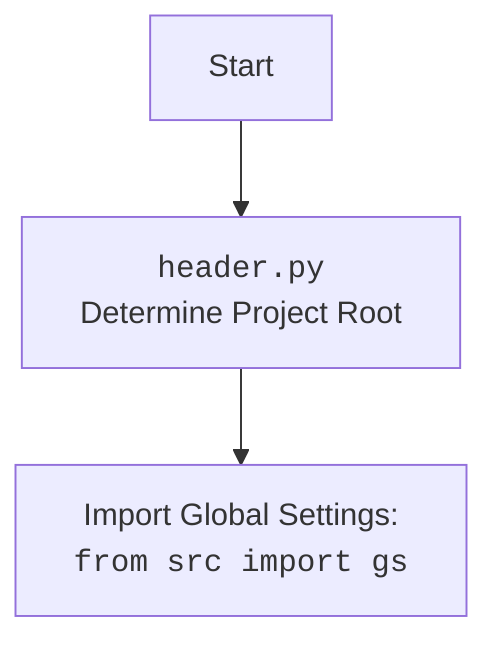

## <алгоритм>

1.  **`get_list_products_in_category(s)`**:
    *   Принимает объект `Supplier` (s).
    *   Вызывает `get_prod_urls_from_pagination(s)` для получения списка URL товаров.
    *   Возвращает список URL товаров, собранных со страницы категории.
        *   Пример: `s` - объект поставщика, функция вернет список URL товаров (`['url1', 'url2', ...]`).
2.  **`get_prod_urls_from_pagination(s)`**:
    *   Принимает объект `Supplier` (s).
    *   Извлекает драйвер браузера из объекта поставщика `_d = s.driver`.
    *   Извлекает локаторы для ссылок на товары `_l: dict = s.locators['category']['product_links']`.
    *   Использует `_d.execute_locator(_l)` для получения ссылок на товары с текущей страницы.
    *   Если список пуст, возвращает пустой список (`[]`).
    *   Запускает цикл `while True`, для обхода страниц пагинации:
        *   Проверяет наличие кнопки "следующая страница"  `_d.execute_locator(s.locators['category']['pagination']['->'])`.
        *   Если кнопки нет, выходит из цикла.
        *   Если кнопка есть, добавляет новые URL товаров, полученные при помощи `_d.execute_locator(_l)` в общий список.
    *   Возвращает список URL товаров.
        *   Пример: `s` - объект поставщика, функция вернет список URL товаров (`['url1', 'url2', 'url3', ... ]`).
3.  **`update_categories_in_scenario_file(s, scenario_filename)`**:
    *   Принимает объект `Supplier` (s) и имя файла сценария (`scenario_filename`).
    *   Загружает JSON-данные из файла сценария.
    *   Извлекает список категорий из файла сценария.
    *   Вызывает `get_list_categories_from_site()` (тут есть недочет,  аргументы  нужны `s,scenario_filename`) для получения списка категорий с сайта.
    *   Создает пустой список `all_ids_in_file`.
    *   Вспомогательная функция `_update_all_ids_in_file()`:
        *   Перебирает категории в файле сценария.
        *   Если `category ID on site` больше 0, добавляет его в `all_ids_in_file`.
        *   Иначе, извлекает ID категории из URL и добавляет в `all_ids_in_file`, так же обновляет `category ID on site` в файле.
    *   Загружает JSON-данные категорий из магазина с сайта.
    *   Проверяет статус код. Если не 200, логирует ошибку и завершает работу.
    *   Извлекает список групп категорий из JSON.
    *   Создает пустые списки `all_ids_on_site` и `all_categories_on_site`.
    *   Перебирает группы категорий, если нет подгрупп добавляет `groupId` в `all_ids_on_site` и группу в `all_categories_on_site`.
    *   Если подгруппы есть, перебирает их, добавляя `groupId` в `all_ids_on_site` и подгруппу в `all_categories_on_site`.
    *   Формирует списки `removed_categories` и `added_categories` на основе сравнения `all_ids_in_file` и `all_ids_on_site`.
    *   Если есть добавленные категории:
        *   Добавляет их в файл сценария, используя `category_id` и обновляет файл.
        *   Отправляет уведомление о добавлении.
    *   Если есть удаленные категории:
        *   Отключает их в файле сценария и обновляет файл.
        *   Отправляет уведомление об отключении.
    *   Возвращает `True` после всех операций.
        *   Пример: `s` - объект поставщика, `scenario_filename` - имя файла, функция обновит файл сценария и вернет `True`.
4.  **`get_list_categories_from_site(s, scenario_file, brand='')`**:
    *   Принимает объект `Supplier` (s), имя файла сценария (`scenario_file`) и бренд (не используется).
    *   Загружает JSON-данные из файла сценария.
    *   Открывает страницу категорий магазина.
    *   Функция имеет незаконченный код (`...`), что указывает на её неполную реализацию.
5.  **`DBAdaptor`**:
    *   Предоставляет методы для взаимодействия с базой данных через `CategoryManager`.
    *   `select(cat_id, parent_id, project_cat_id)`: Выбирает записи из `AliexpressCategory`.
    *   `insert()`: Вставляет новую запись в `AliexpressCategory`.
    *   `update()`: Обновляет запись в `AliexpressCategory`.
    *   `delete()`: Удаляет запись из `AliexpressCategory`.

## <mermaid>

```mermaid
flowchart TD
    Start[Start] --> get_products[get_list_products_in_category(s)]
    get_products --> get_urls[get_prod_urls_from_pagination(s)]
    get_urls -->  check_list{list_products_in_category is empty?}
    check_list -- Yes -->  return_empty[return []]
    check_list -- No -->  loop_pagination{while next page exists}
     loop_pagination -- No next page --> return_list[return list_products_in_category]
     loop_pagination -- next page -->  add_urls[extend list_products_in_category with new urls]
    add_urls --> loop_pagination
    return_empty --> End[End]
    return_list --> End
    Start --> update_categories[update_categories_in_scenario_file(s, scenario_filename)]
    update_categories --> load_scenario[Load scenario from file]
    load_scenario --> get_categories_site[get_list_categories_from_site(s,scenario_file)]
    get_categories_site --> parse_scenario_categories[Parse IDs from scenario file]
    parse_scenario_categories --> get_categories_from_shop[get categories from Aliexpress shop JSON]
    get_categories_from_shop -- status_code=200 --> compare_categories[Compare categories]
    compare_categories --> check_added{added categories?}
    check_added -- Yes -->  add_new_categories[add new categories to scenario]
    add_new_categories --> send_notification_add[Send notification (added)]
    send_notification_add -->check_removed{removed categories?}
    check_added -- No --> check_removed
   
    check_removed -- Yes --> disable_removed_categories[Disable removed categories in scenario]
    disable_removed_categories --> send_notification_remove[Send notification (removed)]
    check_removed -- No --> update_scenario_file[Update scenario file]
    
    update_scenario_file --> End
   
    get_categories_from_shop -- status_code!=200 --> error_log[Log error]
    error_log --> End

   
    Start --> DB_Adaptor[DBAdaptor]
    DB_Adaptor --> select_db[select(cat_id, parent_id, project_cat_id)]
    DB_Adaptor --> insert_db[insert()]
    DB_Adaptor --> update_db[update()]
    DB_Adaptor --> delete_db[delete()]

    select_db --> end_db[End DB Operation]
    insert_db --> end_db
    update_db --> end_db
    delete_db --> end_db

     end_db --> End


```



## <объяснение>

**Импорты:**

*   `from typing import Union`: Импортируется `Union` для аннотации типов, позволяющей указывать, что переменная может иметь один из нескольких типов.
*   `from pathlib import Path`: Импортируется `Path` для работы с путями к файлам и директориям, обеспечивает кроссплатформенную совместимость.
*   `from src import gs`: Импортируется `gs` (глобальные настройки) из пакета `src`. `gs` используется для доступа к общим настройкам проекта, таким как пути к директориям, учетные данные и т.д.
*   `from src.utils.jjson import j_dumps, j_loads`: Импортируются функции `j_dumps` (для сериализации данных в JSON) и `j_loads` (для десериализации данных из JSON) из модуля `jjson`.
*   `from src.logger.logger import logger`: Импортируется объект `logger` из модуля `logger` для логирования событий и ошибок.
*   `from src.db.manager_categories.suppliers_categories import CategoryManager, AliexpressCategory`: Импортируются класс `CategoryManager` и модель `AliexpressCategory` из модуля `suppliers_categories`. `CategoryManager` используется для управления категориями, а `AliexpressCategory` - ORM для работы с таблицей категорий.

**Классы:**

*   **`CategoryManager`**:
    *   Роль: Управляет категориями, предоставляя методы для выборки, вставки, обновления и удаления записей в базе данных, а также для перевода категорий.
    *   Атрибуты: Не показаны в данном коде, но предполагается, что он имеет методы для работы с базой данных и ORM, определенной в `suppliers_categories.py`.
    *   Методы: В данном коде не используются напрямую. Предполагается наличие методов `select_record`, `insert_record`, `update_record`, `delete_record`.
    *   Взаимодействие: Используется в `DBAdaptor` для выполнения операций с базой данных.
*   **`AliexpressCategory`**:
    *   Роль: ORM (Object-Relational Mapping) модель для таблицы категорий Aliexpress.
    *   Атрибуты: Представляет поля таблицы, такие как `category_name`, `parent_category_id`, `hypotez_category_id`.
    *   Методы: Методы не показаны в данном коде, но предполагает работу с базой данных через ORM.
    *   Взаимодействие: Используется в `DBAdaptor` и `CategoryManager` для взаимодействия с базой данных.
*  **`DBAdaptor`**:
    *   Роль: предоставляет адаптер для выполнения операций с базой данных.
    *   Атрибуты: не имеет собственных атрибутов.
    *  Методы: `select(cat_id:int, parent_id:int, project_cat_id:int)`, `insert()`, `update()`, `delete()`
    *   Взаимодействие: Использует `CategoryManager` и `AliexpressCategory` для выполнения CRUD операций с базой данных.

**Функции:**

*   **`get_list_products_in_category(s) -> list[str, str]`**:
    *   Аргументы:
        *   `s`: Экземпляр класса `Supplier`, представляющий поставщика.
    *   Возвращаемое значение: Список строк (URL товаров).
    *   Назначение: Собирает URL товаров со страницы категории, включая пагинацию.
    *   Пример: `get_list_products_in_category(supplier_instance)` вернет список URL товаров, таких как `['https://example.com/product1', 'https://example.com/product2']`.
*   **`get_prod_urls_from_pagination(s) -> list[str]`**:
    *   Аргументы:
        *   `s`: Экземпляр класса `Supplier`.
    *   Возвращаемое значение: Список URL товаров со страницы категории.
    *   Назначение: Собирает URL товаров со страницы категории с учётом пагинации.
    *   Пример: `get_prod_urls_from_pagination(supplier_instance)` вернет список URL товаров.
*   **`update_categories_in_scenario_file(s, scenario_filename: str) -> bool`**:
    *   Аргументы:
        *   `s`: Экземпляр класса `Supplier`.
        *   `scenario_filename`: Имя файла сценария.
    *   Возвращаемое значение: `True` при успешном выполнении.
    *   Назначение: Проверяет и обновляет категории в файле сценария на основе данных с сайта. Добавляет новые и отключает удаленные категории.
    *   Пример: `update_categories_in_scenario_file(supplier_instance, 'test_scenario.json')` обновит категории в файле `test_scenario.json` и вернет `True`.
*    **`get_list_categories_from_site(s,scenario_file,brand='')`**:
      *   Аргументы:
        *   `s`: Экземпляр класса `Supplier`.
        *    `scenario_file`: имя файла сценария
        *   `brand`: бренд.
      *   Возвращаемое значение:  Отсутствует, функция не завершена, логика  не реализована.
      *   Назначение: Получает список категорий с сайта.
*   **`_update_all_ids_in_file()`**:
    *   Аргументы: Нет. Использует переменные из области видимости `update_categories_in_scenario_file`.
    *   Возвращаемое значение: Нет.
    *   Назначение: Извлекает и обновляет идентификаторы категорий из файла сценария.

**Переменные:**

*   `credentials`: Глобальные переменные из `gs.db_translations_credentials`, учетные данные для работы с базой данных переводов.
*   `manager`: Экземпляр класса `CategoryManager`, используется для управления категориями.
*   `_d`:  Драйвер браузера, используется для навигации по сайту и поиска элементов на странице.
*   `_l`:  Локаторы элементов для поиска.
*   `list_products_in_category`: Список собранных URL товаров.
*   `scenario_json`: JSON данные из файла сценария.
*   `scenarios_in_file`: категории из файла сценария.
*    `all_ids_in_file`: список id категорий в файле сценария.
*   `categories_on_site`: список категорий с сайта.
*   `response`: Объект ответа http запроса.
*    `categories_from_aliexpress_shop_json`: JSON данные категорий с сайта.
*   `groups`: Список групп категорий с сайта.
*   `all_ids_on_site`: Список id категорий с сайта.
*   `all_categories_on_site`: Список категорий с сайта в формате JSON.
*   `removed_categories`: Список id удаленных категорий.
*    `added_categories`: Список id добавленных категорий.
*    `category`: данные о категории.
*    `category_name`: Название категории.
*    `category_url`: URL категории.
*    `post_subject`: тема сообщения для отправки уведомления.
*    `post_message`: текст сообщения для отправки уведомления.

**Потенциальные ошибки и области для улучшения:**

*   В функции `get_prod_urls_from_pagination` есть риск бесконечного цикла, если не будет возможности найти кнопку "следующая страница". Нужно добавить более надежную проверку или ограничение количества итераций.
*   Функция  `get_list_categories_from_site` не завершена.
*   В `update_categories_in_scenario_file` есть потенциальная ошибка, если  `'category ID on site'` отсутствует в файле, но она отлавливается.
*   Не используется параметр `brand` в `get_list_categories_from_site`.
*   Использование `set` для сравнения списков может быть неэффективным для больших наборов данных, можно использовать более производительные структуры.
*   Логика формирования списка `added_categories` и `removed_categories` можно вынести в отдельную функцию для повторного использования.
*  В `DBAdaptor` нет реализации логики работы с БД, только заглушки.

**Взаимосвязь с другими частями проекта:**

*   Импорт `from src import gs` показывает зависимость от глобальных настроек проекта.
*   Импорт `from src.utils.jjson import j_dumps, j_loads` показывает использование утилит для работы с JSON.
*   Импорт `from src.logger.logger import logger` показывает использование системы логирования.
*   Импорт `from src.db.manager_categories.suppliers_categories import CategoryManager, AliexpressCategory` показывает зависимость от ORM для работы с БД.
*   Использует `Supplier` (не показан в коде), что предполагает интеграцию с модулем управления поставщиками.
*  Функции  `send()` (отправка сообщений) и `json_dump()`(сериализация JSON) не показаны в этом коде, но предполагают интеграцию с системой уведомлений и файловой системой.

Таким образом, данный код является частью модуля для управления категориями товаров на сайте Aliexpress, взаимодействуя с настройками, утилитами JSON, системой логирования, базой данных, а также с модулем управления поставщиками. Он обеспечивает сбор данных о товарах с категорий сайта, их сверку с данными в файле сценария и обновление, а также возможность управления данными категорий в БД.