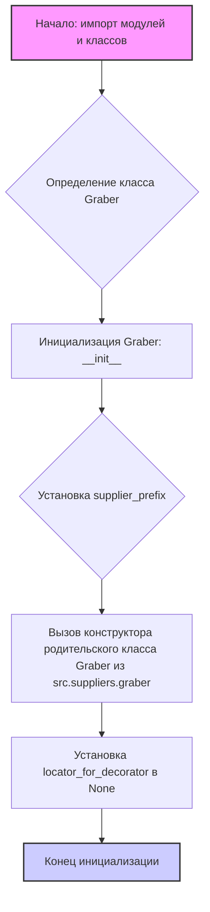
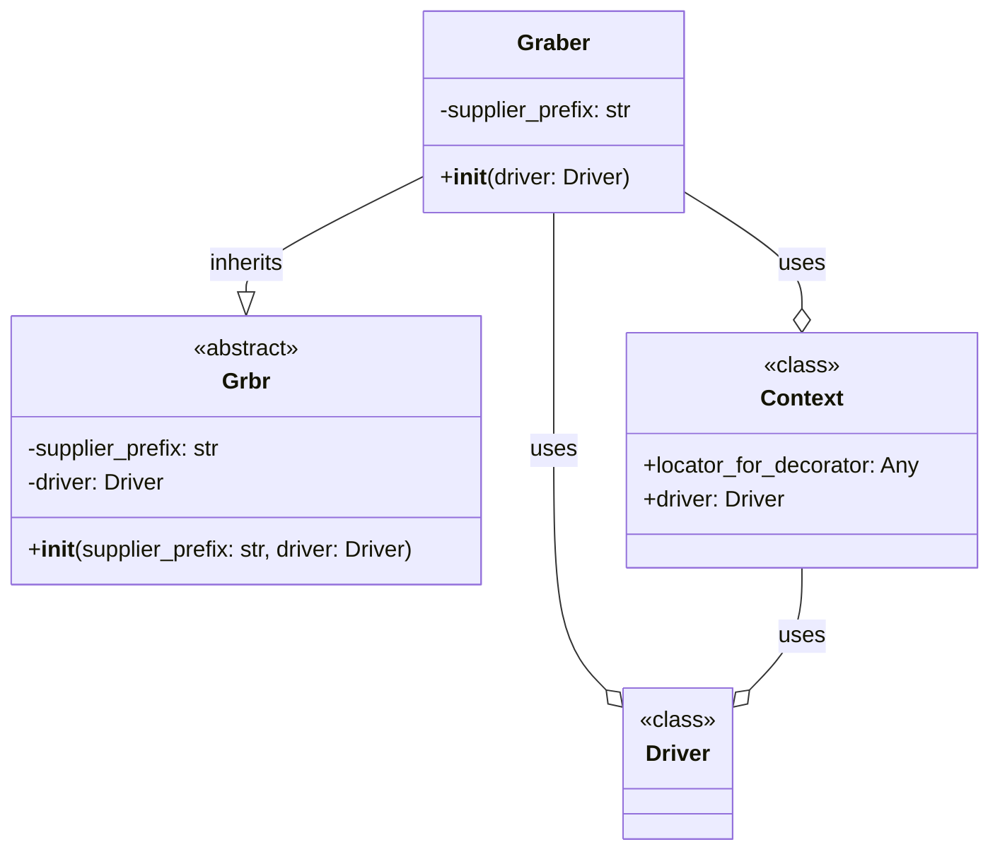

## ИНСТРУКЦИЯ:

Анализируй предоставленный код подробно и объясни его функциональность. Ответ должен включать три раздела:

1.  **<алгоритм>**: Опиши рабочий процесс в виде пошаговой блок-схемы, включая примеры для каждого логического блока, и проиллюстрируй поток данных между функциями, классами или методами.
2.  **<mermaid>**: Напиши код для диаграммы в формате `mermaid`, проанализируй и объясни все зависимости,
    которые импортируются при создании диаграммы.
    **ВАЖНО!** Убедитесь, что все имена переменных, используемые в диаграмме `mermaid`,
    имеют осмысленные и описательные имена. Имена переменных вроде `A`, `B`, `C`, и т.д., не допускаются!

    **Дополнительно**: Если в коде есть импорт `import header`, добавьте блок `mermaid` flowchart, объясняющий `header.py`:
    ```mermaid
    flowchart TD
        Start --> Header[<code>header.py</code><br> Determine Project Root]

        Header --> import[Import Global Settings: <br><code>from src import gs</code>]
    ```

3.  **<объяснение>**: Предоставьте подробные объяснения:
    *   **Импорты**: Их назначение и взаимосвязь с другими пакетами `src.`.
    *   **Классы**: Их роль, атрибуты, методы и взаимодействие с другими компонентами проекта.
    *   **Функции**: Их аргументы, возвращаемые значения, назначение и примеры.
    *   **Переменные**: Их типы и использование.
    *   Выделите потенциальные ошибки или области для улучшения.

Дополнительно, постройте цепочку взаимосвязей с другими частями проекта (если применимо).

Это обеспечивает всесторонний и структурированный анализ кода.
## Формат ответа: `.md` (markdown)
**КОНЕЦ ИНСТРУКЦИИ**

## <алгоритм>



**Примеры:**

*   **Начало: импорт модулей и классов**: Импортируются `Any, Callable, wraps, Graber as Grbr, Context, close_pop_up, Driver, logger, ExecuteLocatorException`.  
*   **Определение класса Graber**: Определяется класс `Graber`, наследующий от `Graber` из `src.suppliers.graber`.
*   **Инициализация Graber: `__init__`**: Создается экземпляр класса `Graber` с параметром `driver`.
*   **Установка `supplier_prefix`**: Атрибуту `supplier_prefix` присваивается значение `'aliexpress'`.
*   **Вызов конструктора родительского класса**: Вызывается `super().__init__(supplier_prefix=self.supplier_prefix, driver=driver)`, передавая `supplier_prefix` и `driver`.
*   **Установка `locator_for_decorator` в `None`**: `Context.locator_for_decorator` устанавливается в `None`, чтобы декоратор не выполнялся.
*   **Конец инициализации**: Экземпляр класса `Graber` готов к работе.

## <mermaid>



**Объяснение зависимостей:**

*   `Graber` (из текущего файла) наследует (реализует)  функциональность  от абстрактного класса `Grbr` (из `src.suppliers.graber`), что позволяет расширять и переопределять поведение родительского класса.
*   `Graber` использует `Context` и `Driver`. `Context` используется для хранения контекста выполнения, включая локатор для декоратора (который в данном случае установлен в `None`), и для доступа к `Driver`.
*   `Driver` представляет собой класс для управления веб-драйвером (например, Selenium).
*   `Context` также имеет зависимость от `Driver`, так как хранит в себе его экземпляр.

## <объяснение>

**Импорты:**

*   `from typing import Any, Callable`: Импортируются типы `Any` (любой тип) и `Callable` (вызываемый объект, например функция) для аннотаций типов.
*   `from functools import wraps`: Импортируется декоратор `wraps` для сохранения метаданных декорируемой функции.
*   `from src.suppliers.graber import Graber as Grbr, Context, close_pop_up`:
    *   `Graber as Grbr`: Импортирует базовый класс `Graber` из `src.suppliers.graber` и переименовывает его в `Grbr` для краткости.
    *   `Context`: Импортирует класс `Context` из `src.suppliers.graber`, который используется для хранения глобального состояния.
    *   `close_pop_up`: Импортирует функцию/декоратор `close_pop_up`, которая используется для закрытия всплывающих окон. В текущей версии кода закомментирован, так что не используется.
*   `from src.webdriver.driver import Driver`: Импортирует класс `Driver` из `src.webdriver.driver` для взаимодействия с веб-драйвером.
*   `from src.logger.logger import logger`: Импортирует объект `logger` из `src.logger.logger` для логирования.
*   `from src.logger.exceptions import ExecuteLocatorException`: Импортирует исключение `ExecuteLocatorException` из `src.logger.exceptions` для обработки ошибок при выполнении локатора.

**Классы:**

*   `class Graber(Grbr)`:
    *   **Роль**: Класс для сбора данных о товарах с AliExpress.
    *   **Наследование**: Наследует от `src.suppliers.graber.Graber` (`Grbr`).
    *   **Атрибуты**:
        *   `supplier_prefix: str`: Префикс поставщика, инициализирован в `'aliexpress'`.
    *   **Методы**:
        *   `__init__(self, driver: Driver)`: Конструктор класса, инициализирует `supplier_prefix` и вызывает конструктор родительского класса, а также сбрасывает `Context.locator_for_decorator`.

**Функции:**
    * `close_pop_up` - закомментирована.  Предполагается, что это декоратор, который закрывает всплывающее окно перед выполнением основной функции.

**Переменные:**

*   `supplier_prefix`: Строка, указывающая префикс поставщика.
*   `driver`: Экземпляр класса `Driver` для взаимодействия с браузером.
*   `Context.locator_for_decorator`: Переменная для хранения локатора для декоратора, устанавливается в `None` в конструкторе класса.

**Потенциальные ошибки и области для улучшения:**

*   **Отсутствие реализации методов:** Класс `Graber` пока не содержит методов для сбора данных о товарах. Необходимо добавить методы, которые будут обращаться к веб-страницам и извлекать нужные данные.
*   **Декоратор `close_pop_up` закомментирован**: Декоратор для закрытия всплывающих окон закомментирован, его нужно раскомментировать и использовать при необходимости. Сейчас для корректной работы нужно переопределить его в дочерних классах.
*   **Обработка ошибок:** В коде есть обработка исключения `ExecuteLocatorException`, но не все возможные ошибки обработки страниц. Нужно предусмотреть обработку других исключений.
*   **Контекст**: `Context` является статическим, его нужно прорабатывать для работы с многопоточностью или асинхронностью.

**Взаимосвязи с другими частями проекта:**

*   Класс `Graber` зависит от класса `Graber` из `src.suppliers.graber`, реализуя его абстрактный интерфейс.
*   Используется класс `Driver` из `src.webdriver.driver` для управления браузером.
*   Используется `logger` из `src.logger.logger` для логирования.
*   `Context` из `src.suppliers.graber` используется для хранения контекста выполнения, включая `locator_for_decorator`.
*   Класс `Graber` использует исключение `ExecuteLocatorException` из `src.logger.exceptions`.