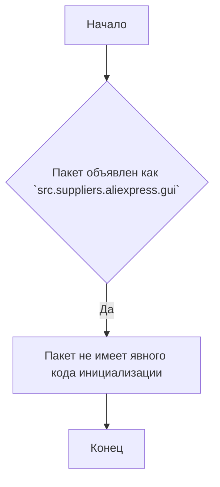
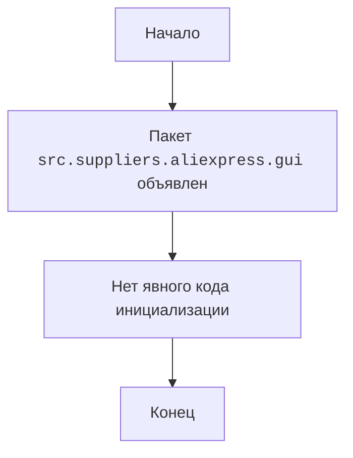

## АНАЛИЗ КОДА: `src/suppliers/aliexpress/gui/__init__.py`

### 1. <алгоритм>

Файл `__init__.py` в Python, как правило, используется для обозначения того, что каталог является пакетом.  В данном случае, файл пуст и не содержит явного кода. Это означает, что пакет `src.suppliers.aliexpress.gui` не имеет собственной логики инициализации, но существует как модуль, который может быть импортирован другими частями проекта.

**Пошаговая блок-схема:**



**Пример:**

- **Логический блок A:** Начало выполнения программы, где импортируется пакет.
- **Логический блок B:**  `__init__.py`  определяет, что каталог является пакетом, а не обычным каталогом.
- **Логический блок C:** В данном случае, отсутствие явного кода означает, что нет инициализационных действий при импорте.
- **Логический блок D:** Конец обработки пакета, готового к использованию.

### 2. <mermaid>



**Объяснение:**

Диаграмма `mermaid` представляет собой простую блок-схему, отражающую отсутствие явной логики инициализации пакета.

- `Start`:  Начало процесса импорта пакета `src.suppliers.aliexpress.gui`.
- `PackageDeclaration`: Указание на то, что `__init__.py` определяет директорию как пакет.
- `NoCode`: Отсутствие исполняемого кода в файле `__init__.py`.
- `End`: Завершение процесса импорта пакета.

### 3. <объяснение>

**Импорты:**

- Файл `__init__.py` не содержит импортов, поскольку не выполняет какой-либо конкретной инициализации или не содержит исполняемого кода.

**Классы:**

- В данном файле классы не определены.

**Функции:**

- В данном файле функции не определены.

**Переменные:**

- В данном файле переменные не определены.

**Объяснение:**

- **Назначение:** Файл `__init__.py` в Python используется для того, чтобы интерпретатор Python распознал каталог как пакет. Даже если файл пуст, его наличие означает, что каталог с именем `gui` может быть импортирован как пакет.
- **Взаимосвязь с другими частями проекта:** Этот пакет, скорее всего, является частью более крупной структуры проекта `src`, который включает в себя модули для обработки поставщиков, в частности AliExpress. При импорте этого пакета, другие модули могут получить доступ к файлам и модулям, находящимся внутри каталога `gui`.
- **Пример использования:** Другой модуль в проекте может импортировать этот пакет следующим образом:
  ```python
  from src.suppliers.aliexpress import gui
  ```
  Это позволит другим модулям импортировать и использовать модули, находящиеся внутри каталога `gui`.
- **Потенциальные ошибки или области для улучшения:** Поскольку файл `__init__.py` пустой, нет явных ошибок. Однако, если в будущем потребуется добавлять какую-либо логику инициализации для пакета, файл можно будет расширить. Сейчас он просто указывает, что каталог является пакетом и не более.
- **Цепочка взаимосвязей:** Пакет `src.suppliers.aliexpress.gui` является частью иерархии пакетов `src`,  в которой `src` является корневым пакетом, `suppliers` - подпакет, и `aliexpress` - еще один подпакет, а `gui` - это подпакет `aliexpress`. Этот файл важен для организации структуры кода и обеспечения возможности импорта модулей внутри `gui`.