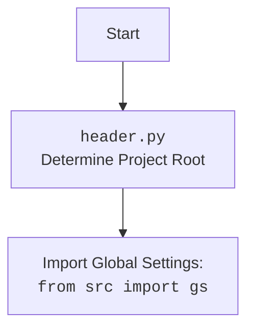

# АНАЛИЗ КОДА: `hypotez/src/suppliers/aliexpress/gui/header.py`

## <алгоритм>

1.  **`set_project_root(marker_files)`**:
    *   **Начало**: Функция получает список файлов-маркеров (`marker_files`, по умолчанию `('__root__', '.git')`).
    *   **Инициализация**: Устанавливает `current_path` как абсолютный путь к директории, содержащей текущий файл.
    *   **Обход директорий**:
        *   Начинает с текущей директории и переходит к родительским.
        *   Для каждой директории проверяет, существует ли в ней хотя бы один из файлов-маркеров.
            *   **Пример:** Если `current_path` это `/home/user/project/src/suppliers/aliexpress/gui`, то перебираются `/home/user/project/src/suppliers/aliexpress/gui`, `/home/user/project/src/suppliers/aliexpress`, `/home/user/project/src/suppliers`, `/home/user/project/src`, `/home/user/project`, `/home/user` и т.д.
        *   Если маркер найден, то путь к этой директории сохраняется в переменную `__root__`, цикл обхода завершается.
    *   **Обновление `sys.path`**:
        *   Если директория `__root__` не входит в `sys.path`, она добавляется в начало. Это позволяет импортировать модули, находящиеся в корне проекта.
        *   Возвращает путь к корневой директории `__root__`.

2.  **`__root__: Path = set_project_root()`**:
    *   Вызывает функцию `set_project_root` для определения корневой директории проекта.
    *   Сохраняет результат в глобальную переменную `__root__`.

3.  **Импорт `gs` и загрузка `settings.json`**:
    *   Пытается открыть файл `settings.json`, расположенный в каталоге `src`, относительно корневой директории.
        *   **Пример**: Если `__root__` это `/home/user/project`, то файл `settings.json` будет искаться по пути `/home/user/project/src/settings.json`.
    *   Если файл успешно открыт, его содержимое загружается как словарь JSON и сохраняется в переменную `settings`.
    *   **Обработка ошибок**: Если файл не найден или его нельзя декодировать как JSON, происходит обработка исключений.

## <mermaid>

```mermaid
flowchart TD
    Start[Start <code>header.py</code>] --> setProjectRoot[<code>set_project_root</code><br> Find Project Root Directory]
    setProjectRoot --> findMarker[Check for marker files <br> in current and parent dirs]
    findMarker -- Marker Found --> setRoot[Set __root__ to parent dir]
    findMarker -- No Marker --> continueSearch[Continue search in parent directory]
    continueSearch --> findMarker
    setRoot --> updateSysPath[Update sys.path if needed]
    updateSysPath --> returnRoot[Return <code>__root__</code>]
    returnRoot --> setGlobalRoot[Set global <code>__root__</code>]
    setGlobalRoot --> importGs[Import Global Settings: <br><code>from src import gs</code>]
     importGs --> loadSettings[Attempt to load <br><code>settings.json</code>]
    loadSettings -- Success --> setSettings[Set settings from json file]
    loadSettings -- Error --> errorHandling[Handle FileNotFoundError or JSONDecodeError]
    setSettings --> end[End]
    errorHandling --> end


    style Start fill:#f9f,stroke:#333,stroke-width:2px
    style end fill:#ccf,stroke:#333,stroke-width:2px

```



**Зависимости, импортируемые в диаграмме `mermaid`:**

*   `sys`: Модуль, предоставляющий доступ к некоторым переменным и функциям, взаимодействующим с интерпретатором Python. Используется для модификации пути поиска модулей (`sys.path`).
*   `json`: Модуль для работы с данными в формате JSON. Используется для загрузки файла `settings.json`.
*   `pathlib`: Модуль для работы с путями в файловой системе. Используется для определения корневой директории проекта.
*   `packaging.version`: Модуль для работы с версиями. (В предоставленном коде не используется, но импортирован).
*   `src.gs`: Предположительно, пользовательский модуль (глобальные настройки), содержащий настройки проекта и переменные, связанные с путями.

## <объяснение>

**Импорты:**

*   `sys`: Используется для добавления корневой директории проекта в список путей поиска модулей (`sys.path`). Это позволяет Python импортировать модули из каталогов, не входящих в стандартный путь.
*   `json`: Используется для чтения данных конфигурации из файла `settings.json` в формате JSON.
*    `packaging.version`: Модуль для работы с версиями.  В предоставленном коде не используется. Возможно, используется в других частях проекта.
*   `pathlib`: Используется для работы с путями к файлам и каталогам. Обеспечивает более удобный и объектно-ориентированный способ манипуляции путями, чем работа со строками.
*   `src.gs`: Это собственный модуль в проекте, который, вероятно, содержит глобальные настройки и константы проекта. `gs.path.root` предоставляет путь к корневой директории, что необходимо для загрузки `settings.json`.

**Функции:**

*   **`set_project_root(marker_files)`**:
    *   **Аргументы**:
        *   `marker_files` (tuple, по умолчанию `('__root__', '.git')`): кортеж файлов или директорий, которые определяют корневую директорию проекта.
    *   **Возвращает**: `Path` -  объект, представляющий путь к корневой директории проекта.
    *   **Назначение**: Функция находит корневую директорию проекта путем поиска вверх по иерархии каталогов, пока не найдет каталог, содержащий один из файлов-маркеров. После определения корневой директории, она добавляется в `sys.path` для корректной работы импортов модулей.
    *   **Пример**: Если структура проекта такая:
    ```
        project/
        ├── src/
        │   ├── suppliers/
        │   │   ├── aliexpress/
        │   │   │   └── gui/
        │   │   │       └── header.py
        │   └── ...
        ├── __root__
        └── ...
    ```
    Тогда при запуске `header.py`, `set_project_root` определит `/project/` как корневую директорию.

**Переменные:**

*   `__root__` (Path): Глобальная переменная, которая хранит путь к корневой директории проекта. Инициализируется с помощью результата вызова `set_project_root()`.
*   `settings` (dict or None): Переменная для хранения загруженных из `settings.json` настроек. Если загрузка не удалась, значением будет `None`.

**Классы**:

* Классы в данном файле не используются

**Потенциальные ошибки и области для улучшения**:

*   **Обработка ошибок загрузки `settings.json`**: В случае ошибки загрузки `settings.json`,  просто происходит `...` . Это может привести к проблемам, если другие части кода зависят от настроек. Желательно добавить логирование или более осмысленную обработку ошибок.
*   **Отсутствие обработки случая, когда маркер не найден**: Если корневая директория не найдена, текущая директория возвращается, что может быть не всегда правильно.
*   **Зависимость от `gs` перед загрузкой `settings`**: `gs` импортируется перед попыткой загрузить `settings.json`. Если `gs` зависит от настроек из `settings.json`, это может вызвать проблемы с порядком инициализации.

**Цепочка взаимосвязей с другими частями проекта:**

1.  **`set_project_root`:** Эта функция является важным компонентом проекта, поскольку она определяет корневую директорию, что является основой для правильной работы всех остальных модулей.
2.  **`__root__`:** Путь к корневой директории используется для корректной работы импортов модулей и  загрузки файла настроек `settings.json`.
3.  **`gs`:** Глобальные настройки, которые будут использованы в других частях проекта.
4.  **`settings`:** Настройки из `settings.json` влияют на поведение проекта. Зависят от `__root__` и `gs`.
5.  **Зависимость:** `header.py` зависит от других модулей, для работы с путями, `pathlib`; файлами, `json`; модулями, `sys` и `src.gs`.

В целом, этот файл является важной частью проекта, обеспечивая инициализацию корневой директории, загрузку глобальных настроек и обеспечение корректной работы импортов модулей.