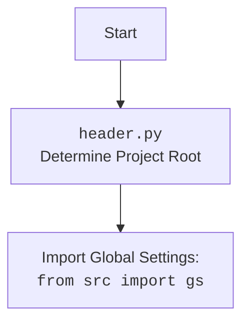

## ИНСТРУКЦИЯ:

Анализируй предоставленный код подробно и объясни его функциональность. Ответ должен включать три раздела:

1. **<алгоритм>**: Опиши рабочий процесс в виде пошаговой блок-схемы, включая примеры для каждого логического блока, и проиллюстрируй поток данных между функциями, классами или методами.
2. **<mermaid>**: Напиши код для диаграммы в формате `mermaid`, проанализируй и объясни все зависимости,
    которые импортируются при создании диаграммы.
    **ВАЖНО!** Убедитесь, что все имена переменных, используемые в диаграмме `mermaid`,
    имеют осмысленные и описательные имена. Имена переменных вроде `A`, `B`, `C`, и т.д., не допускаются!

    **Дополнительно**: Если в коде есть импорт `import header`, добавьте блок `mermaid` flowchart, объясняющий `header.py`:
    ```mermaid
    flowchart TD
        Start --> Header[<code>header.py</code><br> Determine Project Root]

        Header --> import[Import Global Settings: <br><code>from src import gs</code>]
    ```

3. **<объяснение>**: Предоставьте подробные объяснения:
   - **Импорты**: Их назначение и взаимосвязь с другими пакетами `src.`.
   - **Классы**: Их роль, атрибуты, методы и взаимодействие с другими компонентами проекта.
   - **Функции**: Их аргументы, возвращаемые значения, назначение и примеры.
   - **Переменные**: Их типы и использование.
   - Выделите потенциальные ошибки или области для улучшения.

Дополнительно, постройте цепочку взаимосвязей с другими частями проекта (если применимо).

Это обеспечивает всесторонний и структурированный анализ кода.
## Формат ответа: `.md` (markdown)
**КОНЕЦ ИНСТРУКЦИИ**

```markdown
## <алгоритм>

1.  **Инициализация `ProductEditor`:**
    *   Создается экземпляр класса `ProductEditor`.
    *   Сохраняется ссылка на главное приложение `main_app`.
    *   Вызывается `setup_ui()` для настройки графического интерфейса.
    *   Вызывается `setup_connections()` для установки связей между сигналами и слотами (в текущей версии не реализованы).
        *   *Пример:* `product_editor = ProductEditor(parent=mainWindow, main_app=self)`.

2.  **Настройка интерфейса `setup_ui()`:**
    *   Устанавливается заголовок окна "Product Editor".
    *   Изменяется размер окна.
    *   Создается кнопка "Open JSON File" (при нажатии вызывает `open_file()`).
    *   Создается метка для отображения имени файла "No file selected".
    *   Создается кнопка "Prepare Product" (при нажатии вызывает `prepare_product_async()`).
    *   Компоненты добавляются в вертикальный макет `QVBoxLayout`.
        *   *Пример:* Кнопка "Open JSON File" и метка "No file selected" видны в окне.

3.  **Открытие файла `open_file()`:**
    *   Открывается диалоговое окно выбора файла (`QFileDialog`).
        *   *Пример:* При нажатии на кнопку "Open JSON File" открывается окно проводника.
    *   Если файл выбран, вызывается `load_file()` с путем к файлу.
        *   *Пример:* Пользователь выбирает `product.json`.

4.  **Загрузка файла `load_file(file_path)`:**
    *   Парсится JSON файл в объект `SimpleNamespace` с помощью `j_loads_ns()`.
        *   *Пример:* `{ "title": "Example Product", "details": "Product details here" }` превращается в `data.title` = "Example Product", `data.details` = "Product details here".
    *   Сохраняется путь к файлу в `file_path`.
    *   Изменяется текст метки на имя файла.
    *   Создается экземпляр `AliCampaignEditor` для работы с данными.
    *   Вызывается `create_widgets()` для создания виджетов на основе данных.
    *   В случае ошибки отображается окно с сообщением.

5.  **Создание виджетов `create_widgets(data)`:**
    *   Очищается макет от старых виджетов, кроме кнопок `open_button`, `prepare_button` и метки `file_name_label`.
    *   Создается метка с заголовком продукта из `data.title`.
    *   Создается метка с деталями продукта из `data.details`.
    *   Новые виджеты добавляются в макет.
        *   *Пример:* В окне появляется метка "Product Title: Example Product" и "Product Details: Product details here".

6.  **Асинхронная подготовка продукта `prepare_product_async()`:**
    *   Проверяется, что `editor` не `None`.
    *   Вызывается `self.editor.prepare_product()` асинхронно.
    *   В случае успеха отображается сообщение об успехе.
    *   В случае ошибки отображается сообщение об ошибке.

## <mermaid>

```mermaid
flowchart TD
    Start[Start] --> Init[Initialize ProductEditor]
    Init --> SetupUI[setup_ui(): Setup UI Components]
    SetupUI --> OpenButton[Open JSON File Button]
    OpenButton -- Clicked --> OpenFile[open_file(): Open File Dialog]
    OpenFile -- File Selected --> LoadFile[load_file(file_path): Load JSON File]
    OpenFile -- No File --> End[End]
    LoadFile --> ParseJSON[j_loads_ns(file_path): Parse JSON to SimpleNamespace]
    ParseJSON --> SaveFilePath[Save File Path & Update Label]
    SaveFilePath --> CreateEditor[Create AliCampaignEditor]
    CreateEditor --> CreateWidgets[create_widgets(data): Create UI Elements]
    CreateWidgets --> DisplayUI[Display Updated UI]
    DisplayUI --> PrepareButton[Prepare Product Button]
    PrepareButton -- Clicked --> PrepareProductAsync[prepare_product_async(): Prepare Product Asynchronously]
    PrepareProductAsync -- Success --> SuccessMessage[Show Success Message]
    PrepareProductAsync -- Failure --> ErrorMessage[Show Error Message]
    SuccessMessage --> End
    ErrorMessage --> End


    style Init fill:#f9f,stroke:#333,stroke-width:2px
    style SetupUI fill:#ccf,stroke:#333,stroke-width:2px
    style LoadFile fill:#cfc,stroke:#333,stroke-width:2px
    style CreateWidgets fill:#ffc,stroke:#333,stroke-width:2px
     style PrepareProductAsync fill:#fcc,stroke:#333,stroke-width:2px
```



**Анализ зависимостей:**

*   `Start`: Начальная точка выполнения программы.
*   `Init`: Инициализируется класс `ProductEditor`.
*   `SetupUI`: Функция `setup_ui` создает и настраивает интерфейс, включая кнопки и метки.
*   `OpenButton`: Кнопка "Open JSON File" вызывает функцию открытия файла.
*   `OpenFile`: Функция `open_file` открывает диалоговое окно выбора файла.
*    `LoadFile`: Функция `load_file` загружает JSON файл и обрабатывает его.
*   `ParseJSON`: Функция `j_loads_ns` парсит JSON и преобразует в `SimpleNamespace`.
*   `SaveFilePath`: Сохранение пути к файлу и обновление метки с именем файла.
*    `CreateEditor`: Создается экземпляр класса `AliCampaignEditor`.
*   `CreateWidgets`: Функция `create_widgets` создает UI элементы на основе данных из файла.
*   `DisplayUI`: Отображение обновленного пользовательского интерфейса.
*   `PrepareButton`: Кнопка "Prepare Product" вызывает асинхронную подготовку продукта.
*   `PrepareProductAsync`: Функция `prepare_product_async` асинхронно подготавливает продукт.
*   `SuccessMessage`: Отображение сообщения об успешной подготовке.
*   `ErrorMessage`: Отображение сообщения об ошибке.
*   `End`: Конечная точка выполнения.

## <объяснение>

**Импорты:**

*   `import header`: Импортирует модуль `header`, который, вероятно, отвечает за определение корневой директории проекта и загрузку глобальных настроек.
*   `import sys`: Импортирует модуль `sys` для работы с системными параметрами и функциями.
*   `from pathlib import Path`: Импортирует класс `Path` для работы с путями к файлам в объектно-ориентированном стиле.
*   `from types import SimpleNamespace`: Импортирует класс `SimpleNamespace` для создания объектов с произвольными атрибутами, полученных из JSON.
*   `from PyQt6 import QtWidgets, QtGui, QtCore`: Импортирует модули из библиотеки PyQt6 для создания графического интерфейса (GUI).
*   `from src.utils.jjson import j_loads_ns, j_dumps`: Импортирует функции `j_loads_ns` для загрузки JSON-данных в `SimpleNamespace` и `j_dumps` для сохранения JSON из `SimpleNamespace`.
*   `from src.suppliers.aliexpress.campaign import AliCampaignEditor`: Импортирует класс `AliCampaignEditor` из модуля `campaign`, предназначенный для редактирования кампаний AliExpress.

**Классы:**

*   `ProductEditor(QtWidgets.QWidget)`: Класс `ProductEditor` является основным виджетом для редактирования данных о продуктах.
    *   **Атрибуты:**
        *   `data: SimpleNamespace`: Содержит данные о продукте, загруженные из JSON.
        *   `language: str = 'EN'`: Язык, используемый для отображения данных (по умолчанию 'EN').
        *   `currency: str = 'USD'`: Валюта, используемая для отображения данных (по умолчанию 'USD').
        *   `file_path: str`: Путь к открытому JSON-файлу.
        *   `editor: AliCampaignEditor`: Экземпляр класса `AliCampaignEditor` для редактирования кампаний.
        *   `main_app`: Ссылка на экземпляр главного приложения.
    *   **Методы:**
        *   `__init__(self, parent=None, main_app=None)`: Конструктор класса, инициализирует виджет, сохраняет ссылку на главное приложение, настраивает UI и соединения.
        *   `setup_ui(self)`: Настраивает пользовательский интерфейс виджета, добавляет кнопки, метки и устанавливает макет.
        *   `setup_connections(self)`: Настраивает связи между сигналами и слотами. (в текущей реализации не имеет соединений)
        *   `open_file(self)`: Открывает диалоговое окно для выбора JSON-файла.
        *   `load_file(self, file_path)`: Загружает JSON-файл, парсит данные, создает `AliCampaignEditor`, и вызывает `create_widgets`.
        *   `create_widgets(self, data)`: Создает виджеты для отображения данных продукта.
        *    `prepare_product_async(self)`: Асинхронно подготавливает продукт с помощью `AliCampaignEditor`.

**Функции:**

*   `__init__(self, parent=None, main_app=None)`:
    *   **Аргументы:** `parent` (родительский виджет), `main_app` (экземпляр главного приложения).
    *   **Назначение:** Инициализирует экземпляр класса `ProductEditor`.
    *   **Пример:** `product_editor = ProductEditor(parent=mainWindow, main_app=self)`.

*   `setup_ui(self)`:
    *   **Аргументы:** `self` (экземпляр класса).
    *   **Назначение:** Настраивает UI виджета, создает кнопки, метки.
    *   **Пример:** Создаёт кнопки "Open JSON File", "Prepare Product" и метку "No file selected".

*   `setup_connections(self)`:
    *   **Аргументы:** `self` (экземпляр класса).
    *   **Назначение:** Настраивает сигналы и слоты (в данном случае не используется).

*   `open_file(self)`:
    *   **Аргументы:** `self` (экземпляр класса).
    *   **Назначение:** Открывает диалоговое окно выбора файла.
    *    **Пример:** Вызывается при нажатии кнопки "Open JSON File", открывает проводник для выбора JSON файла.

*   `load_file(self, file_path)`:
    *   **Аргументы:** `self` (экземпляр класса), `file_path` (путь к файлу).
    *   **Назначение:** Загружает JSON-файл, парсит данные, создает `AliCampaignEditor` и вызывает `create_widgets`.
    *   **Пример:** `load_file("path/to/product.json")`.

*  `create_widgets(self, data)`:
    *   **Аргументы:** `self` (экземпляр класса), `data` (SimpleNamespace с данными продукта).
    *   **Назначение:** Создает виджеты на основе загруженных данных.
    *    **Пример:** Если `data.title` = "Test Product", добавляет метку "Product Title: Test Product".

*   `prepare_product_async(self)`:
    *   **Аргументы:** `self` (экземпляр класса).
    *   **Назначение:** Асинхронно вызывает метод `prepare_product()` класса `AliCampaignEditor` для подготовки продукта.
        *   **Пример:** Запускается при нажатии кнопки "Prepare Product".

**Переменные:**

*   `data`: Объект `SimpleNamespace`, который хранит данные о продукте, загруженные из JSON.
*   `language`: Строка, представляющая язык (по умолчанию 'EN').
*   `currency`: Строка, представляющая валюту (по умолчанию 'USD').
*   `file_path`: Строка, представляющая путь к загруженному JSON-файлу.
*   `editor`: Экземпляр класса `AliCampaignEditor`, который используется для подготовки продукта.
*   `open_button`, `file_name_label`, `prepare_button`: Экземпляры PyQt6 виджетов.

**Потенциальные ошибки и области для улучшения:**

*   **Обработка ошибок:** Текущая обработка ошибок включает только вывод сообщений в QMessageBox, что может быть недостаточным. Необходимо добавить логирование ошибок и более детальную обработку исключений.
*   **Неполная реализация:** Метод `setup_connections` не реализует никаких связей сигнал-слот.
*   **Зависимость от конкретных данных:** Код в `create_widgets` ожидает наличие полей `title` и `details` в JSON, что делает его недостаточно гибким. Необходимо предусмотреть более гибкую обработку JSON.
*   **Асинхронность:** Асинхронность используется только в методе `prepare_product_async`, возможно есть другие операции, которые также могут быть вынесены в асинхронный контекст, например загрузка файла `load_file`.

**Взаимосвязи с другими частями проекта:**

*   Модуль является частью GUI, предназначенного для взаимодействия с данными AliExpress.
*   `AliCampaignEditor` из `src.suppliers.aliexpress.campaign` используется для выполнения бизнес-логики по подготовке продукта.
*   `j_loads_ns` и `j_dumps` из `src.utils.jjson` используются для работы с JSON-данными.
*   Глобальные настройки, вероятно, импортируются через `header.py` и используются внутри `AliCampaignEditor`, но не видны напрямую в этом файле.
```