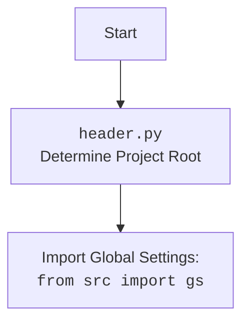

## ИНСТРУКЦИЯ:

Анализируй предоставленный код подробно и объясни его функциональность. Ответ должен включать три раздела:

1. **<алгоритм>**: Опиши рабочий процесс в виде пошаговой блок-схемы, включая примеры для каждого логического блока, и проиллюстрируй поток данных между функциями, классами или методами.
2. **<mermaid>**: Напиши код для диаграммы в формате `mermaid`, проанализируй и объясни все зависимости,
    которые импортируются при создании диаграммы.
    **ВАЖНО!** Убедитесь, что все имена переменных, используемые в диаграмме `mermaid`,
    имеют осмысленные и описательные имена. Имена переменных вроде `A`, `B`, `C`, и т.д., не допускаются!

    **Дополнительно**: Если в коде есть импорт `import header`, добавьте блок `mermaid` flowchart, объясняющий `header.py`:
    ```mermaid
    flowchart TD
        Start --> Header[<code>header.py</code><br> Determine Project Root]

        Header --> import[Import Global Settings: <br><code>from src import gs</code>]
    ```

3. **<объяснение>**: Предоставьте подробные объяснения:
   - **Импорты**: Их назначение и взаимосвязь с другими пакетами `src.`.
   - **Классы**: Их роль, атрибуты, методы и взаимодействие с другими компонентами проекта.
   - **Функции**: Их аргументы, возвращаемые значения, назначение и примеры.
   - **Переменные**: Их типы и использование.
   - Выделите потенциальные ошибки или области для улучшения.

Дополнительно, постройте цепочку взаимосвязей с другими частями проекта (если применимо).

Это обеспечивает всесторонний и структурированный анализ кода.
## Формат ответа: `.md` (markdown)
**КОНЕЦ ИНСТРУКЦИИ**
### <алгоритм>

1.  **Начало**: Исполнение скрипта `header.py` начинается.

2.  **Импорт модулей**:
    *   Импортируются модули `sys`, `json`, `Version` из `packaging.version` и `Path` из `pathlib`.
    *   Пример: `import sys` -  предоставляет доступ к системным функциям и переменным.

3.  **Определение функции `set_project_root`**:
    *   Определение функции, которая находит корневую директорию проекта,
        принимая `marker_files` (файлы или папки для поиска) по умолчанию: `("__root__", ".git")`.
    *   Пример:  `set_project_root(marker_files=('__root__', '.git'))`

4.  **Инициализация `current_path`**:
    *   Определение пути к текущей директории, где находится файл `header.py`,
        с использованием `Path(__file__).resolve().parent`.
    *   Пример: Если файл `header.py` расположен в `/home/user/project/src/suppliers/aliexpress/`,
        `current_path` будет `/home/user/project/src/suppliers/aliexpress/`.

5.  **Инициализация `__root__`**:
    *  Переменной `__root__` присваивается значение `current_path`.
    *  Пример: `__root__` получает значение `/home/user/project/src/suppliers/aliexpress/`.

6.  **Поиск корневой директории**:
    *   Цикл `for` проходит по текущей директории и всем ее родительским директориям.
    *   Проверяется наличие любого из `marker_files` в текущей директории.
    *   Пример: если в `/home/user/project/` есть файл `.git`, то `__root__` будет `/home/user/project/`,
        цикл завершится.

7.  **Обновление `sys.path`**:
    *  Если найденный путь `__root__` не присутствует в `sys.path`, то он добавляется в начало.
    *  Пример: если `__root__` это `/home/user/project/`, то путь `/home/user/project/` добавится в `sys.path`
        для корректного импорта модулей.

8.  **Возврат `__root__`**:
    *   Функция возвращает найденный путь к корневой директории проекта.

9.  **Присвоение значения `__root__`**:
    *   Переменной `__root__` (на уровне модуля) присваивается значение, возвращенное функцией `set_project_root()`.
    *   Пример: `__root__` становится `/home/user/project/`.

10. **Импорт `gs`**:
    *  Импортируется модуль `gs` из пакета `src`.
    *  Пример: `from src import gs`

11. **Инициализация `settings`**:
    *  Переменной `settings` присваивается значение `None`.

12. **Загрузка `settings.json`**:
    *   Блок `try` пытается открыть и загрузить файл `settings.json` из директории `src`
        относительно корневой директории.
    *   Пример: если `__root__` это `/home/user/project/`, то будет попытка открыть `/home/user/project/src/settings.json`.
        `settings` присвоится словарь из содержимого `json`.

13. **Обработка ошибок**:
    *   Если происходит ошибка `FileNotFoundError` или `json.JSONDecodeError` (не удалось открыть файл или декодировать JSON), блок `except` пропускает действие, т.е. `settings` остается `None`.

### <mermaid>

```mermaid
flowchart TD
    Start[Start: <code>header.py</code>] --> FindProjectRootFunction[<code>set_project_root</code><br>Find Project Root Directory]
    FindProjectRootFunction --> InitializeCurrentPath[Initialize: <br> <code>current_path = Path(__file__).resolve().parent</code>]
    InitializeCurrentPath --> InitializeRootPath[Initialize: <br><code>__root__ = current_path</code>]
    InitializeRootPath --> LoopThroughParents[Loop: <br><code>for parent in [current_path] + list(current_path.parents)</code>]
    LoopThroughParents -- CheckIfMarkerExists --> CheckMarkerExists[Check: <br><code>if any((parent / marker).exists() for marker in marker_files)</code>]
    CheckMarkerExists -- Yes --> UpdateRootPath[Update: <br><code>__root__ = parent</code>]
    UpdateRootPath --> BreakLoop[Break Loop]
    CheckMarkerExists -- No --> LoopThroughParents
    BreakLoop --> CheckRootPathInSysPath[Check: <br><code>if __root__ not in sys.path</code>]
    LoopThroughParents -- No Marker --> CheckRootPathInSysPath
    CheckRootPathInSysPath -- Yes --> InsertRootPathInSysPath[Insert: <br><code>sys.path.insert(0, str(__root__))</code>]
    InsertRootPathInSysPath --> ReturnRootPath[Return:<br><code>return __root__</code>]
    CheckRootPathInSysPath -- No --> ReturnRootPath
    ReturnRootPath --> AssignRootModuleVariable[Assign:<br> <code>__root__: Path = set_project_root()</code>]
    AssignRootModuleVariable --> ImportGS[Import:<br><code>from src import gs</code>]
    ImportGS --> InitializeSettingsVariable[Initialize:<br><code>settings:dict = None</code>]
    InitializeSettingsVariable --> TryLoadSettings[Try: <br><code>try: open and load settings.json</code>]
    TryLoadSettings --> SuccessLoadSettings[Success: <code>settings = json.load(settings_file)</code>]
    TryLoadSettings -- FileNotFoundError or JSONDecodeError --> HandleError[Handle Error: <code>pass</code>]
    SuccessLoadSettings --> End[End]
    HandleError --> End
```



### <объяснение>

**Импорты:**

*   `sys`: Модуль `sys` предоставляет доступ к некоторым переменным и функциям, взаимодействующим с интерпретатором Python и системой.
    Используется для изменения `sys.path` для добавления корневой директории проекта.
*   `json`: Модуль `json` используется для работы с данными в формате JSON. В данном коде он используется для загрузки настроек из файла `settings.json`.
*   `packaging.version.Version`: Импортируется класс `Version` для работы с версиями. В этом коде он не используется. Возможно, его планировалось использовать в будущих итерациях разработки.
*   `pathlib.Path`: Класс `Path` предоставляет объектно-ориентированный способ работы с путями к файлам и директориям. Используется для поиска корневой директории и для формирования путей к файлам.

**Функция `set_project_root`:**

*   **Назначение**: Функция определяет корневую директорию проекта.
*   **Аргументы**:
    *   `marker_files` (tuple, по умолчанию `("__root__", ".git")`): Список файлов или директорий, наличие которых указывает на корневую директорию.
*   **Возвращаемое значение**:
    *   `Path`: Объект `Path`, представляющий корневую директорию проекта. Если не удалось определить, возвращается текущая директория.
*   **Логика**:
    1.  Определяется путь к директории, в которой расположен файл `header.py` ( `current_path`).
    2.  Изначально предполагается, что корневая директория это `current_path`.
    3.  Функция итерируется по текущей директории и ее родительским директориям.
    4.  Если в какой-либо директории найден один из `marker_files`, она становится корневой, цикл прерывается.
    5.  Если корневая директория не находится в `sys.path`, добавляет ее в начало.
    6.  Возвращается корневая директория.

**Переменные:**

*   `__root__` (Path):  Содержит путь к корневой директории проекта. Находится на уровне модуля.
*   `settings` (dict или None): Содержит словарь с настройками из `settings.json`. Если файл не найден или ошибка чтения `json`, то присваивается `None`.
*   `current_path` (Path): Содержит путь к текущей директории, где находится `header.py`.

**Классы:**

*   Классов нет.

**Взаимосвязь с другими частями проекта:**

*   Функция `set_project_root()` является основой для определения корневой директории, от которой строятся все остальные пути проекта.
*   Модуль `gs` используется для доступа к глобальным настройкам проекта, и его использование зависит от того, что определено в его модуле.
*   Загрузка `settings.json` позволяет настраивать поведение программы из внешнего файла.

**Потенциальные ошибки и области для улучшения:**

*   Обработка ошибок при чтении `settings.json` слишком проста (просто пропускает ошибку).
    В дальнейшем можно добавить логирование ошибки или использовать значения по умолчанию.
*   Использование `...` в `except` — плохая практика, лучше явно указывать `pass` или записывать ошибку в лог.
*   Возможно, стоит добавить более гибкую настройку `marker_files` (например, возможность указания через переменную окружения или аргументы командной строки).

**Цепочка взаимосвязей с другими частями проекта:**

1.  `header.py` определяет корневую директорию проекта.
2.  Корневая директория используется для импорта `src.gs`, который, в свою очередь, может определять конфигурацию приложения.
3.  `settings.json` может использоваться для хранения параметров конфигурации для разных частей приложения.
4.  Все остальные модули проекта используют корневую директорию, определенную в `header.py`.

Таким образом, `header.py` является ключевым компонентом, обеспечивающим правильную загрузку и конфигурацию всего проекта.