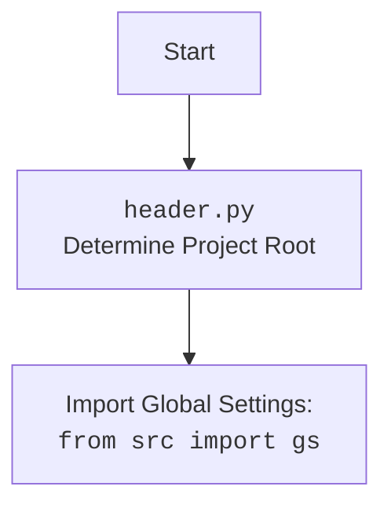

## <алгоритм>

1.  **`set_project_root(marker_files)`**:
    *   Начало: Функция вызывается с кортежем `marker_files` (по умолчанию `('__root__', '.git')`).
    *   Определение текущего пути: Получается абсолютный путь к директории, где находится текущий файл (`header.py`).
    *   Инициализация корневого пути: Переменная `__root__` инициализируется текущим путем.
    *   Поиск родительских директорий: Цикл перебирает текущую директорию и все её родительские директории.
        *   Проверка маркеров: Для каждой директории проверяется, существует ли в ней хотя бы один из файлов/директорий, указанных в `marker_files`.
        *   Обновление корневого пути: Если маркер найден, `__root__` обновляется до этой родительской директории, и цикл прерывается.
    *   Добавление в `sys.path`: Если найденный корневой путь (`__root__`) еще не присутствует в списке путей поиска модулей (`sys.path`), то он добавляется в начало списка.
    *   Возврат: Функция возвращает найденный корневой путь (`__root__`).
    
    *Пример:*
    *   Файл `header.py` находится в `/home/user/project/src/suppliers/amazon`.
    *   В `/home/user/project` находится файл `__root__`.
    *   Функция вернет `/home/user/project`.
2.  **Инициализация `__root__`**:
    *   Вызов `set_project_root()`: Вызывается функция `set_project_root()`, которая возвращает корневую директорию проекта.
    *   Сохранение: Возвращенное значение сохраняется в глобальной переменной `__root__`.
3.  **Загрузка `settings.json`**:
    *   Попытка открытия файла: Пытается открыть файл `settings.json`, расположенный в директории `src` относительно корневой директории проекта (`__root__/src/settings.json`).
    *   Загрузка JSON: Если файл открыт успешно, его содержимое загружается как словарь JSON в переменную `settings`.
    *   Обработка ошибок: Если файл не найден или не является валидным JSON, возникает `FileNotFoundError` или `json.JSONDecodeError`. В этом случае исключение игнорируется (используется `...`).
4.  **Загрузка `README.MD`**:
    *   Попытка открытия файла: Пытается открыть файл `README.MD`, расположенный в директории `src` относительно корневой директории проекта (`__root__/src/README.MD`).
    *   Чтение содержимого: Если файл открыт успешно, его содержимое считывается в строковую переменную `doc_str`.
    *   Обработка ошибок: Если файл не найден, возникает `FileNotFoundError` или `json.JSONDecodeError`. В этом случае исключение игнорируется (используется `...`).
5.  **Инициализация глобальных переменных**:
    *   `__project_name__`: Если `settings` загружен, извлекает значение ключа "project_name" (по умолчанию "hypotez"). Иначе устанавливается в "hypotez".
    *   `__version__`: Если `settings` загружен, извлекает значение ключа "version" (по умолчанию пустая строка). Иначе устанавливается в пустую строку.
    *   `__doc__`: Устанавливается в значение `doc_str`, если оно есть, иначе в пустую строку.
    *   `__details__`: Инициализируется пустой строкой.
    *   `__author__`: Если `settings` загружен, извлекает значение ключа "author" (по умолчанию пустая строка). Иначе устанавливается в пустую строку.
    *   `__copyright__`: Если `settings` загружен, извлекает значение ключа "copyrihgnt" (по умолчанию пустая строка). Иначе устанавливается в пустую строку.
    *   `__cofee__`: Если `settings` загружен, извлекает значение ключа "cofee" (по умолчанию ссылка на boosty). Иначе устанавливается ссылка на boosty.

## <mermaid>

```mermaid
flowchart TD
    Start[Start] --> FindRoot[set_project_root(marker_files)];
    FindRoot --> CheckMarkers[Check for marker files in parent directories];
    CheckMarkers -- Marker found --> SetRoot[Set project root];
    CheckMarkers -- No marker found --> UseCurrentDir[Use current directory as root];
    SetRoot --> AddToSysPath[Add root to sys.path];
    UseCurrentDir --> AddToSysPath
    AddToSysPath --> LoadSettings[Load settings.json];
    LoadSettings -- Success --> LoadReadme[Load README.MD];
    LoadSettings -- Failure --> LoadReadme;
    LoadReadme -- Success --> InitVars[Initialize global variables from settings];
    LoadReadme -- Failure --> InitVars;
    InitVars --> End[End];
    
   
    
    classDef important fill:#f9f,stroke:#333,stroke-width:2px;
    class Start, FindRoot, CheckMarkers, SetRoot, UseCurrentDir, AddToSysPath, LoadSettings, LoadReadme, InitVars, End important;
```



## <объяснение>

**Импорты:**

*   `import sys`: Модуль `sys` используется для доступа к системным переменным и функциям, в частности, для добавления пути к проекту в `sys.path`.
*   `import json`: Модуль `json` используется для работы с JSON-данными, конкретно для загрузки настроек из файла `settings.json`.
*    `from packaging.version import Version`: Модуль `packaging.version` используется для работы с версиями.
*   `from pathlib import Path`: Модуль `pathlib` предоставляет удобный способ работы с путями к файлам и директориям.

**Функция `set_project_root(marker_files)`:**

*   **Аргументы**:
    *   `marker_files` (tuple): Кортеж строк, представляющих имена файлов или директорий, которые используются для определения корневой директории проекта. По умолчанию `('__root__', '.git')`.
*   **Возвращаемое значение**:
    *   `Path`: Объект `Path`, представляющий корневую директорию проекта. Если маркеры не найдены, возвращается директория, в которой находится скрипт.
*   **Назначение**:
    Функция `set_project_root` определяет корневую директорию проекта. Она начинает поиск от директории, в которой находится текущий файл (`header.py`), и поднимается вверх по иерархии каталогов, пока не найдет каталог, содержащий один из файлов или директорий, указанных в `marker_files`. Это позволяет скрипту работать правильно независимо от того, в какой поддиректории он находится. После определения корневой директории, она добавляется в `sys.path`, что позволяет импортировать модули из других частей проекта.

**Глобальные переменные:**

*   `__root__` (Path): Абсолютный путь к корневой директории проекта, вычисляется с помощью функции `set_project_root()`.
*   `settings` (dict): Словарь, загруженный из файла `settings.json`. Содержит настройки проекта, может быть `None`, если загрузка не удалась.
*   `doc_str` (str): Строка, содержащая содержимое файла `README.MD`, может быть `None`, если загрузка не удалась.
*   `__project_name__` (str): Название проекта, извлекается из `settings` или "hypotez", если `settings` не загружен.
*   `__version__` (str): Версия проекта, извлекается из `settings` или пустая строка, если `settings` не загружен.
*   `__doc__` (str): Строка документации проекта, извлекается из `doc_str` или пустая строка, если `doc_str` не загружен.
*  `__details__` (str): Строка с деталями проекта, инициализируется пустой строкой.
*   `__author__` (str): Автор проекта, извлекается из `settings` или пустая строка, если `settings` не загружен.
*   `__copyright__` (str): Информация об авторских правах, извлекается из `settings` или пустая строка, если `settings` не загружен.
*   `__cofee__` (str): Призыв угостить разработчика кофе, извлекается из `settings` или ссылка на boosty, если `settings` не загружен.

**Цепочка взаимосвязей с другими частями проекта:**

*   `from src import gs`: Импортирует глобальные настройки (`gs`) из пакета `src`. Это позволяет получить доступ к общим переменным и настройкам проекта. В частности, `gs.path.root` используется для доступа к корневой директории, определенной в `set_project_root`.
*   Использование `settings`: Загруженные настройки из `settings.json` используются для инициализации глобальных переменных, таких как название проекта, версия и т.д. Это позволяет настраивать проект через файл конфигурации.

**Потенциальные ошибки и области для улучшения:**

*   **Обработка исключений при загрузке JSON и README**:
    *   В настоящее время ошибки при загрузке `settings.json` и `README.MD` обрабатываются с помощью `...` (пропуск исключения), что может скрыть проблемы и затруднить отладку.
    *   Было бы полезно добавить более конкретную обработку исключений, например, вывод предупреждающего сообщения в консоль или использование значений по умолчанию в случае ошибки загрузки.
*   **Отсутствие валидации `settings.json`**:
    *   Код предполагает, что `settings.json` содержит нужные ключи. Если файл настроек не содержит, например, `project_name` или `version`, то переменные могут быть инициализированы значениями по умолчанию.
    *   Возможно, следует добавить валидацию файла `settings.json` для проверки наличия необходимых ключей и их типов.
*   **Зависимость от структуры проекта**:
    *   Код предполагает, что `settings.json` и `README.MD` находятся в `src` директории. Изменение структуры проекта может привести к ошибкам.
    *   Можно сделать пути к этим файлам настраиваемыми через переменные окружения или другие настройки.
*  **Использование `__doc__`:**
    *  Использование `__doc__` для документации проекта, возможно, не совсем корректно, так как `__doc__` предназначен для описания текущего модуля. Было бы лучше использовать другой механизм для хранения и доступа к описанию проекта.
* **Неявная зависимость от `src`**:
  *  Код неявно предполагает наличие папки `src`, при этом не учитывая, что структура проекта может быть другой. Это может привести к ошибкам при изменении структуры проекта.

**Дополнительные замечания:**

*   Код инициализирует глобальные переменные модуля, которые используются для получения базовой информации о проекте.
*   Функция `set_project_root` является важной частью проекта, так как обеспечивает правильную работу скрипта в различных условиях.
*   Использование `pathlib` делает код более читабельным и менее подверженным ошибкам, связанным с работой с путями.