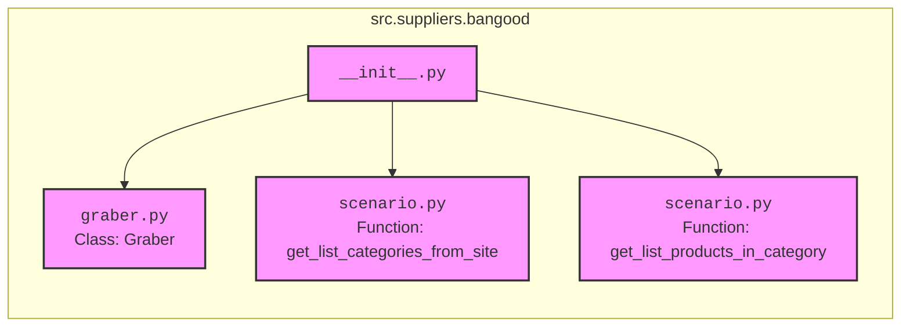

## АНАЛИЗ КОДА: `src/suppliers/bangood/__init__.py`

### 1. <алгоритм>

**Блок-схема:**

**Описание:**

1.  **Начало**:  Начало выполнения модуля `__init__.py`.
2.  **Импорт `Graber`**: Импортируется класс `Graber` из модуля `graber.py`. Этот класс, вероятно, отвечает за парсинг веб-страниц.
3.  **Импорт `get_list_categories_from_site`**: Импортируется функция `get_list_categories_from_site` из модуля `scenario.py`. Эта функция, вероятно, используется для получения списка категорий товаров с сайта Banggood.
4.  **Импорт `get_list_products_in_category`**: Импортируется функция `get_list_products_in_category` из модуля `scenario.py`. Эта функция, вероятно, используется для получения списка товаров из определенной категории сайта Banggood.
5.  **Конец**:  Конец выполнения модуля `__init__.py`.

**Примеры:**

-   `Graber`: Объект этого класса можно создать для извлечения данных с веб-страницы, используя, например, методы для поиска элементов DOM.
-   `get_list_categories_from_site`: Функция может быть вызвана без параметров и возвращать список словарей, где каждый словарь представляет категорию.
-   `get_list_products_in_category`: Функция принимает на вход ID категории и возвращает список словарей, где каждый словарь представляет товар в данной категории.

### 2. <mermaid>

**Объяснение зависимостей:**

-   `__init__.py` -  Главный модуль пакета `bangood`.
-   `graber.py` - Содержит класс `Graber`, который предположительно используется для парсинга веб-страниц.
-   `scenario.py` - Содержит функции `get_list_categories_from_site` и `get_list_products_in_category`, отвечающие за извлечение данных с сайта Banggood.

### 3. <объяснение>

**Импорты:**

-   `from .graber import Graber`: Импортирует класс `Graber` из модуля `graber.py`, находящегося в том же каталоге, что и `__init__.py`. Этот класс, скорее всего, используется для парсинга HTML-страниц, извлечения данных, и, вероятно, взаимодействует с модулем `requests` (или аналогичным) для получения HTML-контента.
-   `from .scenario import get_list_categories_from_site, get_list_products_in_category`: Импортирует две функции из модуля `scenario.py`. Эти функции, вероятно, реализуют сценарии для получения данных с сайта Banggood: список категорий и список продуктов в каждой категории. Взаимодействуют с модулем `graber` и могут использовать библиотеки для обработки HTML или JSON.

**Классы:**

-   `Graber`: Это класс, который, судя по имени, отвечает за извлечение данных (парсинг) со страниц веб-сайта Banggood. Скорее всего, он имеет методы для отправки HTTP-запросов, парсинга HTML-кода и извлечения необходимой информации.

**Функции:**

-   `get_list_categories_from_site`: Функция, предназначенная для получения списка категорий с сайта Banggood.  Она может использовать `Graber` для получения HTML-кода главной страницы и последующего парсинга для извлечения списка категорий. Возвращает структурированные данные, например, список словарей, где каждый словарь представляет категорию (имя, URL, ID).
-   `get_list_products_in_category`: Функция, предназначенная для получения списка товаров из определенной категории на сайте Banggood. Принимает на вход идентификатор категории, и используя `Graber`, получает и парсит страницу с товарами, формируя список товаров с их описанием, ценой, ссылками, и т.д. Возвращает список словарей, где каждый словарь представляет товар.

**Переменные:**

В данном коде не определено переменных. Переменные будут использоваться внутри `graber.py` и `scenario.py` для хранения результатов парсинга, URL-ов и других данных.

**Взаимосвязи с другими частями проекта:**

-   `src.suppliers`: Данный пакет `bangood` является частью более общего пакета `src.suppliers`, который, вероятно, отвечает за интеграцию с различными поставщиками.
-   `src`:  Пакет `src` является корнем проекта и, вероятно, содержит общие настройки, утилиты и другие общие для всего проекта модули.

**Потенциальные ошибки и области для улучшения:**

-   **Обработка ошибок**: В коде не представлена обработка ошибок, например, при неудачных HTTP-запросах или проблемах парсинга HTML. Необходимо добавить обработку исключений.
-   **Устойчивость к изменениям сайта**: Код зависит от структуры HTML-страниц сайта Banggood. Любые изменения на сайте могут привести к поломке парсера. Можно сделать код более гибким, используя CSS-селекторы или XPath и добавив логику повторных попыток.
-   **Масштабируемость**: Если нужно парсить много данных, могут потребоваться оптимизации, например, использование асинхронного программирования.

**Цепочка взаимосвязей:**

`src` -> `suppliers` -> `bangood` -> `graber.py`, `scenario.py`

Вся структура предназначена для получения данных из сайта bangood, с последующей возможностью  их  обработки и использования в других частях проекта.