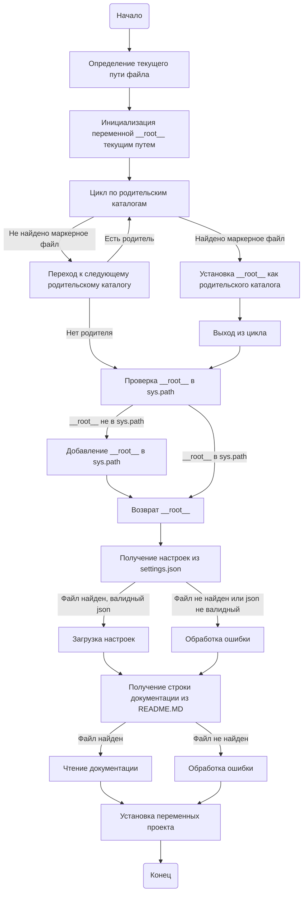

## ИНСТРУКЦИЯ:

Анализируй предоставленный код подробно и объясни его функциональность. Ответ должен включать три раздела:

1. **<алгоритм>**: Опиши рабочий процесс в виде пошаговой блок-схемы, включая примеры для каждого логического блока, и проиллюстрируй поток данных между функциями, классами или методами.
2. **<mermaid>**: Напиши код для диаграммы в формате `mermaid`, проанализируй и объясни все зависимости,
    которые импортируются при создании диаграммы.
    **ВАЖНО!** Убедитесь, что все имена переменных, используемые в диаграмме `mermaid`,
    имеют осмысленные и описательные имена. Имена переменных вроде `A`, `B`, `C`, и т.д., не допускаются!

    **Дополнительно**: Если в коде есть импорт `import header`, добавьте блок `mermaid` flowchart, объясняющий `header.py`:
    ```mermaid
    flowchart TD
        Start --> Header[<code>header.py</code><br> Determine Project Root]

        Header --> import[Import Global Settings: <br><code>from src import gs</code>]
    ```

3. **<объяснение>**: Предоставьте подробные объяснения:
   - **Импорты**: Их назначение и взаимосвязь с другими пакетами `src.`.
   - **Классы**: Их роль, атрибуты, методы и взаимодействие с другими компонентами проекта.
   - **Функции**: Их аргументы, возвращаемые значения, назначение и примеры.
   - **Переменные**: Их типы и использование.
   - Выделите потенциальные ошибки или области для улучшения.

Дополнительно, постройте цепочку взаимосвязей с другими частями проекта (если применимо).

Это обеспечивает всесторонний и структурированный анализ кода.
## Формат ответа: `.md` (markdown)
**КОНЕЦ ИНСТРУКЦИИ**
## <алгоритм>



**Примеры:**

1. **SetCurrentPath:** Если файл `header.py` находится по пути `/home/user/project/src/suppliers/bangood/header.py`, то `current_path` будет равен `/home/user/project/src/suppliers/bangood`.
2. **LoopThroughParents:**
   - Первый родитель: `/home/user/project/src/suppliers`
   - Второй родитель: `/home/user/project/src`
   - Третий родитель: `/home/user/project`
   - Предположим, что в `/home/user/project` есть файл `__root__` или директория `.git`, тогда цикл прервется, а `__root__` будет равен `/home/user/project`.
3. **CheckRootInSysPath:** Если `/home/user/project` уже есть в `sys.path`, то ничего не произойдет.
4. **GetSettings:** Если файл `/home/user/project/src/settings.json` существует и содержит валидный JSON, он будет загружен в переменную `settings`.
5. **SetProjectInfo:** Переменные, такие как `__project_name__`, `__version__`, будут получены из `settings` или установлены значения по умолчанию (например, "hypotez" для `__project_name__`).
## <mermaid>
```mermaid
flowchart TD
    Start --> SetProjectRootFunction[<code>set_project_root()</code><br> Найти корень проекта]
    SetProjectRootFunction --> GetCurrentFilePath[Определение пути текущего файла: <code>__file__</code>]
    GetCurrentFilePath --> InitializeRootPath[Инициализация <code>__root__</code> текущим путем]
    InitializeRootPath --> LoopThroughParents[Цикл по родительским каталогам]
    LoopThroughParents -- Найдено маркерное файл --> SetRootPath[Установка <code>__root__</code> как родительского каталога]
    SetRootPath --> BreakLoop[Выход из цикла]
    LoopThroughParents -- Не найдено маркерное файл --> NextParent[Переход к следующему родительскому каталогу]
    NextParent -- Есть родитель --> LoopThroughParents
    NextParent -- Нет родителя --> CheckRootInSysPath[Проверка <code>__root__</code> в <code>sys.path</code>]
    BreakLoop --> CheckRootInSysPath
    CheckRootInSysPath -- <code>__root__</code> не в <code>sys.path</code> --> InsertRootToSysPath[Добавление <code>__root__</code> в <code>sys.path</code>]
    InsertRootToSysPath --> ReturnRootPath[Возврат <code>__root__</code>]
    CheckRootInSysPath -- <code>__root__</code> в <code>sys.path</code> --> ReturnRootPath
    ReturnRootPath --> SetGlobalRootVariable[Установка глобальной переменной: <br><code>__root__: Path = set_project_root()</code>]
    SetGlobalRootVariable --> ImportGlobalSettings[Импорт глобальных настроек: <code>from src import gs</code>]
    ImportGlobalSettings --> ReadSettingsFile[Чтение файла настроек: <br> <code>settings.json</code>]
    ReadSettingsFile --> HandleSettings[Обработка настроек и ошибок]
    HandleSettings --> ReadDocFile[Чтение файла документации: <code>README.MD</code>]
     ReadDocFile --> HandleDocStr[Обработка документации и ошибок]
    HandleDocStr --> SetProjectVariables[Установка глобальных переменных проекта: <br><code>__project_name__</code>, <code>__version__</code>, etc.]
    SetProjectVariables --> End
    

    
   
    classDef fileStyle fill:#f9f,stroke:#333,stroke-width:2px
    classDef funcStyle fill:#ccf,stroke:#333,stroke-width:2px
    class SetProjectRootFunction,GetCurrentFilePath,InitializeRootPath,LoopThroughParents,SetRootPath,NextParent,CheckRootInSysPath,InsertRootToSysPath,ReturnRootPath,HandleSettings,HandleDocStr funcStyle
    class ReadSettingsFile,ReadDocFile fileStyle
```

```mermaid
    flowchart TD
        Start --> Header[<code>header.py</code><br> Determine Project Root]
    
        Header --> import[Import Global Settings: <br><code>from src import gs</code>]
    ```

**Анализ зависимостей:**

*   `sys`: Модуль `sys` используется для работы с системными параметрами и функциями, в частности, для добавления пути к проекту в список путей поиска модулей (`sys.path`). Это позволяет импортировать модули из проекта, как если бы они были установлены.
*   `json`: Модуль `json` используется для работы с файлами в формате JSON, в частности, для чтения файла `settings.json`, содержащего настройки проекта.
*   `packaging.version.Version`: Используется для сравнения версий, но в данном коде не используется.
*   `pathlib.Path`:  `Path` используется для представления путей к файлам и директориям в виде объектов, что упрощает операции с файловой системой (создание, удаление, чтение и т.д.).

## <объяснение>

**Импорты:**

*   `sys`: Используется для модификации `sys.path`, чтобы добавить корневую директорию проекта, позволяя Python находить модули из проекта.
*   `json`: Используется для чтения данных из файла `settings.json`.
*   `packaging.version.Version`: Хотя импортирован, в данном коде не используется.
*  `pathlib.Path`:  Обеспечивает объектно-ориентированный способ работы с файловой системой, делая код более читаемым и лаконичным.

**Функции:**

*   `set_project_root(marker_files=('__root__', '.git')) -> Path`:
    *   **Аргументы:** `marker_files` – кортеж с именами файлов/директорий, которые отмечают корень проекта. По умолчанию это `'__root__'` и `'.git'`.
    *   **Возвращаемое значение:** `Path` – объект, представляющий путь к корневой директории проекта, либо путь к директории, где находится файл, если корень не найден.
    *   **Назначение:** Функция ищет корень проекта путем подъема по дереву директорий от текущего файла, останавливаясь на первой директории, содержащей один из указанных маркерных файлов.
    *   **Пример:** Если файл находится в `/path/to/project/src/suppliers/bangood/header.py`, а в `/path/to/project` есть файл `__root__`, то функция вернет `Path('/path/to/project')`.
*   Использование `__file__`: Переменная `__file__` является встроенной и содержит путь к текущему файлу. `Path(__file__).resolve().parent` получает абсолютный путь к директории, содержащей текущий файл.

**Переменные:**

*   `__root__`: Глобальная переменная типа `Path`, хранящая абсолютный путь к корневой директории проекта.
*   `settings`: Словарь, содержащий настройки проекта, загруженные из файла `settings.json`. Если файл не найден или не удалось распарсить JSON, `settings` остается `None`.
*   `doc_str`: Строка, содержащая контент из файла `README.MD`. Если файл не найден, `doc_str` остается `None`.
*   `__project_name__`, `__version__`, `__doc__`, `__details__`, `__author__`, `__copyright__`, `__cofee__`: Глобальные строковые переменные, содержащие метаданные проекта, которые загружаются из файла `settings.json`, если он существует, или устанавливаются значения по умолчанию.

**Потенциальные ошибки и области для улучшения:**

1.  **Обработка ошибок:**
    *   В коде используется `try-except` для обработки `FileNotFoundError` и `json.JSONDecodeError` при чтении `settings.json` и `README.MD`. Однако, обработка заключается в `pass`, что может скрыть проблемы.
    *  Рекомендуется добавить более информативное логирование ошибок или использовать значения по умолчанию. Например, вместо `...` можно использовать `logging.error(f"Error reading file: {e}")`.
2.  **Жестко заданные пути:**
    *   Путь к файлу `settings.json` жестко задан как `gs.path.root / 'src' / 'settings.json'`. Это может стать проблемой, если структура проекта изменится. Рассмотрите возможность настройки путей через переменные окружения или конфигурационные файлы.
3.  **Отсутствие типа переменных:**
    *   Некоторые переменные, такие как `doc_str`, `settings`  не имеют аннотаций типов. Это можно исправить, указав типы переменных для лучшей читаемости и проверки.
4.  **`packaging.version`:**
    *   `packaging.version` импортирован, но не используется. Рекомендуется удалить ненужный импорт.
5.  **Универсальность `marker_files`:**
    *   `marker_files` задан по умолчанию, но  можно было бы сделать его настраиваемым через переменные среды, что обеспечило бы большую гибкость.

**Взаимосвязь с другими частями проекта:**

*   `from src import gs`: Этот импорт указывает на связь с модулем `gs` (предположительно `global_settings`), который должен содержать глобальные настройки проекта.
*   Код отвечает за настройку окружения проекта, предоставляя корневую директорию (`__root__`) и основные метаданные, которые используются в других частях проекта.
*   Использование `settings.json` предполагает наличие конфигурационного файла, который может влиять на работу различных частей проекта.

**Улучшения:**

1.  **Логирование:** Добавить логирование для ошибок и важных событий.
2.  **Конфигурация:** Сделать пути и маркерные файлы настраиваемыми.
3.  **Типизация:** Добавить аннотацию типов.
4.  **Обработка ошибок:** Сделать обработку ошибок более информативной.
5. **Использовать `os.path`:** Вместо `pathlib`, там где это уместно, можно использовать модуль `os.path` для гибкости.

В целом, этот файл предназначен для определения корня проекта и загрузки базовой информации о нем. Код работает, но имеет области для улучшения в плане обработки ошибок, конфигурации и гибкости.