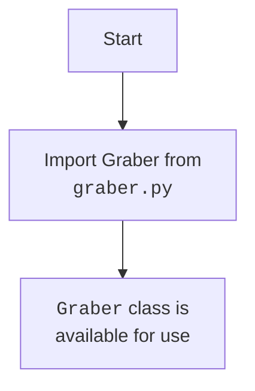

## АНАЛИЗ КОДА: `hypotez/src/suppliers/cdata/__init__.py`

### 1. <алгоритм>

**Общая схема:**

1.  **Импорт модуля `graber`**: Из текущего пакета `src.suppliers.cdata` импортируется модуль `graber`.
2.  **Использование `Graber`**: После импорта класс `Graber` становится доступным для использования в других частях пакета или проекта, где импортируется `src.suppliers.cdata`.

**Пример:**
```python
from src.suppliers.cdata import Graber

# Создание экземпляра класса Graber
my_graber = Graber()

# Использование методов класса Graber
my_graber.some_method()
```
**Поток данных:**

`__init__.py` (этот файл) ---> `graber.py` (импорт модуля)
       |
       V
  `Graber` (класс) доступен для использования в других частях проекта.

### 2. <mermaid>


**Объяснение:**

*   `Start`: Начало процесса импорта.
*   `ImportGraber`: Импорт модуля `graber.py`, содержащего класс `Graber`.
*   `GraberClassAvailable`: Указывает, что класс `Graber` теперь доступен для использования в других частях проекта, где импортирован пакет `src.suppliers.cdata`.

### 3. <объяснение>

*   **Импорты:**
    *   `from .graber import Graber`: Этот оператор импортирует класс `Graber` из модуля `graber.py`, находящегося в том же пакете `src.suppliers.cdata`. Использование `.` обозначает относительный импорт в рамках текущего пакета. Это позволяет использовать `Graber` в других модулях, которые импортируют `src.suppliers.cdata`.
*   **Классы:**
    *   `Graber`: Класс `Graber` предположительно находится в файле `graber.py` и отвечает за какую-либо операцию сбора или обработки данных. `__init__.py` просто делает этот класс доступным для внешнего использования. Детали о самом классе можно найти в файле `graber.py`.
*   **Функции:**
    *   В этом файле (`__init__.py`) нет функций. Его главная цель – управление пространством имен пакета и предоставление доступа к классам и функциям из модулей пакета.
*   **Переменные:**
    *   Файл не содержит переменных.

**Дополнительное объяснение:**

Файл `__init__.py` в Python играет роль инициализирующего файла для пакета. Когда вы импортируете пакет, Python в первую очередь выполняет код в файле `__init__.py`, что позволяет:
1. Управлять импортом: можно импортировать определенные классы и функции, чтобы сделать их сразу доступными для внешнего кода, импортирующего пакет.
2. Инициализировать пакет: можно добавить логику инициализации, которая будет выполнена один раз при первом импорте пакета.

В данном случае, `__init__.py` делает класс `Graber` доступным через импорт `src.suppliers.cdata`, что позволяет пользователям этого пакета легко создавать экземпляры класса `Graber`, не зная деталей его расположения внутри пакета.

**Цепочка взаимосвязей:**

1.  Другие модули в `src.suppliers` или в других частях проекта могут импортировать `src.suppliers.cdata`, что позволит использовать класс `Graber`:
```python
    from src.suppliers.cdata import Graber
    instance = Graber()
```
2.  Взаимосвязь с `graber.py`:  `__init__.py` зависит от существования `graber.py` в том же пакете. Сам `graber.py` может иметь свои зависимости и выполнять какие-либо специфические действия.