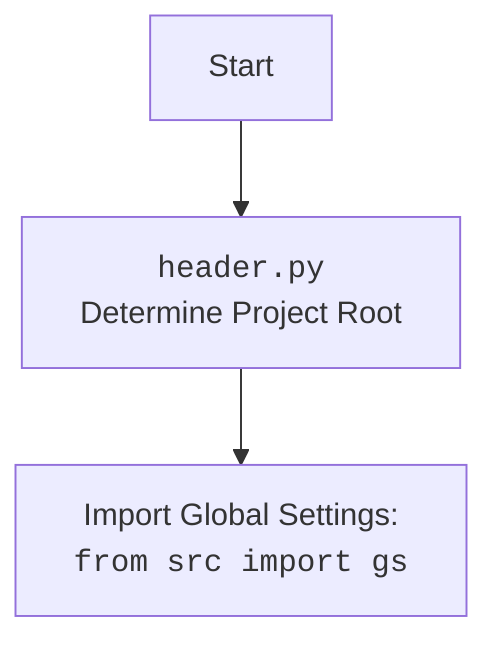

## АНАЛИЗ КОДА: `src/suppliers/chat_gpt/chat_gpt.py`

### 1. <алгоритм>

**Блок-схема:**

```
flowchart TD
    A[Start: Инициализация] --> B(Определение пути к директории с беседами: `conversation_directory = Path(gs.path.data / 'chat_gpt' / 'conversations')`);
    B --> C(Поиск HTML-файлов в директории: `html_files = conversation_directory.glob("*.html")`);
    C --> D[Конец: Итератор html файлов]
    
    style A fill:#f9f,stroke:#333,stroke-width:2px
    style B fill:#ccf,stroke:#333,stroke-width:2px
    style C fill:#ccf,stroke:#333,stroke-width:2px
    style D fill:#f9f,stroke:#333,stroke-width:2px
```

**Примеры:**

1.  **Инициализация:** Класс `ChatGpt` инициализируется.
2.  **Определение пути к директории с беседами:**
    *   `gs.path.data` может, например, возвращать `/path/to/project/data`.
    *   Результатом будет `Path('/path/to/project/data/chat_gpt/conversations')`.
3.  **Поиск HTML-файлов:**
    *   Функция `glob("*.html")` ищет все файлы с расширением `.html` в указанной директории.
    *   `html_files` будет итератором, который может выдать, например, `['/path/to/project/data/chat_gpt/conversations/file1.html', '/path/to/project/data/chat_gpt/conversations/file2.html']`

### 2. <mermaid>

```mermaid
flowchart TD
    Start[Start: Class Initialization] --> SetPath[Set Conversation Directory Path:<br> `conversation_directory = Path(gs.path.data / 'chat_gpt' / 'conversations')`];
    SetPath --> FindHtml[Find HTML Files:<br> `html_files = conversation_directory.glob("*.html")`];
    FindHtml --> End[End: Yield HTML Files]
    
    classDef process fill:#ccf,stroke:#333,stroke-width:2px;
    class SetPath, FindHtml process;
    
    
    linkStyle default stroke:#333,stroke-width:2px
```


**Объяснение зависимостей `mermaid`:**

*   `Start`: Начало процесса инициализации класса `ChatGpt`.
*   `SetPath`: Определяется путь к директории, где хранятся файлы бесед. Используется `gs.path.data` для получения базового пути к данным, добавляются подкаталоги 'chat\_gpt' и 'conversations'.
*   `FindHtml`: Ищет все HTML-файлы (`*.html`) в директории, определенной на предыдущем шаге.
*   `End`: Конец процесса, метод возвращает итератор найденных HTML-файлов.

**Дополнительно**
*   `Start` - начало процесса, определяет корень проекта.
*   `Header` -  `header.py` определяет корень проекта.
*   `import` -  импортирует глобальные настройки.

### 3. <объяснение>

**Импорты:**

*   `import header`: Импортирует модуль `header`, который, вероятно, используется для определения корневого пути проекта и настройки среды.
*   `from pathlib import Path`: Импортирует класс `Path` из модуля `pathlib`, который используется для работы с файловыми путями. Это позволяет создавать и манипулировать путями к файлам и директориям в кросс-платформенном стиле.
*   `from src import gs`: Импортирует модуль `gs` из пакета `src`, который, вероятно, содержит глобальные настройки проекта, включая пути к каталогам.
*   `from src.utils.file import recursively_read_text_files`: Импортирует функцию `recursively_read_text_files` для рекурсивного чтения текстовых файлов из директории.  (но в данном коде не используется)

**Классы:**

*   `class ChatGpt:`
    *   **Роль:** Класс `ChatGpt` предназначен для обработки данных, связанных с чат-ботом ChatGPT, например, поиск и обработка HTML-файлов бесед.
    *   **Атрибуты:** В текущем коде нет явно определенных атрибутов, но класс может хранить настройки или другие параметры, связанные с ChatGPT.
    *   **Методы:**
        *   `yeld_conversations_htmls(self) -> str`: Это метод-генератор (yield), который  должен возвращать итерируемый объект. В данном случае он итерирует HTML файлы.  Он использует `gs.path.data` для получения базового пути к данным, а затем формирует путь к каталогу с беседами ChatGPT и находит все HTML-файлы в нем.

**Функции:**

*   `yeld_conversations_htmls(self) -> str:`
    *   **Аргументы:** `self` (ссылка на экземпляр класса).
    *   **Возвращаемое значение:** Итератор html файлов в виде строк.
    *   **Назначение:**  Метод генерирует пути к HTML-файлам, которые содержат беседы, сохраненные ChatGPT.
    *   **Пример:** Если `gs.path.data` возвращает `/path/to/project/data`, и в `/path/to/project/data/chat_gpt/conversations` есть файлы `file1.html` и `file2.html`, метод вернет итератор с путями к этим файлам.

**Переменные:**

*   `conversation_directory` (тип: `pathlib.Path`): Переменная хранит путь к директории с беседами ChatGPT.
*   `html_files` (тип: итератор ): Переменная хранит итератор, содержащий объекты `Path` для каждого HTML-файла, найденного в директории `conversation_directory`.

**Потенциальные ошибки и области для улучшения:**

1.  **Обработка исключений:** В коде нет обработки исключений, например, если директория `conversation_directory` не существует. Следует добавить try-except блоки.
2.  **Тип возвращаемого значения:** Метод `yeld_conversations_htmls` объявлен как возвращающий `str`, но на самом деле он должен возвращать `Iterator[str]` так как используется `yield`, т.е. генератор.
3.  **Использование `recursively_read_text_files`**: Функция импортируется, но не используется в текущей версии кода.
4.  **Неполная функциональность:** Метод `yeld_conversations_htmls`  закончен, но не возвращает  текст из html-файлов,  стоит доработать.
5.  **Отсутствие комментариев**: Стоит добавлять комментарии для более простого понимания кода.

**Взаимосвязь с другими частями проекта:**

*   Модуль зависит от `src.gs` для получения глобальных настроек и путей.
*   Модуль зависит от `header.py` для определения корня проекта.
*   Он использует `pathlib.Path` для кроссплатформенной работы с файловыми путями.
*   Класс `ChatGpt` может быть использован другими модулями или классами для получения списка HTML-файлов бесед ChatGPT.