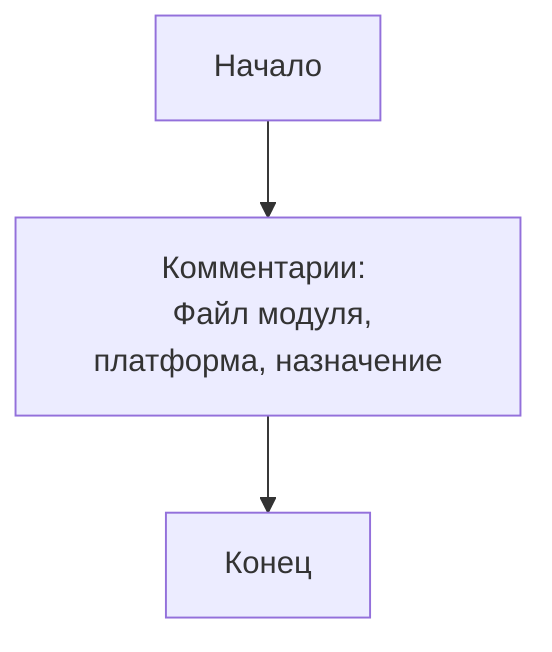

## <алгоритм>

Представленный код является пустым файлом Python с комментариями, которые, по-видимому, предназначены для документирования модуля.  Алгоритмически, файл не содержит выполняемого кода, поэтому блок-схема будет очень простой:

1. **Начало**:  Файл `gemini_trainer.py` открывается для интерпретации.
2. **Комментарии**:  Интерпретатор Python игнорирует все строки, начинающиеся с `#` и многострочные комментарии `""" ... """`. Эти комментарии содержат информацию о модуле, его платформе и назначении, но не приводят к выполнению каких-либо действий.
3. **Конец**: Файл заканчивается, не выполняя никаких операций.

Пример:

```
Начало -> Комментарии (информация о модуле, платформе, назначении) -> Конец
```

Поток данных отсутствует, поскольку код не выполняет никаких операций.

## <mermaid>



**Разбор зависимостей:**

*   `Start`: Начальная точка выполнения скрипта.
*   `Comments`:  Блок, представляющий комментарии внутри файла, содержащие метаданные и документацию.
*   `End`: Конечная точка скрипта.

В данном коде отсутствуют импорты и логические блоки, поэтому зависимости между ними отсутствуют.

## <объяснение>

**Импорты:**

В данном коде нет импортов, т.е. он не использует функциональность из других модулей или библиотек.

**Классы:**

В коде не определены классы.

**Функции:**

В коде не определены функции.

**Переменные:**

В коде не определены переменные.

**Пояснения:**

-   **Файл:**  `gemini_trainer.py` - это, как предполагается, модуль, который должен содержать код для обучения модели Gemini. Однако предоставленный код пустой, содержащий только заголовочные комментарии.
-   **Назначение комментариев**:
    -   `# -*- coding: utf-8 -*-`: указывает кодировку файла как UTF-8, позволяя корректно обрабатывать символы разных языков.
    -   `#! .pyenv/bin/python3`: шебанг для запуска файла интерпретатором Python 3.12, предполагая использование виртуального окружения `venv`.
    -   Многострочные комментарии `""" ... """` предназначены для документирования модуля, указания платформы, на которой он может выполняться (Windows, Unix) и краткого описания (`synopsis`).
-   **Отсутствие кода:**  Файл не содержит фактического кода, что делает его нефункциональным. Это может быть шаблон или недописанный файл.

**Потенциальные ошибки и области для улучшения:**

-   **Отсутствие функциональности**: Файл не выполняет никаких действий, так как он пуст. Необходимо добавить код для обучения, валидации и использования модели Gemini.
-   **Неполная документация**:  Хотя есть комментарии, они не описывают конкретный функционал, так как его нет. В будущим, нужно добавить подробное описание всех функций, классов, переменных, и пр.
-   **Отсутствие обработки ошибок**:  Не предусмотрена обработка ошибок, так как нет кода, который бы мог вызвать ошибки.

**Взаимосвязи с другими частями проекта:**

Поскольку данный файл пуст, он не имеет никаких связей с другими частями проекта на данном этапе. Однако, он предназначен для нахождения в каталоге `src/suppliers/chat_gpt`, что предполагает его использование для интеграции с OpenAI Gemini.