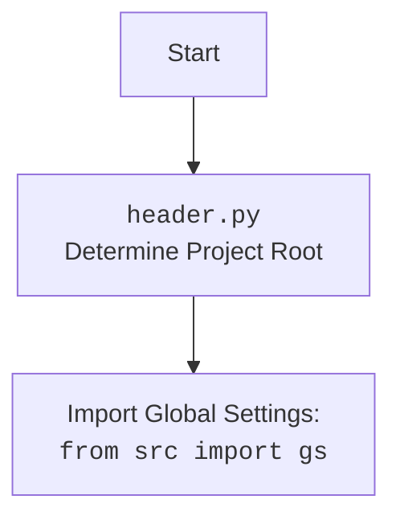

## <алгоритм>

1.  **Инициализация:**
    *   Создается экземпляр класса `GPT_Traigner`.
    *   В конструкторе `__init__` инициализируется `self.gs` как экземпляр `GptGs`.
    *   Устанавливается драйвер для браузера (Chrome).

2.  **Сбор данных (`dump_downloaded_conversations`):**
    *   Определяется директория с HTML-файлами разговоров (`conversation_directory`).
    *   Находится список HTML-файлов.
    *   Для каждого HTML-файла:
        *   Загружается HTML-файл в браузер через `self.driver.get_url(file_uri)`.
        *   Извлекаются элементы с ролью "user" и "assistant" из DOM (`self.driver.execute_locator`).
        *   Извлекается текст из найденных элементов.
        *   Для каждой пары "user_text" и "assistant_text" (используя `zip_longest`):
            *   Если оба текста существуют, создается словарь с ключами `role`, `content` и `sentiment` и добавляется в список `all_data` в виде DataFrame.
            *   Выводится прогресс в консоль.
    *   После обработки всех файлов:
        *   Если есть данные в `all_data`, объединяет их в единый DataFrame `all_data_df`.
        *   Сохраняет `all_data_df` в CSV (`all_conversations.csv`) и JSONL (`all_conversations.jsonl`) файлы.
        *   Извлекает все `content` из DataFrame и сохраняет их в один `raw_conversations.txt` файл.

3.  **Инициализация и использование модели:**
    *   Создается экземпляр класса `Model`.
    *   Вызывается метод `stream_w` модели, передавая путь к файлу `all_conversations.csv` в качестве аргумента.
    
    **Примеры:**

*   **Инициализация:** `traigner = GPT_Traigner()` создает объект `traigner` класса `GPT_Traigner`.
*   **Сбор данных:** 
    *   Если в папке есть два файла `file1.html`, `file2.html` , цикл `for local_file_path in html_files:`  выполнится дважды.
    *   Внутри цикла  `user_content` будет содержать текст всех элементов, соответствующих локатору `locator.user` из текущего файла. Аналогично для `assistant_content`.
    *   Если `user_content` -  `['Hello', 'How are you']`, а `assistant_content` - `['Hi', 'I am fine']`, то будут созданы два словаря (в виде DataFrame) `{'role': ['user', 'assistant'], 'content': ['Hello', 'Hi'], 'sentiment': ['neutral', 'neutral']}` и `{'role': ['user', 'assistant'], 'content': ['How are you', 'I am fine'], 'sentiment': ['neutral', 'neutral']}` которые будут добавлены в список `all_data`.
*   **Сохранение:** После обработки всех файлов, `all_data_df`  содержит объединенные данные из всех HTML файлов, которые потом сохраняются в CSV и JSONL формате.
*   **Использование модели:** `model.stream_w(...)` запускает процесс обработки собранных данных для обучения или использования модели.

## <mermaid>

```mermaid
flowchart TD
    subgraph GPT_Traigner
        A[Start: Create GPT_Traigner Instance] --> B(Init: Initialize GptGs and Driver);
        B --> C{Check for HTML files};
        C -- Yes --> D[Get HTML content from browser];
        D --> E{Extract User/Assistant text};
        E --> F{Prepare Conversation Data};
        F --> G[Append Data to DataFrame];
        G --> C;
        C -- No --> H{Save all_conversations.csv};
        H --> I{Save all_conversations.jsonl};
        I --> J{Save raw_conversations.txt};
    end
    subgraph Model
        K[Start: Create Model Instance] --> L{Model.stream_w(all_conversations.csv)};
    end
    J --> K;
    
    
    style A fill:#f9f,stroke:#333,stroke-width:2px
    style K fill:#ccf,stroke:#333,stroke-width:2px

```

**mermaid объяснение:**

1.  **GPT\_Traigner subgraph:**
    *   **A [Start: Create GPT\_Traigner Instance]:** Начало работы, создание экземпляра класса `GPT_Traigner`.
    *   **B (Init: Initialize GptGs and Driver):** Инициализация `GptGs` и драйвера браузера (Chrome).
    *   **C {Check for HTML files}:** Проверка, есть ли HTML-файлы для обработки.
    *   **D [Get HTML content from browser]:** Загрузка HTML-содержимого в браузер.
    *   **E {Extract User/Assistant text}:** Извлечение текста сообщений от пользователя и ассистента.
    *   **F {Prepare Conversation Data}:** Подготовка данных о разговорах в формате DataFrame.
    *   **G [Append Data to DataFrame]:** Добавление подготовленных данных в список DataFrame `all_data`.
    *   **H {Save all\_conversations.csv}:** Сохранение объединенных данных в CSV файл.
    *   **I {Save all\_conversations.jsonl}:** Сохранение объединенных данных в JSONL файл.
    *   **J {Save raw\_conversations.txt}:** Сохранение необработанных данных в текстовый файл.

2.  **Model subgraph:**
    *   **K [Start: Create Model Instance]:** Создание экземпляра класса `Model`.
    *   **L {Model.stream\_w(all\_conversations.csv)}:** Вызов метода `stream_w` модели, передавая путь к `all_conversations.csv`.

3.  **Связь между блоками:**
    *   **J --> K:** После сохранения всех файлов в `GPT_Traigner` передается управление на `Model`.

    Импорт `header.py`:


`header.py` отвечает за определение корневой директории проекта и импорт глобальных настроек через `from src import gs`.

## <объяснение>

**Импорты:**

*   `re`: Используется для работы с регулярными выражениями (хотя в коде не используется).
*   `argparse`:  Для разбора аргументов командной строки (не используется).
*   `asyncio`: Для асинхронного программирования (не используется явно).
*   `pathlib.Path`: Для работы с путями к файлам и директориям в объектно-ориентированном стиле.
*   `itertools.zip_longest`: Для итерирования по нескольким итерируемым объектам, дополняя более короткие значениями `None`.
*   `pandas as pd`: Для работы с табличными данными и DataFrame.
*   `aioconsole.ainput`: Для асинхронного ввода данных (не используется).
*   `header`: Пользовательский модуль для определения корневой директории проекта.
*   `src.gs`:  Глобальные настройки проекта.
*   `src.logger.logger`: Пользовательский модуль для логирования.
*   `src.suppliers.chat_gpt.GptGs`:  Класс для настроек, специфичных для ChatGPT.
*   `src.webdriver.driver`: Класс для управления веб-драйвером.
*   `src.webdriver.driver.Chrome`, `src.webdriver.driver.Firefox`, `src.webdriver.driver.Edge`: Классы для работы с разными браузерами.
*   `src.ai.openai.model`: Класс для работы с моделью OpenAI.
*   `src.utils.jjson`: Модуль для работы с JSON (сериализация, десериализация).
*   `src.utils.convertors`: Модуль для конвертации данных (словарь в csv, json в csv).
*   `src.utils.printer`: Модуль для красивого вывода данных.

**Классы:**

*   `GPT_Traigner`:
    *   `driver`: Экземпляр класса `Driver` для управления браузером (Chrome).
    *   `__init__`: Инициализирует экземпляр класса, создавая экземпляр `GptGs`.
    *   `determine_sentiment`: Функция для определения сентимента (возвращает только "positive" или "negative").
    *   `save_conversations_to_jsonl`: Функция для сохранения данных в JSONL файл.
    *   `dump_downloaded_conversations`: Основная функция, собирающая данные из HTML файлов, сохраняет их в CSV, JSONL и TXT.
*    `Model`:
    *    Экземпляр класса `Model`, используется для обучения или работы с моделью OpenAI.

**Функции:**

*   `determine_sentiment(self, conversation_pair: dict[str, str], sentiment: str = 'positive') -> str`:
    *   Аргументы: `conversation_pair` (словарь с парой реплик), `sentiment` (строка, по умолчанию 'positive').
    *   Возвращает: строку "positive" или "negative" в зависимости от `sentiment`, но всегда возвращает "positive" если `sentiment` не пустая строка.
*   `save_conversations_to_jsonl(self, data: list[dict], output_file: str)`:
    *   Аргументы: `data` (список словарей), `output_file` (путь к выходному файлу).
    *   Возвращает: ничего.
    *   Сохраняет данные в JSONL файл.
*   `dump_downloaded_conversations(self)`:
    *   Аргументы: Нет.
    *   Возвращает: ничего.
    *   Основная функция, собирающая данные из HTML, сохраняет их в CSV, JSONL и TXT файлы.
        *   Обходит HTML файлы в директории `gs.path.google_drive / 'chat_gpt' / 'conversation'`.
        *   Использует `self.driver` для загрузки HTML и извлечения элементов.
        *   Сохраняет данные в pandas DataFrame и  сохраняет DataFrame в CSV и JSONL, и выгружает `raw` данные в TXT.

**Переменные:**

*   `locator`: JSON словарь с локаторами для поиска элементов на веб-странице, загружается из файла `chat.json`.
*   `traigner`: Экземпляр класса `GPT_Traigner`.
*   `model`: Экземпляр класса `Model`.
*   `conversation_directory`:  Путь к директории с HTML файлами.
*   `html_files`:  Список объектов `Path` для HTML файлов.
*   `all_data`: Список DataFrame для хранения данных.
*   `counter`: Счетчик обработанных файлов.
*   `local_file_path`: Путь к текущему обрабатываемому HTML файлу.
*   `file_uri`: URL текущего HTML файла.
*   `user_elements`:  Список элементов, соответствующих локатору `locator.user`.
*   `assistant_elements`:  Список элементов, соответствующих локатору `locator.assistant`.
*   `user_content`: Список текстов из элементов пользователя.
*   `assistant_content`: Список текстов из элементов ассистента.
*   `data`:  Словарь для хранения данных в формате {'role': \['user', 'assistant'], 'content': \['text', 'text'\], 'sentiment': \['neutral', 'neutral']}.
*   `all_data_df`: Объединенный DataFrame из списка `all_data`.
*   `csv_file_path`: Путь к CSV файлу.
*   `jsonl_file_path`: Путь к JSONL файлу.
*   `raw_conversations`: Строка со всеми текстами `content`.
*   `raw_file_path`: Путь к TXT файлу с `raw` текстом.

**Потенциальные ошибки и области для улучшения:**

*   Функция `determine_sentiment` не делает ничего, кроме как возвращает "positive" или "negative" в зависимости от входного параметра `sentiment`, что может быть не корректно.
*   Используется `zip_longest` без обработки ситуаций, когда `user_content` и `assistant_content` не совпадают по длине, что может привести к `None` значениям.
*   Обработка ошибок может быть улучшена (например, добавление try/except при работе с файлами).
*   Логика сохранения данных в разных форматах (CSV, JSONL, TXT) может быть вынесена в отдельные функции.
*   Много импортов, некоторые из них не используются.

**Взаимосвязи с другими частями проекта:**

*   `header.py`: Обеспечивает правильное определение корневой директории проекта и загрузку глобальных настроек через `from src import gs`.
*   `src.gs`: Глобальные настройки, определяющие пути к файлам и другие параметры.
*   `src.webdriver.driver`: Класс, использующийся для взаимодействия с веб-браузером для извлечения данных со страниц.
*   `src.ai.openai.model`: Класс, используемый для обучения или работы с моделью OpenAI, используя собранные данные.

Этот код является частью системы для сбора и обработки данных для обучения модели ChatGPT. Он автоматизирует процесс сбора диалогов из HTML файлов, их преобразование в нужные форматы, а затем передаёт полученные данные модели для дальнейшей обработки.