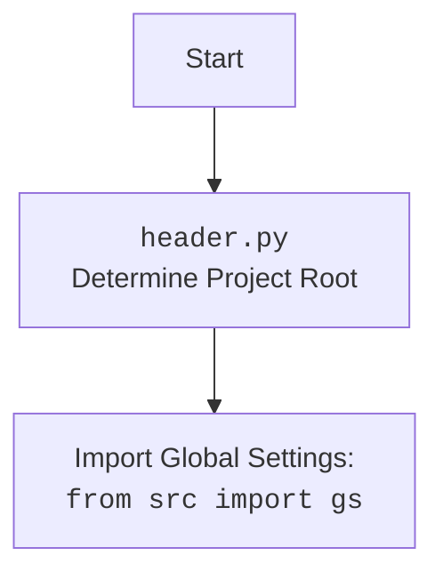

## АНАЛИЗ КОДА: `src/suppliers/chat_gpt/scenarios/grab_lilnks_to_chats.py`

### <алгоритм>

1.  **Начало:** Программа запускается.

2.  **Импорт модулей:**
    *   Импортируются необходимые модули для работы: `header`, `src.gs`, `src.webdriver.driver.Driver`, `src.webdriver.chrome.Chrome`, `src.webdriver.firefox.Firefox`, `src.utils.jjson.j_loads_ns`.
    *   Эти модули обеспечивают функциональность для настройки драйвера браузера, загрузки JSON данных и работы с глобальными настройками.
    
3.  **Загрузка локаторов:**
    *   Вызывается функция `j_loads_ns` из `src.utils.jjson` для загрузки JSON файла с локаторами элементов чата, который хранится в `src/suppliers/chat_gpt/locators/chats_list.json`
    
    ```python
    # Пример содержимого locator.json
    {
        "link": "css=a.chat-link"
    }
    ```

4.  **Определение функции `get_links`**:
    *   Функция `get_links` принимает экземпляр класса `Driver` в качестве аргумента.
    *   Функция `execute_locator` вызывается из объекта драйвера (`d`) и передает в нее локатор.
    *   Результат выполнения (`links`) (предположительно список элементов) возвращается.
    ```python
        # Пример вызова функции:
        links = get_links(d)
        # links может содержать HTML элементы:
        # [<selenium.webdriver.remote.webelement.WebElement (session="...", element="...")>, <selenium.webdriver.remote.webelement.WebElement (session="...", element="...")>, ...]
    ```

5.  **Основная часть `if __name__ == '__main__'`**:
    *   Создается экземпляр класса `Driver` с указанием типа драйвера `Firefox` (например: `d = Driver(Firefox)`).
    *   Открывается веб-страница ChatGPT по URL: `https://chatgpt.com/` с использованием метода `get_url` драйвера.
    *   Вызывается функция `get_links` и результат (ссылки) сохраняется в переменную `links`.
        
    ```python
        # Пример вызова функции:
        links = get_links(d)
        # links может содержать HTML элементы:
        # [<selenium.webdriver.remote.webelement.WebElement (session="...", element="...")>, <selenium.webdriver.remote.webelement.WebElement (session="...", element="...")>, ...]
    ```
    *   В конце стоит заглушка `...`, что подразумевает дальнейшую обработку полученных ссылок.
    
    
### <mermaid>
```mermaid
flowchart TD
    Start[Start] --> ImportModules[Импорт модулей];
    ImportModules --> LoadLocators[Загрузка локаторов из JSON];
    LoadLocators --> DefineGetLinks[Определение функции get_links(driver)];
    DefineGetLinks --> MainBlock[Основной блок if __name__ == '__main__':];
    MainBlock --> CreateDriver[Создание экземпляра Driver(Firefox)];
    CreateDriver --> NavigateURL[driver.get_url('https://chatgpt.com/')];
    NavigateURL --> GetLinks[links = get_links(driver)];
    GetLinks --> ProcessLinks[Дальнейшая обработка ссылок (заглушка)...];
    
    style ImportModules fill:#f9f,stroke:#333,stroke-width:2px
    style LoadLocators fill:#ccf,stroke:#333,stroke-width:2px
    style DefineGetLinks fill:#ccf,stroke:#333,stroke-width:2px
    style MainBlock fill:#ccf,stroke:#333,stroke-width:2px
    
    classDef important fill:#f9f,stroke:#333,stroke-width:2px
    class ImportModules, LoadLocators, DefineGetLinks, MainBlock important;
    
    
    subgraph Global Settings
    ImportModules --> ImportGlobalSettings[Импорт глобальных настроек: <br><code>from src import gs</code>];
    end
    
    subgraph  webdriver
    ImportModules --> ImportDriverModule[Импорт Driver: <br><code>from src.webdriver.driver import Driver</code>];
    ImportModules --> ImportChromeModule[Импорт Chrome Driver: <br><code>from src.webdriver.chrome import Chrome</code>];
    ImportModules --> ImportFirefoxModule[Импорт Firefox Driver: <br><code>from src.webdriver.firefox import Firefox</code>];
    end
    
    subgraph JSON Utils
    ImportModules --> ImportJsonLoader[Импорт JSON Loader: <br><code>from src.utils.jjson import j_loads_ns</code>]
    end
    
    
    
```


### <объяснение>

**Импорты:**

*   `import header`: Импортирует модуль `header.py`.  `header.py` отвечает за определение корневой директории проекта и добавление ее в `sys.path`, что позволяет импортировать модули из `src`.
*   `from src import gs`: Импортирует объект `gs` из пакета `src`. `gs` содержит глобальные настройки проекта, включая пути к директориям.
*   `from src.webdriver.driver import Driver`: Импортирует класс `Driver` из модуля `driver.py`. Этот класс используется для управления веб-драйверами.
*    `from src.webdriver.chrome import Chrome`: Импортирует класс `Chrome` из модуля `chrome.py`, который представляет конкретный драйвер для браузера Chrome.
*   `from src.webdriver.firefox import Firefox`: Импортирует класс `Firefox` из модуля `firefox.py`, который представляет конкретный драйвер для браузера Firefox.
*   `from src.utils.jjson import j_loads_ns`: Импортирует функцию `j_loads_ns` из модуля `jjson.py`, которая используется для загрузки данных из JSON файлов с поддержкой пространств имен.

**Классы:**

*   **`Driver` (из `src.webdriver.driver.Driver`)**:
    *   **Роль**: Абстрактный класс или интерфейс для взаимодействия с веб-драйверами.
    *   **Атрибуты**: Может содержать атрибуты для управления драйвером, сессией браузера и др.
    *   **Методы**: Например, `get_url(url)` для открытия URL, `execute_locator(locator)` для выполнения поиска элемента на странице.
    *   **Взаимодействие**: Взаимодействует с конкретными драйверами браузеров (`Chrome`, `Firefox`).
*   **`Chrome` (из `src.webdriver.chrome.Chrome`)**:
    *   **Роль**: Конкретный драйвер для браузера Chrome.
    *   **Атрибуты**: Атрибуты для управления сессией Chrome.
    *   **Методы**: Методы для управления браузером Chrome.
    *   **Взаимодействие**: Наследует или реализует интерфейс `Driver`.
*   **`Firefox` (из `src.webdriver.firefox.Firefox`)**:
    *   **Роль**: Конкретный драйвер для браузера Firefox.
    *   **Атрибуты**: Атрибуты для управления сессией Firefox.
    *   **Методы**: Методы для управления браузером Firefox.
    *   **Взаимодействие**: Наследует или реализует интерфейс `Driver`.

**Функции:**

*   **`get_links(d: Driver)`**:
    *   **Аргументы**:
        *   `d`: Экземпляр класса `Driver`.
    *   **Возвращаемое значение**: Список ссылок (WebElement), найденных на веб-странице.
    *   **Назначение**: Использует объект драйвера для поиска и возврата ссылок на чаты на текущей странице.
    *   **Пример**:
        
        ```python
            links = get_links(d) # Возвращает список WebElement
        ```
*   **`j_loads_ns` (из `src.utils.jjson.j_loads_ns`)**:
    *   **Аргументы**: JSON файл с локаторами.
    *   **Возвращаемое значение**: Данные загруженные из JSON (обычно словарь).
    *   **Назначение**: Загружает данные JSON из файла и преобразует его в объект. В данном случае, в объект `locator`.
    *   **Пример**:
        
        ```python
            locator = j_loads_ns(gs.path.src / 'suppliers' / 'chat_gpt' / 'locators' / 'chats_list.json')
        ```

**Переменные:**

*   `locator`: Словарь с локаторами для поиска элементов на странице, загруженный из JSON файла.
*   `links`: Список, содержащий найденные веб-элементы (ссылки на чаты).
*   `d`: Экземпляр класса `Driver`, используемый для управления веб-драйвером.

**Потенциальные ошибки и области для улучшения:**

*   **Обработка исключений**: В коде отсутствует обработка исключений, что может привести к сбоям, если какой-либо из вызовов функций или методов не удастся.
*   **Заглушка `...`**: Не указано, что происходит с найденными ссылками. Необходимо добавить функциональность для дальнейшей обработки ссылок.
*   **Типизация**: Можно добавить type hints, для более четкого понимания типа передаваемых значений.

**Взаимосвязи с другими частями проекта:**

*   Модуль зависит от `src.gs`, что означает, что он использует глобальные настройки проекта.
*   Модуль использует драйверы, находящиеся в `src/webdriver/`, что указывает на использование инфраструктуры для управления браузерами.
*   Локаторы загружаются из файла `chats_list.json`, который находится в `src/suppliers/chat_gpt/locators/`, что является частью структуры проекта.

**Цепочка взаимосвязей:**

1.  Сценарий (`grab_lilnks_to_chats.py`) использует глобальные настройки (`gs`).
2.  Сценарий создает и использует драйвер (`Driver`).
3.  Драйвер управляет браузером (`Firefox` или `Chrome`).
4.  Сценарий использует локаторы (`locator`) для поиска элементов.
5.  Сценарий загружает JSON файлы, используя `j_loads_ns`.

**Дополнительные замечания:**

*   В начале файла есть комментарии, указывающие на то, что код не работает с драйверами Chrome и Firefox. Это может быть связано с устаревшими версиями, неправильными настройками драйверов или ошибками в самой логике работы с драйвером.
*   Для стабильной работы кода, необходимо отслеживать обновления библиотек `selenium`, `webdriver-manager` и прочих зависимостей.
*   Необходима реализация обработки найденных ссылок.