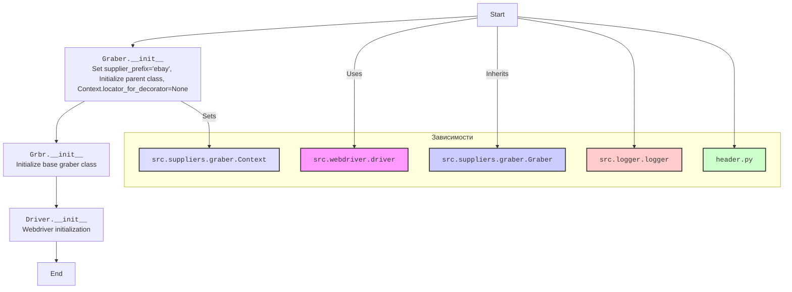
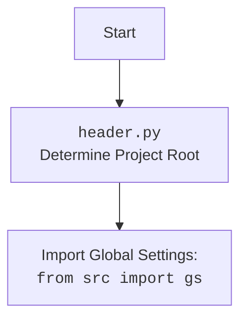

## <алгоритм>

1. **Инициализация:**
   - Создается экземпляр класса `Graber`.
   - Устанавливается префикс поставщика `supplier_prefix` как 'ebay'.
   - Вызывается конструктор родительского класса `Grbr` с префиксом и драйвером.
   - Инициализируется `Context.locator_for_decorator` в `None`, что говорит об отключении кастомного декоратора.

2. **Наследование:**
   - Класс `Graber` наследует от класса `Graber` (псевдоним `Grbr`), предоставляя базовый функционал для сбора данных.

3. **Декоратор (закомментированный):**
    -  Если бы декоратор был активен (раскомментирован), он бы работал следующим образом:
        - Функция `close_pop_up` принимает значение `value` (используется как заглушка).
        - Она возвращает декоратор, который принимает функцию `func` в качестве аргумента.
        - Внутри декоратора определен `wrapper`, который:
          -  Выполняет код закрытия всплывающего окна с помощью `Context.driver.execute_locator(Context.locator.close_pop_up)` если `Context.locator_for_decorator` установлен.
          - Ловит `ExecuteLocatorException` для отладки.
          - Вызывает исходную функцию `func` и возвращает ее результат.

4. **Логика сбора данных (не показана в этом коде):**
   -  Класс `Graber` (наследуемый) должен содержать методы для сбора данных со страниц `ebay.com`.
   -  Эти методы могут использовать `self.driver` для взаимодействия с веб-страницей и `Context` для получения глобальных настроек.

**Пример работы (если бы декоратор был активен):**

```python
# Предположим, что есть функция для сбора названия товара
# @close_pop_up()
# async def get_product_name():
#      ... # Логика сбора данных

# При вызове get_product_name() сначала был бы вызван декоратор,
# затем бы выполнился основной код
```

## <mermaid>





## <объяснение>

**Импорты:**

-   `from typing import Any`: Импортирует `Any` для указания типа, который может быть любым. Используется в декораторе как заглушка.
-   `import header`: Импортирует модуль `header`, который, вероятно, отвечает за определение корневого каталога проекта и загрузку глобальных настроек (см. `mermaid` диаграмму для `header.py`).
-   `from src.suppliers.graber import Graber as Grbr, Context, close_pop_up`: Импортирует:
    -   `Graber` из `src.suppliers.graber` и переименовывает его в `Grbr`. Это базовый класс для всех граберов поставщиков.
    -   `Context` из `src.suppliers.graber` — класс для хранения глобальных настроек и состояния, передаваемых между функциями.
    -   `close_pop_up` (скорее всего декоратор) из `src.suppliers.graber` для закрытия всплывающих окон, перед тем как начать парсить.
-   `from src.webdriver.driver import Driver`: Импортирует класс `Driver` из `src.webdriver.driver`, который, вероятно, управляет веб-драйвером (например, Selenium).
-   `from src.logger.logger import logger`: Импортирует объект `logger` из `src.logger.logger` для логирования событий и ошибок.

**Классы:**

-   `class Graber(Grbr)`:
    -   Это класс `Graber` для сбора данных с сайта `ebay.com`.
    -   Наследует от `Grbr` (базового класса грабера).
    -   `supplier_prefix: str`:  Атрибут класса, хранящий префикс поставщика (в данном случае 'ebay').
    -   `__init__(self, driver: Driver)`: Конструктор класса.
        -   `self.supplier_prefix = 'ebay'`: Устанавливает префикс поставщика.
        -   `super().__init__(supplier_prefix=self.supplier_prefix, driver=driver)`: Вызывает конструктор родительского класса `Grbr`, передавая ему префикс и драйвер.
        -   `Context.locator_for_decorator = None`: Инициализирует переменную `locator_for_decorator`, указывая что кастомный декоратор не будет выполняться.
    - Метод `__init__` настраивает начальное состояние грабера, готового к сбору данных.

**Функции:**

-   `close_pop_up(value: Any = None) -> Callable` (закомментированная):
    -   Это шаблон декоратора для закрытия всплывающих окон.
    -   Принимает необязательное значение `value`.
    -   Возвращает декоратор `decorator`, который оборачивает другую функцию.
    -   Внутри `wrapper` (в закомментированном коде):
        -   Пытается закрыть всплывающее окно с помощью `Context.driver.execute_locator(Context.locator.close_pop_up)`.
        -   Ловит ошибки `ExecuteLocatorException` и логирует их.
        -   Вызывает исходную функцию и возвращает ее результат.
    -   Потенциально полезна для выполнения действий перед выполнением основной логики функции.

**Переменные:**

-   `supplier_prefix: str`:  Строка, определяющая префикс поставщика.
-   `driver: Driver`: Объект драйвера веб-браузера (экземпляр класса `Driver` из `src.webdriver.driver`).
-   `Context.locator_for_decorator`: Указывает на то, нужно ли выполнять действия до парсинга (закрыть окно и т.д). По дефолту `None`, что значит - нет.
-   `logger` - объект для логирования.

**Потенциальные ошибки и области для улучшения:**

1.  **Отсутствует логика сбора данных:** В представленном коде нет конкретных методов для сбора данных со страниц eBay. Класс `Graber` должен содержать методы, использующие `self.driver` для навигации по страницам и извлечения данных.
2.  **Закомментированный декоратор:** Декоратор `close_pop_up` закомментирован, что означает, что логика закрытия всплывающих окон не выполняется. Если эта функциональность необходима, декоратор нужно раскомментировать и настроить.
3.  **Обработка ошибок:**  Обработка `ExecuteLocatorException` в закомментированном декораторе ограничивается логированием. Может потребоваться более сложная логика обработки ошибок (например, повторные попытки или выход из программы).
4.  **Жестко заданный префикс:**  Префикс поставщика `'ebay'` задан прямо в классе. Можно сделать его более гибким, например, передавая в конструктор.
5.  **Непонятное использование `Context`:** Предполагается, что `Context` используется для хранения общих данных. Примеры использования не показаны в этом коде, но `Context.locator_for_decorator` используется для включения/выключения декоратора.

**Взаимосвязи с другими частями проекта:**

-   **`header.py`**: Модуль `header` устанавливает корень проекта, что позволяет `graber.py` импортировать остальные модули из `src`.
-   `src.suppliers.graber`:  Обеспечивает базовую функциональность грабера и класс `Context` для управления состоянием.
-   `src.webdriver.driver`:  Управляет веб-драйвером, предоставляя методы для навигации по сайту и взаимодействия с элементами.
-   `src.logger.logger`:  Отвечает за логирование событий и ошибок.

В целом, этот код представляет собой структуру класса-грабера для eBay, использующего общие компоненты проекта, но требует дальнейшей разработки логики сбора данных и настройки декоратора.