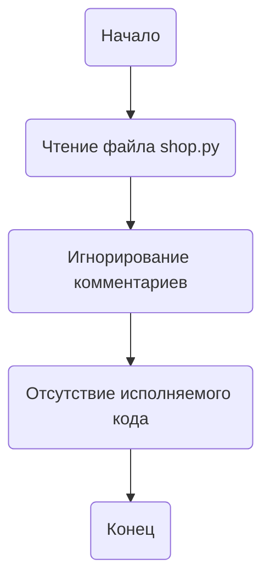

## ИНСТРУКЦИЯ:

Анализируй предоставленный код подробно и объясни его функциональность. Ответ должен включать три раздела:  

1. **<алгоритм>**: Опиши рабочий процесс в виде пошаговой блок-схемы, включая примеры для каждого логического блока, и проиллюстрируй поток данных между функциями, классами или методами.  
2. **<mermaid>**: Напиши код для диаграммы в формате `mermaid`, проанализируй и объясни все зависимости, 
    которые импортируются при создании диаграммы. 
    **ВАЖНО!** Убедитесь, что все имена переменных, используемые в диаграмме `mermaid`, 
    имеют осмысленные и описательные имена. Имена переменных вроде `A`, `B`, `C`, и т.д., не допускаются!  
    
    **Дополнительно**: Если в коде есть импорт `import header`, добавьте блок `mermaid` flowchart, объясняющий `header.py`:\
    ```mermaid
    flowchart TD
        Start --> Header[<code>header.py</code><br> Determine Project Root]
    
        Header --> import[Import Global Settings: <br><code>from src import gs</code>] 
    ```

3. **<объяснение>**: Предоставьте подробные объяснения:  
   - **Импорты**: Их назначение и взаимосвязь с другими пакетами `src.`.  
   - **Классы**: Их роль, атрибуты, методы и взаимодействие с другими компонентами проекта.  
   - **Функции**: Их аргументы, возвращаемые значения, назначение и примеры.  
   - **Переменные**: Их типы и использование.  
   - Выделите потенциальные ошибки или области для улучшения.  

Дополнительно, постройте цепочку взаимосвязей с другими частями проекта (если применимо).  

Это обеспечивает всесторонний и структурированный анализ кода.
## Формат ответа: `.md` (markdown)
**КОНЕЦ ИНСТРУКЦИИ**

## <алгоритм>

Поскольку предоставленный код `hypotez/src/suppliers/ebay/shop.py` является по сути пустым файлом с комментариями, то алгоритм работы будет сводиться к:

1.  **Начало**: Запуск интерпретатора Python для файла `shop.py`.
2.  **Чтение файла**: Интерпретатор читает содержимое файла `shop.py`.
3.  **Игнорирование комментариев**: Интерпретатор пропускает все строки, начинающиеся с `#` или заключенные в `""" """`.
4.  **Отсутствие исполняемого кода**: Поскольку нет никакого выполняемого кода, интерпретатор не выполняет никаких действий, кроме как пропускает комментарии.
5.  **Конец**: Завершение работы интерпретатора.

Пример:

```
Начало -> Чтение файла -> Игнорирование комментариев -> Отсутствие кода -> Конец
```

## <mermaid>



**Объяснение `mermaid` диаграммы:**

Диаграмма описывает простой процесс чтения файла и пропуска комментариев, с учетом того, что кода нет. 

1. `Start`: Начало процесса интерпретации файла `shop.py`.
2. `ReadFile`: Этап чтения содержимого файла `shop.py` интерпретатором Python.
3. `SkipComments`: Этап пропуска комментариев, так как они не влияют на выполнение кода.
4. `NoCode`: Этап, отображающий отсутствие исполняемого кода в файле.
5. `End`: Конец процесса интерпретации.

В данной диаграмме нет импортируемых зависимостей, так как в файле нет исполняемого кода.

## <объяснение>

**Импорты:**

В представленном коде отсутствуют какие-либо импорты. Файл по сути представляет собой заголовочный файл с комментариями. Обычно, в файлах `shop.py` в рамках проекта `hypotez`, будут импортироваться необходимые библиотеки и модули для работы с eBay API, а также модули для работы с общей конфигурацией проекта (например, `src.gs` для глобальных настроек), но в данном файле импорты отсутствуют.

**Классы:**

В данном файле отсутствуют объявления классов. В файлах `shop.py` в рамках проекта `hypotez`, как правило, содержатся классы, реализующие взаимодействие с API конкретного поставщика (в данном случае eBay). Например, может быть класс `EbayShop` с методами для получения списка товаров, информации о ценах, и т.п.

**Функции:**

В данном файле нет объявленных функций. В файлах `shop.py` обычно объявляются функции, которые реализуют отдельные операции, такие как получение данных о товарах, обработка ответов API, и другие.

**Переменные:**

В данном файле нет объявленных переменных. В файлах `shop.py` обычно объявляются переменные для хранения настроек, параметров API, а также промежуточных данных, полученных от API.

**Потенциальные ошибки или области для улучшения:**

1. **Отсутствие кода**: Основная проблема заключается в том, что данный файл практически пустой, за исключением комментариев. Для полноценной функциональности необходимо добавить код для взаимодействия с API eBay, а также другие необходимые компоненты.
2. **Комментарии**: Комментарии очень разрозненные и не добавляют ценности. Их следует пересмотреть и сделать более информативными.
3. **Отсутствие структуры**: Файл `shop.py` должен содержать код, который структурирован в соответствии с функциональными задачами, которые он выполняет.
4. **Отсутствие импортов**: Отсутствуют необходимые импорты.

**Цепочка взаимосвязей с другими частями проекта:**

Обычно `shop.py` в рамках проекта `hypotez` является частью подсистемы для работы с поставщиками. Он должен взаимодействовать с:

1.  `src.gs` для получения глобальных настроек, таких как ключи API, параметры соединения, и т.п.
2.  Модулями для работы с API eBay (например, `ebay-sdk`), если такой есть.
3.  Модулями для работы с базой данных, если требуется сохранять или загружать данные.
4.  Другими модулями для обработки данных, если необходимо.

В данном примере файл не связан с другими частями проекта, так как он не содержит кода.