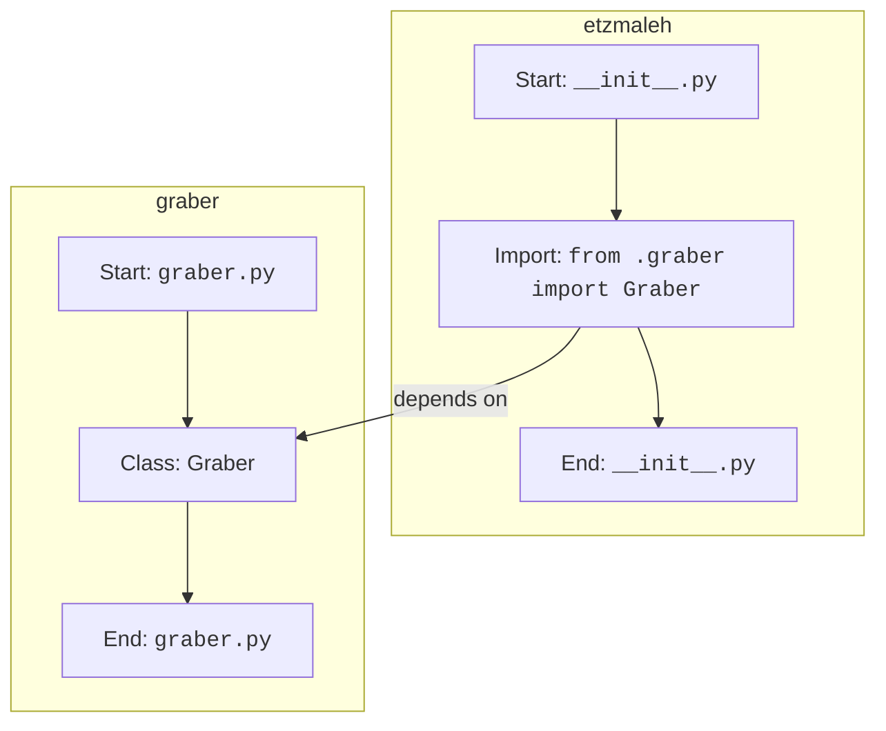

## Анализ кода `hypotez/src/suppliers/etzmaleh/__init__.py`

### <алгоритм>

1.  **Импорт `Graber`:**
    *   Импортируется класс `Graber` из модуля `graber.py`, находящегося в том же пакете `etzmaleh`.
    *   Пример: `from .graber import Graber` - делает класс `Graber` доступным для использования в файле `__init__.py`.

### <mermaid>

**Объяснение:**

*   Диаграмма показывает импорт класса `Graber` из модуля `graber.py` в `__init__.py`.
*   `Start`, `ImportGraber`, `End` представляют этапы в `__init__.py`.
*   `StartGraber`, `ClassGraber`, `EndGraber` представляют этапы в `graber.py`.
*   Стрелка `depends on` показывает зависимость `__init__.py` от `graber.py`, где определен класс `Graber`.

### <объяснение>

**Импорты:**

*   `from .graber import Graber`: Этот импорт делает класс `Graber`, определенный в файле `graber.py` (внутри пакета `etzmaleh`), доступным для использования внутри пакета `etzmaleh`.  Это типичный способ импорта в Python, который позволяет модулям внутри пакета взаимодействовать друг с другом.

**Классы:**

*   В данном файле нет определения классов, но импортируется класс `Graber`.  Исходя из имени, предположительно, класс `Graber` отвечает за получение данных (парсинг) с веб-сайтов или других источников. Детали реализации этого класса находятся в файле `graber.py`.

**Функции:**

*   В данном файле нет определения функций.

**Переменные:**

*   В данном файле нет явных переменных, кроме импорта класса.

**Цепочка взаимосвязей:**

1.  Файл `__init__.py` выступает как точка входа для пакета `etzmaleh`. Когда пакет `etzmaleh` импортируется, Python выполняет код внутри `__init__.py`.
2.  Импортируя `Graber` из `graber.py`, он делает класс доступным для использования в других частях проекта, которые импортируют пакет `etzmaleh`. Например, если есть другой модуль, который импортирует `from src.suppliers.etzmaleh import Graber`, он сможет использовать класс `Graber`.
3.  Потенциально, класс `Graber` внутри пакета `etzmaleh` может взаимодействовать с другими частями проекта, например, для получения данных о товарах от поставщика `etzmaleh`. Эти данные затем могут быть использованы для сравнения цен, добавления новых товаров в систему и т. д.

**Потенциальные ошибки или области для улучшения:**

*   На данном этапе в файле `__init__.py` просто производится импорт. Если пакет `etzmaleh` будет расширяться, в `__init__.py` могут быть добавлены дополнительные импорты, определения переменных или функции для настройки пакета, либо для более удобного использования.
*   Без контекста кода в `graber.py`, сложно сказать, есть ли какие-то проблемы с реализацией `Graber`.