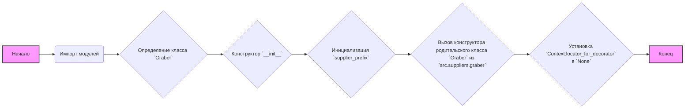
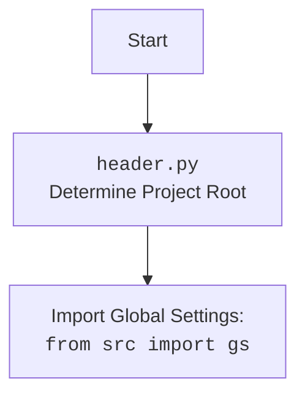

## АНАЛИЗ КОДА: `src/suppliers/etzmaleh/graber.py`

### 1. <алгоритм>

**Блок-схема:**



**Примеры:**

*   **Импорт модулей:**  Импортируются модули `header`, `src.suppliers.graber`, `src.webdriver.driver` и `src.logger.logger`.
*   **Класс `Graber`:** Создается класс `Graber`, наследующий от `Graber` из `src.suppliers.graber`.
*   **Конструктор `__init__`:** Инициализируется префикс поставщика, вызывается конструктор родительского класса и устанавливается `Context.locator_for_decorator` в `None`.

### 2. <mermaid>

```mermaid
flowchart TD
    Start --> ImportModules[Import Modules];
    ImportModules --> HeaderImport[<code>header.py</code><br> Determine Project Root];
    HeaderImport --> ImportGlobalSettings[Import Global Settings: <br><code>from src import gs</code>];
    ImportModules --> GraberImport[<code>src.suppliers.graber</code><br> Import Graber and Context Classes];
     ImportModules --> DriverImport[<code>src.webdriver.driver</code><br> Import Driver Class];
    ImportModules --> LoggerImport[<code>src.logger.logger</code><br> Import Logger Class];
    ImportModules --> DefineGraberClass[Define <code>Graber</code> Class <br> (inherits from <code>src.suppliers.graber.Graber</code>)];
    DefineGraberClass --> GraberInit[<code>__init__</code> method: <br> Initializes supplier prefix and parent class, sets <code>Context.locator_for_decorator</code> to None];
    GraberInit --> End
    
   
    style Start fill:#f9f,stroke:#333,stroke-width:2px
     style End fill:#f9f,stroke:#333,stroke-width:2px
```



**Объяснение зависимостей:**

*   **`header.py`**: Определяет корень проекта для правильного импорта модулей.
*   **`from src import gs`**: Импортирует глобальные настройки проекта, определенные в файле `gs.py`.
*   **`from src.suppliers.graber import Graber as Grbr, Context, close_pop_up`**: Импортирует базовый класс `Graber`, класс `Context` для передачи контекста и функцию `close_pop_up` для обработки всплывающих окон из модуля `graber` в `src.suppliers`.
*    **`from src.webdriver.driver import Driver`**: Импортирует класс `Driver` для управления веб-драйвером.
*   **`from src.logger.logger import logger`**: Импортирует объект `logger` для логирования событий.

### 3. <объяснение>

**Импорты:**

*   `from typing import Any`: Импортируется `Any` для обозначения типа данных, который может быть любым.
*   `import header`: Импортируется модуль `header`, который, вероятно, отвечает за настройку путей и общие настройки проекта.
*   `from src.suppliers.graber import Graber as Grbr, Context, close_pop_up`:
    *   Импортирует `Graber` (переименован в `Grbr`) как базовый класс для парсеров, `Context` для хранения контекста (например, экземпляры драйвера, локаторы), и функцию `close_pop_up` для обработки всплывающих окон из модуля `graber`, находящийся в пакете `src.suppliers`.
*   `from src.webdriver.driver import Driver`: Импортирует класс `Driver`, который предназначен для управления веб-драйвером (например, Selenium).
*   `from src.logger.logger import logger`: Импортирует объект `logger` для логирования событий и отладки.

**Классы:**

*   **`Graber(Grbr)`**:
    *   **Роль**: Класс `Graber` предназначен для сбора данных со страниц товаров конкретного поставщика ("etzmaleh").
    *   **Атрибуты**:
        *   `supplier_prefix: str`: Содержит строковый префикс поставщика ("etzmaleh").
    *   **Методы**:
        *   `__init__(self, driver: Driver)`:
            *   Конструктор класса.
            *   Инициализирует `self.supplier_prefix` строкой "etzmaleh".
            *   Вызывает конструктор родительского класса `Grbr`, передавая ему `supplier_prefix` и объект `driver`.
            *   Устанавливает `Context.locator_for_decorator` в `None`. Это говорит о том, что декоратор по умолчанию не будет использоваться, если только `Context.locator_for_decorator` не будет установлено другое значение.
    *   **Взаимодействие**: Наследует функциональность от `src.suppliers.graber.Graber`.

**Функции:**

*   В коде есть закомментированный шаблон декоратора `close_pop_up`, который мог бы закрывать всплывающие окна. В данный момент неактивен.

    *   **Аргументы**:  принимает значение `value` любого типа, и `func`, которая является функцией.
    *   **Возвращаемое значение**: `decorator`, который является функцией, которая оборачивает входную функцию `func`.
    *   **Назначение**: предназначается для закрытия всплывающих окон перед выполнением основной логики функции.
    *   **Примеры**: Если бы был активен, его можно было бы использовать так: `@close_pop_up(locator=my_locator) async def my_function(...): ...`
        
**Переменные:**
*   `supplier_prefix`: Строка, представляющая префикс поставщика.
*   `Context.locator_for_decorator`: Атрибут класса `Context`, который, будучи установленным, определяет какой локатор использовать для декоратора `close_pop_up` для закрытия всплывающих окон перед выполнением основной логики функции.

**Потенциальные ошибки и области для улучшения:**

*   Шаблон декоратора `close_pop_up` закомментирован. Если его планируется использовать, его нужно раскомментировать и доработать.
*   Обработка ошибок `ExecuteLocatorException` в декораторе ограничена логированием, стоит предусмотреть более гибкую обработку в зависимости от ситуации.
*   Класс `Graber` не имеет других методов, кроме конструктора, это говорит о том, что вся обработка полей делается в родительском классе.
*   Необходимо добавить описание работы с вебдрайвером, а так же добавить описание, для чего нужен `Context`.

**Взаимосвязи с другими частями проекта:**

*   Модуль `src.suppliers.graber` является родительским классом, где реализована основная логика парсинга.
*   Модуль `src.webdriver.driver` отвечает за работу с веб-драйвером (например, Selenium), через который происходит навигация по сайту и поиск элементов.
*   Модуль `src.logger.logger` используется для логирования действий и ошибок.
*   `header.py` используется для определения корня проекта и импорта глобальных настроек.

Данный класс `Graber` предназначен для расширения и кастомизации базового парсера под конкретного поставщика "etzmaleh", используя базовые функции и структуру, определенную в `src.suppliers.graber`.