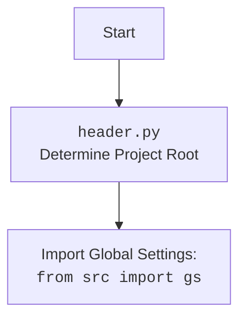

## Анализ кода `header.py`

### 1. <алгоритм>

**Блок-схема:**

```mermaid
graph LR
    A[Начало] --> B{Определение корня проекта\n(set_project_root)};
    B --> C{Получение родительской директории\n текущего файла};
    C --> D{Проверка наличия маркерных файлов\n(__root__,.git) в директории или ее родителях};
    D -- Да --> E{Установка __root__ в директорию с маркерным файлом};
    E --> F{Добавление __root__ в sys.path, если его нет};
    D -- Нет --> G{Проверка на наличие маркерных файлов у родителей};
    G -- Да --> E;
    G -- Нет --> H{Установка __root__\nв текущую директорию};
     H --> F
    F --> I{Чтение файла settings.json};
    I --> J{Загрузка настроек из settings.json};
    J -- Успех --> K{Чтение файла README.MD};
    J -- Ошибка --> L{Обработка ошибки};
    K --> M{Загрузка README.MD};
     M -- Успех --> N{Извлечение имени проекта,\nверсии, и т.д. из настроек};
      M -- Ошибка --> O{Обработка ошибки}
      L --> N
       O --> N
   N --> P[Конец];
```

**Примеры:**

* **`set_project_root`**:
    1.  Если текущий файл находится в `/project/src/suppliers/etzmaleh/header.py`, функция начинает поиск с `/project/src/suppliers/etzmaleh`.
    2.  Если маркерные файлы (например, `.git`) находятся в `/project`, функция устанавливает `/project` как корень проекта.
    3. Если маркерные файлы нигде не найдены, корень проекта будет каталогом где расположен скрипт
    4. Если корень проекта не в `sys.path` он туда добавляется

* **Чтение `settings.json`**:
    1.  Если `settings.json` находится в `/project/src/settings.json`,  содержимое файла будет загружено в переменную `settings`.
    2.  Если `settings.json` отсутствует или не может быть прочитан (например, из-за `JSONDecodeError`),  переменная `settings` останется `None`.

* **Чтение `README.MD`**:
    1.  Если `README.MD` находится в `/project/src/README.MD`, содержимое файла будет загружено в переменную `doc_str`.
    2.  Если `README.MD` отсутствует, переменная `doc_str` останется `None`.

* **Инициализация переменных**:
    1. Если `settings` содержит данные, то значения `project_name`, `version`, `author`, `copyrihgnt` и `cofee` будут извлечены из словаря `settings`.
    2. Если `settings` пуст,  будут установлены значения по умолчанию для `project_name` и остальные параметры будут установлены в `''`
    3. Если `doc_str` содержит данные, то его содержимое присваивается `__doc__` , если `doc_str` пуст, то `__doc__`  будет `''`.

### 2. <mermaid>

```mermaid
flowchart TD
    Start[Начало] --> set_project_root_call[Вызов set_project_root()];
    set_project_root_call --> find_root[Поиск корневой директории]
    find_root --> found_root{Маркерный файл найден?};
    found_root -- Yes --> set_root[Установить корень проекта];
    set_root --> add_to_syspath{Добавить корень в sys.path};
    found_root -- No --> next_parent{Проверить родительскую директорию};
     next_parent -->  find_root
    add_to_syspath --> root_set[Корень проекта установлен];
    root_set --> import_gs[Импорт gs из src]
    import_gs --> read_settings[Чтение settings.json];
    read_settings --> load_settings{Настройки загружены?};
    load_settings -- Yes --> read_doc[Чтение README.MD];
    load_settings -- No --> set_defaults[Установка значений по умолчанию];
     read_doc --> doc_loaded{Документ загружен?}
    doc_loaded -- Yes --> extract_info[Извлечение информации];
    doc_loaded -- No --> extract_info[Извлечение информации];
    set_defaults --> extract_info;
    extract_info --> set_variables[Установка глобальных переменных];
    set_variables --> End[Конец];
  
    classDef file fill:#f9f,stroke:#333,stroke-width:2px;
   class Start,End file;
```



**Объяснение зависимостей:**

1.  `import sys`:  Используется для модификации `sys.path`, добавляя путь к корневой директории проекта, чтобы обеспечить доступ к модулям из других частей проекта.
2.  `import json`:  Используется для работы с данными в формате JSON, в частности для загрузки настроек из `settings.json`.
3.  `from packaging.version import Version`: Используется для обработки версий пакетов, хотя в данном коде не используется напрямую.
4.  `from pathlib import Path`: Используется для работы с путями к файлам и директориям, облегчает операции с файловой системой.
5.  `from src import gs`:  Импортирует глобальные настройки проекта, позволяя получить доступ к путям и другим глобальным параметрам проекта.

### 3. <объяснение>

**Импорты:**

*   `sys`: Модуль `sys` используется для доступа к некоторым переменным и функциям, взаимодействующим с интерпретатором Python. В данном случае, он применяется для добавления пути к корню проекта в список путей поиска модулей (`sys.path`).
*   `json`: Модуль `json` используется для работы с данными в формате JSON. Здесь он используется для чтения файла `settings.json`, в котором хранятся настройки проекта.
*   `packaging.version`: Из модуля `packaging.version` импортируется класс `Version`. В текущем коде он не используется, но это указывает на возможность использования версионирования проекта в будущем.
*   `pathlib`: Модуль `pathlib` предоставляет классы для представления путей файловой системы. Здесь используется `Path` для более удобной работы с путями, например, для построения пути к файлу `settings.json` и файлу `README.MD`, а также для поиска корневой директории проекта.
*    `from src import gs`: Импортирует глобальные настройки проекта из пакета `src`. Это позволяет получить доступ к общим параметрам проекта, определенным в `gs` , например `gs.path.root`.

**Функции:**

*   `set_project_root(marker_files: tuple = ('__root__', '.git')) -> Path`:
    *   **Аргументы**: `marker_files` - это кортеж строк, содержащих имена файлов или директорий, которые служат маркерами корневой директории проекта. По умолчанию это `('__root__', '.git')`.
    *   **Возвращает**: `Path` - путь к корневой директории проекта. Если маркеры не найдены, то возвращается путь к директории где расположен данный скрипт.
    *   **Назначение**: Определяет корневую директорию проекта, начиная с текущей директории файла и поднимаясь вверх по дереву директорий.
    *   **Примеры**:
        1.  Если файл `header.py` находится в `/path/to/project/src/suppliers/etzmaleh` и в `/path/to/project` есть файл `.git`, функция вернет `Path('/path/to/project')`.
        2.  Если маркерные файлы не найдены, то корень проекта будет `/path/to/project/src/suppliers/etzmaleh`.

**Переменные:**

*   `__root__`: `Path` - абсолютный путь к корневой директории проекта. Используется для определения начальной точки всех относительных путей в проекте.
*   `settings`: `dict` - словарь с настройками проекта, прочитанными из `settings.json`. Может быть `None`, если файл не найден или возникла ошибка при чтении JSON.
*   `doc_str`: `str` - строка с содержимым файла `README.MD`. Может быть `None`, если файл не найден или возникла ошибка при чтении.
*   `__project_name__`: `str` - имя проекта, извлеченное из `settings` или установлено по умолчанию как `'hypotez'`.
*   `__version__`: `str` - версия проекта, извлеченная из `settings` или установлена как `''`.
*   `__doc__`: `str` - строка с документацией проекта, загруженной из `README.MD` или установлена как `''`.
*   `__details__`: `str` -  не используется, инициализируется пустой строкой.
*   `__author__`: `str` - автор проекта, извлеченный из `settings` или установлен как `''`.
*   `__copyright__`: `str` - строка с информацией об авторских правах, извлеченная из `settings` или установлена как `''`.
*   `__cofee__`: `str` - строка с ссылкой для пожертвования, извлеченная из `settings` или установлена как `Treat the developer to a cup of coffee for boosting enthusiasm in development: https://boosty.to/hypo69`.

**Цепочка взаимосвязей:**

1.  **`set_project_root`**: Функция устанавливает корневой путь проекта.
2.  **Использование `gs`**: `gs.path.root` использует установленный корень проекта, и позволяет обращаться к файлам настроек `settings.json` и `README.MD`
3.  **Чтение настроек**: Настройки из `settings.json` используются для инициализации глобальных переменных.

**Потенциальные ошибки и улучшения:**

1.  **Обработка ошибок**: При чтении `settings.json` и `README.MD`  используется  `try-except`,  но обработка ошибок в блоке `except`  пропущена. Логирование ошибок или установка значений по умолчанию помогли бы более корректной работе приложения.
2.  **`__details__`**: Переменная `__details__`  не используется и не инициализируется значением.
3.  **Дублирование**:  При использовании `with open` не закрывается файл если не произошло исключение.
4. **Жестко закодированный путь**: В коде есть жестко заданные пути к файлам `'src' / 'settings.json'` и `'src' / 'README.MD'`. Желательно чтобы путь к файлам можно было кастомизировать
5.  **`cofee`**:  Орфографическая ошибка в имени переменной `__cofee__`. Правильное написание `coffee`.

**Дополнительные замечания:**

*   Код отвечает за определение корневой директории проекта и загрузку базовых настроек.
*   Глобальные переменные, такие как `__project_name__`, `__version__`,  и другие, используются в других частях проекта, поэтому их корректная инициализация важна.