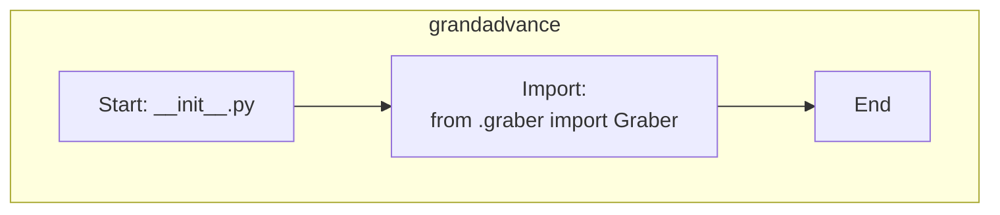

## Анализ кода `src/suppliers/grandadvance/__init__.py`

### <алгоритм>

1.  **Импорт `Graber`:**
    *   Импортируется класс `Graber` из модуля `graber.py` (предполагается, что он находится в том же каталоге `grandadvance`).
    *   Пример: `from .graber import Graber`
    *   Поток данных:  Модуль `__init__.py` получает доступ к классу `Graber`, что позволяет использовать его в других частях проекта, которые импортируют `src.suppliers.grandadvance`.

### <mermaid>

### <объяснение>

**Импорты:**

*   `from .graber import Graber`: Этот импорт делает класс `Graber` доступным внутри пакета `src.suppliers.grandadvance`, а также для модулей, которые импортируют этот пакет. Точка `.` означает, что модуль `graber` находится в том же каталоге, что и текущий файл `__init__.py`. Это стандартный способ импорта модулей в рамках пакета Python.

**Классы:**

*   `Graber`: Этот класс, вероятно, отвечает за логику сбора данных (граббинга) для поставщика Grand Advance. Он импортируется, чтобы быть доступным через пакет `src.suppliers.grandadvance`. Детали его реализации находятся в файле `graber.py`.

**Функции:**

*   В данном файле нет явно определенных функций. `__init__.py` используется для инициализации пакета, поэтому обычно в нем содержится импорт модулей или классов из других частей пакета, которые нужно сделать доступными при импорте пакета.

**Переменные:**

*   В данном файле нет переменных.

**Дополнительно:**

*   Этот файл `__init__.py` действует как точка входа для пакета `src.suppliers.grandadvance`.  Когда другие части проекта импортируют этот пакет (`import src.suppliers.grandadvance`), они получают доступ к классу `Graber` через импорт, сделанный в `__init__.py`.  
*  Обычно, при использовании `from src.suppliers.grandadvance import Graber` (в другом модуле), вы получите прямой доступ к классу `Graber`.
*  Потенциально, могут быть добавлены дополнительные импорты в `__init__.py`, если появятся другие важные классы или функции, которые нужно экспортировать через этот пакет.
*   Цепочка взаимосвязей:
    *   `src.suppliers.grandadvance` - это пакет, который, вероятно, представляет конкретного поставщика (Grand Advance).
    *   `graber.py` - это модуль, содержащий класс `Graber`, который, вероятно, занимается сбором данных (граббингом) с сайта Grand Advance.
    *   Другие модули в проекте, вероятно, импортируют `src.suppliers.grandadvance`, чтобы использовать функциональность `Graber`.
*   Для улучшения, в будущем, можно рассмотреть добавление более подробных комментариев и Docstrings для класса `Graber` и других частей пакета, чтобы сделать код более понятным и поддерживаемым.
*   Потенциальных ошибок на данном этапе нет.