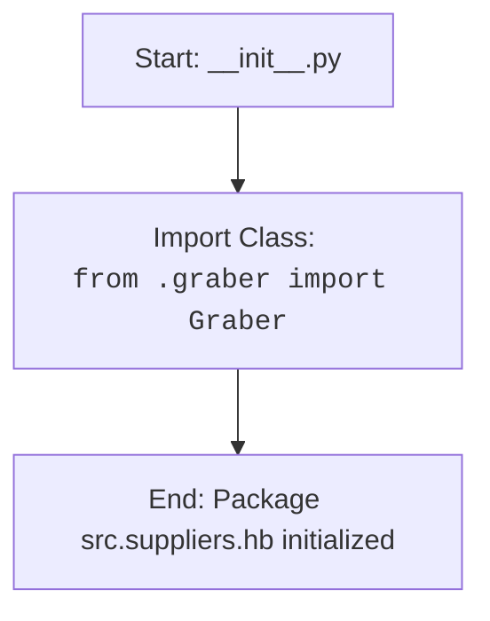

## ИНСТРУКЦИЯ:

Анализируй предоставленный код подробно и объясни его функциональность. Ответ должен включать три раздела:  

1. **<алгоритм>**: Опиши рабочий процесс в виде пошаговой блок-схемы, включая примеры для каждого логического блока, и проиллюстрируй поток данных между функциями, классами или методами.  
2. **<mermaid>**: Напиши код для диаграммы в формате `mermaid`, проанализируй и объясни все зависимости, 
    которые импортируются при создании диаграммы. 
    **ВАЖНО!** Убедитесь, что все имена переменных, используемые в диаграмме `mermaid`, 
    имеют осмысленные и описательные имена. Имена переменных вроде `A`, `B`, `C`, и т.д., не допускаются!  
    
    **Дополнительно**: Если в коде есть импорт `import header`, добавьте блок `mermaid` flowchart, объясняющий `header.py`:\
    ```mermaid
    flowchart TD
        Start --> Header[<code>header.py</code><br> Determine Project Root]
    
        Header --> import[Import Global Settings: <br><code>from src import gs</code>] 
    ```

3. **<объяснение>**: Предоставьте подробные объяснения:  
   - **Импорты**: Их назначение и взаимосвязь с другими пакетами `src.`.  
   - **Классы**: Их роль, атрибуты, методы и взаимодействие с другими компонентами проекта.  
   - **Функции**: Их аргументы, возвращаемые значения, назначение и примеры.  
   - **Переменные**: Их типы и использование.  
   - Выделите потенциальные ошибки или области для улучшения.  

Дополнительно, постройте цепочку взаимосвязей с другими частями проекта (если применимо).  

Это обеспечивает всесторонний и структурированный анализ кода.
## Формат ответа: `.md` (markdown)
**КОНЕЦ ИНСТРУКЦИИ**

## <алгоритм>
1. **Начало**: Запуск скрипта `__init__.py` в пакете `src.suppliers.hb`.
2. **Импорт**: Импорт класса `Graber` из модуля `graber.py`, находящегося в том же пакете `src.suppliers.hb`.
3. **Завершение**: Инициализация пакета `src.suppliers.hb` завершена. Класс `Graber` готов к использованию в других частях проекта через импорт этого пакета.

Пример:
```
# В другом файле проекта, например:
from src.suppliers.hb import Graber

# Теперь можно использовать класс Graber
my_graber = Graber()
```

## <mermaid>


## <объяснение>
### Импорты:
- `from .graber import Graber`: 
    - **Назначение**: Этот импорт делает класс `Graber`, определенный в модуле `graber.py`, доступным в текущем пакете `src.suppliers.hb`. Точка (`.`) в начале означает, что импорт происходит из текущего пакета.
    - **Взаимосвязь с другими пакетами**: `Graber` может содержать логику, необходимую для сбора данных (например, парсинг HTML, запросы к API и т.д.). Импортируя его, другие части проекта (за пределами `src.suppliers.hb`) могут использовать эту функциональность.

### Классы:
- `Graber`:
    - **Роль**: Класс `Graber`, импортируемый из `graber.py`, скорее всего, предназначен для выполнения задач по сбору данных. Конкретные детали его реализации (атрибуты, методы) не видны из `__init__.py`, но можно предположить, что он содержит методы для доступа к данным и их обработки.
    - **Взаимодействие**: Класс `Graber` предназначен для использования в других частях проекта после импорта. В самом `__init__.py` данный класс не используется, но он становится доступным для импорта извне.

### Функции:
В данном коде нет явных функций, за исключением неявного конструктора пакета.

### Переменные:
В коде нет явно объявленных переменных.

### Потенциальные ошибки и области для улучшения:
- **Отсутствие документации**: Код содержит только общую docstring для пакета, но нет подробного описания класса `Graber`. Добавление более подробной документации (например, docstring для класса Graber и его методов) было бы полезным.
- **Отсутствие логики**: Сам файл `__init__.py` очень простой и не содержит никакой логики, кроме импорта. Если бы пакет нуждался в дополнительной инициализации при импорте, это бы происходило именно здесь.
- **Зависимости**: Нельзя определить зависимости `Graber` от других пакетов без просмотра кода в файле `graber.py`. В `__init__.py` они не видны, но важно понимать эти зависимости при использовании пакета `src.suppliers.hb`.

### Взаимосвязи с другими частями проекта:
Пакет `src.suppliers.hb` выступает в качестве поставщика данных. Его основная задача - предоставить класс `Graber` для сбора и обработки данных, которые затем могут быть использованы в других частях проекта (например, для обработки данных, сохранения в БД, и т.д).