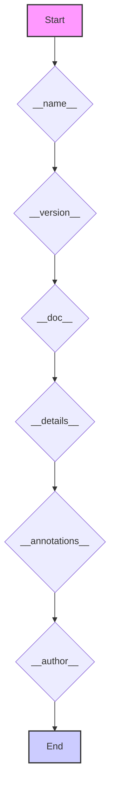

## Анализ кода `hypotez/src/suppliers/hb/scenarios/version.py`

### 1. <алгоритм>

**Блок-схема:**

```mermaid
graph TD
    A[Start] --> B{Define `__name__`: str};
    B --> C{Define `__version__`: str = "3.12.0.0.0.4"};
    C --> D{Define `__doc__`: str};
    D --> E{Define `__details__`: str = "Details about version for module or class"};
    E --> F{Define `__annotations__`};
    F --> G{Define `__author__`: str = 'hypotez'};
    G --> H[End];
```

**Примеры:**

*   `B`:  Создается переменная `__name__` типа `str`.
*   `C`:  Создается переменная `__version__` типа `str` и присваивается значение `"3.12.0.0.0.4"`.
*   `D`:  Создается переменная `__doc__` типа `str`. (значение будет присвоено позднее, например при генерации документации)
*   `E`:  Создается переменная `__details__` типа `str` и присваивается значение `"Details about version for module or class"`.
*   `F`:  Создается переменная `__annotations__`. (значение будет присвоено позднее, например при использовании аннотаций типов)
*   `G`:  Создается переменная `__author__` типа `str` и присваивается значение `'hypotez '`.

**Поток данных:**

Данные в этом коде - это литеральные значения, которые присваиваются переменным. Поток данных заключается в последовательном определении этих переменных.

### 2. <mermaid>



**Зависимости:**

В данном коде нет импортов, поэтому нет зависимостей от других модулей. Основная работа заключается в определении метаданных модуля.

### 3. <объяснение>

**Импорты:**
В данном файле импорты отсутствуют.  Это означает, что он не зависит от других модулей проекта на уровне импортов.

**Классы:**
Классы в данном коде отсутствуют. Он представляет собой простой файл, содержащий метаданные модуля.

**Функции:**
Функции в данном коде отсутствуют. Код содержит только определения переменных, которые описывают метаданные.

**Переменные:**

*   `__name__`:  Строковая переменная,  которая обычно содержит имя модуля или "__main__", если скрипт запущен напрямую.
*   `__version__`: Строковая переменная,  содержащая версию модуля (здесь `"3.12.0.0.0.4"`).
*   `__doc__`: Строковая переменная для хранения документации модуля. На данный момент пустая, но может быть использована для описания.
*   `__details__`: Строковая переменная,  предоставляющая дополнительные детали о версии или модуле (здесь `"Details about version for module or class"`).
*   `__annotations__`: Переменная, используемая для хранения аннотаций типов, пока что не определена в коде.
*   `__author__`: Строковая переменная,  указывающая автора модуля (здесь `"hypotez "`).

**Потенциальные ошибки и области для улучшения:**

1.  **Отсутствие документации `__doc__`:**  Переменная `__doc__` не заполнена, что делает невозможной автоматическую генерацию документации для этого модуля.
2.  **Неясное значение `__details__`**: Значение  `"Details about version for module or class"`  не очень информативно. Возможно, следует сделать ее более конкретной.
3.  **Неиспользуемые `__annotations__`**:  Переменная `__annotations__`  определена, но не используется. Рекомендуется либо добавить аннотации типов, либо удалить эту переменную, если она не нужна.
4.  **Отсутствие обработки `__name__`**:  Часто используют проверку `if __name__ == '__main__':`, чтобы выполнять код только при запуске скрипта напрямую. В данном случае этого нет, что означает, что все переменные определяются всегда при импорте модуля, что не всегда может быть желательно.
5.  **Неопределенность формата версии**:  Формат версии `"3.12.0.0.0.4"` необычен, так как обычно используется семантическое версионирование (Major.Minor.Patch). Стоит уточнить, зачем используется именно такой формат.

**Взаимосвязь с другими частями проекта:**

Этот файл, вероятно, используется в качестве части более крупного проекта. Его метаданные, такие как `__version__`, могут быть использованы для отслеживания версий модуля, и это позволяет идентифицировать используемую версию модуля в других частях проекта.

**Резюме:**

Файл `version.py`  определяет метаданные модуля `src.suppliers.hb.scenarios`, включая версию, автора и другие детали.  Хотя сам файл прост, у него есть потенциал для улучшения, особенно в плане добавления документации и уточнения назначения некоторых переменных.