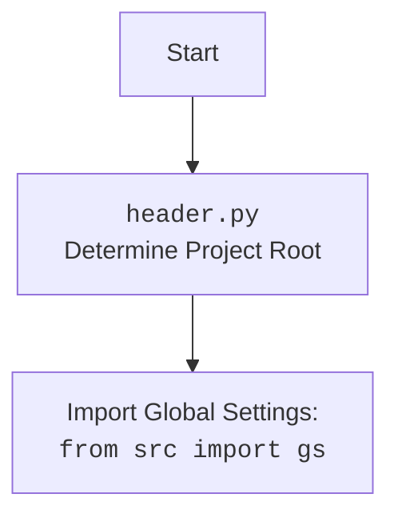

## <алгоритм>

1.  **Импорт модулей**:
    *   Импортируются необходимые модули: `typing`, `header`, `src.suppliers.graber.Graber` (как `Grbr`), `src.suppliers.graber.Context`, `src.suppliers.graber.close_pop_up`, `src.webdriver.driver.Driver`, `src.logger.logger.logger`.

    *   Пример: `from src.webdriver.driver import Driver` импортирует класс `Driver` для управления веб-драйвером.

2.  **Определение класса `Graber`**:
    *   Создается класс `Graber`, наследующийся от `Grbr` из `src.suppliers.graber`.

    *   Пример: `class Graber(Grbr):` - класс `Graber` получает функциональность родительского класса `Grbr`.

3.  **Инициализация класса `__init__`**:
    *   В конструкторе `__init__` устанавливается префикс поставщика `supplier_prefix` равным `'ivory'`.
    *   Вызывается конструктор родительского класса `super().__init__` с указанием префикса и объекта драйвера.
        *   Пример: `super().__init__(supplier_prefix=self.supplier_prefix, driver=driver)` вызывает конструктор `Grbr` с параметрами.
    *   Устанавливается значение `Context.locator_for_decorator = None`.

    *   Пример: `self.supplier_prefix = 'ivory'` устанавливает значение переменной класса.

4.  **Декоратор (закомментирован)**:
    *   В коде есть закомментированный код декоратора `close_pop_up` который предназначен для закрытия всплывающих окон перед выполнением основной логики функции.
        *   Декоратор `close_pop_up` принимает необязательный аргумент `value`.

        *   Внутри `close_pop_up` есть функция `decorator`, которая принимает функцию `func` в качестве аргумента.

        *   Внутри `decorator` есть функция `wrapper`, которая выполняет операции до и после вызова `func`:
             *   Сначала выполняется попытка закрыть всплывающее окно с использованием `Context.driver.execute_locator(Context.locator.close_pop_up)`.
            *  Если попытка не удается, то выводится сообщение об ошибке в лог.
            *   Затем вызывается основная функция `func` и возвращается ее результат.

        *   Пример:  `@close_pop_up(value='some_value')`  - если бы декоратор не был закоментирован, то так бы вызывался декоратор.
5.  **Использование `Context`**:
    *   Используется `Context` для хранения и передачи данных, таких как локаторы и драйвер, в рамках выполнения операций сбора данных.

    *   Пример: `Context.locator_for_decorator = None`  - устанавливает начальное значение атрибута.

## <mermaid>

```mermaid
flowchart TD
    Start[Start] --> ImportModules[Импорт модулей]
    ImportModules --> DefineGraberClass[Определение класса Graber]
    DefineGraberClass --> InitGraber[Инициализация __init__]
    InitGraber --> SetSupplierPrefix[Установка supplier_prefix = 'ivory']
    SetSupplierPrefix --> CallSuperInit[Вызов super().__init__]
    CallSuperInit --> SetContextLocator[Установка Context.locator_for_decorator = None]
    SetContextLocator --> End[End]

    
    classDef importClass fill:#f9f,stroke:#333,stroke-width:2px
    class ImportModules importClass
    
    
    style Start fill:#ccf,stroke:#333,stroke-width:2px
    style End fill:#ccf,stroke:#333,stroke-width:2px
```



## <объяснение>

### Импорты

*   **`typing.Any`**: Используется для аннотации типов, указывая, что переменная может быть любого типа.
*   **`header`**: Предположительно, это локальный модуль, который устанавливает корень проекта и обеспечивает доступ к глобальным настройкам.
*   **`src.suppliers.graber.Graber` (as `Grbr`)**: Импортирует базовый класс `Graber` из модуля `src.suppliers.graber`, переименовывая его в `Grbr` для краткости. Этот класс, вероятно, содержит общую логику для всех "граберов" (сборщиков данных).
*   **`src.suppliers.graber.Context`**: Импортирует класс `Context`, который вероятно, используется для хранения контекстной информации, необходимой для работы "грабера".
*    **`src.suppliers.graber.close_pop_up`**: Импортирует функцию `close_pop_up`, которая, вероятно, используется для закрытия всплывающих окон.
*   **`src.webdriver.driver.Driver`**: Импортирует класс `Driver`, который отвечает за управление веб-драйвером (например, Selenium) для взаимодействия с веб-страницами.
*   **`src.logger.logger.logger`**: Импортирует объект `logger` для записи логов.

### Классы

*   **`Graber(Grbr)`**:
    *   Это класс, предназначенный для сбора данных с веб-сайта поставщика 'ivory'.
    *   Наследуется от `Grbr`, что позволяет переиспользовать общую логику и расширять ее.
    *   `supplier_prefix: str`: Атрибут класса, который хранит префикс поставщика (в данном случае 'ivory').
    *   `__init__(self, driver: Driver)`: Конструктор класса.
        *   Принимает объект `driver` типа `Driver`.
        *   Инициализирует атрибут `supplier_prefix` значением 'ivory'.
        *   Вызывает конструктор родительского класса (`Grbr`) с указанием префикса и драйвера.
        *   Устанавливает `Context.locator_for_decorator = None`.

### Функции

*   **`__init__(self, driver: Driver)`**:
    *   Конструктор класса `Graber`.
    *   `driver`: Объект драйвера, используется для взаимодействия с веб-страницей.
    *   Устанавливает `supplier_prefix` как 'ivory', вызывает конструктор родителя и устанавливает `Context.locator_for_decorator` в `None`.

### Переменные

*   **`supplier_prefix: str`**:
    *   Строковая переменная, хранящая префикс поставщика.
    *   Используется для определения, с каким поставщиком работает класс.
*   **`Context.locator_for_decorator`**:
    *   Переменная, используемая для хранения локатора для декоратора.
    *   По умолчанию устанавливается в `None`.

### Потенциальные ошибки и области для улучшения

*   **Закомментированный декоратор**: Код декоратора закомментирован, что означает, что он не используется. Если этот функционал нужен, то необходимо его раскомментировать и протестировать.
*   **`Context.locator_for_decorator`**: Потенциально может быть не совсем ясным, как и когда следует устанавливать этот локатор для его использования в декораторе. Нужна более подробная документация.
*   **Отсутствие обработки исключений в `__init__`**:  В конструкторе нет явной обработки исключений, возникающих при вызове `super().__init__`.

### Взаимосвязи с другими частями проекта

*   **`src.suppliers.graber`**: Класс `Graber` наследуется от `Grbr`, который является частью пакета `src.suppliers.graber`, что указывает на тесную связь и переиспользование логики сбора данных.
*   **`src.webdriver.driver`**:  Класс `Graber` использует объект `Driver` для управления браузером, что указывает на зависимость от функциональности веб-драйвера.
*   **`src.logger.logger`**:  Класс использует модуль `logger` для логирования, что позволяет отслеживать работу сбора данных и потенциальные ошибки.
*   **`header`**: Используется для определения корневого каталога проекта и загрузки глобальных настроек.

Таким образом, класс `Graber` из `src/suppliers/ivory/graber.py` является специализированным сборщиком данных для поставщика 'ivory', использующим общую логику из `src.suppliers.graber` и инструменты для управления браузером из `src.webdriver.driver`. Он также взаимодействует с системой логирования через `src.logger.logger`.