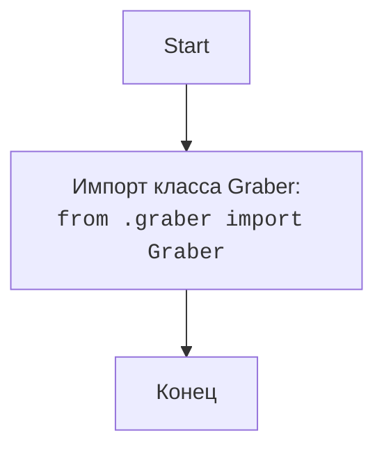

## АНАЛИЗ КОДА: `src/suppliers/ksp/__init__.py`

### <алгоритм>

1. **Импорт `Graber`**: Из модуля `src.suppliers.ksp.graber` импортируется класс `Graber`.
   * **Пример**: `from .graber import Graber` - позволяет использовать класс `Graber` в текущем пакете `ksp`.

### <mermaid>

**Описание `mermaid`:**

*   **`flowchart TD`**:  Определяет тип диаграммы как блок-схему (flowchart) с направлением сверху вниз (TD).
*   **`Start --> ImportGraber`**:  Начало процесса, которое ведет к импорту класса `Graber`.
*   **`ImportGraber --> End`**:  После импорта процесс завершается.
*  **`ImportGraber[Импорт класса Graber: <code>from .graber import Graber</code>]`**: Описывает действие импорта класса `Graber` из файла `graber.py`, находящегося в той же директории, что и `__init__.py`.

### <объяснение>

**Импорты:**

*   `from .graber import Graber`:
    *   Импортирует класс `Graber` из модуля `graber.py`, находящегося в той же директории, что и текущий файл `__init__.py`.
    *   `.` означает, что импорт происходит из текущего пакета `src.suppliers.ksp`.
    *   Класс `Graber`, вероятно, содержит логику для сбора данных с сайта поставщика KSP.

**Роль `__init__.py`:**

*   Файл `__init__.py` в Python используется для того, чтобы пометить каталог как пакет. Это позволяет импортировать модули из этого каталога.
*   В данном случае,  файл `__init__.py`  делает пакет `ksp` модулем, и импортируя  `Graber`, делает его доступным для использования в других частях проекта.

**Взаимосвязь с другими частями проекта:**

*   Этот пакет `ksp` является частью пакета `suppliers`, что, вероятно, означает, что он является одним из поставщиков, из которых собираются данные.
*   Класс `Graber` скорее всего используется в другом модуле для сбора и обработки данных KSP.

**Потенциальные ошибки и улучшения:**

*   В текущем коде нет явных ошибок.
*   Поскольку `__init__.py` содержит только импорт `Graber`, его можно рассматривать как точку входа для функциональности KSP. Если в будущем потребуется добавить дополнительную логику инициализации, её можно добавить сюда.
*   Стоит добавить docstring для `__init__.py` для более точного описания пакета `ksp`.
*   Необходимо проанализировать код `graber.py`, чтобы понять как именно работает класс `Graber`.