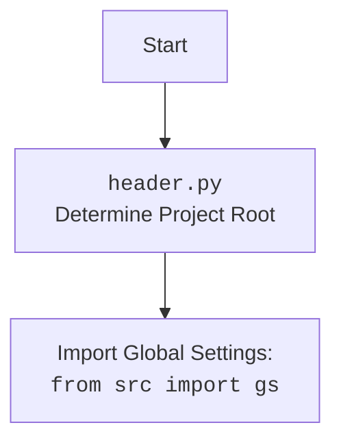

## <алгоритм>
1.  **`set_project_root(marker_files)`**:
    *   **Начало**: Функция принимает кортеж `marker_files` (по умолчанию `('__root__', '.git')`) для поиска корневой директории проекта.
    *   **Инициализация**: Определяет текущий путь файла (`__file__`), преобразует его в абсолютный путь, и устанавливает его родительскую директорию как начальный `__root__`.
        *   Пример: Если `__file__` это `/path/to/project/src/suppliers/ksp/header.py`, то `current_path` будет `/path/to/project/src/suppliers/ksp`.
    *   **Поиск родительских директорий**:
        *   Перебирает текущую директорию и все её родительские директории в порядке возрастания (например, `/path/to/project/src/suppliers/ksp`, `/path/to/project/src/suppliers`, `/path/to/project/src`, `/path/to/project`, `/path/to`).
        *   **Проверка на маркер**: Для каждой родительской директории проверяет, существует ли любой из `marker_files` в этой директории.
            *   Пример: Если `marker_files` это `('__root__', '.git')`, проверяет, существуют ли файлы или директории `__root__` или `.git` в текущей родительской директории.
        *   **Установка корня**: Если маркер найден, устанавливает `__root__` как эту родительскую директорию и прерывает цикл.
    *   **Добавление в `sys.path`**: Если `__root__` еще не в `sys.path`, то добавляет его в начало. Это позволяет импортировать модули из корневой директории проекта.
    *   **Возврат**: Возвращает `__root__`.
2.  **Вызов `set_project_root()`**: Вызывает функцию `set_project_root()` и присваивает результат переменной `__root__`.
3.  **Импорт `gs`**: Импортирует `gs` (глобальные настройки) из пакета `src`.
4. **Загрузка settings.json**: 
    *  Пытается открыть файл `settings.json` из директории `/src/` относительно корня проекта (`gs.path.root`).
    *  Загружает JSON-данные в переменную `settings`
    *  Перехватывает исключения `FileNotFoundError` и `JSONDecodeError`
5.  **Загрузка `README.MD`**:
    *   Пытается открыть файл `README.MD` из директории `/src/` относительно корня проекта (`gs.path.root`).
    *   Читает содержимое файла в переменную `doc_str`.
    *   Перехватывает исключения `FileNotFoundError` и `JSONDecodeError`.
6.  **Определение глобальных переменных**:
    *   Определяет глобальные переменные:
        *   `__project_name__`: из `settings.project_name` или `hypotez` по умолчанию.
        *   `__version__`: из `settings.version` или `''` по умолчанию.
        *   `__doc__`: из `doc_str` или `''` по умолчанию.
        *   `__details__`: пустая строка `''`.
        *   `__author__`: из `settings.author` или `''` по умолчанию.
        *   `__copyright__`: из `settings.copyrihgnt` или `''` по умолчанию.
        *   `__cofee__`: из `settings.cofee` или строка "Treat the developer to a cup of coffee for boosting enthusiasm in development: https://boosty.to/hypo69" по умолчанию.

## <mermaid>
```mermaid
flowchart TD
    Start(Start) --> FindRoot[<code>set_project_root()</code><br>Find Project Root Directory]
    FindRoot --> GetSettings[Try to Load <code>settings.json</code>]
    GetSettings -- Success --> ReadMe[Try to Load <code>README.MD</code>]
    GetSettings -- Fail --> ReadMe
    ReadMe -- Success --> SetVars[Set Global Variables]
    ReadMe -- Fail --> SetVars
    SetVars --> End(End)

    
    style Start fill:#f9f,stroke:#333,stroke-width:2px
    style End fill:#f9f,stroke:#333,stroke-width:2px
    
```

## <объяснение>

**Импорты:**

*   `sys`: Предоставляет доступ к некоторым переменным и функциям, взаимодействующим с интерпретатором Python. Используется для добавления корневой директории проекта в `sys.path`, чтобы обеспечить возможность импорта модулей из этой директории.
*   `json`: Модуль для работы с JSON-данными. Используется для загрузки настроек проекта из файла `settings.json`.
*   `packaging.version`:  Используется для работы с версиями. В данном коде, хотя он и импортирован, напрямую не используется. 
*    `pathlib.Path`:  Модуль для работы с путями к файлам и директориям. Используется для определения корневой директории и путей к файлам настроек и документации.

**Функции:**

*   **`set_project_root(marker_files)`**:
    *   **Аргументы**: `marker_files` (tuple, необязательный) - список имен файлов или директорий, используемых для определения корневой директории. По умолчанию `('__root__', '.git')`.
    *   **Возвращает**: `Path` - объект `pathlib.Path`, представляющий корневую директорию проекта. Если не найдена, то возвращается директория где расположен скрипт.
    *   **Назначение**: Поиск корневой директории проекта путем подъема по родительским директориям, пока не будет найдена директория, содержащая один из `marker_files`. После нахождения добавляет эту директорию в `sys.path`.
    *   **Пример**: Если скрипт расположен в `/path/to/project/src/suppliers/ksp/header.py`, и корневой директорией является `/path/to/project`, то `set_project_root()` вернет `/path/to/project`.

**Переменные:**

*   `__root__`: (Path) Глобальная переменная, хранящая путь к корневой директории проекта.
*   `settings`: (dict) Глобальная переменная, хранящая загруженные из `settings.json` настройки проекта.
*   `doc_str`: (str) Глобальная переменная, хранящая содержимое `README.MD`.
*   `__project_name__`: (str) Глобальная переменная, хранящая имя проекта. По умолчанию 'hypotez'.
*   `__version__`: (str) Глобальная переменная, хранящая версию проекта. По умолчанию ''.
*   `__doc__`: (str) Глобальная переменная, хранящая документацию проекта.
*   `__details__`: (str) Глобальная переменная, хранящая дополнительные детали проекта. По умолчанию ''.
*   `__author__`: (str) Глобальная переменная, хранящая имя автора проекта. По умолчанию ''.
*    `__copyright__`: (str) Глобальная переменная, хранящая копирайт проекта. По умолчанию ''.
*   `__cofee__`: (str) Глобальная переменная, хранящая сообщение для поддержки проекта. По умолчанию 'Treat the developer to a cup of coffee for boosting enthusiasm in development: https://boosty.to/hypo69'.

**Взаимосвязь с другими частями проекта:**

*   Импортирует `gs` из `src`, который, вероятно, содержит глобальные настройки и пути проекта.
*   Использует `gs.path.root` для определения пути к файлам `settings.json` и `README.MD`.
*   Определяет глобальные переменные, которые могут быть использованы в других частях проекта.

**Потенциальные ошибки и области для улучшения:**

*   Обработка исключений: `FileNotFoundError` и `json.JSONDecodeError` перехватываются, но никак не обрабатываются. В реальном приложении было бы полезно журналировать ошибки.
*   Зависимость от структуры каталогов: Код зависит от наличия файлов `settings.json` и `README.MD` в каталоге `src`. Это может стать проблемой, если структура каталогов изменится.
*   Отсутствие обработки ошибок при чтении файлов: Если файл существует, но его нельзя прочитать из-за прав доступа, то возникнет исключение, которое не обрабатывается.
*   **Отсутствие `try except` при обращении к ключам словаря `settings`**: Если в `settings.json` нет ключа `project_name`, то это приведет к ошибке `KeyError` если обращаться к нему как `settings["project_name"]`. Исправлено с помощью метода `.get()`  словаря `settings`, устанавливая значение по умолчанию.
*    Версии пакетов и их использование: Модуль `packaging.version` импортируется, но не используется. Если в дальнейшем планируется работать с версиями, то это может быть полезно.

**Цепочка взаимосвязей:**

1.  `header.py` устанавливает корневую директорию и импортирует `gs`.
2.  `header.py` пытается загрузить настройки из `settings.json` и документацию из `README.MD` на основе настроек `gs`.
3.  `header.py` устанавливает глобальные переменные, которые могут быть использованы другими модулями проекта.

Этот анализ предоставляет полное представление о функциональности и взаимодействии данного модуля.